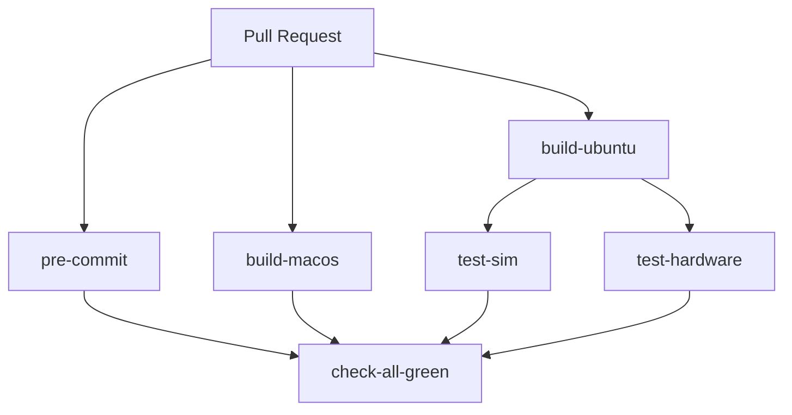

# tt-lang CI/CD

CI pipeline for building tt-lang and running tests on self-hosted hardware runners.

## Workflow Overview



### Workflows

- **on-pr.yml**: Main PR workflow - runs pre-commit checks, builds (Ubuntu/macOS), simulation tests, and hardware tests
- **call-build.yml**: Builds tt-lang for Ubuntu (containerized) or macOS, uploads artifacts
- **call-test-hardware.yml**: Runs lit tests on self-hosted hardware runners (N150, N300, TG, P150)
- **call-test-sim.yml**: Runs simulation tests (pytest)
- **call-build-tt-mlir-fetchcontent.yml**: Nightly build using CMake FetchContent to build tt-mlir from main

### Build Artifacts

**Compression**: tt-mlir installations are compressed with `zstd --long=31` (~500MB → ~100MB)

**Artifacts**:
- `ttlang-build-{ubuntu,macos}`: Build outputs (python packages, tests, env scripts)
- `ttlang-ttmlir-install-ubuntu`: Compressed tt-mlir installation (zstd archive)

**Retention**: 1 day (test reports: 7 days)

### Caching Strategy

- **macOS toolchain**: Cached at `/opt/ttmlir-toolchain` based on `tt-mlir/env/CMakeLists.txt` hash
- **tt-mlir build**: Cached based on tt-mlir commit hash + LLVM version
- **ccache**: Used for incremental C++ builds

## Self-Hosted Runners

Hardware tests require runners with:
- **Labels**: `tt-ubuntu-2204-{hardware}-stable` (e.g., `tt-ubuntu-2204-n150-stable`)
- **Container support**: Docker installed, device access configured
- **Hardware**: Tenstorrent card with kernel driver loaded
- **Hugepages**: Both 2MB and 1GB hugepages configured

Runner setup:
```bash
./config.sh --url https://github.com/tenstorrent/tt-lang --token TOKEN \
  --name n150-runner-1 \
  --labels tt-ubuntu-2204-n150-stable

sudo ./svc.sh install && sudo ./svc.sh start
```

## Running Tests Locally

```bash
# Set up environment
source build/env/activate
export SYSTEM_DESC_PATH=/path/to/system_desc.ttsys

# Run hardware tests
llvm-lit -sv build/test/python/

# Generate test report
llvm-lit -sv build/test/python/ --xunit-xml-output test_reports/report.xml
```

## Common Issues

**llvm-lit not found**: Ensure `PATH` includes `$TT_MLIR_DIR/bin` (set in call-test-hardware.yml)

**Artifact extraction fails**: Hardware test extraction must use `zstd --long=31` to match compression window size

**System descriptor missing**: Check that `ttrt` is available and hardware is accessible (`ls -l /dev/tenstorrent`)

**Cache invalidation**: macOS toolchain cache key includes `tt-mlir/env/CMakeLists.txt` hash - changes to LLVM/Stablehlo versions will invalidate cache

## Triggering Workflows Manually

```bash
# Trigger hardware tests
gh workflow run call-test-hardware.yml --ref main \
  --field runs-on=n150 --field build-os=ubuntu

# Trigger full PR workflow
gh workflow run on-pr.yml --ref your-branch-name
```

## Adding New Hardware

1. Update `call-test-hardware.yml` runner label: `tt-ubuntu-2204-{hardware}-stable`
2. Configure self-hosted runner with matching labels
3. Add hardware-specific test filters in `call-test-hardware.yml` if needed (e.g., `--disable-eth-dispatch` for TG/P150)
