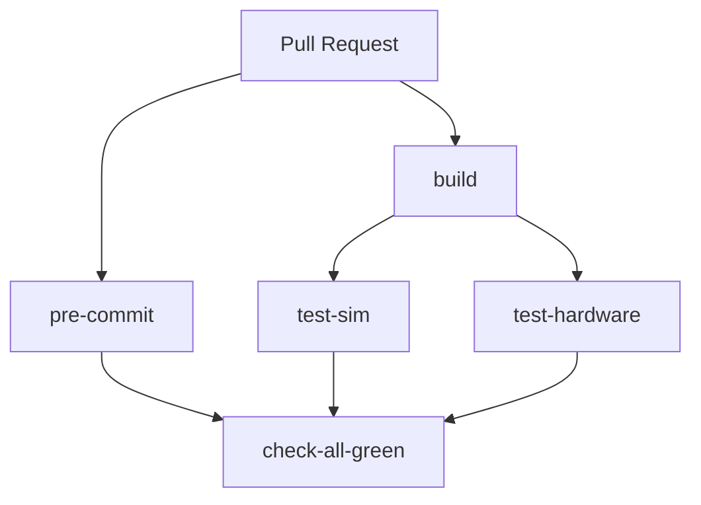
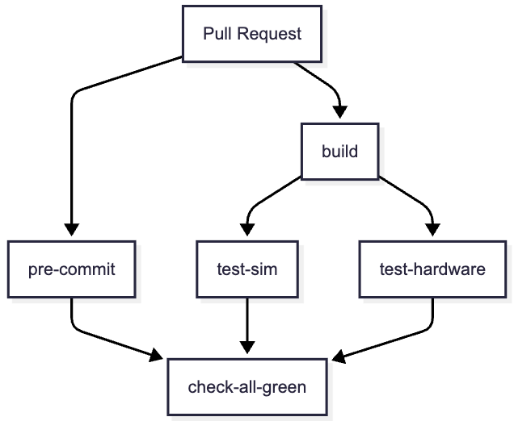

# tt-lang CI/CD Documentation

This document describes the CI/CD workflows for tt-lang, including hardware testing on self-hosted runners.

## Workflow Overview

The tt-lang CI/CD pipeline consists of several workflows that work together:


<!--
<p align="center">
  
</p>
-->

### Workflows

#### 1. on-pr.yml - Main PR Workflow

Triggered on pull requests to the `main` branch. Orchestrates all other workflows.

**Jobs**:
- `pre-commit`: Runs code formatting and linting checks
- `build`: Builds tt-lang for Ubuntu and macOS
- `test-sim`: Runs Python simulation tests
- `test-hardware`: Runs hardware tests on N150 (self-hosted, **required to pass**)
- `check-all-green`: Ensures all required jobs passed

**Concurrency**: Cancels previous runs on new commits to the same PR.

**Important**: All jobs including hardware tests are required to pass. If the self-hosted runner is unavailable, the PR workflow will fail.

#### 2. call-build.yml - Build Workflow

Builds tt-lang for Ubuntu (in container) and macOS.

**Build Matrix**:
- Ubuntu: Uses `ghcr.io/tenstorrent/tt-mlir/tt-mlir-ci-ubuntu-22-04:latest` container
- macOS: Native runner (macos-26)

**Build Steps**:
1. Checkout tt-lang
2. Checkout tt-mlir (version from `third-party/tt-mlir.commit`)
3. **macOS only**: Setup LLVM/Stablehlo toolchain (cached based on `tt-mlir/env/CMakeLists.txt` hash)
4. Cache or build tt-mlir with PyKernel enabled
5. Build tt-lang
6. Run smoketest
7. Upload artifacts:
   - `ttlang-build-ubuntu` / `ttlang-build-macos`: Contains `build/python_packages`, `build/test`, `build/env`, `sim/`
   - `ttlang-ttmlir-install-ubuntu`: Compressed tt-mlir installation (Ubuntu only, zstd format)

**Caching**:
- **macOS toolchain**: Cached in `/opt/ttmlir-toolchain` based on hash of `tt-mlir/env/CMakeLists.txt` and branch name
- **tt-mlir build**: Cached based on tt-mlir commit hash and LLVM version (macOS) or Ubuntu build
- **ccache**: Used for tt-lang C++ builds to speed up recompilation

#### 3. call-test-hardware.yml - Hardware Test Workflow

Runs tests on self-hosted hardware runners.

**Inputs**:
- `runs-on`: Hardware type (default: `n150`, supports: n150, n300, tg, p150)
- `build-os`: Which build artifacts to use (default: `ubuntu`)
- `timeout`: Test timeout in minutes (default: 30)

**Runner Configuration**:
- Runs on: `tt-ubuntu-2204-{hardware}-stable` with `in-service` label
- Container: Same tt-mlir CI container as build
- Device access: `/dev/tenstorrent` mounted
- Hugepages: Both 2MB and 1GB hugepages mounted

**Test Steps**:
1. Download build artifacts from build job
2. Download and extract tt-mlir installation (zstd-compressed archive)
3. Set up environment (PATH, LD_LIBRARY_PATH, PYTHONPATH)
   - `PATH`: Includes `$TT_MLIR_DIR/bin` for `llvm-lit` and other tools
   - `LD_LIBRARY_PATH`: Includes `$TT_MLIR_DIR/lib` for runtime libraries
   - `PYTHONPATH`: Includes `build/python_packages` for Python bindings
4. Generate system descriptor using `ttrt query`
5. Run lit tests: `llvm-lit -sv build/test/python/`
6. Upload test reports (JUnit XML)
7. Display test summary using `action-junit-report`

**Hardware-Specific Configuration**:
- TG and P150: Use `--disable-eth-dispatch` when generating system descriptor
- Other hardware: Standard system descriptor generation

#### 4. call-test-sim.yml - Simulation Test Workflow

Runs Python simulation tests on Ubuntu and macOS runners (no hardware required).

**Test Command**: `pytest test/sim/ -v`

#### 5. call-build-tt-mlir-fetchcontent.yml - Nightly FetchContent Build

Runs nightly (4am PST) to build tt-lang with tt-mlir via CMake FetchContent, then runs hardware tests.

**Purpose**: Tests integration with tt-mlir main branch and catches issues early.

**Schedule**: `0 12 * * *` (4am PST daily)

**Jobs**:
- `build-tt-lang-tt-mlir`: Builds tt-lang with tt-mlir fetched via CMake
- `test-hardware-n150`: Runs hardware tests on N150
- `check-all-green`: Ensures all jobs passed

**Build Configuration**:
- Uses FetchContent to automatically fetch and build tt-mlir
- Caches tt-mlir installation based on commit hash
- Can override tt-mlir commit via workflow dispatch input
- Uploads artifacts with `ttlang-fetchcontent` prefix

**Artifact Names**:
- `ttlang-fetchcontent-build-ubuntu`: Build artifacts
- `ttlang-fetchcontent-ttmlir-install-ubuntu`: tt-mlir installation

## Self-Hosted Runner Setup

### Runner Requirements

To run hardware tests, you need a self-hosted runner with:

1. **Hardware**: Tenstorrent hardware card (N150, N300, etc.)
2. **OS**: Ubuntu 22.04
3. **Labels**:
   - `tt-ubuntu-2204-{hardware}-stable` (e.g., `tt-ubuntu-2204-n150-stable`)
   - `in-service`
4. **Docker**: Installed and configured
5. **Kernel Modules**: Tenstorrent kernel driver loaded
6. **Hugepages**: Configured for both 2MB and 1GB pages
7. **Tools**: `ttrt` installed (for system descriptor generation)

### Runner Configuration Example

```bash
# Install GitHub Actions Runner
mkdir actions-runner && cd actions-runner
curl -o actions-runner-linux-x64-2.311.0.tar.gz -L https://github.com/actions/runner/releases/download/v2.311.0/actions-runner-linux-x64-2.311.0.tar.gz
tar xzf ./actions-runner-linux-x64-2.311.0.tar.gz

# Configure runner
./config.sh --url https://github.com/tenstorrent/tt-lang --token YOUR_TOKEN \
  --name n150-runner-1 \
  --labels tt-ubuntu-2204-n150-stable,in-service

# Install as service
sudo ./svc.sh install
sudo ./svc.sh start
```

### Runner Access Requirements

The runner needs access to:
- `/dev/tenstorrent` - Tenstorrent device files
- `/dev/hugepages` - 2MB hugepages
- `/dev/hugepages-1G` - 1GB hugepages
- `/etc/udev/rules.d` - Device rules
- `/lib/modules` - Kernel modules

These are automatically mounted via the container `volumes` configuration in [call-test-hardware.yml](workflows/call-test-hardware.yml#L48).

## Running Tests Locally

### Using the Helper Script

A helper script is provided for running hardware tests locally:

```bash
# Run all tests on N150
.github/scripts/run_hardware_tests.sh --type n150

# Run specific test
.github/scripts/run_hardware_tests.sh --filter test_operator_add.py

# Run with verbose output
.github/scripts/run_hardware_tests.sh --verbose --type n150

# Specify custom directories
.github/scripts/run_hardware_tests.sh \
  --build-dir ./build \
  --install-dir ./tt-mlir-install \
  --output-dir ./my-test-results
```

### Manual Test Execution

```bash
# Set up environment
source build/env/activate
export SYSTEM_DESC_PATH=/path/to/system_desc.ttsys

# Run all hardware tests
llvm-lit -sv build/test/python/

# Run specific test
llvm-lit -sv build/test/python/test_operator_add.py

# Generate test report
llvm-lit -sv build/test/python/ \
  --xunit-xml-output test_reports/report.xml
```

## Debugging Hardware Test Failures

### Viewing Test Reports

Test reports are uploaded as artifacts and can be downloaded using GitHub CLI:

```bash
# List artifacts for a workflow run
gh run view RUN_ID --repo tenstorrent/tt-lang

# Download test reports
gh run download RUN_ID --name hardware-test-reports-n150 \
  --repo tenstorrent/tt-lang
```

### Common Issues

#### 1. System Descriptor Generation Fails

**Symptoms**: Warning "ttrt not available" or "No system descriptor found"

**Solutions**:
- Ensure `ttrt` is installed in the container or on the runner
- Check that the hardware device is accessible: `ls -l /dev/tenstorrent`
- Verify kernel driver is loaded: `lsmod | grep tenstorrent`

#### 2. Tests Timeout

**Symptoms**: Job cancelled after timeout period

**Solutions**:
- Increase timeout in [on-pr.yml](workflows/on-pr.yml#L41) for the `test-hardware` job
- Check if hardware is hung: `ttrt query`
- Review system logs: `dmesg | grep tenstorrent`

#### 3. Container Permissions

**Symptoms**: Permission denied accessing `/dev/tenstorrent`

**Solutions**:
- Ensure runner user is in the correct groups
- Verify udev rules are configured correctly
- Check container options in [call-test-hardware.yml](workflows/call-test-hardware.yml#L48)

#### 4. Missing Dependencies

**Symptoms**: Import errors or missing commands (e.g., `llvm-lit: command not found`)

**Solutions**:
- Verify build artifacts uploaded correctly
- Check that tt-mlir installation artifact is complete and extracted properly
- Ensure `PATH` includes `$TT_MLIR_DIR/bin` (where `llvm-lit` is located)
- Verify zstd extraction used correct window size: `--long=31`
- Ensure environment activation script exists and works

### Verbose Debugging

Enable verbose pass output for detailed MLIR debugging:

```bash
# In workflow, modify call-test-hardware.yml:
env:
  TTLANG_VERBOSE_PASSES: 1
  TTLANG_INITIAL_MLIR: /tmp/initial.mlir
  TTLANG_FINAL_MLIR: /tmp/final.mlir
```

Then review the MLIR dumps in test output.

## Adding New Hardware Configurations

To add support for a new hardware type (e.g., N300):

### 1. Update on-pr.yml

Add a new job or modify the existing `test-hardware` job:

```yaml
test-hardware-n300:
  if: github.event.pull_request.draft == false
  needs: build
  uses: ./.github/workflows/call-test-hardware.yml
  secrets: inherit
  with:
    runs-on: n300
    build-os: ubuntu
    timeout: 30
```

### 2. Configure Self-Hosted Runner

Set up a new runner with labels:
- `tt-ubuntu-2204-n300-stable`
- `in-service`

### 3. Update check-all-green

Add the new job to the needs list:

```yaml
check-all-green:
  if: always()
  needs:
    - pre-commit
    - build
    - test-sim
    - test-hardware
    - test-hardware-n300  # Add here
  runs-on: ubuntu-latest
  steps:
    - name: Decide whether all needed jobs succeeded or failed
      uses: re-actors/alls-green@release/v1
      with:
        jobs: ${{ toJSON(needs) }}
```

**Note**: Hardware tests are required to pass. All jobs in the needs list must succeed for the PR to be mergeable.

### 4. Optional: Hardware-Specific Test Filters

If certain tests should only run on specific hardware, add filters to the lit configuration in [test/lit.cfg.py](../test/lit.cfg.py).

## Triggering Workflows Manually

### Trigger Hardware Tests Only

```bash
gh workflow run call-test-hardware.yml \
  --repo tenstorrent/tt-lang \
  --ref main \
  --field runs-on=n150 \
  --field build-os=ubuntu
```

### Trigger Full PR Workflow

```bash
gh workflow run on-pr.yml \
  --repo tenstorrent/tt-lang \
  --ref your-branch-name
```

## Artifacts

### Build Artifacts

**ttlang-build-ubuntu / ttlang-build-macos**:
- `build/python_packages/` - Python packages and bindings
- `build/test/` - Lit test files
- `build/env/` - Environment activation scripts
- `sim/` - Simulation files

**ttlang-ttmlir-install-ubuntu**:
- `lib/` - tt-mlir runtime libraries
- `bin/` - tt-mlir binaries and tools
- `python/` - tt-mlir Python bindings

**Retention**: 1 day (artifacts are deleted after 24 hours)

### Test Artifacts

**hardware-test-reports-{hardware}**:
- `test_reports/report_{hardware}.xml` - JUnit XML test results

**Retention**: 7 days

## Performance Considerations

### Build Artifact Size

Current artifact sizes (approximate):
- `ttlang-build-ubuntu`: ~50MB
- `ttlang-ttmlir-install-ubuntu`: ~100MB (zstd compressed with `--long=31`)

**Compression Strategy**:
The tt-mlir installation is compressed using zstd with maximum compression settings:
```bash
tar -I 'zstd --long=31 --adapt=min=9 -T0' -cf tt-mlir-install.tar.zst -C $TT_MLIR_DIR .
```

When extracting (in hardware tests), the same window size must be used:
```bash
tar -I 'zstd --long=31' -xf tt-mlir-install.tar.zst -C $TT_MLIR_DIR
```

To reduce artifact size further, consider:
- Excluding unnecessary files (e.g., debug symbols, documentation)
- Sharing tt-mlir installation across multiple test jobs via cache

### Test Parallelization

Currently, all tests run sequentially in a single job. To improve performance:

1. **Split tests by duration**: Create multiple jobs that run subsets of tests
2. **Use test matrix**: Run different test suites in parallel
3. **Example**:

```yaml
test-hardware:
  strategy:
    matrix:
      test-suite: [basic, operators, dma, runtime]
  uses: ./.github/workflows/call-test-hardware.yml
  with:
    runs-on: n150
    test-filter: ${{ matrix.test-suite }}
```

## Future Enhancements

Potential improvements to the CI pipeline:

1. **Nightly Builds**: Run comprehensive tests on a schedule
2. **Performance Benchmarking**: Track performance metrics over time
3. **Multi-card Testing**: Test distributed execution on N300, TG
4. **Test Result History**: Track test results and flakiness
5. **Automatic Bisection**: Identify which commit caused a regression
6. **Container Optimization**: Build custom container with ttrt pre-installed

## References

- [GitHub Actions Documentation](https://docs.github.com/en/actions)
- [Self-Hosted Runners](https://docs.github.com/en/actions/hosting-your-own-runners)
- [tt-mlir CI Documentation](https://docs.tenstorrent.com/tt-mlir/ci.html)
- [tt-lang Testing Guide](../test/TESTING.md)
