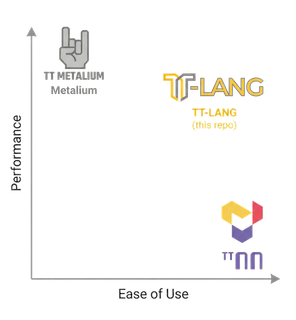

# tt-lang (⚠️ in early development ⚠️)


A Python-based Domain-Specific Language (DSL) for authoring high-performance custom kernels on Tenstorrent hardware. **This project is currently in early development stages, the language spec has not yet been finalized and programs are not yet expected to run.**

## Vision

TT-Lang joins the Tenstorrent software ecosystem as an expressive yet ergonomic middle ground between [TT-NN](https://docs.tenstorrent.com/tt-metal/latest/ttnn/index.html) and [TT-Metalium](https://docs.tenstorrent.com/tt-metal/latest/tt-metalium/index.html), aiming to provide a unified entrypoint with integrated simulation, performance analysis, and AI-assisted development tooling.



The language is designed to support generative AI workflows and a robust tooling ecosystem: Python as the host language enables AI tools to translate GPU DSL kernels (Triton, CUDA, cuTile, TileLang) to Tenstorrent hardware more reliably than direct TT-Metalium translation, while tight integration with functional simulation will allow AI agents to propose kernel implementations, validate correctness, and iterate on configurations autonomously. Developers should be able to catch errors and performance issues in their IDE rather than on hardware, with a functional simulator to surface bugs early. Line-by-line performance metrics and data flow graphs can guide both programmers and AI agents to easily spot bottle necks and optimization opportunities.

Tenstorrent developers today face a choice between TT-NN which provides high-level operations that are straightforward to use but lack the expressivity needed for custom kernels and TT-Metalium which provides full hardware control through explicit low-level management of memory and compute. This is not a shortcoming of TT-Metalium; it is designed to be low-level and expressive, providing direct access to hardware primitives without abstraction overhead, and it serves its purpose well for developers who need that level of control. The problem is that there is no middle ground where the compiler handles what it does best—resource management, validation, optimization—while maintaining high expressivity for application-level concerns.

TT-Lang bridges this gap through progressive disclosure: simple kernels require minimal specification where the compiler infers compute API operations, NOC addressing, DST register allocation and more from high-level abstractions, while complex kernels allow developers to open the hood and craft pipelining and synchronization details directly. The primary use case is kernel fusion for model deployment. Engineers porting models through TT-NN quickly encounter operations that need to be fused for performance or patterns that TT-NN cannot express, and today this requires rewriting in TT-Metalium which takes weeks and demands undivided attention and hardware debugging expertise. TT-Lang makes this transition fast and correct: a developer can take a sequence of TT-NN operations, express the fused equivalent with explicit control over intermediate results and memory layout, validate correctness through simulation, and integrate the result as a drop-in replacement in their TT-NN graph.

## Prerequisites

* [CMake](https://cmake.org/) 3.28+
* [Clang](https://clang.llvm.org/) 18+ or [GCC](https://gcc.gnu.org/) 11+
* An existing LLVM/MLIR toolchain at `TTMLIR_TOOLCHAIN_DIR` (default: `/opt/ttmlir-toolchain`)
* [Python](https://www.python.org/) 3.11+ in the toolchain's virtual environment
* Optional (recommended): [Ninja](https://ninja-build.org/) build system

## Quick Start

tt-lang depends on [tt-mlir](https://github.com/tenstorrent/tt-mlir), the MLIR-based compiler infrastructure for Tenstorrent hardware. tt-mlir provides the core MLIR dialects, compilation passes, and runtime support that tt-lang builds upon to deliver a Python-based DSL for authoring custom kernels.

The build system supports three different integration scenarios for tt-mlir -- build-based, installation-based, or automatically fetched and installed (for more details on these, please refer to the [build system document](docs/BUILD_SYSTEM.md)).

Here we describe the most common scenario for tt-lang users who do not have a pre-built or pre-installed tt-mlir. Note that this will fetch, configure, build and install the tt-mlir version whose commit SHA is in `third-party/tt-mlir.commit`.

```bash
cd /path/to/tt-lang
cmake -GNinja -Bbuild .
source build/env/activate
cmake --build build
```

The tt-mlir will be built and installed to `build/tt-mlir-install/` by default (or to the location specified by `TTMLIR_INSTALL_PREFIX`). The generated `env/activate` script in tt-lang's build directory will automatically use this local installation. This process requires:
- An existing LLVM/MLIR toolchain at `TTMLIR_TOOLCHAIN_DIR` (default: `/opt/ttmlir-toolchain`)

**Build options:**
```bash
# Debug build with Python bindings
cmake -GNinja -Bbuild . -DCMAKE_BUILD_TYPE=Debug -DTTLANG_ENABLE_BINDINGS_PYTHON=ON

# Custom install prefix for automatically built tt-mlir
cmake -GNinja -Bbuild . -DTTMLIR_INSTALL_PREFIX=/tmp/my-ttmlir-install

# Enable code coverage
cmake -GNinja -Bbuild . -DCODE_COVERAGE=ON
```

To generate the Sphinx documentation, configure with `-DTTLANG_ENABLE_DOCS`.

**Note:** The `third-party/tt-mlir.commit` file contains the reference tt-mlir version. The build system ensures version compatibility automatically.

## Example

See the `examples/` and `tests/` directory for complete working examples, including:
- `test/python/test_runtime_add.py`
- `test/python/test_dram_interleaved_flash_attention_large.py`

Note: this project is currently in early prototype phase, examples are not final and may change significantly as we finalize the initial language spec and implement features.

## Documentation

- [Build System](docs/BUILD_SYSTEM.md) - Detailed build configuration options and integration scenarios
- [Testing Guide](test/TESTING.md) - How to write and run tests using LLVM lit
- [Sphinx docs](docs/README.md) - How to build, view, and extend the documentation (docs are disabled by default; enable with `-DTTLANG_ENABLE_DOCS=ON` and build with `cmake --build build --target ttlang-docs`)

## Testing

Run tests using CMake targets:

```bash
source build/env/activate

# All tests (MLIR + Python)
cmake --build build --target check-ttlang

# MLIR dialect tests only
cmake --build build --target check-ttlang-mlir

# Python runtime tests only
cmake --build build --target check-ttlang-python-lit
```

Or run specific test suites using lit directly:

```bash
source build/env/activate
llvm-lit -sv test/ttlang/     # MLIR dialect tests
llvm-lit -sv test/python/     # Python runtime tests
```

For more information on testing, including how to write new tests and interpret results, see [test/TESTING.md](test/TESTING.md).

## Python Package Structure

The `ttlang` Python package provides a DSL for authoring custom data movement and compute kernels:

```
python/ttlang/
├── __init__.py           # Main package exports
├── d2m_api.py            # Core decorator and compilation orchestration
├── operators.py          # TensorBlock, MemTx, DMA operations
├── circular_buffer.py    # CircularBuffer for inter-thread communication
├── semaphore.py          # Semaphore for multi-core synchronization
├── layouts.py            # MetalLayoutAttr creation and accessor layout utilities
├── dtype_utils.py        # PyTorch/runtime data type conversions
├── constants.py          # Shared constants (tile sizes, memory spaces)
└── _src/                 # Internal implementation modules
    ├── d2m_ast.py        # D2M dialect AST compiler
    ├── kernel_ast.py     # Base kernel compilation infrastructure
    ├── kernel_types.py   # CircularBuffer, Kernel, and other types
    ├── base_ast.py       # AST base classes
    ├── tensor_accessor.py  # TensorAccessor type for indexed tile-level access
    ├── utils.py          # Utility functions
    └── codegen.py        # D2M generic function creation and code generation
```

## Developer Guidelines

### Updating tt-mlir version

Update the `third-party/tt-mlir.commit` file to the desired commit SHA if using the automated tt-mlir install. Refer to the [BuildSystem.md](docs/BUILD_SYSTEM.md) document for details on building with a pre-built tt-mlir or pre-installed one.

### Code Formatting with Pre-commit

tt-lang uses [pre-commit](https://pre-commit.com/) to automatically format code and enforce style guidelines before commits.

#### Installation

Install pre-commit using pip:

```bash
pip install pre-commit
```

Or using your system package manager:
```bash
# macOS
brew install pre-commit

# Ubuntu/Debian
sudo apt install pre-commit
```

#### Setup

After cloning the repository, install the git hook scripts:

```bash
cd /path/to/tt-lang
pre-commit install
```

This will configure git to run `pre-commit` checks before each commit. You may also
choose not to do this step and instead run `pre-commit` manually as described
below.

#### Usage

Once installed, `pre-commit` will automatically run when you commit:

```bash
git commit -m "Your commit message"
```

Pre-commit will:
- Format Python code with [Black](https://github.com/psf/black)
- Format C++ code with [clang-format](https://clang.llvm.org/docs/ClangFormat.html) (LLVM style)
- Remove trailing whitespace
- Ensure files end with a single newline
- Check YAML and TOML syntax
- Check for large files
- Check for valid copyright notice

If `pre-commit` makes changes, the commit will be stopped. Review the changes, stage them, and commit again:

```bash
git add -u
git commit -m "Your commit message"
```

#### Manual Formatting

To run pre-commit checks manually on all files:

```bash
pre-commit run --all-files
```

To run on specific files:

```bash
pre-commit run --files path/to/file1.py path/to/file2.cpp
```

#### Skipping Pre-commit (Not Recommended)

In rare cases where you need to skip pre-commit checks:

```bash
git commit --no-verify -m "Your commit message"
```

**Note:** CI will still run these checks, so skipping locally may cause CI failures.

## Contributing

We welcome contributions! Please see [CONTRIBUTING.md](CONTRIBUTING.md) for guidelines on how to contribute to tt-lang.

## Code of Conduct

This project adheres to a [Code of Conduct](CODE_OF_CONDUCT.md). By participating, you are expected to uphold this code and treat all community members with respect.

## Support

- **Issues:** [GitHub Issues](https://github.com/tenstorrent/tt-lang/issues) - Report bugs or request features

## License

This project is licensed under the Apache License 2.0 - see the [LICENSE](LICENSE) file for details.

Third-party dependencies and their licenses are listed in the [NOTICE](NOTICE) file.
