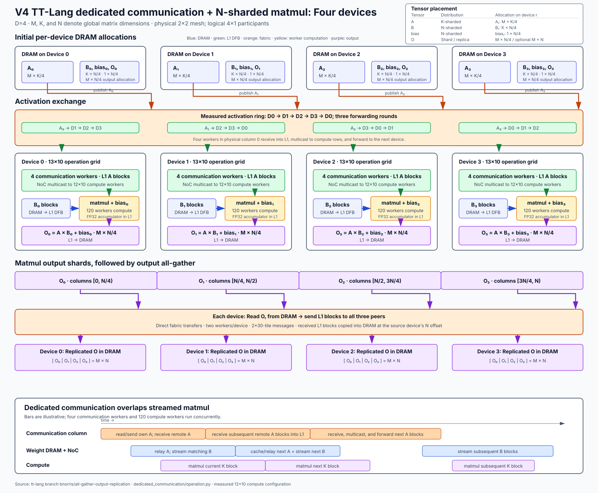
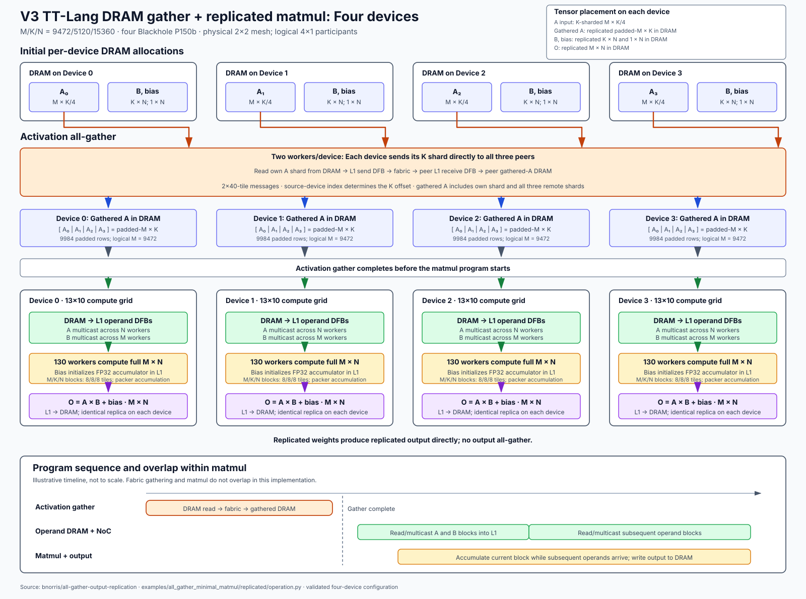

# All-gather matmul: TT-Lang vs TT-Metal

This benchmark compares all-gather, matrix multiplication and row-bias addition
with TT-Metal's
[`ttnn.experimental.all_gather_minimal_matmul_async`](https://github.com/tenstorrent/tt-metal/blob/ea042c4ad6237678103cd7cbceb346e060f0f9a3/ttnn/cpp/ttnn/operations/experimental/ccl/all_gather_minimal_matmul_async/all_gather_minimal_matmul_async.cpp).
Both compared versions return the same replicated output.

Compare the best measured configuration of each implementation for identical
global inputs, precision and replicated output. Tune compute grids, blocks and
communication independently; equal resource usage is not required. Report
the selected worker count and configuration for each result.

For M/K/N=9472/5120/15360 on four Blackhole P150b devices, TT-Lang V4 takes
3.792 ms for N-sharded output and 14.498 ms after a separate output gather.
Replicated TT-Lang V3 takes 10.248 ms; native takes 6.916 ms. The equivalent
replicated-output ratios are 2.096 and 1.482. See
[results and configurations](PERFORMANCE.md).

## TT-Lang versions

Oldest to newest; all remain runnable.

| Version | Implementation | Output on each device |
| --- | --- | --- |
| 1. Per-row all-gather + matmul | [Operation](../../examples/all_gather_minimal_matmul/per_row_all_gather/operation.py); one communication worker per M-worker row | N-sharded; optionally gathered to replicated output |
| 2. Two-worker ring + matmul | [Operation](../../examples/all_gather_minimal_matmul/two_worker_ring/operation.py); two communication workers serve all M-worker rows | N-sharded; optionally gathered to replicated output |
| 3. DRAM all-gather + replicated matmul | [Operation](../../examples/all_gather_minimal_matmul/replicated/operation.py); gather completes before replicated matmul | Replicated output; no final gather |
| 4. Dedicated communication + N-sharded matmul | [Operation](../../examples/all_gather_minimal_matmul/dedicated_communication/operation.py); activation exchange uses a separate worker column and overlaps matmul | N-sharded; optionally gathered to replicated output |

[Entry points and selection flags](../../examples/all_gather_minimal_matmul/README.md).
The performance comparison uses versions 3 and 4 against the native TT-Metal reference.

## Files

| File or directory | Purpose |
| --- | --- |
| [`__main__.py`](__main__.py) | Inputs, correctness checks, device timing and provenance for both implementations. |
| [`profile.py`](profile.py) | Python dispatch profiling; not used for device-performance results. |
| [`ccl_comparison.py`](ccl_comparison.py) | Identical activation collective measured alone and within replicated matmul. |
| [`source_size.py`](source_size.py) | Reproduce the per-version Python/native C++ source-line counts, excluding comments and blank lines. |
| [`PERFORMANCE.md`](PERFORMANCE.md) | Four-device results and exact measured configurations. |
| [`images/`](images/) | Four-device dataflow diagrams. |
| [Examples](../../examples/all_gather_minimal_matmul/README.md) | Separate N-sharded and replicated-output implementations, with shared collectives. |
| [Device timer](../device_timing.py) | TT-Metal profiler analysis and multi-program device intervals. |
| [Single-device matmul](../matmul/README.md) | Matmul-only benchmarks. |

## Comparison with the native benchmark

`M`, `K` and `N` denote complete matrix dimensions; `D=4`.
Activations are initially K-sharded. All inputs/output use TILE layout and
interleaved DRAM. The [N-sharded implementation](../../examples/all_gather_minimal_matmul/dedicated_communication/operation.py)
fuses activation gathering with matmul. The [replicated implementation](../../examples/all_gather_minimal_matmul/replicated/operation.py)
gathers activations into DRAM first, then computes the complete output on every device.

| Tensor on each of four devices | TT-Lang N-sharded + output gather | TT-Lang replicated weights | Native |
| --- | --- | --- | --- |
| Activation input | M x K/4 | M x K/4 | M x K/4 |
| Weight input | K x N/4 | K x N | K x N |
| Bias input | 1 x N/4 | 1 x N | 1 x N |
| Computed output | M x N/4 | M x N | M x N |
| Returned output | Replicated M x N | Replicated M x N | Replicated M x N |

`--gather-output --n-tiles N_TILES` selects N-sharded compute followed by
output all-gather. `--variant replicated --n-tiles N_TILES` instead computes
the complete output on each device. `N_TILES=N/32`.
Without either selection, TT-Lang returns N-sharded output; that result is not
equivalent to the native replicated output.

| Measurement condition | TT-Lang | Native reference |
| --- | --- | --- |
| Devices | Four Blackhole P150b | Same four devices |
| Global M / K | 9472 / 5120 | 9472 / 5120 |
| Global N | 15360 | 15360 |
| Precision | BF16 input/output, HiFi2, FP32 destination and packer accumulation | Same |
| Bias | Included | Included |
| Timing | Device trace replay; includes final gather when selected | Device trace replay of fused program |
| Worker roles per device | Replicated: 130 compute (transposed 13x10) plus two communication; N-sharded: 120 compute, four fabric and six local distribution (transposed 13x10 operation grid) | 108 compute (transposed 12x9); 24 also exchange activation blocks over fabric; four additional mux-only workers |
| Blocking | Measured settings in [PERFORMANCE.md](PERFORMANCE.md) | 8/8/8 tiles, 2x2 subblock |
| Fabric | 2D, strict initialization, 8192-byte payload | 1D ring, strict initialization, 8192-byte payload |
| Native communication settings | Not applicable | Two links, six workers/link, 24 channel buffers |

## Native per-device worker organization

The native 12x9 rectangle is not compute-only. Every node runs matmul and both operand data-movement kernels concurrently. The activation and weight roles below overlap; only the four fabric mux nodes are outside the compute rectangle.

| Function | Logical nodes | Count | Data movement |
| --- | --- | ---: | --- |
| Matmul and output | `x=0..11, y=0..8` | 108 | Consume activation and weight DFBs, accumulate FP32, and write each node's assigned M/N tile region to DRAM. |
| Activation injection | `x=0..11, y=0` | 12 | Read the current local activation block or an arrived remote block from gather-scratch DRAM, then inject it down one column. |
| Activation on-device relay | `x=0..11, y=1..6` | 72 | Forward the activation block through the column's L1 DFB chain. |
| Activation fabric clients | `x=0..11, y=7..8` | 24 | Continue the column relay and send the block in one ring direction during the first N-block pass; 12 clients serve each direction. |
| Weight injection | `x=0, y=0..8` | 9 | Read one replicated-weight N stripe and bias from DRAM, then inject blocks across one row. |
| Weight relay | `x=1..11, y=0..8` | 99 | Forward weight blocks through the row's L1 DFB chain. |
| Fabric mux | `(5,9), (6,9), (11,9), (12,9)` | 4 | One mux per link and ring direction; each mux serves six activation fabric clients. These nodes do not compute matmul. |

Remote activation packets scatter-write into each destination device's private `M x K` gather-scratch DRAM allocation and increment a readiness semaphore. A column injector reads a block after it arrives, while the 108 compute nodes process earlier blocks. Fabric transmission occurs only on the first N-block pass; later N blocks reuse the gathered activation from DRAM. This avoids repeated fabric traffic when the full K dimension cannot remain in L1, at the cost of one DRAM write and later reads for remote activation tiles.

The assignments follow the pinned native [core ranges](https://github.com/tenstorrent/tt-metal/blob/ea042c4ad6237678103cd7cbceb346e060f0f9a3/ttnn/cpp/ttnn/operations/experimental/ccl/all_gather_minimal_matmul_async/device/all_gather_minimal_matmul_async_program_factory.cpp#L396-L413), [fabric mux placement](https://github.com/tenstorrent/tt-metal/blob/ea042c4ad6237678103cd7cbceb346e060f0f9a3/ttnn/cpp/ttnn/operations/experimental/ccl/all_gather_minimal_matmul_async/device/all_gather_minimal_matmul_async_program_factory.cpp#L478-L596), and [activation streaming loop](https://github.com/tenstorrent/tt-metal/blob/ea042c4ad6237678103cd7cbceb346e060f0f9a3/ttnn/cpp/ttnn/operations/experimental/ccl/all_gather_minimal_matmul_async/device/kernels/dm_in0_sender.cpp#L290-L594). The [per-device figure](images/ttmetal_device.svg) shows these overlapping roles.

Reference sources:
[Wan2.2 test](https://github.com/tenstorrent/tt-metal/blob/f69f924c6b4f38daa0a6f25716731f36c573dc0e/models/tt_dit/tests/models/wan2_2/test_all_gather_minimal_matmul_async.py)
and [block sweep](https://github.com/tenstorrent/tt-metal/blob/f69f924c6b4f38daa0a6f25716731f36c573dc0e/models/tt_dit/utils/sweep_mm_block_sizes.py).
These source revisions and the installed binary hashes are recorded separately
in each report.

## Run the comparison

Activate the TT-Lang build environment and ensure the four devices are idle.
The runner discovers the physical 2x2 mesh and reshapes its logical coordinates
to 4x1 for the native operation's single collective axis.

All commands below use global M/K/N=9472/5120/15360.

TT-Lang replicated output:

```bash
python -m benchmarks.all_gather_minimal_matmul \
    --implementation ttlang --variant replicated --mesh-shape 4x1 \
    --fabric-config 2d --fabric-reliability strict --fabric-router-payload 8192 \
    --m-tiles 296 --k-tiles-per-device 40 --n-tiles 480 \
    --worker-grid 13 10 --transpose \
    --m-block-tiles 8 --k-block-tiles 8 --n-block-tiles 8 \
    --no-reuse-activation --activation-all-gather all_to_all \
    --math-fidelity HiFi2 --fp32-dest-acc \
    --warmup 3 --samples 5 --json /tmp/ttlang-replicated-n15360.json
```

N-sharded compute, with optional output all-gather:

```bash
python -m benchmarks.all_gather_minimal_matmul \
    --implementation ttlang --mesh-shape 4x1 \
    --fabric-config 2d --fabric-reliability strict --fabric-router-payload 8192 \
    --m-tiles 296 --k-tiles-per-device 40 --n-tiles-per-device 120 \
    --worker-grid 12 10 --transpose --dedicated-communication-workers 10 \
    --m-block-tiles 4 --k-block-tiles 10 --n-block-tiles 12 \
    --no-reuse-activation --activation-all-gather ring \
    --math-fidelity HiFi2 --fp32-dest-acc \
    --warmup 3 --samples 10 --json /tmp/ttlang-n-sharded-n15360.json
```

Replace `--n-tiles-per-device 120` with `--n-tiles 480` and append these
options to time the equivalent replicated output:

```bash
--gather-output --output-all-gather all_to_all --output-gather-workers 2 \
    --output-gather-block-tiles 30 --output-gather-m-block-tiles 2
```

Native replicated output:

```bash
python -m benchmarks.all_gather_minimal_matmul \
    --implementation ttmetal --variant replicated --mesh-shape 4x1 \
    --fabric-config 1d-ring --fabric-reliability strict --fabric-router-payload 8192 \
    --native-num-links 2 --native-workers-per-link 6 --native-channel-buffers 24 \
    --m-tiles 296 --k-tiles-per-device 40 --n-tiles 480 \
    --worker-grid 12 9 --transpose \
    --m-block-tiles 8 --k-block-tiles 8 --n-block-tiles 8 --native-subblock 2 2 \
    --warmup 2 --samples 3 --json /tmp/native-n15360.json
```

For the smaller native M/K/N=3072/5120/3840 case, change `--m-tiles 96`,
`--n-tiles 120`, and the report filename. TT-Lang requires independently tuned
blocks and grids; the larger-case configurations above are not smaller-case optima.

## Collective comparison

`--activation-all-gather all_to_all|ring` selects direct peer transfers or
ring forwarding. `--output-all-gather` independently selects the final gather.
`--output-gather-m-block-tiles` and `--output-gather-block-tiles` control its
message's row and column tile counts independently of matmul blocking.

`--compare-activation-ccl --variant replicated --implementation ttlang` measures
the full operation, its activation collective alone, then the full operation
again. All three stages reuse the same collective instance and input/output
tensors; matmul's allocations remain live during the isolated measurement.
The report records actual collective geometry, including padded M, and saves
each completed stage. Full timings include the activation gather, matmul and
device gap; isolated timings include only the collective. Every sample checks
the replicated result, with exact checks for the collective.

Run each existing algorithm with the same full-operation configuration:

```bash
for algorithm in all_to_all ring; do
    python -m benchmarks.all_gather_minimal_matmul \
        --compare-activation-ccl --implementation ttlang --variant replicated \
        --mesh-shape 4x1 --fabric-config 2d --fabric-reliability strict \
        --fabric-router-payload 8192 --activation-all-gather "$algorithm" \
        --m-tiles 296 --k-tiles-per-device 40 --n-tiles 480 \
        --worker-grid 13 10 --transpose \
        --m-block-tiles 8 --k-block-tiles 8 --n-block-tiles 8 \
        --no-reuse-activation --math-fidelity HiFi2 --fp32-dest-acc \
        --warmup 2 --samples 5 --worker-timeout 600 \
        --json "/tmp/activation-ccl-$algorithm.json"
done
```

This configuration uses logical M/K/N=9472/5120/15360, padded M=9984,
130 matmul workers and two collective workers per device, with 2x40-tile
collective messages. Both algorithms are TT-Lang implementations. The operation
gathers into DRAM before matmul; this does not measure native's overlapping
collective or the N-sharded implementation's fused L1 transfers.

`--collective-only activation|output` instead constructs an independent
standalone collective. Its worker/block flags need not match a full operation;
use the comparator above when selecting the replicated operation's collective.

## Measurement contract

The runner uses TT-Metal's
[`device_kernel_duration` analysis](https://github.com/tenstorrent/tt-metal/blob/ea042c4ad6237678103cd7cbceb346e060f0f9a3/tools/tracy/device_post_proc_config.py)
through `tracy.process_device_log.import_log_run_stats`.

1. Allocate the output gather's persistent L1 buffers before matmul's buffers
   to preserve contiguous matmul workspace. Compile, warm up and validate
   against FP32 PyTorch.
2. Prepare/reset runtime resources outside capture, then capture and replay
   one invocation. Replicated-output selections enable trace replay automatically.
3. On each device, measure first kernel start through last kernel end.
   Both N-sharded compute plus output gather and replicated activation gather
   plus matmul include both programs and their gap. The workload records its
   program count explicitly; single-device replicated matmul has one program.
4. Average the four device durations, then report the median of the requested samples.
   `--device-aggregation max` instead selects the slowest device per sample.

Device clocks are independent; timestamps from different devices are never
subtracted. The interval includes device communication, compute and waits.
It excludes host dispatch, resource preparation, correctness checking and
profiler processing.

Reports contain UTC timestamps, source revisions/hashes, dirty-tree status,
binary hashes, actual device IDs, configurations, correctness results and
per-device cycles. Raw profiler reports remain in private worker directories
beside the requested JSON, outside the repository. A failed run exits nonzero;
an existing combined report is not replaced.

## Dataflow

These diagrams show both N-sharded TT-Lang implementations, DRAM all-gather
with replicated TT-Lang matmul, and the native operation. Dedicated device
DRAM is described in the
[TT-Metalium architecture introduction](https://github.com/tenstorrent/tt-metal/blob/f69f924c6b4f38daa0a6f25716731f36c573dc0e/docs/source/tt-metalium/tt_metal/labs/matmul/lab1/lab1.rst#L227-L230).







| Algorithm | TT-Lang N-sharded | Native |
| --- | --- | --- |
| Activation communication | Direct peer transfers or ring forwarding | Bidirectional ring forwarding |
| Gathered activation storage | L1 dataflow buffers | DRAM scratch followed by L1 dataflow buffers |
| Activation reuse | Full-K L1 cache when selected; streaming otherwise | Gathered activation read from DRAM |
| Output replication | Optional final gather | Inherent with replicated weights |
