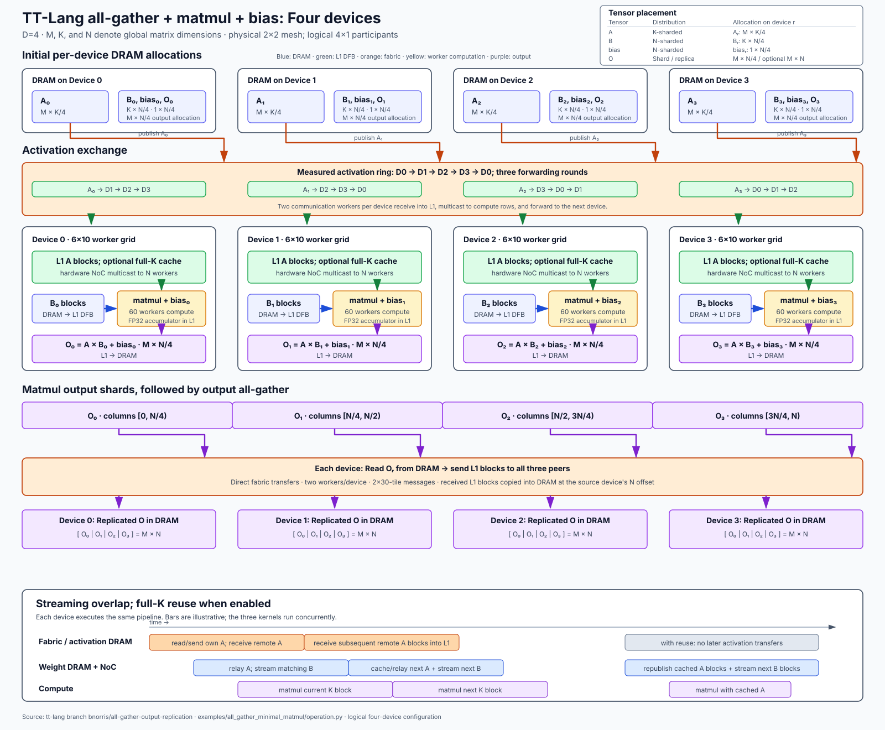
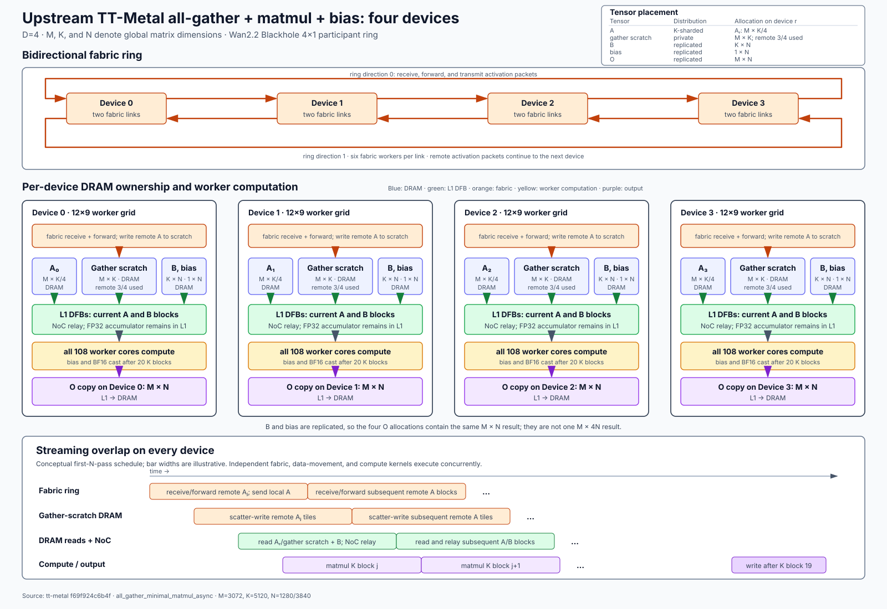

# All-gather matmul: TT-Lang vs TT-Metal

This benchmark measures device execution time for two implementations of
all-gather followed by matrix multiplication and row-bias addition:
the [TT-Lang operation](../../examples/all_gather_minimal_matmul/operation.py)
and TT-Metal's
[`ttnn.experimental.all_gather_minimal_matmul_async`](https://github.com/tenstorrent/tt-metal/blob/ea042c4ad6237678103cd7cbceb346e060f0f9a3/ttnn/cpp/ttnn/operations/experimental/ccl/all_gather_minimal_matmul_async/all_gather_minimal_matmul_async.cpp).
"Native" below means that TTNN operation, not a separate all-gather plus
`ttnn.matmul`. Both implementations receive identical inputs and compute settings.

## Files and related benchmarks

| File or directory | Purpose |
| --- | --- |
| [`__main__.py`](__main__.py) | Benchmark runner: constructs inputs, runs both implementations, checks outputs, and writes device timings and provenance. Run with `python -m benchmarks.all_gather_minimal_matmul`. |
| [`profile.py`](profile.py) | Optional Python `cProfile` helper for host dispatch overhead; its timings are not used in the device-performance comparison. |
| [`../device_timing.py`](../device_timing.py) | Reads device timings through TT-Metal's existing Tracy profiler analysis. |
| [`PERFORMANCE.md`](PERFORMANCE.md) | Measured results, measurement conditions, provenance, and comparison limits. |
| [`images/`](images/) | Four-device TT-Lang and TT-Metal dataflow diagrams. |
| [`examples/all_gather_minimal_matmul/`](../../examples/all_gather_minimal_matmul/README.md) | TT-Lang implementation and standalone correctness example. |
| [`benchmarks/matmul/`](../matmul/README.md) | Single-device matmul benchmarks, without all-gather. |

## Four-device dataflow

Both diagrams use `D=4` and global `M`, `K`, and `N` notation. They show tensor
placement, communication, worker-core use, DRAM traffic, and computation/data
movement overlap. They do not report four-device timing results. The
[TT-Metalium architecture introduction](https://github.com/tenstorrent/tt-metal/blob/f69f924c6b4f38daa0a6f25716731f36c573dc0e/docs/source/tt-metalium/tt_metal/labs/matmul/lab1/lab1.rst#L227-L230)
describes the dedicated DRAM attached to each device.

### TT-Lang



### Upstream TT-Metal Wan2.2 test



The upstream test replicates full `B` and bias values, so its four devices
produce four copies of the same `M x N` result. The TT-Lang benchmark instead
N-shards `B`, bias, and output.

| Aspect | TT-Lang | Upstream TT-Metal |
| --- | --- | --- |
| Inter-device A transfer | One fabric unicast per source/destination pair | Bidirectional ring forwarding |
| Remote A storage | Directly in L1 DFBs | Device DRAM scratch, then L1 DFBs |
| A reuse | Full-K block cached in L1 across N rounds | Current blocks read from DRAM and relayed through L1 |
| B, bias, output | N-sharded | Replicated |

## Operation and dimensions

Let `D` be the participant count. For each participant, the output is
`activation @ weight_shard + bias_shard`.
The activation is initially split along the reduction dimension K; all-gather
makes the full activation available to each participant. Weights, bias, and
output are split along the output-column dimension N.

| Tensor | Complete tensor | Allocation on each participant |
| --- | --- | --- |
| Activation | M x K | M x (K / D) |
| Weight | K x N | K x (N / D) |
| Row bias | 1 x N | 1 x (N / D) |
| Output | M x N | M x (N / D) |

All input/output tensors use tile layout and interleaved DRAM storage.
The benchmark always includes bias. It generates reproducible random inputs
with seed 0: normally distributed activations, weights scaled by
`1 / sqrt(full K)`, and bias scaled by 0.1.

Command-line dimensions and blocks are in 32 x 32 tiles, not elements:

| Argument | Conversion to elements |
| --- | --- |
| `--m-tiles 96` | M = 96 x 32 = 3072 |
| `--k-tiles-per-device 80` | K = D x 80 x 32; for D=2, K=5120 |
| `--n-tiles-per-device 40` or `120` | N / D = 1280 or 3840; for D=2, N=2560 or 7680 |
| `--m-block-tiles 2 --k-block-tiles 40 --n-block-tiles 2` | Each compute block multiplies a 64 x 1280 activation block by a 1280 x 64 weight block. |

`--worker-grid 2 5 --transpose` selects ten compute workers per device:
two divide the M blocks and five divide the N blocks. Each worker processes
multiple output blocks. Here `--transpose` changes the worker-grid orientation;
it does not transpose the input matrices. `--k-block-tiles` also controls
TT-Lang's activation-transfer size.

## TT-Lang optimizations

The [TT-Lang implementation](https://github.com/tenstorrent/tt-lang/blob/7ad660d452270ddcc44d0fd15864e08237d8af35/examples/all_gather_minimal_matmul/operation.py)
uses the following optimizations in the measured configuration:

1. Receive gathered activation blocks directly into on-chip L1 memory,
   eliminating gathered-activation DRAM writes and subsequent DRAM reads.
2. Cache each worker's M block over full K and reuse it across N blocks,
   avoiding repeated activation reads, inter-device transfers, and row broadcasts.
3. Accumulate matmul products directly into FP32 L1 through the packer,
   eliminating a separate BF16 product buffer, conversion buffer, and per-K
   vector addition while retaining FP32 intermediate precision.
4. Use 40-tile K blocks for both compute and activation transfers, amortizing
   per-block synchronization and dataflow-buffer handoffs. Native uses the same
   compute blocking in the comparison.
5. Double-buffer weights so loading a subsequent block can overlap compute.
6. Assign activation reads to NoC 0 and weight reads to NoC 1, using the two
   on-chip networks for different operands. Output writes share NoC 0;
   inter-device sends share the weight-loading processor.

## Measured results

Both workloads use M=3072, full K=5120, two Blackhole devices, the transposed
2x5 compute grid, BF16 inputs/output, HiFi2 math, FP32 destination registers,
FP32 packer accumulation, and bias. Packer accumulation adds successive
K-block products to intermediate results in on-chip L1 memory.

Both implementations use identical M/K/N blocks of 2/40/2 tiles.
Times are median device-kernel milliseconds; parentheses show sample minimum
and maximum, not confidence intervals. Ratios below 1 favor TT-Lang.

| Per-device N | TT-Lang ms (range) | Native ms (range) | TT-Lang / native |
| --- | ---: | ---: | ---: |
| 1280 | 3.439 (3.434-3.448) | 3.690 (3.687-3.699) | 0.932 |
| 3840 | 9.040 (8.959-9.170) | 10.396 (10.311-10.449) | 0.870 |

Measured 2026-09-09 23:00:22-23:01:27 UTC; TT-Lang `7ad660d45227`; TT-Metal/LLVM source pins `ea042c4ad623`/`37aca9d384347`; compiler/TTNN/Metal binary SHA-256 prefixes `a31540fb2fad`/`62edde2b1f61`/`65380f11dc15`; container digest `6eaf96b4b00d5`; 3 warmups, 5 samples, median of the per-invocation mean across devices.

These results compare the specified configurations, not each implementation's
best possible configuration. The [performance report](PERFORMANCE.md)
summarizes the measurements and their scope.

## Reproduce the measurements

### Hardware and software

The recorded setup has four visible Blackhole devices forming a 2x2 parent
mesh. The operation runs on a connected 2x1 submesh, reported as device IDs
1 and 2. The profiler reports a 1350 MHz clock. Driver logs record KMD 2.4.1
and firmware bundle 18.12.1. These IDs identify the measured participants,
not a required numbering scheme on another system.

The runner discovers the visible fabric topology, opens the entire parent
mesh, then selects two devices along its first non-singleton dimension.
It has no argument for selecting physical device IDs.
**All devices in the discovered parent mesh must be available and idle**,
even though only two participate in the operation. Check device reservations,
host processes holding device nodes, and workloads in other containers before
running. Mapping only two nodes from a larger fabric can prevent discovery.
The commands below neither reserve devices nor reset them.

A Linux host needs Docker access, a working Tenstorrent driver/firmware
installation, connected Blackhole devices, and the hugepage mounts used below.
The [development-image guide](../../docs/sphinx/getting-started.md#building-from-source-ird-image)
describes the prebuilt toolchain. The following setup pins the v1.1.9 image
used for these measurements and builds only TT-Lang, not LLVM or TT-Metal.

Run in Bash on the host, after confirming that all mapped devices are available:

```bash
benchmark_image=ghcr.io/tenstorrent/tt-lang/tt-lang-ird-ubuntu-24-04@sha256:6eaf96b4b00d5e44de5cfcef05052963a2bad563692bc03129c83fbeecae390b
benchmark_workspace=$(mktemp -d /tmp/all-gather-matmul.XXXXXX)
printf 'Host workspace: %s\n' "$benchmark_workspace"
benchmark_devices=()
for device_node in /dev/tenstorrent/*; do
    benchmark_devices+=(--device "$device_node:$device_node")
done

docker run -d --name all-gather-matmul-benchmark \
    "${benchmark_devices[@]}" \
    -v /dev/hugepages:/dev/hugepages \
    -v /dev/hugepages-1G:/dev/hugepages-1G \
    -v "$benchmark_workspace:/workspace" \
    -e BENCHMARK_CONTAINER_IMAGE="$benchmark_image" \
    "$benchmark_image" sleep infinity
docker exec -it -w /workspace all-gather-matmul-benchmark bash
```

Run inside that container:

```bash
git clone https://github.com/tenstorrent/tt-lang.git
cd tt-lang
git checkout --detach 7ad660d452270ddcc44d0fd15864e08237d8af35
cmake -G Ninja -B build-docker -DTTLANG_USE_TOOLCHAIN=ON
source build-docker/env/activate
cmake --build build-docker
```

The source revision is the measured implementation, not the latest branch
head. To measure another revision, check out and rebuild that revision, then
retain its generated report separately.

The installed native binaries came from the pinned image; their exact
TT-Metal build commit was not recorded. The source link at the top points to
TT-Lang's TT-Metal dependency revision. It does not identify the installed
binary's commit. Verify the native binaries against the measured SHA-256
values before comparing a new run:

```bash
sha256sum "$TT_METAL_HOME/lib/_ttnncpp.so" "$TT_METAL_HOME/lib/libtt_metal.so"
```

| Binary | Measured SHA-256 |
| --- | --- |
| `_ttnncpp.so` | `62edde2b1f6153a59073bba75f134425e0f4ad9ff25bab6d3c387a5cf50f726f` |
| `libtt_metal.so` | `65380f11dc158ba5ed8f1a3ca67a2d0824ef2a0884313142b5414a9026bb6efc` |

### Run both full-size cases

Continue in the activated container shell at the repository root.
The runner enables device profiling itself. Clear conflicting profiling
options and create a fresh output directory so a failed run cannot be
mistaken for an older result:

```bash
unset TTLANG_COMPILE_ONLY TTLANG_AUTO_PROFILE TTLANG_PERF_DUMP
unset TTLANG_SIGNPOST_PROFILE TT_METAL_PROFILER_ACCUMULATE
set -o pipefail
benchmark_results=$(mktemp -d /workspace/all-gather-results.XXXXXX)

for n_tiles in 40 120; do
    timeout 360 python -m benchmarks.all_gather_minimal_matmul \
        --implementation both --dtype bf16 --math-fidelity HiFi2 \
        --fp32-dest-acc --reuse-activation \
        --m-tiles 96 --k-tiles-per-device 80 --n-tiles-per-device "$n_tiles" \
        --m-block-tiles 2 --k-block-tiles 40 --n-block-tiles 2 \
        --worker-grid 2 5 --transpose --native-channel-buffers 24 \
        --device-aggregation mean --warmup 3 --samples 5 --seed 0 \
        --json "$benchmark_results/n$((n_tiles * 32)).json" \
        2>&1 | tee /tmp/device_test.log || exit 1
done
```

Each command runs TT-Lang first, then native in a separate process.
Each implementation has an internal 180-second timeout, including compilation;
the enclosing 360-second timeout bounds the complete command.
The host directory printed as `Host workspace` contains the source tree
and result directories after the container exits. `/tmp/device_test.log`
inside the container shows the most recent command's progress.

To run only a small correctness/timing check, omit the dimension, block, grid,
and `--transpose` arguments; defaults are M=64, full K=64, per-device N=128,
and a 4x2 compute grid. Default-size results do not reproduce the table above.

### Read and retain the output

A successful comparison prints five device-time samples per implementation,
the TT-Lang/native ratio, and the JSON filename. For example, this command
prints the medians in milliseconds and their ratio:

```bash
python - "$benchmark_results/n1280.json" <<'PY'
import json
import sys

with open(sys.argv[1]) as report_file:
    report = json.load(report_file)
for implementation in ("ttlang", "ttmetal"):
    measurement = report["variants"][implementation]["measurements"][implementation]
    print(f"{implementation}: {measurement['median_us'] / 1000:.3f} ms")
print(f"TT-Lang/native: {report['ttlang_over_ttmetal']:.3f}")
PY
```

Each `variants.ttlang` or `variants.ttmetal` entry records the UTC timestamp,
arguments, actual mesh/device IDs, compute configuration, correctness results,
source revision and worktree status, source and binary hashes, and profiler
source hashes. Sample records retain per-device cycles, launch IDs, clock
frequency, mean duration, and maximum duration. JSON durations are in
microseconds; the table above divides them by 1000.

Raw profiler CSVs and individual worker reports remain in unique
`n1280.ttlang.*`, `n1280.ttmetal.*`, and corresponding `n3840.*` directories
beside the combined JSON. Retain these directories with the report.
A correctness failure or timeout exits nonzero without replacing the combined
JSON; partial worker logs can still exist.

## Measurement contract

The runner uses TT-Metal's standard
[`device_kernel_duration` analysis](https://github.com/tenstorrent/tt-metal/blob/ea042c4ad6237678103cd7cbceb346e060f0f9a3/tools/tracy/device_post_proc_config.py),
through `tracy.process_device_log.import_log_run_stats`.

1. Perform three warmup invocations, synchronizing and checking each output.
2. For each of five measured invocations, synchronize, dump the device
   profiler, and select the newest operation on each participant. Launch IDs
   must advance between samples.
3. For each device, measure from the earliest worker-kernel start to the latest
   worker-kernel end, across all worker processors. Convert cycles using the
   profiler's clock frequency.
4. Average the two device durations to obtain one sample. Report the median
   of five samples and the ratio of implementation medians.

Device clocks are independent: the calculation averages durations and never
subtracts timestamps from different chips. `--device-aggregation max`
instead uses the slower device for each sample; that is not the table's metric.

This interval includes communication, data movement, compute, and worker
waits within the operation. It excludes compilation, Python dispatch,
allocation, separate resource-initialization programs, host synchronization,
correctness checking, and profiler processing. Thus the table reports device
execution time, not host or end-to-end application latency.

Both implementations use ordinary launches, not trace replay.
TT-Lang currently synchronizes to replace fabric semaphore resources between
invocations, preventing trace capture. Device-side waits caused by
cross-device dispatch skew can therefore affect these timings.

Correctness is checked against FP32 PyTorch `activation @ weight + bias`
after every warmup and measured invocation. BF16 requires Pearson correlation
(PCC) >= 0.99 and elementwise relative/absolute tolerances of 0.05.
The separate `--dtype fp32` mode uses HiFi4, PCC >= 0.999, and tolerances of
0.005; its matmul sources use TF32 precision, not full IEEE FP32 arithmetic.
The native gathered scratch is checked exactly: remote K shards match the
input, while the unused device-owned K shard remains zero.
TT-Lang does not produce a gathered output tensor.

## Comparison with the native benchmark

TT-Metal's [Wan2.2 operation test](https://github.com/tenstorrent/tt-metal/blob/f69f924c6b4f38daa0a6f25716731f36c573dc0e/models/tt_dit/tests/models/wan2_2/test_all_gather_minimal_matmul_async.py)
provides the M=3072/full K=5120/per-device N=1280 or 3840 cases.
Its [block-size sweep](https://github.com/tenstorrent/tt-metal/blob/f69f924c6b4f38daa0a6f25716731f36c573dc0e/models/tt_dit/utils/sweep_mm_block_sizes.py)
tunes the same collective operation.
The table distinguishes those upstream settings from the two-device runs
reported here. Unless an implementation is named, the last column applies
to both TT-Lang and native.

| Setting | Upstream TT-Metal Blackhole test/sweep | Reported two-device comparison |
| --- | --- | --- |
| Tensor dimensions | Plain-bias operation test: M=3072, full K=5120, per-device N=1280 or 3840. | Same dimensions per matmul; with two participants, each input activation shard has K=2560 instead of K=1280 on four participants. |
| Device mesh | Default sweep: 4x8 parent with a 4x1 participant ring; alternative: 1x8 participant ring. | Discovered 2x2 parent with a 2x1 participant submesh. Different device count and connectivity. |
| Compute workers | Transposed 12x9 grid, including edge-block scheduling. | Transposed 2x5 grid; block counts must divide worker extents. Native additionally uses fabric multiplexer cores, so ten compute workers is not a total core count. |
| M/K/N blocks | Plain M=3072 test: 8/8/8 tiles; sweep varies blocks. | 2/40/2 tiles for both implementations. These do not reproduce the upstream blocks. |
| Arithmetic | BF16, HiFi2, FP32 destinations, packer L1 accumulation. | Same settings, with FP32 intermediate storage in both implementations. |
| Output subblocks | Plain test: 2x2 tiles; sweep varies valid subblocks. | Native: 2x2; TT-Lang: compiler-selected register scheduling for the 2x2 output block. |
| Fabric transport | Ring, two links, six workers/link; 24 channel buffers in sweep, 48 in operation test. | Native: linear, one link, two workers/link, 24 channel buffers. TT-Lang: direct inter-device PipeNet channels; channel capacities are not equivalent to native's multiplexer buffer counts. |
| Fabric initialization | Sweep: STRICT_INIT, 8192-byte router payload. Blackhole operation test: 4096-byte payload. | RELAXED_INIT and the installed runtime's default router payload; payload size was not recorded. |
| Timing | Warmup and trace replay; mean device-kernel duration across participants, collected through the ops profiler. | Same per-device interval and cross-device mean; ordinary launches, five samples, median, separate profiler dump per invocation. |
| Tensor layout/storage | Tile layout, interleaved DRAM, row bias. Operation test replicates each device's K x N weight and 1 x N bias values. | Same layout and storage; weight and bias values are distinct N shards. Per-device dimensions still match. |

The sweep multiplies its M parameter by the parent sequence-parallel extent
when allocating activations. The dimensions above refer to actual tensors
in the operation test, not sweep case names.

### Configuration limits

The published performance results cover the two-device BF16 configuration
above, not a 4x1 or 1x8 Galaxy ring. The full-size commands use ten compute
workers and do not exercise upstream's 12x9 edge scheduling.

TT-Lang activation reuse requires at most 32 K blocks over full K and enough
L1 capacity for the cached activation plus other buffers.
Increasing `--k-block-tiles` reduces the number of cached blocks;
`--no-reuse-activation` reduces storage but repeats activation reads,
transfers, and broadcasts for each N round. Both changes affect performance.

M/N block counts must divide the corresponding worker counts. Comparisons
including native require at least four N workers; non-transposed scheduling
also requires M <= per-device N. The driver rejects unsupported combinations.
BF16 without FP32 destinations (`--no-fp32-dest-acc`) fails the unchanged
numerical tolerance at large K and is not the configuration reported above.
