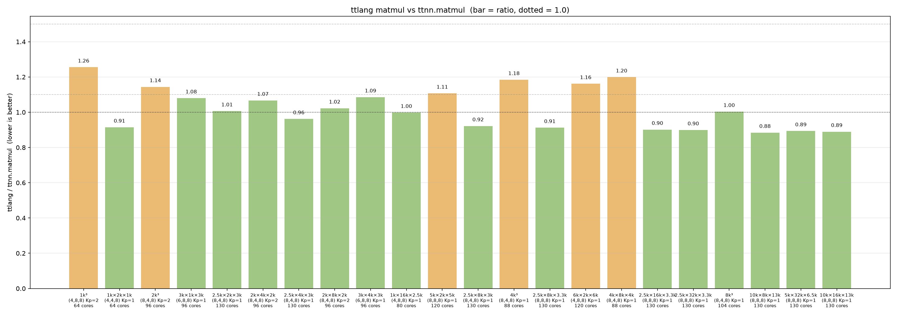

# Matmul benchmark

Sweeps a ksplit/SUMMA matmul against [`ttnn.matmul`](https://github.com/tenstorrent/tt-metal/blob/ea042c4ad6237678103cd7cbceb346e060f0f9a3/ttnn/cpp/ttnn/operations/matmul/matmul.cpp) across shapes. **All inputs and outputs are DRAM interleaved.**

## Files

- [`summa_kernel.py`](summa_kernel.py): each output owner computes the entire
  K reduction locally (`Kp == 1`).
- [`ksplit_kernel.py`](ksplit_kernel.py): partitions K across worker groups,
  computes partial outputs, then gathers and adds them at output owners
  (`Kp >= 2`). These are the two kernel implementations, not two test drivers.
- [`config.py`](config.py): block/grid planner and per-shape overrides.
- [`sweep.py`](sweep.py): runs the selected kernel and `ttnn.matmul` for each
  matrix size; checks correctness and records timings.
- [`sweep_baseline.py`](sweep_baseline.py): historical planner comparison that
  tries both decompositions; distinct from the `ttnn.matmul` reference.
- [`plot.py`](plot.py): renders the CSV timing ratios.
- [`ksplit_sweep.csv`](ksplit_sweep.csv) and `ksplit_sweep.png`: recorded results
  and their figure; detailed timing records and provenance are kept in the
  [external artifact archive](https://gist.github.com/brnorris03/79c57b196efe09355699d40165780088).
  [REGRESSIONS.md](REGRESSIONS.md) preserves the historical host-time comparison
  and lists every current device-time ratio.
  [NOTES.md](NOTES.md) contains historical tuning observations.
- [`__init__.py`](__init__.py): package marker.

The separate [all-gather benchmark](../all_gather_minimal_matmul/README.md)
compares distributed TT-Lang matmul with the native fused collective operation.

## Results



2026-09-09 18:39:48-18:41:36 UTC; Blackhole 13x10; TT-Lang `3e688e1f07b7` + multicast receiver corrections; TT-Metal pin `ea042c4ad623`; LLVM pin `37aca9d384347`; binary SHA-256: compiler `7f5e02a65e4c`, TTNN `62edde2b1f61`, Metal `65380f11dc15` ([archived provenance](https://gist.githubusercontent.com/brnorris03/79c57b196efe09355699d40165780088/raw/65a8900caa9cda4115847a9e27b2711fdec72bee/matmul_device_ksplit_sweep.json)).

Bars show `ttlang / ttnn.matmul` device kernel duration (lower is better). Green < 1.1,
orange < 1.5, red otherwise. All 22 rows pass PCC >= 0.99 for both implementations.
Ratios range from 0.884 to 1.255; 12 rows are slower than native. See the
[complete comparison and historical host regressions](REGRESSIONS.md).
Historical host timings are not device-regression baselines. Dependency pins
do not establish installed binary build revisions; binary hashes identify the
actual libraries used.

To regenerate inside the device-test container, from the repository root:

```bash
source build-docker/env/activate
set -o pipefail
export TT_METAL_DEVICE_PROFILER=1 TT_METAL_PROFILER_MID_RUN_DUMP=1
export TT_METAL_PROFILER_DIR=$(mktemp -d /tmp/matmul-profiler.XXXXXX)
timeout 600 python -m benchmarks.matmul.sweep --csv /tmp/ksplit_sweep.csv \
    2>&1 | tee /tmp/device_test.log
```

The driver writes CSV, PNG, and timestamped JSON provenance together under
`/tmp` by default. Detailed timing files and source snapshots belong in the
external artifact archive, not in the repository. A failure
raises a nonzero exit and writes the failing case and completed rows to `.failed.json`;
it does not publish a partial replacement figure. `--shape-index` selects a
zero-based case for diagnosis and can be repeated. Each implementation runs
3 warmups followed by 5 device-profiled invocations; the minimum standard
TT-Metal `device_kernel_duration` is reported. Raw profiler dumps, cycles,
clock frequency, launch IDs, and all samples are retained. Python dispatch,
allocation, host synchronization, and profiler processing are outside timing.
[`../device_timing.py`](../device_timing.py) calls the existing TT-Metal
`import_log_run_stats()` processor; it does not implement a CSV parser.
The historical `sweep_baseline.py` still uses host wall time and must not be
compared directly with this figure.

Exclusively tested and tuned on single Blackhole card with 130 cores.


## Kernels

Two kernels cover the `K_parts` axis:

- `summa_kernel.py` for `Kp == 1`. Grid is `(Np, Mp)`; each core owns an
  output tile-block and reduces over the full K axis locally.
- `ksplit_kernel.py` for `Kp >= 2`. Grid is `(Np * Kp, Mp)`. The K-space is
  partitioned across `Kp` column-groups; each group runs an independent
  SUMMA over its K-slab, then gathers partials.

`sweep.py` dispatches to `summa_kernel` when the plan picks `Kp == 1` and to
`ksplit_kernel` otherwise.

## Multicast

Both kernels use the same two mcast nets:

- **A (activations) row-mcast**: the core at column 0 of each row reads an A
  block from DRAM and multicasts it across the row to all `Np` consumers in
  that row.
- **B (weights) column-mcast**: the core at row 0 of each column reads a B
  block and multicasts it down the column to all `Mp` consumers.

So each A block is read once per row and each B block once per column; every
other core receives over the on-chip mcast net instead of hitting DRAM. In
`ksplit_kernel` these nets are replicated per K-group (`Kp` independent A
row-mcasts and `Np * Kp` independent B column-mcasts), since each group
works on a disjoint K-slab.

## Gather (ksplit only)

After compute, each non-root core (`k_p > 0`) at logical position
`(k_p * Np + n_p, m_p)` sends its partial sum to the root core at
`(n_p, m_p)` (i.e. `k_p == 0`) via a dedicated `reduce_net`. The root
receives `Kp - 1` partials, sums them into its own partial, and writes the
final block to DRAM. Only root cores touch the output tensor.

## Config

`config.py` exposes `plan_matmul(M, K, N)` which returns a `MatmulPlan` with
`block_cfg = (bm, bn, bk)` (tile-block dims) and `part_cfg = (Mp, Np, Kp)`
(grid partitioning).

`SHAPE_PLANS` is a hand-picked override table for shapes in the sweep;
shapes not in the table fall through to a heuristic that scores candidate
`(block, part)` pairs on core utilization, padding overhead, and per-core
iteration count. The sweep's shape list and timing convention live in
`sweep.py`; `sweep_baseline.py` reproduces the old `bench_matmul_sweep.py`
heuristic for comparison.
