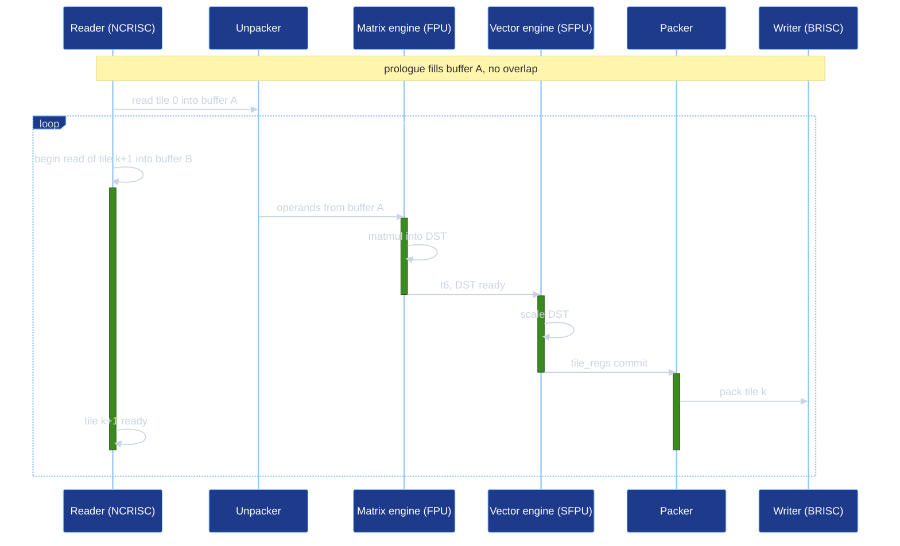

# Cost model proposal

This document specifies a compiler analysis for ranking equivalent lowering
candidates by predicted runtime. The analysis models one TT-Lang device launch:
all kernel-thread functions, all launch-grid nodes, local compute and
data-movement resources, dataflow-buffer synchronization, and inter-node NoC
communication. A local compute region can be the decision being ranked, but its
cost must be evaluated in the surrounding program graph.

The immediate consumer is accumulation-strategy selection. Later consumers are
engine placement, subblocking, and PipeNet lowering choices. The model replaces
the current storage-traffic-only score with a program-level runtime estimate.

## 1. Motivation

The compiler has several semantics-preserving lowering choices:

- accumulation strategy: keep partial results in DST or accumulate through the
  packer in L1;
- engine placement: run eligible elementwise work on the matrix engine or the
  vector engine;
- subblock selection when a compute does not fit in DST at once;
- PipeNet lowering: unicast, multicast, forwarding chains, ring-style
  reductions, or wave decomposition.

A data-movement traffic score cannot rank these choices reliably. It has no term
for matrix-engine, vector-engine, unpacker, or packer time. A serial sum of local
work is also wrong: reader, compute, writer, and NoC work can overlap, and the
winning candidate is often the one that changes the limiting resource.

The cost model therefore estimates:

- the work issued to each local resource;
- the synchronization edges that force ordering;
- launch-node domains for multi-node programs;
- inter-node communication and shared-resource contention;
- steady-state pipeline throughput for loops.

The result is a *ranking* of performance *estimates*, not a replacement for device validation or an accurate prediction of actual execution time.

## 2. Program Execution Model

The model builds a directed execution graph for one lowered program launch.
Nodes in this graph are timed operations on resource instances. Edges are
ordering constraints.

### 2.1 Launch Nodes

`ttl.launch_grid` defines the set of physical launch nodes. The model creates
resource instances for every node that may execute a kernel-thread function. A
domain analysis, using the same facts as `LaunchNodeDomainAnalysis`, restricts
participants under `ttl.is_src`, `ttl.is_dst`, `ttl.is_active`, and
`ttl.pipenet_scope`.

The program runtime is the time when all required launch nodes complete, plus
contention on shared resources such as NoC links or DRAM interfaces. It is not
the sum of node runtimes.

### 2.2 Kernel Threads and Local Resources

Each launched node has local hardware resources described by the architecture
descriptor. For Wormhole and Blackhole, the relevant local resources are:

- data-movement processors selected from `#ttkernel.thread<noc>` and
  `ttl.noc_index`;
- the unpack processor and unpacker;
- the math processor;
- the matrix engine (FPU);
- the vector engine (SFPU);
- the pack processor and packer;
- DST slots and dataflow-buffer slots.

The compute engines are not independent control processors. They execute work
issued by the compute processors and signal completion through hardware
synchronization. The initial implementation may fold TRISC control overhead into
the engine intervals, but it must record that assumption and validate it. If
control work appears on the limiting dependence chain, the descriptor must add
separate TRISC timelines.

Resource identity is local to a launch node. Work on `(node 0, matrix engine)`
and `(node 1, matrix engine)` can run concurrently. Work on the same local
resource serializes unless an architecture descriptor explicitly allows
overlap.

### 2.3 Synchronization Edges

The graph includes these ordering edges:

- program order on each kernel-thread function;
- resource order on each local resource instance;
- dataflow-buffer `reserve`, `push`, `wait`, and `pop` edges;
- tile-register `acquire`, `commit`, `wait`, and `release` edges;
- DST read-after-write and write-after-write hazards;
- matrix/vector synchronization, including `t6` where the lowering emits it;
- NoC reads, writes, barriers, semaphores, and PipeNet receiver waits;
- DRAM or L1 memory access edges from the tensor layout and memory config.

`t6` is not modeled as "no synchronization." It is a finer synchronization
mechanism between matrix and vector work. A lowering without `t6` may have to
serialize a whole matrix/vector sequence through program order or shared DST
hazards. A `t6`-aware lowering replaces that coarse ordering with per-tile or
per-subblock signal/wait edges. The engines can overlap only where the graph has
no unsatisfied DST or `t6` dependence between the intervals being considered.

### 2.4 Runtime Computation

For a straight-line region, cost is the longest dependence chain through the
execution graph, subject to resource occupancy constraints.

For loops, the model separates latency from throughput:

```
loop_cost = prologue + steady_state_ii * max(trip_count - 1, 0) + epilogue
```

`steady_state_ii` is the initiation interval. It is constrained by resource
occupancy per iteration, loop-carried dependences, and bounded dataflow-buffer
capacity. If a loop has no cross-iteration overlap, the initiation interval is
the body latency. If double buffering overlaps reads for iteration `k + 1` with
compute and writes for iteration `k`, the initiation interval is the maximum of
the overlapped resource demands and recurrence constraints, not the sum of the
stages.

For a local decision inside a larger program, common surrounding work may cancel
only when the two candidate graphs have identical launch-node domains,
communication structure, and control structure. If that proof is missing, the
caller must compare the full candidate graphs or treat the estimate as unknown.

## 3. Candidate Prediction

Most lowering choices are made before conversion to TTKernel, while the exact
per-resource operation sequence becomes visible after lowering. The analysis
therefore needs a candidate predictor.

Inputs to the predictor include:

- the module or decision context being ranked;
- candidate decisions such as accumulation strategy, engine placement,
  subblock sizes, and PipeNet lowering policy;
- tile element types and tensor layouts;
- launch-grid and PipeNet role domains;
- target architecture.

The predictor emits a resource-annotated operation graph, not a new IR module.
It must share the same helper logic used by lowering where possible. In
particular, subblock sizing must not duplicate the private helper in
`TTLSubblockComputeForDST.cpp`; that helper should move to a shared utility
before the cost model depends on it. Duplicating subblock selection would make
the fp32 DST-versus-L1 crossover unreliable.

Lowering-coupled prediction is the main correctness risk. Each predicted
sequence must be checked against actual TTKernel lowering for representative
kernels.

## 4. Operation Costs

Operation costs live in a checked-in, per-architecture data file rather than
hard-coded in the analysis. The file should include:

- architecture name and source metadata;
- participant names and resource relationships;
- operation class, element type, fixed issue cost, and per-tile cost;
- unpack, matrix, vector, pack, data-movement, and scalar operation costs;
- dataflow-buffer synchronization costs;
- `pack_reconfig_l1_acc` cost and L1-accumulating pack surcharge;
- NoC, DRAM, L1, and die-to-die bandwidth and latency terms where available.

Ranking does not require all of these at once. Candidates are compared graph
against graph, so operations identical across the candidates cancel, and the
model needs accurate costs only for the operations that differ between the
lowerings being ranked: for accumulation, the packs and operand re-reads; for
engine placement, the matrix- and vector-engine work that is swapped. An
operation present unchanged in every candidate can carry a coarse cost without
changing the ranking. The data file can therefore grow one decision at a time;
the broader coverage above matters mainly for absolute-runtime reporting.

The first data file can be bootstrapped from the tt-metal kernel-library
performance CI data generated nightly. That microbenchmark suite reports isolated
math, unpack, and pack medians for operation suites such as `eltwise_sfpu`,
`eltwise_fpu`, `math_matmul`, `reduce`, and `pack_dest_bank`, including the
L1-accumulation delta.

This bootstrap is sufficient to start ranking, but it is not sufficient as the
only calibration source. A dedicated microbenchmark must measure per-operation,
per-engine costs on each supported architecture, and a regeneration script must
update the checked-in data with the benchmark source, date, statistic, and unit.

Unknown architecture must not silently use Blackhole weights for final
optimization decisions. It may use a conservative diagnostic estimate, but a
pass that changes code based on the model must either know the target or return
unknown.

## 5. Control Flow

Structured control flow is part of the graph.

- `scf.for` uses the loop formula above. Static trip counts produce numeric
  costs. Dynamic trip counts produce symbolic costs only when the symbol is
  common to all candidates being compared.
- `scf.if` uses branch reduction. Without profile data or a source-level
  probability hint, the reduction is worst-case runtime over feasible branches.
  With probabilities, the model may also report expected runtime, but the
  worst-case result remains available.
- Launch-node predicates refine branch domains. For example, `ttl.is_src`
  contributes cost only on source nodes, and `ttl.is_dst` contributes cost only
  on destination nodes.
- First-iteration work, such as the `pack_reconfig_l1_acc` enable after the
  first loop iteration, may be normalized into loop prologue only if doing so
  preserves all dependencies. Otherwise it remains an explicit conditional in
  the loop graph.
- Data-dependent unbounded loops return unknown cost unless the caller supplies
  a valid bound.

## 6. Example

This example shows one launch node's local resources inside the global program
graph. The full model repeats these resources over the launch grid and adds
inter-node communication edges when PipeNets or remote tensor accesses are
present.

The reader fills input dataflow buffers, the compute kernel consumes them, and
the writer drains the output buffer. In steady state, the reader for tile
`k + 1`, compute for tile `k`, and writer for tile `k - 1` can overlap when
buffer capacity and synchronization permit it. The loop cost is the prologue,
the steady-state initiation interval, and the epilogue.



The limiting term can be the reader, matrix engine, vector engine, packer,
writer, a dataflow-buffer wait, or an inter-node NoC edge. A candidate that moves
work from vector to matrix is profitable only if it shortens the limiting
dependence chain or reduces occupancy on the limiting shared resource.

## 7. Interface

The analysis exposes a non-mutating entry point:

```
estimate(program, candidate, architecture) -> FailureOr<CostEstimate>
```

`CostEstimate` should contain:

- runtime expression or numeric cost;
- per-participant occupancy;
- limiting dependence-chain summary;
- candidate assumptions, such as folded TRISC control cost;
- unknown-reason diagnostics when the estimate cannot be trusted.

The first consumer can keep the accumulation-strategy planner's current
signature. Internally, it builds the DST
and L1-pack candidate graphs, calls `estimate`, and selects the legal candidate
with the lower estimated runtime. Forced `dst` or `l1-pack` still diagnoses
illegal strategies rather than falling back silently.

## 8. Integration

The implementation should be a standalone analysis library, not embedded in a
specific pass. It should reuse or expose these existing compiler facts:

- target architecture detection;
- launch-grid and PipeNet domain analysis;
- trip-count and tile-count helpers;
- destination-register capacity helpers;
- subblock-size selection after moving it to a shared utility;
- tensor layout and memory config;
- kernel-thread attributes and `ttl.noc_index`.

The existing accumulation traffic score can migrate incrementally:

1. Add the graph data structures, target descriptor, checked-in cost data, and
   synthetic graph tests.
2. Replace the internals of the existing accumulation traffic score while
   preserving the public accumulation planner API.

The replacement must not change behavior when the estimate is unknown. Unknown
cost should preserve the current conservative strategy for `auto` and emit a
diagnostic for forced strategies when legality cannot be proved.

## 9. Validation

Ranking correctness is required. Magnitude accuracy is useful but secondary.

Validation should include:

- graph unit tests with known resource occupancy and known longest dependence
  chains;
- loop tests that distinguish latency from steady-state initiation interval;
- predictor-equivalence tests comparing the predicted per-resource sequence with
  actual TTKernel IR for sample lowerings;
- generated-code checks that prove structural behavior, such as
  `ttl.tile_accumulate ... add` or absence of `llk_pack_reconfig_l1_acc` for
  DST-resident accumulation;
- device benchmarks for ranking: DST versus L1 accumulation, fp32 matmul
  DST-versus-L1 crossover, FPU versus SFPU elementwise placement, and
  subblock-size changes;
- multi-node benchmarks for PipeNet and NoC choices, including cases where
  per-node compute is identical but communication differs;
- magnitude checks with an explicit tolerance band only after ranking tests pass.

Runtime correctness alone is not enough validation. DST and L1 accumulation can
produce the same numeric result, so structural lowering evidence is required
when validating the selected strategy.

## 10. Implementation Risks

### Predictor Divergence

If the predictor duplicates lowering policy, it will drift from the generated
TTKernel. This is the highest implementation risk. Mitigation: share lowering
helpers, move private helpers to common utilities, and require equivalence tests
for every modeled lowering family.

### Incorrect Global Scope

A local-region estimate can choose the wrong candidate when unchanged
surrounding work does not cancel. Examples include a writer bottleneck, PipeNet
receiver waits, or DRAM contention. Mitigation: compare candidate graphs in the
same program context and return unknown when cancellation cannot be proved.

### Overestimated Matrix/Vector Overlap

The matrix and vector engines are distinct, but TRISC issue overhead, DST
hazards, and missing `t6` lowering can serialize them. Mitigation: model `t6`
as explicit signal/wait edges, keep current lowering serialized where it is
serialized today, and add TRISC timelines if folded control cost is visible in
measurements.

### Calibration Noise

Isolated microbenchmarks do not capture all effects in fused kernels. Mitigation:
store source metadata with every cost table, use confidence bands for close
rankings, and validate ranking on end-to-end kernels before enabling a new
consumer.

### Shared-Resource Contention

DRAM, NoC links, and die-to-die links are shared across launch nodes. A per-node
model that ignores aggregate bandwidth can overvalue compute optimizations in
memory-bound programs. Mitigation: include topology and bandwidth terms in the
architecture descriptor, and report unknown for communication-heavy candidates
until those terms are calibrated.

### Dynamic Control Flow

Dynamic branches can make worst-case and expected estimates diverge. Dynamic
loop bounds can prevent numeric ranking. Mitigation: keep symbolic expressions
only when symbols are common to all candidates; otherwise return unknown or
require profile data.

### Target Defaults

Using Blackhole costs for an unknown target can silently select the wrong
lowering on Wormhole or future architectures. Mitigation: require an explicit
target for mutating optimization decisions.

### Coarse Operation Classes

The first cost table may group operations too broadly. Reduce, broadcast,
typecast, binary FPU, binary SFPU, and matmul can have different fixed costs and
per-tile costs. Mitigation: start with operation classes that match measured
suites, then split classes when ranking tests show ambiguity.

## 11. Architecture Portability

The graph mechanism is architecture-independent. The descriptor supplies the
architecture-specific facts:

- launch-node resource instances;
- mapping from kernel-thread attributes to processors;
- compute engines and processor-control relationships;
- synchronization primitives;
- NoC, DRAM, L1, and die-to-die topology;
- per-operation costs.

For Quasar and later Grendel chiplets, the descriptor must define the launch
topology and resource mapping explicitly. A quad arrangement of Tensix cores is
not only a local compute concern; it can change communication routes and shared
resource contention. If the per-Tensix compute pipeline matches Wormhole or
Blackhole, the local compute portion of the descriptor can be reused, but the
program-level topology still needs its own data.

MX shared-exponent formats are new element-type entries in the cost table.
IDMA and die-to-die GDDR7 traffic are descriptor-level data-movement resources,
not special cases in the graph algorithm.

## 12. Initial Scope

The first implementation should support:

- whole-module candidate graphs for one TT-Lang launch;
- launch-node domains from `ttl.launch_grid` and PipeNet predicates;
- NoC and compute kernel-thread functions;
- local unpack, matrix, vector, pack, and data-movement resource timelines;
- dataflow-buffer and tile-register synchronization;
- static `scf.for`, `scf.if`, and symbolic common trip counts;
- checked-in Wormhole and Blackhole cost data;
- accumulation-strategy ranking with unchanged public planner API.

The first implementation may leave these as explicit unknowns:

- data-dependent unbounded loops;
- uncalibrated NoC or DRAM contention;
- architectures without descriptors;
- candidate rewrites whose generated TTKernel sequence is not covered by an
  equivalence test.

## References

- Compute engines and dataflow within Tensix:
  https://github.com/tenstorrent/tt-metal/blob/c296ef469fe6aab65ab0d359e164b14b62d92bfc/docs/source/tt-metalium/tt_metal/advanced_topics/compute_engines_and_dataflow_within_tensix.rst
- Matrix engine report:
  https://github.com/tenstorrent/tt-metal/blob/c296ef469fe6aab65ab0d359e164b14b62d92bfc/tech_reports/matrix_engine/matrix_engine.md
- tt-metal kernel-library performance run `27594326478` from 2026-06-16:
  https://github.com/tenstorrent/tt-metal/actions/runs/27594326478
- Current storage-traffic accumulation score:
  `include/ttlang/Dialect/TTL/Transforms/AccumulationAnalysis.h`
- Current launch-node domain analysis:
  `include/ttlang/Dialect/TTL/Transforms/LaunchNodeDomainAnalysis.h`
