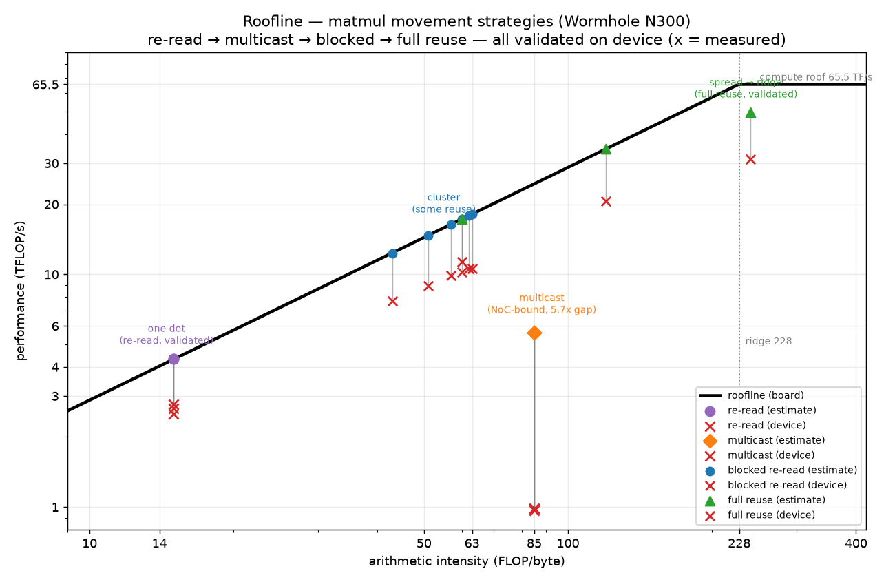

# Cycle Estimator Design

## Overview

`tt-lang-sim-cycles` estimates hardware cycle counts for a tt-lang program from two inputs: a **hardware profile** (peak rates) and the program's **trace events** (see `docs/TRACING.md`). It applies an **analytical ideal-peak model** — cycles are work-counts ÷ hardware rates — assuming the hardware runs at peak performance with no utilization derating.

The estimator consumes trace events without importing the simulator, so it runs two ways: **inline** during a sim run (`--cycles`, on the in-memory trace) or **offline** from a saved JSONL trace, which can be copied and estimated anywhere.

**Quick Start —**
From a built checkout:

```
source build/env/activate      # puts tt-lang-sim / tt-lang-sim-cycles on PATH

# run a program and estimate in one step:
tt-lang-sim examples/matmul-tutorial/step_1_single_node_single_tile_block.py --cycles

# or estimate from a previously saved trace:
tt-lang-sim-cycles trace.jsonl
```

See [Command-Line Interface](#command-line-interface) for the full flag set.

---

## The Model

The trace supplies **work** (how many tiles each op computes or moves) and **structure** (which kernel runs on which node). It never supplies time — the simulator tick is a logical clock, not a duration.

Cycles are estimated entirely from work ÷ rate.

**Per op:** Compute and movement each have a peak rate from the profile:

```
compute  op:  cyc = tiles / R_compute(op_type, dtype)
movement op:  cyc = latency(locality) + (tiles × bytes_per_tile) / R_noc(locality)
```

**Per kernel:** The compute engine and the data-movement engine run concurrently, so the kernel time is the larger of the two serial paths, not their sum:

```
T_kernel = max(Σcyc_compute, Σcyc_movement)
```

**Per program:** The model is throughput-bound — kernel overlap, floored by a shared-memory ceiling:

- *Across kernels* — a node's reader / compute / writer kernels overlap on its concurrent RISCs, and distinct nodes run in parallel, so the program time is the `max` over all kernels.
- *Aggregate memory ceiling* — every core draws from one shared off-chip pool (GDDR6), so the program is also bounded below by `total_memory_bytes / memory_aggregate_bw`. Only `dram`-locality movement counts (L1 traffic stays on-chip).

```
memory_floor = (Σmemory_bytes) / memory_aggregate_bw
node_bound   = max_k T_kernel(k)
T_program    = max(node_bound, memory_floor)
```

`node_bound` and `memory_floor` model different resources (per-core throughput vs shared bandwidth), so the program takes the `max`. The reported `bound` is `memory` when the shared floor wins, otherwise the busiest node's `compute`/`movement`. Without the ceiling, a K-sweep matmul stays `compute` at every K because each of N active cores is (incorrectly) given a private DRAM lane; the aggregate ceiling flips memory-heavy points to `memory`.

Under ideal-peak with full pipelining, connected producer/consumer kernels overlap in steady state, so there is no serial sum along a dependency chain. The roofline **is** the estimate — the model adds no serial-sum slack on top. Being ideal-peak, it is a lower bound (`measured ≥ estimate`); how *tight* depends on the workload — see [Hardware Validation](#hardware-validation).

**Fill/drain — reported, not folded into the bound.**
Pure throughput ignores a pipeline's fill (first item through read→compute→write) and drain (last item). A deterministic estimate of that overhead treats a node's kernels as stages with cycles `C_i` and `N` pipeline items (the write kernel's movement-op count; `N ≥ 1`):

```
node_time  = max_i(C_i) + (Σ_i C_i - max_i C_i) / N     # fill/drain-inclusive per node
fill_drain = max_node(node_time) − node_bound           # reported as `node_fill_drain`
T_program  = max( node_bound, memory_floor )              # the roofline — the reported estimate
```

`fill_drain` is **reported for information only — it is NOT added to `T_program`.** It's a crude heuristic (assumes a read/compute/write stage shape, one item-count per node) that can *exceed* real per-node overhead — folding it in pushed the estimate *above* measured cycles on the reuse-matmul (P100a) at some sizes, breaking `measured ≥ estimate`. So it stays reported-only.

**Out of scope — the rigorous latency regime.**
Exact fill/drain and cross-node serialization from the real dependency DAG (`kernel_block.on`, dfb push/pop, pipe send/recv) are deferred; the correction above is a coarse per-node add-on, not a DAG traversal.

---

## Roofline (per board)

The per-kernel `max(compute, movement)` is the time-domain form of the classic [roofline model](https://docs.nersc.gov/tools/performance/roofline/) (Williams, Waterman & Patterson, 2009): attainable performance is `min(peak_compute, peak_bandwidth × AI)`, where arithmetic intensity (AI) is FLOP per byte. One metric (here, FLOP) gives **one roofline per board** — a hardware ceiling, the best any application can reach, independent of the kernel. Other metrics (e.g. energy) give their own rooflines; we use the classic FLOP one.

| Board | Peak compute (bf16 / FP16, datasheet) | Peak DRAM BW | Ridge AI |
|---|---|---|---|
| `wormhole_n300` | ~65 TFLOP/s (per chip) | 288 GB/s | ~228 FLOP/byte |
| `blackhole_p100a` | ~166 TFLOP/s | 448 GB/s | ~370 FLOP/byte |

- **Peak compute** — datasheet bf16/FP16 matmul peak. Wormhole N300: 131 TFLOP/s per card (2 ASICs, 64 Tensix each @ 1.0 GHz) → ~65/chip. Blackhole P100a: 120 Tensix @ 1.35 GHz → ~166 TFLOP/s (the datasheet's 664 BFP8 ÷ 4 for HiFi4). The estimator's default rate is bf16 HiFi4, matching these.
- **DRAM BW is per chip:** N300 is 576 GB/s per card → 288/chip; P100a is 448 GB/s (7 of 8 GDDR6).
- **Ridge AI** = peak compute ÷ peak BW — below it memory-bound, above it compute-bound.

The report emits this per board when the profile sets `tensix_cores` (see [Output](#output)). Two caveats: FLOP counts **matmul only** (the SFPU rate is an ideal-floor assumption), and the compute roof is the fixed **bf16/HiFi4** reference — a BFP8 (LoFi) kernel runs ~4× faster, so its `compute util` can exceed 100%.

**Vocabulary.** `memory` is the roofline's off-chip bandwidth roof (the shared GDDR6 pool, the classic model's "memory bandwidth"); a per-node `movement` bound is one core's data-movement path (L1 + NoC + off-chip). The trace-level `dram` *locality* is a separate, lower-level tag and keeps its name.

Sources: roofline model — [NERSC](https://docs.nersc.gov/tools/performance/roofline/) and the [Williams et al. paper](https://people.eecs.berkeley.edu/~kubitron/cs252/handouts/papers/RooflineVyNoYellow.pdf); board specs (Tensix count, clock, DRAM BW, peak FLOPs) — Tenstorrent product datasheets ([Blackhole](https://docs.tenstorrent.com/aibs/blackhole/specifications.html), [Wormhole](https://docs.tenstorrent.com/aibs/wormhole/specifications.html)).

---

## Design Rationale — why ideal-peak, not fit-to-trace

The simulator tick is a **logical clock**: it increments by one per productive scheduler activation, measuring scheduling order rather than time (see `docs/TRACING.md`, *Logical Time*). It carries no wall-clock meaning and its value depends on the scheduler policy.

Two consequences shape the model:

- A tick duration cannot be multiplied by a rate to yield cycles. Any model fit to tick durations predicts scheduling behavior, not hardware.
- Physical quantities in the trace are the **work-counts** (tiles, and bytes derived from tiles), not the timing. The estimator therefore multiplies work by hardware rates and ignores tick durations entirely.

This is what lets the estimate be label-free and deterministic: given a profile and a trace, the answer is fixed, with no calibration step.

---

## Inputs

### Hardware profile

`HardwareProfile` (`cycles/types.py`) carries the rates that traces cannot provide:

| Field | Meaning |
|---|---|
| `compute_rate` | tiles/cycle by `(op_type, dtype)` |
| `compute_rate_default` | fallback tiles/cycle |
| `noc_bw` | bytes/cycle by locality (`local_l1` / `remote_l1` / `dram`) |
| `noc_latency` | fixed cycles per transfer, by locality |
| `memory_aggregate_bw` | shared GDDR6 ceiling, B/cyc (JSON stores `memory_aggregate_gbps`, ÷`clock_ghz` at load; `0` disables the ceiling) |
| `bytes_per_tile` | movement tile size; the dtype knob (bf16 2048 / fp32 4096 / bfp8 ~1088 B) |
| `clock_ghz` | GHz; ns reporting **and** the DRAM GB/s→B/cyc conversion at load |
| `dm_engines` | reserved for future overlap modelling |

Compute-rate lookup is tiered: exact `(op_type, dtype)`, then op-type-only `(op_type, "")`, then `compute_rate_default`. The op-type-only tier applies when a profile has no dtype-specific row (or for older traces without a `dtype` field).

Built-in profiles are JSON files under `hw_profiles/` (one per board); `model.py` loads and resolves them (`types.py` holds only the dataclass schema). `--hw-profile <name | path.json>` selects one — a bundled name (full stem or board family, e.g. `wormhole` → `wormhole_n300`), or a path to a custom profile anywhere.

#### `wormhole_n300` provenance

All values are sourced from tt-metal and the Wormhole ISA docs:

| Field | Value | Source |
|---|---|---|
| `clock_ghz` | 1.0 | WH AICLK (tt-metal perf docs) |
| `bytes_per_tile` | 2048 | bf16 32×32 tile (32·32·2 B) |
| `dm_engines` | 2 | BRISC + NCRISC (METALIUM_GUIDE) |
| `noc_bw` / `noc_latency` | 25.3 B/cyc, 293 cyc | **measured**, tt-metal `noc_latencies.yaml` (64 KB / 2589 cyc asymptote; 293-cyc small-transfer floor) |
| `memory_aggregate_gbps` | 288 GB/s | 12 GDDR6 ch × 24 B/cyc @ 12 Gbps (tt-metal `Saturating_DRAM_bandwidth.md`); the **spec upper bound** is used. |
| matmul rate (default) | 1/64 | `16 × fidelity` cyc/tile; tt-lang sets no MathFidelity → tt-metal default **HiFi4**, fixed. |
| matmul rate (fp32) | ≈1/68.5 | f32 args set `fp32_dest_acc_en` (`TTLSetComputeKernelConfig`) → ~7% slower. BH-calibrated. |
| SFPU default | 1/32 | 32 elem/clk ideal 1-instruction floor (SFPU spec) |

Known simplifications: `noc_bw` uses one measured asymptote for all localities (local L1 ≈ 2× remote, DRAM ≈ 24 B/cyc per channel); fidelity is fixed at HiFi4.

The bundled `blackhole_p100a` profile mirrors this structure with Blackhole P100a values: 1.35 GHz, 448 GB/s aggregate DRAM (7/8 GDDR6), 60.9 B/cyc NoC. Its `noc_latency` (293) is **placeholder data copied from Wormhole** — `noc_latencies.yaml` has no BH table.

### Simulator trace — the consumed contract

The estimator reads three event kinds and ignores all others:

| Event | Category | Fields read | Produces |
|---|---|---|---|
| `compute_op` | `compute` | `op_type`, `dtype`, `tiles` | one compute `OpWork` |
| `copy_end` | `copy` | `local_l1`, `remote_l1`, `dram` (tile counts) | one movement `OpWork` per non-zero locality |
| `pipe_recv` | `pipe` | `tiles` | one `remote_l1` movement `OpWork` (multicast receive) |

`compute_op` is emitted once per math op. `copy_end` carries per-locality tile counts for Tensor↔Block copies. `pipe_recv` is a multicast receive: the receiver ingests `tiles` into its L1 over the NoC, charged as per-node `remote_l1` movement.

The consumed set is declared as `parse.CONSUMED_EVENTS` and pinned against the producer's registry (`sim/trace.py`) by `test/sim/test_trace_contract.py`, so a producer-side rename fails a test rather than silently zeroing the estimate.

A trace without `compute_op` events — produced before the instrumentation, or with the `compute` category filtered out — parses as movement-only.

#### `compute_op` emission sites

`op_type` and `tiles` are known only at the op site, so each op-family emits at its own chokepoint:

| Site | Ops | `op_type` |
|---|---|---|
| `dfb.Block._binary_op` | `+ - * / //` | operator name (`add`/`sub`/`mul`/`truediv`/`floordiv`) |
| `dfb.matmul` | matmul | `matmul` (tiles = M·K·N) |
| `math._create_unary_op_wrapper` | `exp`, `rsqrt`, `sqrt`, `relu`, `sign`, … | op name |
| `math._apply_unary_with_params` | `relu_max`, `clamp`, `elu`, `leaky_relu`, … | `eltwise_unary` (generic) |
| `math._apply_binary_op` | `max`, `min`, `gt`, `lt`, `eq`, `ne` | `eltwise_binary` (generic) |
| `math._reduce_impl` | reduce sum/max | `reduce_sum` / `reduce_max` |

Each site also emits the declared `dtype` (via `dtype_name`), so compute-rate lookup uses the `(op_type, dtype)` tier and falls back to op-type-only when a profile has no dtype-specific row.

Not instrumented:
`block.broadcast` and `block.transpose` (layout ops — instrumented only if the model should charge for them).

---

## Output

The pipeline produces one canonical `CycleEstimate`; every view is a pure function of it (compute once, render many).

- **Summary** (default) — per-node roll-up: active nodes, per-node cycles, utilization, and a bound-class table (compute vs movement). `--include-zero-kernels` also lists idle nodes.
- **Detailed** (`--detailed`) — the full per-kernel table.
- **JSON** (`--json-out`) — self-describing (`tool`, `schema_version`, profile, and per-kernel work + cycles).
- **Re-render** (`--view-report REPORT.json`) — reload a saved JSON report and render it without re-running.

Example summary tail:

```
Nodes
..............................................................................
Type         Nodes    Avg Cycles           Max   Max node
compute         48        54.61K        61.44K   node0
movement         0             -             -   -
  per-node max :  61.44K   (compute)
  active nodes :  48 / 56   (8 idle)
------------------------------------------------------------------------------
Memory (shared)
..............................................................................
  read         :  46.0 MB
  write        :  2.0 MB
  bandwidth    :  288 B/cyc   (288 GB/s @ 1.0 GHz)
  floor        :  174.76K
------------------------------------------------------------------------------
Program
..............................................................................
  cycles       :  174.76K
  AI           :  150 FLOP/B
  bound        :  memory
  compute util :  66%
  memory  util :  100%
```

The **Nodes** block classifies each node compute- or movement-bound (movement = its movement path exceeds compute); `per-node max` is the slowest node and its reason, `active nodes` the utilization. The **Memory (shared)** block renders only when the profile sets an aggregate ceiling (`memory_aggregate_bw > 0`).

The **Program** block is the answer: `cycles`, the program `AI` (matmul FLOP ÷ memory bytes), the `bound` that set it (`compute` \| `movement` \| `memory`), and each roof's utilization (achieved ÷ peak). `AI` and the `util` lines — plus the header's `peak compute` / `ridge AI` — render only when the profile sets `tensix_cores`.

---

## Testing

Under ideal-peak there are no per-kernel hardware labels, so the estimator is tested for correctness, behavior, and sensitivity — not fit to measured cycles.

- **Correctness** (regression fixtures): the per-kernel estimate is deterministic, linear in work, and the `max` of compute and movement. Zero work gives zero cycles.
- **Behavior**: per-kernel decomposition (compute vs movement, dominant term, bound class) across a work-count matrix (compute-bound / memory-bound / mixed / multi-node), small → large.
- **Sensitivity**: sweep the profile and confirm estimates and bound class shift sensibly.

---

## Command-Line Interface

**Offline** — analyze a saved trace:

```
tt-lang-sim-cycles trace.jsonl
    [-d | --detailed]                  # show per-kernel table
    [-p | --hw-profile NAME|FILE.json] # use specific profile
    [-o | --json-out OUT.json]         # output report
    [-r | --view-report REPORT.json]   # review saved report
    [--include-zero-kernels]           # show idle nodes
```

**Inline** — run and estimate in one step:

```
tt-lang-sim prog.py --cycles [REPORT.json] [--hw-profile NAME|FILE.json] [--trace trace.jsonl]
```

Runs the program, then prints the estimate **summary** from the same in-memory trace (no file round-trip). Give a path after `--cycles` to also write the JSON report there (like `--trace`), and `--hw-profile` to target a specific part. For the per-kernel **detailed** view or to re-render a saved report, use `tt-lang-sim-cycles`.

---

## Module Layout

```
python/
├─ sim/                       simulator · PRODUCER
│  ├─ trace.py                event schema + registry
│  ├─ math.py, dfb.py         emit compute_op
│  └─ copy.py                 emits copy_end (per-locality tiles)
│
└─ sim_stats/cycles/          cycle estimator · CONSUMER
   ├─ parse.py                trace → per-kernel work
   ├─ types.py
   ├─ model.py                cycle math
   ├─ report.py
   ├─ cli.py
   └─ hw_profiles/            bundled JSON profiles
```

---

## Hardware Validation

Program-level accuracy is checked against device cycles on Wormhole N300 (grid 8×8, 64 cores) across the roofline's three movement regimes — memory-bound re-read, compute-bound reuse, and NoC-bound multicast — plus a Blackhole P100a compute spot-check. `measured ≥ estimate` at every point (the estimate is an ideal-peak lower bound); how *tight* the bound is depends on which resource the kernel actually stresses.



**Regime sweep (Wormhole N300).** Each kernel is a matmul that isolates one movement strategy, swept across problem size and compared to its ideal-peak estimate:

| Regime | Kernel (nature) | AI (FLOP/B) | Bound | device ÷ estimate |
|---|---|---|---|---|
| Memory | pure re-read (no blocking) | 15 | memory | ~1.5× |
| Memory | blocked re-read (`step_4`) | 43–63 | memory | ~1.4× |
| **Compute** | full reuse (per-node big block, cube M=N=K) | up to **241** | **compute** | **1.59×** |
| Movement | 2D multicast (fine-grained) | 85 | movement | **5.7×** |

- **The memory and compute roofs are both tight.** The DRAM roof (pure re-read, AI 15) and the compute roof (full reuse, AI 241 — a cube M=N=K sweep whose per-node block grows until AI crosses the ridge) both land at **1.4–1.7× the estimate**, so the ideal-peak model is a *tight* lower bound once a kernel saturates a roof.
- **Multicast exposes the movement model's gap.** A fine-grained (1-tile) 2D multicast runs at **5.7× the estimate** (a stable multiplier across sizes): the movement term prices the broadcast's bytes but not the fixed **per-transfer latency** that dominates thousands of small NoC transfers  (see [Limitations](#current-limitations--deferred-work)).

Achieved DRAM utilization ~57–67% (WH) / ~82–92% (BH); tt-npe confirms the memory regime is DRAM-dominant, not NoC-bound (0% congestion). dtype movement scaling and the fp32 `fp32_dest_acc_en` penalty (~7%) are device-confirmed.

---

## Current Limitations & Deferred Work

- **Multicast under-counted (~5.7×,** [Hardware Validation](#hardware-validation)**)** — `pipe_recv` uses the flat unicast latency, missing fan-out latency and a shared-NoC ceiling. Not a value swap: needs a size × fan-out *table lookup* (the model uses a scalar), `pipe_recv` must start emitting the fan-out (producer-side change), and it's WH-only in-tree + needs device re-validation.
*Source:* tt-metal `noc_estimator/noc_latencies.yaml` (a 55-way mcast of a 2 KB tile is ~10× unicast)
- **Dry-run emits `dtype: fp32` (producer-side)** — `--dry-run` stubs tensors as f32. Bytes and AI use the profile's `bytes_per_tile`, so only the dtype-keyed **compute rate** is affected: a compute-bound estimate gets the fp32 matmul rate (1/68.5 vs bf16's 1/64), ~7% high for a pure-bf16 kernel. Fix in the dry-run stub (carry the declared dtype into the trace).
- **Broadcast / transpose — not charged as compute.** They emit no `compute_op`, so the fix is producer-side instrumentation *plus* a per-tile rate (derivable from LLK `tt_llk_*`) — not a value swap.
Open question first: whether they're material vs matmul (layout ops are typically small — broadcast often folds into the unpacker); charge only if so. 
*Source:* LLK pack/unpack/transpose (`tt_llk_*`), a per-tile derivation
- **SFPU rate is an ideal-floor assumption** — 1/32 (one instruction per 32-elem slot) under-counts multi-instruction ops (`exp`/`gelu`/`sigmoid` cost more than `relu`). 
*Source:* derivable per-op from LLK instruction sequences × Tensix SFPU ISA issue rate (`llk_sfpu` + SFPU ISA, per board)
- **Unified `sim_stats` entry** — one `stats|cycles` subcommand instead of two (`tt-lang-sim-cycles` + `tt-lang-sim-stats`); needs discussion.
