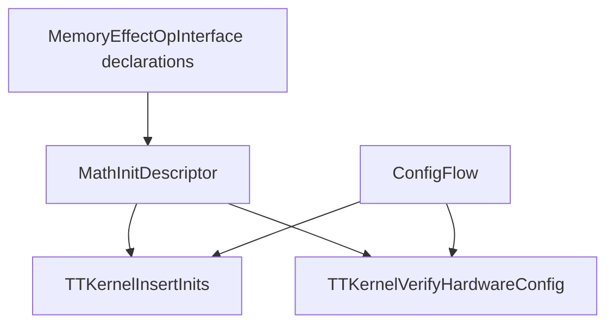

# MATH Hardware Configuration

## Overview

TTKernel tile operations share one implicit MATH configuration slot. A per-op
init writes the slot, and a compute operation reads the configuration required
by its hardware primitive. The configuration is not an SSA value, but compiler
transformations must preserve the same dependency.

The implementation has three parts:



Init insertion establishes the required state. Verification runs after later
canonicalization, CSE, and specialization passes and proves that the state still
holds on every incoming path.

## Effect Model

`MathInitResource` represents the hardware slot as a non-addressable side-effect
resource separate from ordinary memory. A `MathInitDescriptor` identifies one
configuration by:

- the per-op init operation name;
- the operands that affect the configuration;
- the inherent attributes that affect the configuration.

A compute operation reads its required descriptor. Its per-op init writes the
same descriptor. Pipeline-wide inits, undeclared calls, and operations whose
configuration cannot be represented write an unknown value. The
`TTKernelMathInits.def` table defines compute-to-init bindings for both effect
collection and init creation.

Descriptor equality uses SSA value identity for operands and attribute
equality. It does not infer equivalence by tracing SSA definitions.

## Configuration Flow

`ConfigFlow` is a forward analysis of one implicit slot. It models
`scf.for`, `scf.if`, and `scf.while`. Each modeled region has one of three
transfer forms:

```text
identity:       s -> s
assignment:     s -> c
conditional:    s -> join(s, c)
```

These forms are closed under sequencing and control-flow join. For a body
transfer `f` and incoming state `s`, a loop header reaches
`join(s, f(s))`. This is the fixed point required by the slot lattice because
join is associative, commutative, and idempotent.

A statically zero-trip `scf.for` preserves the incoming state and its body is
not visited. A one-trip loop executes the body once without a backedge join.
A dynamic-trip loop joins the incoming state with the loop exit because the
body may not execute.

The analysis treats unsupported region operations and multi-block regions
conservatively. Their nested regions start from unknown, and the enclosing
operation exits with unknown. Unknown is distinct from a proven descriptor and
cannot satisfy a compute read.

## Init Insertion

Insertion first analyzes immutable IR and records each required init. A compute
already reached by an equal descriptor needs no init. Otherwise, the default
insertion point is immediately before the compute.

An init may move before an enclosing modeled SCF operation when:

- every MATH access in that scope uses the same descriptor;
- the scope contains no unknown configuration write;
- the scope contains no DST synchronization boundary;
- the scope contains no unsupported nested region operation;
- every descriptor operand is available before the scope.

Unsupported regions block hoisting even when their nested operations all use
the candidate descriptor. This restriction keeps insertion consistent with
`ConfigFlow`, which discards configuration state at the region boundary.

The hoisting analysis computes one bottom-up summary for each operation
subtree. Summary construction is linear in the number of nested operations;
placement queries inspect cached summaries instead of rescanning complete
regions for every consumer.

DST synchronization preserves non-reduce configurations. A definite reduce
configuration requires `reduce_uninit` before the first following sync or
before a non-reduce consumer. A reduce configuration present on only some
incoming paths does not justify an uninit.

## Verification

`TTKernelVerifyHardwareConfig` runs the same configuration flow with diagnostic
provenance. Every MATH read must receive an equal descriptor on all incoming
paths. Failure distinguishes:

- no descriptor established on every path;
- a different init operation configured;
- the expected init configured with different operands or attributes.

Diagnostics retain up to two earliest writers in program order. Descriptor
writes are reported as configuration sites, while unknown writes are reported
as resets.

The verifier is intentionally independent of insertion decisions. It checks
the resulting IR after transformations that may move, merge, or remove
operations.

## Correctness Argument

For a straight-line block, applying operation transfers in program order gives
the configuration before every operation. A branch result joins all possible
region exits. A loop entry joins the initial path and backedge path, and the
closed transfer algebra computes the same fixed point without repeated region
evaluation. Therefore, a descriptor reported at a read is equal on every
modeled incoming path.

Insertion is sound when it places a descriptor before a compute or moves it
across a scope satisfying the hoisting conditions. Uniform accesses cannot
replace it with another descriptor, synchronization cannot invalidate it, and
all operands dominate the new location. Unsupported regions prevent movement
because their transfer is unknown. The final verifier provides an independent
check of these conditions after subsequent rewrites.

## Limitations

- Only structured `scf.for`, `scf.if`, and `scf.while` control flow is modeled.
- Multi-block CFG regions are conservative unknown boundaries.
- Descriptor operands use SSA identity rather than value equivalence.
- Calls without complete effect declarations reset the configuration.
- The analysis models one hardware slot. Additional independent slots require
  separate analyses or a product state.

Generic MLIR data-flow analysis was considered, but the required state has a
small closed transfer algebra and structured loop semantics. The specialized
summary avoids iterative fixed-point evaluation and is shared by insertion and
verification. MLIR side-effect interfaces remain the source of operation
semantics so other transformations can observe the same hardware dependency.
