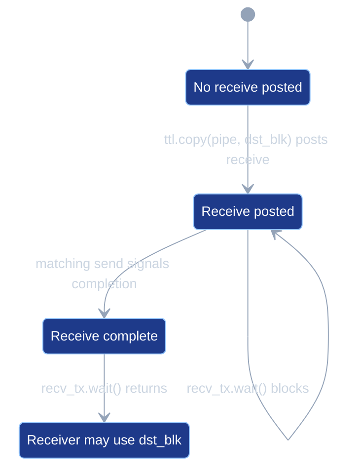
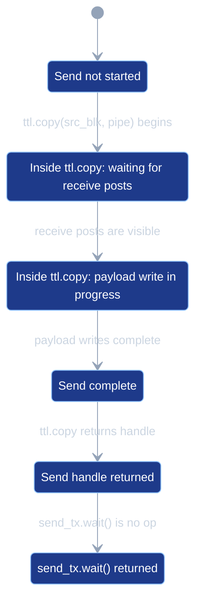
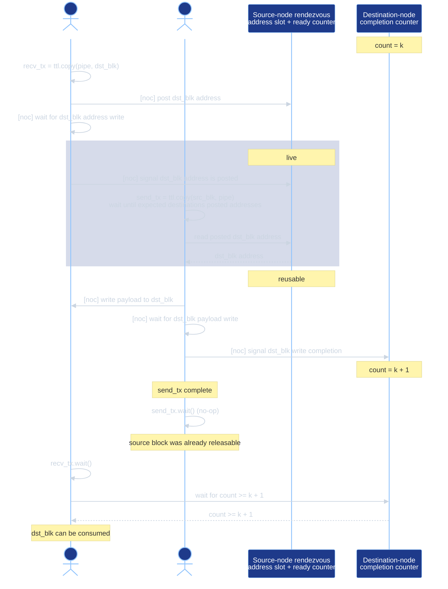

# PipeNets

This document describes PipeNet semantics, verification, lowering,
scheduling, simulator behavior, and test coverage in tt-lang. Both the
compiler and the simulator consume the same operation-level PipeNet
collection described in [Operation PipeNets](#operation-pipenets).

A node is one execution coordinate in the launched device grid. A
dataflow buffer (DFB) is the user-visible payload buffer used by
producer, consumer, and pipe transfer code. A pipe-coupled operation is
an operation whose legality depends on a PipeNet role, such as a
pipe-typed `ttl.copy` or a DFB wait whose producer is PipeNet-routed.
NoC refers to TT-Metal network-on-chip operations used for remote SRAM
writes and semaphore increments.

## Overview

`ttl.PipeNet` describes a logical communication pattern between nodes. A
pipe carries data from a source coordinate (`src`) to either a single
destination (point-to-point) or a contiguous coordinate range
(collective). When the launch grid is larger than the union of all pipe
sources and destinations, the extra nodes have no role in the
communication. If the user fails to guard pipe-coupled work from those
nodes, the kernel reads out-of-bounds tensor regions and corrupts the
pipe synchronization protocol; this failure mode is the one the
verifier guards against (see issue #541).

The launch grid is the grid that `@ttl.operation(grid=...)` schedules
onto. The work extent is the per-axis bounding box of every pipe
coordinate in the user's PipeNets. The launch grid and work extent are
separate: the launch may cover more nodes than the communication uses.
The `grid=` argument selects the launch:

- `grid="full"` launches on the device compute grid.
- `grid="auto"` is currently an alias for `"full"`.
- An explicit tuple is used verbatim.

A PipeNet's active nodes are the union of its source and destination
coordinates. This is the node set tested by `net.is_active()`. Whenever
the launch is wider than those active nodes, the user must guard
pipe-coupled regions with `net.is_src()`, `net.is_dst()`,
`net.is_active()`, or coordinate predicates that express the same role
tests. The verifier rejects any pipe-coupled operation reachable from a
node outside its declared role. The diagnostic names the offending
operation, an example offending coordinate, the contributing PipeNet or
PipeNets, and a suggested guard.

The compiler verifies user-written guards: each pipe-coupled operation
must be reachable only from the nodes permitted by its role
(`ttl.copy(buffer, pipe)` only from `pipe.src`;
`ttl.copy(pipe, buffer)` only from `pipe.dst`; `cb_wait` reachable
only within the static producer domain for that DFB index). The
verifier reads the IR and emits diagnostics; it does not rewrite the
program.

## Semantics

Lowering selects the destination-address mechanism independently from
the sender synchronization mechanism:

- `RA`: receiver-authored address.
- `CA`: computed address.
- `RP`: receiver-post synchronization.
- `CC`: capacity-counter synchronization.

The slash in a mode name combines one address mechanism with one
synchronization mechanism.

| Mode | Destination address | Send condition |
| --- | --- | --- |
| `RA/RP` | Each receiver publishes its reserved DFB address. | Every required receiver has posted. |
| `CA/RP` | The sender computes each receiver DFB address. | Every required receiver has posted. |
| `CA/CC` | The sender computes each receiver DFB address. | Every required receiver has capacity. |

`RA/CC` is unsupported because CC permits a send without a current
receiver post, so the sender must compute the destination address.

All three modes use the same payload write and receiver-completion
signal. A sender-ready increment means that the receiver has reserved
destination storage; it does not mean that the payload write is
complete. The sender signals payload completion separately after its
NoC write barrier.

| Protocol event or property | `RA/RP` | `CA/RP` | `CA/CC` |
| --- | --- | --- | --- |
| Receiver reserves a destination DFB block | Yes | Yes | Yes |
| Receiver publishes the reserved block address | Yes: one inline 32-bit NoC write per post | No | No |
| Receiver increments the sender-ready counter | After the published address is visible | After reserving the block | No |
| Condition for the sender's payload write | Every required receiver has posted | Every required receiver has posted | The receiver has available DFB capacity |
| Sender obtains the destination address | Reads the published address-table entry | Computes `DFB base + slot * block stride + static offset` | Computes the same address |
| Receiver action after popping a block | No capacity update | No capacity update | Increments the sender's capacity semaphore |
| Sender/receiver synchronization | Per-transfer receiver-post rendezvous | Per-transfer receiver-post rendezvous | Sender may use the next computed slot when a capacity credit is available |
| Multicast | Supported | Supported with a proven uniform receiver layout | Not currently supported; uses `CA/RP` instead |

The practical difference is address publication, not send admission.
`CA/RP` does not permit the sender to run before the receiver post. It
removes the receiver's address write and the sender's address-table read
when the compiler can prove that its computed address is the address of
the block the receiver reserved.

`CA/CC` also removes the per-transfer receiver-post rendezvous. The
capacity semaphore starts with one credit per free receiver DFB slot.
The sender can use the next computed slot when a credit is available,
and the receiver returns a credit by incrementing the capacity semaphore
after its pop. This allows sender and receiver execution to overlap
across multiple DFB slots and removes the receiver-post synchronization
traffic.

`RA/RP` remains the fallback when that equality cannot be proven. The
current computed-address proof rejects a transfer when any of the
following applies:

- `--no-ttl-pipe-computed-addresses` is set.
- The destination tile offset is dynamic.
- The receiver DFB stream can contain non-pipe writes, which can advance
  the hardware DFB ring without a corresponding pipe post.
- The pipe graph cannot assign an exact receiver slot.
- One transfer allocation unit does not contain exactly one receive post
  and one send.
- Multicast receiver endpoints do not have one uniform receiver batch
  size.
- The receiver batch size does not divide the DFB `block_count`; a later
  batch could cross the ring boundary and require two payload writes.
- The receiver DFB does not contain tiles, the sender operations do not
  belong to one sender function, or the address arithmetic does not fit
  the supported 32-bit representation.

Multicast is not itself a restriction. Uniform multicast uses `CA/RP`
when the proof succeeds. A collective transfer with a dynamic
destination offset cannot use `RA/RP` as a fallback because TT-Metal NoC
multicast requires one statically proven SRAM address for every receiver;
lowering rejects that transfer.

Pipe transfers have the following operational semantics:

- A pipe has no hidden in-transit buffer. The destination storage is the
  DFB block the user reserves in the receiver callback.
- `ttl.copy(pipe, dst_blk)` posts a receive for the user-reserved
  destination block and returns a transfer handle. `RP` records the
  post as a send condition. `RA/RP` also publishes the runtime
  destination address; both CA modes compute it on the sender.
- Waiting on that transfer handle waits for the sender's completion
  signal for that posted receive.
- `ttl.copy(src_blk, pipe)` starts a send. `RP` waits until every
  destination has posted a receive; `CC` waits until every destination
  has capacity. The send then writes `src_blk` directly to the
  receiver-owned DFB storage, waits for the payload write to complete,
  and signals completion to the receivers.
- The returned send handle preserves the general TTL copy API. For pipe
  sends, `ttl.wait` on that handle lowers to no operation because the
  lowered send has completed before the handle is produced.
- The compiler uses the user's DFB reserve and wait structure for pipe
  payload storage. Pipe lowering does not create a separate payload DFB.
- A deadlock-free schedule must allow every receive post required by a
  send to run before that send can block on the post.
- A receive wait must run only after the send operation that can
  complete that receive has run.
- The verifier builds a wait-for graph over send, receive-post, and
  receive-wait events. It rejects schedules whose same-thread ordering
  creates a wait-for cycle. Other runtime hangs can still have different
  causes.

The receive transfer created by `ttl.copy(pipe, dst_blk)` moves through
these states:



If `recv_tx.wait()` runs in `ReceivePosted`, the calling kernel blocks
until the matching send reaches `ReceiveComplete`.

Current TTKernel lowering executes the send transfer created by
`ttl.copy(src_blk, pipe)` before returning the send handle:



The source thread cannot execute `send_tx.wait()` before `SendComplete`
because the handle is produced only after the lowered send operation
returns. The possible stall is inside `ttl.copy(src_blk, pipe)` while it
waits for receive posts or payload-write completion.

When a single data-movement kernel executes both a send and a receive
for the same PipeNet, program order in that kernel must satisfy the
pipe synchronization order. In a loopback collective, the source node
is also one of the destinations; in relay kernels, a node receives from
one pipe and sends to another.

For example, the loopback schedule below is invalid because the same thread
tries to send before it posts its own receive:

```python
@ttl.datamovement()
def transfer():
    x, _ = ttl.node(dims=2)
    if x == 0:
        with send_cb.wait() as src_blk, recv_cb.reserve() as dst_blk:

            def send(pipe):
                ttl.copy(src_blk, pipe).wait()

            net.if_src(send)

            def recv(pipe):
                ttl.copy(pipe, dst_blk).wait()

            net.if_dst(recv)
```

The send waits until every destination has posted its receive. In this
same-thread loopback schedule, that post is placed after the blocking send,
so the thread can never reach it:


The solid edge is same-kernel program order. The dashed edge is the
wait-for dependency: the send started by `ttl.copy(src_blk, pipe)` needs
the receive post from `ttl.copy(pipe, dst_blk)`.

Valid same-thread loopback schedules post the receive first, run the
send, then wait for receive completion.

```python
@ttl.datamovement()
def transfer():
    x, _ = ttl.node(dims=2)
    if x == 0:
        with send_cb.wait() as src_blk, recv_cb.reserve() as dst_blk:

            def recv(pipe):
                recv_tx = ttl.copy(pipe, dst_blk)

                def send(pipe):
                    ttl.copy(src_blk, pipe).wait()

                net.if_src(send)
                recv_tx.wait()

            net.if_dst(recv)
```

The receive post executes before the send can block on that post. The
receive wait runs only after the send operation has run:


The program order satisfies both dependencies: the send sees the
destination address from `ttl.copy(pipe, dst_blk)`, and
`recv_tx.wait()` runs after `ttl.copy(src_blk, pipe)` has run the send
that can complete the receive.

## Pipe transfer resource model and TTKernel lowering

Pipe lowering first expands public pipe operations to Pipe Transfer IR:

- `ttl.copy(pipe, dst_blk)` expands to `ttl.pipe_transfer.post`.
- `ttl.copy(src_blk, pipe)` expands to `ttl.pipe_transfer.send`.
- `ttl.wait` on a pipe receive handle expands to
  `ttl.pipe_transfer.wait`.
- `ttl.wait` on a pipe send handle remains a public `ttl.wait` until
  TTKernel conversion, where it is erased because `ttl.pipe_transfer.send`
  has already waited for the payload write and signaled completion.

A pipe transfer is the compiler representation for one communication
instance derived from a `ttl.create_pipe` result. A transfer phase is one
dynamic receive-post/send instance for that transfer. In `RP`, a live
transfer phase is a posted phase whose sender-ready count has not been
consumed by the send. In `RA/RP`, its published address is live for the
same interval. Lowering uses the conservative operation span from post
through send to allocate those resources.

A receive post uses the `dst_blk` already reserved by the user; it does
not reserve another DFB block. `RA/RP` reads and publishes its DFB write
pointer. `RP` records the post for the matching send. The send uses its
selected mode, performs the NoC write directly to receiver-owned DFB
storage, and signals receiver completion. Collective sends currently use
`RP` and wait for every destination in the receiver set to post.

Lowering to TTKernel models the resources for these modes separately.

Table 1. Pipe transfer resources, backing storage, and allocation scale.

| Resource | Backing storage / location | Allocation scale |
| --- | --- | --- |
| Source payload block (`src_blk`) | User-reserved DFB block on the source node. | User DFB reserve depth. |
| Destination payload block (`dst_blk`) | User-reserved DFB block on the destination node. | User DFB reserve depth. |
| Address table | Compiler-managed SRAM scratch on each source node; 4 bytes per entry, with the total table allocation rounded up to 32-byte alignment. | Per source node: one entry per concurrently live transfer sourced by that node. |
| Sender-ready counter | Source-node 4-byte SRAM semaphore slot or GlobalSemaphore-backed SRAM semaphore. | Per source node: one counter per concurrently live transfer sourced by that node. |
| Sender-capacity counter | Source-node local semaphore. | One counter per proven receiver endpoint in `CA/CC` mode. |
| Receiver-completion counter | Destination-node 4-byte SRAM semaphore slot. | One counter per PipeNet. |

Here, source node means a physical node in the launched device grid. It
does not mean one allocation per static pipe. Many transfers from the
same source node reuse the same allocation slot unless their live
intervals overlap. The number of source nodes is bounded by the launched
device grid, not by the number of static pipes.

The address table and semaphore-backed counters all reside in Tensix L1
SRAM, but they use different allocation mechanisms. TTKernel local
semaphores consume hardware semaphore ids. GlobalSemaphore-backed
ready counters are host-created semaphore objects whose addresses are
passed as common runtime arguments. Address-table storage is
host-created L1 scratch containing only 32-bit receiver-published
destination addresses.

TTKernel conversion records the compiler-owned pipe resource plan with
module attrs:

- `ttl.pipe_sync_semaphore_count` for local pipe semaphores;
- `ttl.pipe_global_semaphore_count` for GlobalSemaphore-backed ready
  counters;
- `ttl.pipe_sram_scratch_bytes` for receiver-authored address-table
  storage.

The address-table scratch byte count is computed per launched node from
the source-node resource coloring. Each concurrently live same-source
transfer color needs one 4-byte table entry. The compiler takes the
maximum entry count required by any source node and rounds the result up
to 32-byte alignment. If the result is zero, no scratch allocation or
scratch common runtime argument is emitted.

The host runtime reads `ttl.pipe_sram_scratch_bytes` and allocates one
height-sharded TTNN tensor in L1. Each launched node receives one shard
large enough to hold the aligned byte count. The tensor buffer address
is the SRAM scratch base for that node. `build_pipe_runtime_resources`
passes that buffer address as the first extra common runtime argument,
followed by any GlobalSemaphore addresses. TTKernel lowering accounts
for the normal tensor common runtime arguments, so pipe runtime arg 0
becomes common runtime arg index `num_tensor_args + 0`. It reads the
scratch base with `get_common_arg_val` at that index and adds the
compiler-selected byte offset (`resourceColor * 4`) for the transfer's
address-table slot.

This scratch allocation does not alias DFB SRAM. DFB payload storage is
bound through TTNN circular-buffer descriptors in the current runtime,
while pipe scratch is a TTNN L1 tensor buffer address passed separately
as a common runtime argument. tt-metal documents L1 as Tensix SRAM
([Metalium guide](https://github.com/tenstorrent/tt-metal/blob/c296ef469fe6aab65ab0d359e164b14b62d92bfc/METALIUM_GUIDE.md#L41)),
routes `BufferType::L1` buffers through the L1 buffer manager
([allocator.cpp](https://github.com/tenstorrent/tt-metal/blob/c296ef469fe6aab65ab0d359e164b14b62d92bfc/tt_metal/impl/allocator/allocator.cpp#L113-L134)),
and validates static circular-buffer/dataflow-buffer regions against
existing L1 buffer allocations before launch
([tt_metal.cpp](https://github.com/tenstorrent/tt-metal/blob/c296ef469fe6aab65ab0d359e164b14b62d92bfc/tt_metal/tt_metal.cpp#L931-L940)).
The two resource classes still compete for finite L1 capacity, so an
oversized program can fail resource validation, but address-table slots
are offsets inside the scratch tensor, not offsets inside a DFB.

[Device 2.0] This keeps pipe resource ownership in the compiler plan;
future typed device APIs should change only the runtime binding
mechanism, not the IR-level resource model.

The `RA/RP` address-table entry and `RP` sender-ready counter do not
remain live until the public transfer handle is waited on. They carry
only pre-send state: the receiver-published DFB address and the count
proving that the required receivers have posted. After the send resets
the ready counter and, for `RA/RP`, reads the address-table entry, those
source-node resources no longer contain state needed by that transfer.
Receive completion is tracked separately by the per-PipeNet
receiver-completion counter, so the transfer handle returned by
`ttl.copy(pipe, dst_blk)` can remain live until `ttl.wait` without
extending the source-node address-table or sender-ready-counter lifetime.



Queue depth is the maximum number of simultaneously live phases for one
pipe transfer. Current lowering permits one live receive post per pipe
before each send in all three modes. In `RP`, this allows the send to
reset the sender-ready counter after consuming the post. In `RA/RP`, the
same interval also covers its address-table entry. Queue-depth validation
runs before mode selection, so `CA/CC` retains the same restriction.

Queue-depth validation enforces that invariant before resource
allocation. For events in one block, lowering sorts receive posts and
sends by operation order and rejects any sequence whose live post count
exceeds one. For receive posts in different blocks, lowering rejects
the schedule unless those posts are proven mutually exclusive. The
current proof recognizes posts in different regions of the same
`scf.if`; one then-region post and one else-region post are valid
because only one can execute. A receive post before an `scf.if` and a
second receive post inside that `scf.if` are rejected because both can
execute before a send consumes the first address-table entry and
sender-ready count.

### RA/RP: receiver-authored address

Point-to-point and collective transfers use the address table in Table
1 to communicate receiver-owned destination DFB addresses to the source.
The receive post publishes the concrete `dst_blk` address to one
source-node table entry and signals the sender-ready counter. The send
waits for readiness, reads the table entry, and writes the payload to
that receiver-owned DFB block.

Receive posts publish the address with an inline 32-bit NoC write.
The address write is ordered before the sender-ready increment, so the
source cannot observe the post count before the address table entry is
valid.
Table entries are allocated per source node from transfer live
intervals. Same-source transfer intervals that overlap get distinct
entries; non-overlapping same-source intervals can reuse the same entry.
When multiple static transfer operations reference the same logical
pipe, lowering unions their intervals into one allocation unit so
repeated uses preserve the existing per-pipe protocol state.
Address-table storage is L1 scratch, not semaphore storage, so it does
not consume semaphore ids.

### CA/RP and CA/CC: computed receiver address

Some transfers do not need receiver-authored address publication. When
the compiler can prove the receiver DFB base address and slot geometry
statically, the sender computes the destination address directly from
compile-time arguments:

```mlir
%receiver_slot = %static_receiver_slot_index
%dst_addr = %receiver_dfb_base
          + %receiver_slot * %receiver_block_stride_bytes
          + %static_byte_offset
```

For ordinary point-to-point transfers, `%static_receiver_slot_index` is
0. For gather or allgather-style receivers, `PipeGraph` assigns a
physical receiver slot to each receive post from the receiver DFB
reserve order.
Receiver DFB pops release physical slots, so a later batch can reuse the
same slot after the compiler has observed the pop. Static tensor
subviews add `%static_byte_offset` inside the selected DFB block.

When the receiver DFB `block_count` is larger than one proven receiver
batch, the sender uses a local slot counter instead of a single constant
slot. The counter is initialized to the graph-assigned slot for that
transfer and advances after each send:

```mlir
%receiver_slot = load %sender_slot_counter
%next_slot = (%receiver_slot + %receiver_batch_size) mod %block_count
store %next_slot, %sender_slot_counter
```

The current lowering emits one contiguous NOC write per send, so dynamic
computed addressing requires the receiver batch size to divide
`block_count`. Otherwise a later repeated batch could straddle the DFB
ring boundary and require split-write lowering.

When the address proof succeeds but the capacity proof does not,
lowering selects `CA/RP`. The address-table write and read are removed,
but the receiver still increments the sender-ready counter and the
sender still waits for every required receiver to post.

When both proofs succeed, lowering selects `CA/CC`. The capacity
semaphore is initialized to the receiver DFB `block_count`, and the
receiver's remote increment after a pop is its only writer. The sender
tracks its cumulative acquire count in a kernel-local counter and waits
for the capacity semaphore to reach that count before each payload
write. The sender never writes the capacity semaphore, so a receiver
release cannot race with a sender update.

`CA/CC` uses these events:

1. Function entry initializes `%capacity_sem` to the receiver DFB
   `block_count` with `ttkernel.noc_semaphore_set` on the local
   semaphore pointer, and allocates a zero-initialized kernel-local
   cumulative-acquire counter for the sender.
2. Before each payload write, the sender loads its cumulative-acquire
   counter, adds the acquire count, stores the incremented value back,
   and waits until `%capacity_sem` reaches that value with
   `ttkernel.experimental.semaphore_wait_min`. The sender never writes
   `%capacity_sem` before computing `%dst_addr` and issuing the payload
   NoC write.
3. The sender still signals receiver completion after the payload write
   barrier, using the per-PipeNet receiver-completion counter shared by
   all three modes.
4. The receiver executes its normal receive wait, push, wait-front, and
   pop sequence.
5. Lowering emits `ttkernel.noc_semaphore_inc` to the source-node
   capacity semaphore after the proven receiver pop, followed by
   `ttkernel.noc_async_atomic_barrier`.

`CA/CC` removes receiver writes to the source-node address table and
receiver increments of the sender-ready counter. The receiver-completion
counter remains unchanged because it reports payload arrival, not sender
capacity.

#### CA/CC capacity proof

For each receiver endpoint `E`, let `D` be its finalized receiver DFB.
The proof establishes this invariant:

```text
admitted_sends(E) <= block_count(D) + completed_one_block_pops(D)
```

The capacity semaphore is the right side: it starts at `block_count(D)`
and the receiver increments it once after each proven one-block pop. The
sender's cumulative-acquire counter assigns threshold `k` to send `k`.
The send is admitted only after `capacity_sem(E) >= k`, so it has either
one initially free block or one block released by a pop.

`PipeGraph` enumerates all receiver endpoints and groups them by receiver
device, receiver node, and finalized DFB index. Capacity analysis proves
the following predicates:

| Predicate | Required facts |
| --- | --- |
| `single_writer(E, D)` | `writer_endpoints(D) == {E}`. |
| `unit_span(E)` | The receiver reserve for `E` spans one DFB block. |
| `pipe_only(D)` | Every push whose domain overlaps the receiver node has a known domain containing that node, executes on its NOC thread, pushes a whole number of blocks, and has one owning reserve. That reserve owns one or more matching posts; each post has a receive wait before the push; each post belongs to exactly one push; and the push block count equals the sum of the posts' receiver-slot spans. Every overlapping pop and its owning DFB wait have known domains containing the receiver node, execute on its NOC thread, and use the same whole block count. No wait owns more than one pop. |
| `valid_posts(E, D)` | At least one matching post exists. Every post overlapping the receiver node has exactly that node's domain, executes on its NOC thread, and targets `D`. |
| `valid_sends(E)` | At least one matching send exists. Every send has exactly the source-node domain and executes on its NOC thread. |
| `valid_pops(E, D)` | At least one matching pop exists. Every pop overlapping the receiver node has exactly that node's domain, executes on its NOC thread, releases one block, and has one owning DFB wait that has the same domain, thread, and block count. |
| `lowerable(edge)` | Every endpoint has all preceding facts, and every transfer creation has computed receiver-address resources. |

`single_writer(E, D)` makes each pop attributable to `E`:
`ttl.cb_pop` identifies `D`, not the pipe edge that supplied the popped
block. If another endpoint writes `D`, the release owner is not proven.

The analysis is:

```text
for E in pipe_graph.receiver_endpoints:
    D = receiver_dfb(E)
    if not (single_writer(E, D)
            and unit_span(E)
            and pipe_only(D)
            and valid_posts(E, D)
            and valid_sends(E)
            and valid_pops(E, D)):
        continue
    proven[E] = {sends(E), pops(E, D), block_count(D)}

for edge in pipe_graph.edges:
    if not lowerable(edge):
        mode(edge) = "CA/RP" if computed_address(edge) else "RA/RP"
        continue

    for E in edge.receiver_endpoints:
        capacity = allocate_semaphore(initial=proven[E].block_count)
        record_acquire_before(proven[E].sends, capacity, count=1)
        record_release_after(proven[E].pops, capacity, count=1)
    mode(edge) = "CA/CC"
```

Selection is all-or-none per logical pipe edge because one send writes
every endpoint. Multicast currently uses `CA/RP` when computed
addressing is proven and `RA/RP` otherwise. Its receiver post, wait, and
pop operations execute over the complete receiver range, so
`valid_posts` and `valid_pops` cannot establish an exact single-node
domain for each endpoint. Extending `CA/CC` to multicast requires
per-receiver release facts and independent capacity accounting, tracked
in https://github.com/tenstorrent/tt-lang/issues/728.

The `--ttl-pipe-computed-addresses` option, enabled by default, selects
`CA/RP` or `CA/CC` for eligible transfers.
`--no-ttl-pipe-computed-addresses` forces `RA/RP` for every transfer.

### Protocol performance

The measurements below report the sender data-movement kernel duration
from the Blackhole device profiler. Each row is the median of 50 warm
dispatches after 5 warmup dispatches. Both workloads transfer BF16
32-by-32 tiles with sender `block_count = 2` and receiver
`block_count = 8`. The benchmark inspects final MLIR to reject a run if
the compiler did not select the requested address mechanism. The
multicast comparison also verifies that both variants retain the
receiver-post sender wait. Every output was bit-exact.

The point-to-point workload compares the general `RA/RP` fallback with
`CA/CC`. It has one sender and one receiver:

| Transfers | `CA/CC` sender (us) | `RA/RP` sender (us) | Delta/transfer (us) | Sender reduction | Ratio |
| ---: | ---: | ---: | ---: | ---: | ---: |
| 64 | 54.403 | 59.658 | 0.082 | 8.81% | 1.0966x |
| 256 | 217.342 | 238.922 | 0.084 | 9.03% | 1.0993x |
| 1024 | 869.493 | 955.568 | 0.084 | 9.01% | 1.0990x |
| 4096 | 3477.623 | 3824.195 | 0.085 | 9.06% | 1.0997x |

The multicast workload isolates the address mechanism: both variants
use receiver-post synchronization. One sender multicasts each tile to
three receivers. The default option selects `CA/RP`; disabling computed
addresses selects `RA/RP`:

| Transfers | `CA/RP` sender (us) | `RA/RP` sender (us) | Delta/transfer (us) | Sender reduction | Ratio |
| ---: | ---: | ---: | ---: | ---: | ---: |
| 64 | 60.290 | 68.358 | 0.126 | 11.80% | 1.1338x |
| 256 | 240.942 | 273.790 | 0.128 | 12.00% | 1.1363x |
| 1024 | 964.074 | 1094.733 | 0.128 | 11.94% | 1.1355x |
| 4096 | 3853.720 | 4375.486 | 0.127 | 11.92% | 1.1354x |

The multicast comparison shows the cost of address publication while
holding synchronization constant. `CA/RP` removes each receiver's
address-table write and the sender's address-table read, while both
variants retain the sender-ready counter increments and the sender's
wait for all three posts. Absolute durations should not be compared
between the two tables because their point-to-point and multicast
workloads differ.

### Ready-counter allocation

`RP` uses sender-ready counters to record receive posts for a send.
Lowering allocates them from the same live intervals as the address table.
Same-source transfer intervals that overlap get distinct ready counters;
non-overlapping same-source intervals can reuse one ready counter.
Repeated static transfer operations for one logical pipe use the same
unioned allocation unit as the address table.

Sender-ready counters use local hardware semaphores when the assigned
ready-counter indices fit after the receiver-completion semaphore ids.
Otherwise all sender-ready counters in the module use
GlobalSemaphore-backed counters, and the compiler records the required
count in `ttl.pipe_global_semaphore_count`.

Receiver completion uses the per-PipeNet local semaphore in Table 1. It
is cumulative for one program execution: sends increment it, and waits
consume it with monotonically increasing `wait_min` thresholds instead
of resetting it per transfer. The host runtime creates these local
semaphores with initial value 0, and pipe lowering separately
initializes the per-PipeNet in-kernel wait-progress counter to 0.
Address-table storage, ready counting, and completion wait are allocated
independently so address publication does not consume local semaphore
ids.

Here, `wait_min` means the receiver waits until the semaphore value is at
least the expected count; it does not require the semaphore to equal that
count exactly.

### Aggregate collective ready counting

Collective `RA/RP` aggregates receiver posts. Each receiver post writes
the local SRAM address of its `dst_blk` to the source-node table entry
and increments one sender-ready counter. For one collective transfer,
those posted addresses must all be the same value because the NoC
multicast write has only one destination address operand. The sender
waits until the counter reaches the destination count, reads that one
destination address from the table, issues one multicast payload write,
and signals receiver completion with the existing per-PipeNet completion
counter.

TT-Metal NoC multicast has one destination SRAM address for all
receivers. All receivers for one collective pipe must therefore publish
the same destination SRAM address value. The compiler proves that by
validating the receiver DFB index, DFB type, and static tile offset for
every collective receive post. Non-uniform or untraceable destination
addresses are rejected before TTKernel lowering. Per-receiver
destination addresses are not a multicast feature in the current
TT-Metal NoC architecture.

`ttl.wait` on the transfer handle returned by `ttl.copy(pipe, dst_blk)`
expands to `ttl.pipe_transfer.wait`. TTKernel lowering implements that
wait as a per-PipeNet cumulative completion wait. The receiver keeps a
local runtime counter and waits until the receiver-completion counter is
at least that local count, so repeated point-to-point and collective
receives in loops advance across iterations without reusing stale
completion state.

`RA/RP` fixes the multi-iteration write-pointer issue by making
the receiver-owned DFB address authoritative. It also makes same-thread
loopback schedules explicit: the receive post must run before the
dependent send, and the receive wait must run after the send operation
that can complete it has run.

### Lowering walkthrough

This point-to-point `RA/RP` example shows the receiver and sender
portions as separate role regions. The receiver region executes only on
destination node `(1, 0)`. The sender region executes only on source
node `(0, 0)`.

```mlir
%pipe = ttl.create_pipe src(0, 0) dst(1, 0) to(1, 0) net 0
    : !ttl.pipe<src(0, 0) dst(1, 0) to(1, 0) net 0>

ttl.if_dst %pipe : !ttl.pipe<src(0, 0) dst(1, 0) to(1, 0) net 0> {
  %recv = ttl.cb_reserve %dst_dfb
      : <[1, 1], !ttcore.tile<32x32, f32>, 2>
      -> tensor<1x1x!ttcore.tile<32x32, f32>>
  %recv_xf = ttl.copy %pipe, %recv
      : (!ttl.pipe<src(0, 0) dst(1, 0) to(1, 0) net 0>,
         tensor<1x1x!ttcore.tile<32x32, f32>>)
      -> !ttl.transfer_handle
  ttl.wait %recv_xf : !ttl.transfer_handle
  ttl.cb_push %dst_dfb : <[1, 1], !ttcore.tile<32x32, f32>, 2>
}

ttl.if_src %pipe : !ttl.pipe<src(0, 0) dst(1, 0) to(1, 0) net 0> {
  %send_xf = ttl.copy %src_dfb, %pipe
      : (!ttl.cb<[1, 1], !ttcore.tile<32x32, f32>, 2>,
         !ttl.pipe<src(0, 0) dst(1, 0) to(1, 0) net 0>)
      -> !ttl.transfer_handle<write>
  ttl.wait %send_xf : !ttl.transfer_handle<write>
}
```

Pipe transfer expansion makes the protocol events explicit. The receive
copy becomes a receive post plus a receive-completion wait. The send copy
becomes a pipe-transfer send. The public send handle preserves the TTL
ordering contract for sender-side code, but the pipe-transfer send itself
owns the payload-write barrier and receiver-completion signal.

```mlir
%transfer = ttl.pipe_transfer.create %pipe {
  expectedReceivers = 1 : i64,
  kind = #ttl.pipe_transfer_kind<point_to_point>
} : !ttl.pipe<src(0, 0) dst(1, 0) to(1, 0) net 0>
    -> !ttl.pipe_transfer

ttl.if_dst %pipe : !ttl.pipe<src(0, 0) dst(1, 0) to(1, 0) net 0> {
  %recv = ttl.cb_reserve %dst_dfb
      : <[1, 1], !ttcore.tile<32x32, f32>, 2>
      -> tensor<1x1x!ttcore.tile<32x32, f32>>
  %token = ttl.pipe_transfer.post %transfer, %recv
      : (!ttl.pipe_transfer, tensor<1x1x!ttcore.tile<32x32, f32>>)
      -> !ttl.pipe_token<net 0>
  ttl.pipe_transfer.wait %token : !ttl.pipe_token<net 0>
  ttl.cb_push %dst_dfb : <[1, 1], !ttcore.tile<32x32, f32>, 2>
}

ttl.if_src %pipe : !ttl.pipe<src(0, 0) dst(1, 0) to(1, 0) net 0> {
  %send_xf = ttl.pipe_transfer.send %transfer, %src_dfb
      : (!ttl.pipe_transfer,
         !ttl.cb<[1, 1], !ttcore.tile<32x32, f32>, 2>)
      -> !ttl.transfer_handle<write>
  ttl.wait %send_xf : !ttl.transfer_handle<write>
}
```

For `RA/RP`, TTKernel lowering emits the receiver fragment that publishes
the destination DFB address to the source-node address table and
increments the sender-ready counter. Each receiver keeps a local count
of how many payload completions it has consumed. On each receive wait,
lowering increments that local count and waits until the shared
per-PipeNet receiver-completion counter is at least that value.
The TTKernel fragments below show only pipe-protocol operations and omit
type annotations.

This example uses three synchronization values:

| Name | Storage | Initial value | Updated by | Read by |
| --- | --- | --- | --- | --- |
| Sender-ready counter | Source-node semaphore at `%ready_sem_index`. If local semaphore ids are exhausted, this is a GlobalSemaphore-backed SRAM address passed as a common runtime argument. | 0 | Each receiver post increments it by 1 after publishing the destination DFB address. The sender resets it to 0 after waiting for all expected posts. | Sender send waits for it to equal `%expected_receivers`. |
| Receiver-completion counter | Destination-node local semaphore at `%completion_sem_index`, shared by one PipeNet. | 0 | Each completed send increments it by 1 after the payload write barrier. | Receiver wait uses `semaphore_wait_min` against the receiver's next expected cumulative count. |
| Receiver wait-progress counter | Kernel-local `memref<1xi32>` on the receiver. | 0 at function entry | Each `ttl.pipe_transfer.wait` increments it by 1 before waiting. | The receiver uses it as the threshold for `semaphore_wait_min`. |

The sender-ready counter is a reusable pre-send rendezvous counter. The
receiver-completion counter is cumulative for the whole kernel execution
and is not reset by pipe lowering.

```mlir
// Receiver node (1, 0).
%dst_addr = ttkernel.get_write_ptr(%dst_dfb)
%table_addr = ttkernel.get_common_arg_val(%scratch_arg_index)
%table_noc_addr = ttkernel.get_noc_addr(%src_x, %src_y, %table_addr, %noc)
ttkernel.noc_inline_dw_write(%table_noc_addr, %dst_addr, %byte_enable, %noc)
ttkernel.noc_async_write_barrier(%noc)

// Increment the sender-ready counter on the source node from n to n + 1.
%ready_addr = ttkernel.get_semaphore(%ready_sem_index)
%ready_noc_addr = ttkernel.get_noc_addr(%src_x, %src_y, %ready_addr, %noc)
ttkernel.noc_semaphore_inc(%ready_noc_addr, %one, %noc)

// Advance the receiver's local cumulative wait threshold.
%old_count = memref.load %recv_counter[%zero]
%new_count = arith.addi %old_count, %one_i32 : i32
memref.store %new_count, %recv_counter[%zero]

// Read the receiver-completion counter until it is at least %new_count.
%completion_addr = ttkernel.get_semaphore(%completion_sem_index)
%completion_ptr = ttkernel.reinterpret_cast<tt_l1_ptr uint32_t*>(%completion_addr)
ttkernel.experimental::semaphore_wait_min(%completion_ptr, %new_count)
```

The sender fragment waits until the receiver has published the address,
resets the ready counter for the next transfer phase, reads the
receiver-authored address-table entry, writes the payload, waits for that
payload write to complete, and signals receiver completion.

```mlir
// Sender node (0, 0).
// Read the sender-ready counter until every expected receiver has posted.
%ready_addr = ttkernel.get_semaphore(%ready_sem_index)
%ready_ptr = ttkernel.reinterpret_cast<tt_l1_ptr uint32_t*>(%ready_addr)
ttkernel.experimental::semaphore_wait(%ready_ptr, %expected_receivers)

// Reset the sender-ready counter to 0 for the next transfer phase.
ttkernel.noc_semaphore_set(%ready_ptr, %zero)

%src_addr = ttkernel.get_write_ptr(%src_dfb)
%table_addr = ttkernel.get_common_arg_val(%scratch_arg_index)
%table_ptr = ttkernel.reinterpret_cast<tt_l1_ptr uint32_t*>(%table_addr)
%dst_addr = ttkernel.load_from_l1(%table_ptr, %zero_i32)
%dst_noc_addr = ttkernel.get_noc_addr(%dst_x, %dst_y, %dst_addr, %noc)
ttkernel.noc_async_write(%src_addr, %dst_noc_addr, %payload_bytes)
ttkernel.noc_async_write_barrier(%noc)

// Increment the receiver-completion counter on the destination node by 1.
%completion_addr = ttkernel.get_semaphore(%completion_sem_index)
%completion_noc_addr =
    ttkernel.get_noc_addr(%dst_x, %dst_y, %completion_addr, %noc)
ttkernel.noc_semaphore_inc(%completion_noc_addr, %one, %noc)
```

`ttl.wait` on a handle produced by `ttl.pipe_transfer.send` lowers to no
operation. This is correct for every pipe send because the sender waits
for the payload NoC write before it increments the receiver-completion
counter. Any receiver that observes the completion counter has therefore
also observed the payload-write ordering point. A later send-handle wait
cannot make receiver data more available. This rule applies only to pipe
send handles; non-pipe async writes still lower `ttl.wait` to the
appropriate NoC barrier.

For collective transfers, the same structure is used with aggregate
ready counting: each receiver increments the same sender-ready counter,
the sender waits for `expected_receivers == numDests`, then the sender
resets that counter to 0. The sender loads the common published
destination address, emits `ttkernel.noc_async_write_multicast` or
`ttkernel.noc_async_write_multicast_loopback_src`, and increments every
remote receiver's completion counter with
`ttkernel.noc_semaphore_inc_multicast`. If the source is inside the
destination range, lowering also increments the local receiver-completion
counter for the source node and then emits
`ttkernel.noc_async_atomic_barrier` so the non-posted completion
increments are flushed before execution continues.

## Within-PipeNet receiver semantics

When two or more pipes in the same PipeNet target the same receiver
node, the receiver observes every arrival cumulatively and each
sender's data lands in its own slot of the receiver's dataflow buffer.

### Data layout: physical receiver slots

Slot assignment is deterministic for the lowered receive sequence.
`PipeGraph` walks receiver posts in IR order, assigns the next physical
slot in each receiver DFB, and releases slots when it observes a proven
receiver DFB pop. For multicast, every receiver for the same pipe must
reserve the same physical slot because TT-Metal NoC multicast carries
one destination address. Pipes that are simultaneously live at one
receiver use distinct physical slots. After the receiver consumes and
pops a batch, later receive posts can reuse those physical slots.

Each receive post identifies one concrete DFB write pointer. When the
static slot proof succeeds, the sender computes the same address from
the receiver DFB base and graph-assigned physical slot index. If the
same transfer allocation unit can execute again after the receiver DFB
ring has advanced, the sender tracks that slot progress in a local
counter. Otherwise the receiver writes the concrete address to a
sender-visible SRAM address-table entry before incrementing the
sender-ready counter.
Uniform collective uses one destination address per live transfer
interval because TT-Metal NoC multicast writes to the same destination
SRAM address on every receiver. If receivers would use different
destination addresses, the transfer is not a legal multicast. Current
lowering rejects that form before TTKernel lowering. Future support
would need to decompose the operation into separate writes or groups
with uniform destination addresses.

Overlapping arrivals are safe because the user reserves one DFB block
per receive callback. Slot assignment follows receiver post order and
proves that every receiver in a multicast reserves the same DFB slot for
the same pipe.

This is the same layout rule point-to-point gather uses:
simultaneously live point-to-point pipes to one destination use distinct
physical receiver slots. Collective overlap differs only in the
completion signal: it uses the hardware multicast completion signal
(`noc_semaphore_inc_multicast`; see `PipeOptimizations.md`, section 2)
rather than per-destination `noc_semaphore_inc`. The receiver DFB
`block_count` is the number of payload blocks available at that
receiver. The compiler rejects any receive post that would reuse a live
slot before a receiver DFB pop releases it, or that would reserve past
the end of the DFB block ring. There is no synchronous serialization
between senders in one batch: they run concurrently and land in
distinct slots.

### Arrival counter

The handshake uses two counters. Each destination node has a per-PipeNet
SRAM semaphore that senders increment once per arrival. The receiver
kernel also keeps a local expected-arrival count and advances it by 1
per expected arrival per iteration. The receiver blocks until the SRAM
semaphore reaches the local expected count. Consequences:

- A receiver in `N` pipes' destination ranges observes `N` arrivals per
  round, not 1.
- The user's `if_dst` callback runs once per pipe whose destination
  includes the current node; each callback advances the local counter
  by 1.
- `N` senders targeting one receiver do not coordinate with each other;
  they only need to increment the receiver's SRAM semaphore
  independently.

TT-Metal primitive details for `noc_semaphore_inc_multicast`,
`noc_async_atomic_barrier`, `experimental::semaphore_wait_min`, and the
hardware multicast loopback case are documented in
`PipeOptimizations.md`, section 2.

### Sender concurrency

Slot-per-sender preserves every parallelism property of a non-overlapping
collective. The proof tracks four points in the lowered IR:

1. Receiver slot assignment is static within each live batch.
   `PipeGraph` follows receiver post order, assigns each pipe a physical
   receiver DFB slot index, releases slots when a receiver DFB pop is
   proven, and verifies that every multicast receiver uses the same slot
   for that pipe. `CA/RP` and `CA/CC` use that slot index directly or use
   a sender-local slot counter that advances by one receiver batch per
   repeated execution. `RA/RP` uses the receiver-published DFB write
   pointer recorded in the source node's SRAM address table.
2. No inter-sender wait. In `RP`, each sender waits only for its own
   receivers to post. In `CC`, each sender waits only for its own capacity
   counter. The sender then performs its NoC write and increments the
   receiver completion semaphore. No sender reads a semaphore signaled by
   another sender.
3. Receiver completion semaphores are per-PipeNet. Sender-ready
   semaphores are per source-node transfer interval, so two same-source
   transfers that overlap get distinct state and non-overlapping
   same-source transfers can reuse state. Address-table entries and the
   corresponding inline 32-bit NoC writes exist only in `RA/RP`.
4. Receiver uses cumulative `semaphore_wait_min`. The receiver waits
   for a count of total arrivals, not for specific senders. Senders
   increment the counter in any order; the receiver only cares about the
   cumulative total reaching its expected value.

The only places execution can stall are:

- An `RP` sender waiting for its receivers to post.
- A `CC` sender waiting for receiver DFB capacity.
- A receiver waiting for the cumulative arrival count to reach its
  expected value.
- Hardware NoC bandwidth contention (physical, not compiler-inserted).

Sender of pipe A and sender of pipe B (on different nodes) never share
a synchronization point. They write concurrently to distinct slots,
and the receivers' cumulative counter handles ordering-agnostic
accumulation. The cost comparison:

| Pattern | Data writes | Signal ops |
|---|---|---|
| N senders * M receivers, slot-per-sender mcast | N mcast | N inc_mcast |
| N senders * M receivers, point-to-point emulation | N*M unicast | N*M inc |

A hypothetical "merged" multicast that combines payloads from N
different sender nodes into one NoC operation is not a hardware
primitive. Each sender therefore emits one multicast NoC op for its data
plus one for its signal, exactly like a non-overlapping collective. The
resource cost of overlapping arrivals is receiver DFB capacity for the
largest simultaneously live receive batch. Receivers that consume and
pop one batch before posting the next batch can use fewer physical DFB
blocks than the total number of logical incoming pipes.

#### Example timeline

Two senders share a destination range:

```
PipeNet([
  Pipe B: src=(1, 0)  dst=(slice(2, 4), 0),
  Pipe A: src=(0, 0)  dst=(slice(2, 4), 0),
])

Compile-time slot assignment:
  Pipe A -> slot 0
  Pipe B -> slot 1
  => block_count(recv_cb) must be >= 2

State at each receiver (R2 and R3 identical; recv_sem starts at 0):

  time   recv_cb           recv_sem   counter   action
  ----   ---------------   --------   -------   ----------------------
  t0     [  .  |  .  ]          0         0    initial
  t1     [  A  |  .  ]          1         0    S0 wrote slot 0, inc
  t2     [  A  |  B  ]          2         0    S1 wrote slot 1, inc
  t3     [  A  |  B  ]          2         1    compute: ++counter,
                                                wait_min(sem, 1) -> ok,
                                                consume slot 0
  t4     [  A  |  B  ]          2         2    compute: ++counter,
                                                wait_min(sem, 2) -> ok,
                                                consume slot 1
```

t1 and t2 may swap (the two senders are independent). The end state at
t2 is unchanged because writes target different slots and
`inc_multicast` is atomic.

## Operation PipeNets

`OperationPipeNets` (defined in `python/ttl/_pipenets/__init__.py`)
is the per-operation data structure the compiler and the simulator
both consume. It holds:

- A list of `PipeNetUse` entries, each with an operation-local id
  (`0..N-1`, reset per invocation) and a tuple of `PipeUse` records
  (source `NodeCoord`, destination `NodeCoord` for point-to-point or
  `NodeRange` for collective).
- `validate()`: empty PipeNet, mixed point-to-point/collective within one
  PipeNet, mixed coordinate ranks across pipes, collective `slice.step`
  other than 1 (rejected at `ttl.Pipe` construction).

The compiler and the simulator both discover PipeNets by walking the
closure cells and module globals of the operation function and each
kernel function: body-local PipeNets are reached through the kernel
functions' closures, captured ones through the operation function's
closure, and module-scope PipeNets through `__globals__`. See the
[language specification](https://github.com/tenstorrent/tt-lang/blob/main/docs/sphinx/specs/TTLangSpecification.md) for
the enclosing-scope capture rule.

Operation-local ids keep `ttl.create_pipe` ids stable across
invocations, anchor receiver completion semaphore indices, and keep
the sender-ready/address-table layout deterministic. The `OperationPipeNets`
instance is built and validated before MLIR emission on the compiler
side and before `Program(...)` runs on the simulator side.
`PipeNet.__init__` also builds a one-PipeNet `OperationPipeNets` and
runs the same `validate()` synchronously, so malformed PipeNets error
at the construction source location.

## Pass placement

```
... -> ttl-finalize-dfb-indices
    -> ttl-annotate-cb-associations
    -> ttl-verify-pipenet-guards                 (read-only analysis)
    -> ttl-verify-dfb-spsc                       (read-only analysis)
    -> ttl-erase-pipenet-scopes                  (transform)
    -> ttl-validate-cb-budget                    (read-only analysis)
    -> convert-ttl-to-ttkernel
    -> ttkernel-insert-inits
    ...
```

`ttl-verify-pipenet-guards` runs after DFB-index annotation
(`ttl-annotate-cb-associations`) so DFB wait checks can resolve
producer DFB indices. It runs before `convert-ttl-to-ttkernel` so
diagnostics print at TTL IR with TTL-level op names (`ttl.copy`,
`ttl.cb_wait`, `ttl.is_src`, etc.). `ttl-erase-pipenet-scopes` runs
immediately after the verifier and inlines / erases the structural
`ttl.pipenet_scope` markers so downstream lowering sees a scope-free
IR.

Three independent pipeline definitions stay in sync: the C++
`createTTLToTTKernelPipeline` in
`lib/Dialect/TTL/Pipelines/TTLPipelines.cpp`, the Python frontend
pipeline string in `python/ttl/ttl_api.py`, and the me2e builder in
`test/me2e/builder/pipeline.py`. All three insert verifier and
eraser at the same anchor.

## Analysis structure

The verifier requires a `ttl.launch_grid` module attribute (an i64
array of length 2 with positive entries). The frontend stamps this
from the resolved grid; lit tests must declare it explicitly.

`ttl-verify-pipenet-guards` is implemented as a
`DenseForwardDataFlowAnalysis<DomainLattice>` over launch coordinates.
The lattice value at each program point is the set of coordinates that
may execute there.

- `setToEntryState`: the entry block of every kernel function starts
  at the full launch grid (`ttl.launch_grid` module attribute).
- `visitOperation`: identity for most ops; pipe-typed `ttl.copy`
  operations check their `before` domain against the pipe role, and
  `ttl.cb_push` / `ttl.cb_wait` operations are recorded for the later
  DFB producer-domain check.
- `visitRegionBranchControlFlowTransfer`: when entering a region of
  `scf.if`, `affine.if`, `ttl.if_src`, `ttl.if_dst`, or
  `ttl.pipenet_scope`, the lattice at the region entry is set to
  `current` intersected with `predicate-domain`. The framework's
  `RegionBranchOpInterface` machinery handles join points after the
  op (the post-op lattice is the union of region exits and skip).

The TTL custom region ops use a `ttl.yield` implicit terminator
(`SingleBlockImplicitTerminator<"YieldOp">`) so the framework can
detect region exits. The verifier loads
`mlir::dataflow::loadBaselineAnalyses` (`DeadCodeAnalysis`,
`SparseConstantPropagation`) before its own analysis, per the upstream
convention.

`Domain` is an explicit `std::set<Coord>` (Coord = `(x, y)`) over the
launch grid. This is sufficient for current 2D grids (<= ~200 nodes) and
avoids an upstream Presburger dependency. Set ops use the standard
library (`std::set_union`, `std::set_intersection`,
`std::set_difference`, `std::includes`).

Per-pipe role containment is the central check. For each pipe-coupled
op the verifier asserts the current execution domain is a subset of
the role required by the op:

| Op | Required role |
| --- | --- |
| `ttl.copy(buffer, pipe)` | `pipe.src` (single coord) |
| `ttl.copy(pipe, buffer)` | `pipe.dst` (receiver set) |
| `ttl.if_src %pipe` body | `pipe.src` (op carries the predicate intrinsically) |
| `ttl.if_dst %pipe` body | `pipe.dst` (op carries the predicate intrinsically) |
| `cb_wait` on pipe-coupled DFB | union of producer domains across all `cb_push` to the same DFB index |

DFB wait checking is module-global: producer domains accumulate by
DFB index across every `cb_push` the analysis visits, then a
post-pass walks recorded `cb_wait` uses and checks each against the
union. DFB indices are stable post-finalize, so a `cb_wait` in one
kernel function is checked against `cb_push` domains from a
different kernel function.

## Predicate recognition

Three predicate ops - `ttl.is_src`, `ttl.is_dst`, `ttl.is_active`
(the union of source and destination roles) - let user code carry
per-PipeNet guards that the verifier recognizes structurally. Frontend
methods `net.is_src()`, `net.is_dst()`, `net.is_active()` lower to
these ops; coordinate comparisons over `ttl.node(dims=2)` against
integer constants also work and are evaluated per coord.

`visitRegionBranchControlFlowTransfer` narrows the lattice on entry to
each region according to the parent op:

| Parent op | Narrowing rule |
| --- | --- |
| `scf.if` then-branch | intersect with condition domain |
| `scf.if` else-branch | intersect with negated condition domain |
| `affine.if` then/else | per-coord `AffineMap::constantFold` of the IntegerSet |
| `ttl.if_src %pipe` body | intersect with `pipe.src` |
| `ttl.if_dst %pipe` body | intersect with `pipe.dst` |
| `ttl.pipenet_scope` body | unchanged after checking current domain is contained in declared role union |
| `scf.for`/`scf.while`/`affine.for`/`scf.execute_region`/`linalg.generic`/multi-block via `cf.cond_br` | unchanged (no predication, framework default) |

For `scf.if`, the condition's domain is determined structurally:

- `PipeNetPredicateOpInterface` (i.e. `ttl.is_src` / `ttl.is_dst` /
  `ttl.is_active`) -> that PipeNet's role domain via the interface
  methods `getReferencedPipeNetId` / `getReferencedRole`.
- `arith.andi` / `arith.ori` decompose: each operand contributes its
  own domain (intersection or union). A coord-independent operand
  (loop iv, runtime flag) acts as identity instead of making the branch
  domain unknown.
- Other coord-dependent expressions (`arith.cmpi` over arithmetic on
  node coordinates from `ttl.node(dims=2)`) are evaluated per coord.
- A coord-independent expression contributes the universe (uniform
  across the grid).
- Unanalyzable coord-dependent expressions make the branch execution
  domain unknown; the unanalyzable op is threaded through the lattice
  payload so a downstream pipe-coupled op's diagnostic can attach a
  note pointing at the offending expression.

For `affine.if`, the verifier builds an `AffineMap` from the
IntegerSet's constraints (one result per constraint) and folds it per
launch coord with `AffineMap::constantFold`, checking sign against
each constraint's `isEq` flag.

The soundness argument for the verifier is published as a
[gist](https://gist.github.com/brnorris03/5c969f4359fa895c9055c00659074f9d).


## Diagnostics

Every user-facing diagnostic embeds the offending PipeNet id and a
suggested fix in the primary message, with structured notes alongside:
an example offending coordinate, a `PipeNet <N> declared here` note
pointing at the user's `ttl.PipeNet([...])` call site (or the first
`if_src`/`if_dst` referencing it), and a `suggested guard:` line. The
Python frontend's diagnostic formatter renders the primary error and
each note as a separate source-context block so the integer id maps
back to the user's `PipeNet` variable without manual lookup.

`signalPassFailure()` is called once at the end so every site is
reported in a single run rather than failing on the first.

Sample MLIR-level rendering of one violation:

```
error: 'ttl.copy' op this `ttl.copy(buffer, pipe)` sends data on PipeNet 0
       from a node that is not a source of any pipe in that net; wrap the
       copy in `net_0.if_src(...)` or guard with `if net_0.is_src(): ...`
note: example node where the guard does not hold: node=(1, 0)
note: PipeNet 0 declared here  (at create_pipe location)
note: suggested guard: `net_0.is_src()`
```

### User-facing diagnostics

| Diagnostic primary message | Triggered when | Suggested fix in message |
|---|---|---|
| this region exchanges data on PipeNet \<N\> on launched nodes that are not part of that net | A `with cb.reserve()` block containing PipeNet role traffic is reachable from launched nodes outside that net's source/destination union. | wrap the surrounding work in `if net_<N>.is_active(): ...` |
| this `ttl.copy(buffer, pipe)` sends data on PipeNet \<N\> from a node that is not a source of any pipe in that net | A DFB-to-pipe copy is reachable from a node that isn't the pipe's source coordinate. | wrap the copy in `net_<N>.if_src(...)` or guard with `if net_<N>.is_src(): ...` |
| this `ttl.copy(pipe, buffer)` receives data from PipeNet \<N\> on a node that is not a destination of any pipe in that net | A pipe-to-DFB copy is reachable from a node outside the pipe's destination range. | wrap the copy in `net_<N>.if_dst(...)` or guard with `if net_<N>.is_dst(): ...` |
| pipe send occurs before the receiver publishes a destination address on PipeNet \<N\> | A same-thread source can block waiting for a receiver address that is posted later in the same thread. | move `ttl.copy(pipe, dst)` before `ttl.copy(src, pipe)`, then wait for receive completion after the send operation has run |
| receive wait occurs before the send that completes it on PipeNet \<N\> | A receiver waits on the receive transfer before the matching sender operation can run. | post the receive first, run the send, then wait on the transfer handle returned by `ttl.copy(pipe, dst)` |
| pipe schedule contains a wait-for cycle | Same-thread ordering creates a wait-for cycle not matched by a more specific diagnostic. | reorder same-thread sends and receives so all required receive posts happen before dependent sends |
| this `cb_wait` reads from a dataflow buffer that no other thread fills | A `cb_wait` references a DFB index that no `cb_push` anywhere in the module writes to. | check that another `@ttl.compute()` or `@ttl.datamovement()` thread reserves and pushes the same buffer |
| this `cb_wait` runs on launched nodes where no thread pushes data to the buffer (would deadlock) | A `cb_wait` is reachable from nodes outside the union of `cb_push` producer domains for the same DFB index. | guard the wait with the same `if net.is_active(): ...` predicate the producer uses |
| could not statically analyze the PipeNet guard around this op | A surrounding condition uses runtime values or arithmetic the verifier can't enumerate per coordinate (e.g. multiplying a node coordinate by a runtime value). | rewrite using `net.is_src()` / `net.is_dst()` / `net.is_active()`, or compare `ttl.node(dims=2)` coordinates against integer constants |

Internal-invariant diagnostics also exist (`references unknown PipeNet
id`, `requires a \`ttl.launch_grid\` module attribute`); these flag
malformed input the frontend should never emit and are not expected in
user code.

## `ttl.pipenet_scope`

`ttl.pipenet_scope` is one of the IR additions this feature introduces
(alongside the `ttl.is_src` / `ttl.is_dst` / `ttl.is_active` predicate
ops described in [Predicate recognition](#predicate-recognition)). It
exists only after frontend emission and before the verifier inlines and
erases it. During that interval, the verifier can recognize user code
that performs PipeNet role traffic without re-deriving the role
declarations from each pipe-coupled op individually. The op never
reaches TTL -> TTKernel lowering.

The frontend emits this region op around DFB-context blocks
(`with cb.reserve()`) whose body contains pipe role work. It carries
two parallel attributes: `ttl.pipe_net_ids` (`DenseI64ArrayAttr`) and
`ttl.pipe_net_roles` (`DenseI64ArrayAttr`, one entry per id; 0 =
Source, 1 = Destination - `Active` is a *predicate* via
`ttl.is_active` and is not valid as a scope role). The verifier checks
that the scope's effective execution domain is a subset of the union
of declared role domains, then walks its body with the same incoming
domain because the scope has no runtime predicate. After verification
the verifier inlines and erases the scope so downstream lowering sees a
`pipenet_scope`-free IR.

The frontend emits the scope only around blocks whose context manager
is `reserve()`. A `wait()` block consumes a DFB filled by some other
thread and may sit unguarded next to ancillary pipe ops, so wrapping
it would over-constrain those ops to the wait's PipeNet roles. The
DFB wait check (verifier checks `cb_wait` against the union of
`cb_push` domains) catches static-domain mismatches the absent scope would
otherwise have flagged.

## Invariants

The verifier relies on these input properties.

| Invariant | Rationale |
| --- | --- |
| `ttl.launch_grid` module attribute present | Subset checks require a finite launch-coordinate domain. The pass emits a module-level error and fails if the attribute is missing. |
| `ttl.create_pipe` source/destination coordinates are static `I64Attr`s, encoded both on the op and in the result `PipeType` | Domain construction reads the attributes directly to materialize each pipe's source unit box and destination range as concrete `Coord` sets, and `PipeLowering.cpp` emits `arith.ConstantIndexOp` for each coordinate when building per-node role predicates. The static-attribute encoding is a property of today's IR, not a fundamental constraint of the verifier or lowering; see "Future work: parametric PipeNets" for the approach to runtime-bound coordinates. |
| Pipe-coupled ops have stable DFB indices | DFB wait checks require `ttl-annotate-cb-associations` and `ttl-finalize-dfb-indices` to have run already. |
| One operation per module | The verifier walks all pipes in the module to compute role domains; co-compiling multiple operations would require per-operation scoping. |

## Multi-PipeNet operations

The verifier checks each pipe-coupled op against the role of *its
own* PipeNet, not against the union of all PipeNets' active nodes.
A `ttl.copy(buffer, %pipe_a)` reachable from a node that is in
`net_b.is_active()` but outside `net_a.src` is rejected with a
diagnostic that names `net_a`, not the active nodes of some other
PipeNet.

Two mechanisms together carry per-PipeNet correctness in user code
when an operation defines multiple PipeNets over different node groups:

1. `ttl.if_src %pipe { ... }` and `ttl.if_dst %pipe { ... }` carry
   their own per-node predicate: the inner block executes only when
   the current node matches that pipe's source or is in its
   destination range. Per-pipe data movement is therefore correctly
   conditional without any per-PipeNet wrapper.

2. Non-pipe work (dataflow-buffer reserves, compute, address
   arithmetic) is guarded by the user with explicit role-based
   predicates: `if net.is_src()`, `if net.is_dst()`,
   `if net.is_active()`, or coordinate comparisons over
   `ttl.node(dims=2)` against integer constants.

An example is `test_overlapping_pipenets`: two PipeNets with disjoint
source nodes and overlapping destination nodes, where the
data-movement kernel routes work by node coordinate:

```python
@ttl.datamovement()
def dm_read():
    x, _ = ttl.node(dims=2)
    if x == 0:                           # net_a source role
        with a_cb.reserve() as ablk:
            net_a.if_src(...)
    elif x == 3:                         # net_b source role
        with b_cb.reserve() as bblk:
            net_b.if_src(...)
    elif 1 <= x and x <= 2:              # destination role for both
        with a_cb.reserve() as ablk: net_a.if_dst(...)
        with b_cb.reserve() as bblk: net_b.if_dst(...)
```

## Simulator parity

Compiler and simulator share `OperationPipeNets.validate()` for
construction invariants: non-empty PipeNets, no mixed
point-to-point/collective PipeNet, and consistent coordinate rank. The
validator runs at
`PipeNet(...)` construction and again at operation build time. Beyond
that the two diverge:

| Check | Compiler | Simulator |
| --- | --- | --- |
| Cross-pipe construction validation (above) | yes | yes |
| `ttl.copy` reachable only from `pipe.src` / `pipe.dst` | yes (`ttl-verify-pipenet-guards`) | no |
| `ttl.pipenet_scope` domain is a subset of declared role union | yes | no |
| `cb_wait` covered by `cb_push` producer domain | yes (static) | runtime only (deadlock detector in `greenlet_scheduler.py`) |
| Unanalyzable coord-dependent predicate diagnosed | yes | no |
| Missing/malformed `ttl.launch_grid`, unknown PipeNet ids | yes | n/a (no IR) |

Consequently a guard bug that the compiler rejects with a precise
diagnostic and an example offending coordinate can still run to
completion in the simulator with incorrect results, or trip the runtime
deadlock detector with no static context, when the offending node is in
the simulator's active-node set.

Grid resolution is shared: both compiler and simulator treat `"auto"`
and `"full"` as the device compute grid. The compiled kernel launches on
the resolved launch grid. The simulator filters execution to the union
of all PipeNet source and destination nodes when PipeNets are present;
that filter is not a per-operation role check, so user guards
(`net.is_active()` or coordinate predicates) remain part of the compiler
contract.

## Example: 2D collective matmul

This small collective matmul has work extent M_BLOCKS=4, N_BLOCKS=3 and
is launched under `grid="full"` on a Wormhole device (8x7 grid). The
compiled kernel launches on the whole device grid; the user wraps each
pipe-coupled thread body in `if net.is_active():` so the verifier
accepts it. The simulator additionally filters to the PipeNet
active-node set.

```py
@ttl.operation(grid="full")
def small_mcast_matmul(a, w, out):
    a_pipes = [
        ttl.Pipe(src=(0, row), dst=(slice(0, 3), row))   # broadcast A row
        for row in range(4)
    ]
    a_net = ttl.PipeNet(a_pipes)
    b_pipes = [
        ttl.Pipe(src=(col, 0), dst=(col, slice(0, 4)))   # broadcast B col
        for col in range(3)
    ]
    ttl.PipeNet(b_pipes)

    @ttl.compute()
    def compute():
        if a_net.is_active():
            ...
    ...
```

Pipe sources contribute `{(0, 0), (0, 1), (0, 2), (0, 3), (0, 0), (1, 0),
(2, 0)}` and destinations contribute the rectangles `[0,3) x {row}` for
each row plus `{col} x [0,4)` for each col. `a_net.is_active()` covers
exactly `[0, 3) x [0, 4)`, twelve nodes; the remaining 8x7 - 12 = 44
launched nodes evaluate the predicate to `false` and skip the
pipe-coupled work.

## Test coverage

The same pytest file runs on hardware and on the simulator via
`test/scripts/tt-lang-sim-pytest`, which patches `sys.modules` with the
simulator's `ttl` and `ttnn` before pytest collects, so hardware and
simulator coverage is the default for any test under `test/python/`.
Simulator-only tests under `test/sim/` are reserved for simulator
internal helpers that have no hardware analogue. Lit tests cover
compile-time properties not runtime-observable.

| #  | Behavior under test                                       | Device | Sim | Lit |
|----|-----------------------------------------------------------|:------:|:---:|:---:|
|  1 | Empty PipeNet rejected at construction                    |  X  |  X  |     |
|  2 | Within-PipeNet collective dst overlap allowed (full)      |  X  |  X  |     |
|  3 | Within-PipeNet collective dst overlap allowed (partial)   |  X  |  X  |     |
|  4 | Point-to-point gather to same dst allowed                 |  X  |  X  |     |
|  5 | Nonoverlapping collective pipes in one PipeNet allowed    |  X  |  X  |     |
|  6 | Pipe rejects open-bounded slices                          |  X  |  X  |     |
|  7 | Pipe rejects empty / inverted slices                      |  X  |  X  |     |
|  8 | Mixed point-to-point + collective in one PipeNet rejected |  X  |  X  |     |
|  9 | All point-to-point PipeNet allowed                        |  X  |  X  |     |
| 10 | All collective PipeNet allowed                            |  X  |  X  |     |
| 11 | Pipe.src strict 2-tuple rejection                         |  X  | (2) |     |
| 11a| Pipe.dst slice rejects non-1 step (strided collective unsupported) | X | X |     |
| 11b| Overlapping collective end-to-end: two senders share dst range (issue #505 base) | X | X |     |
| 11c| Overlapping collective end-to-end: multi-tile blocks, partial overlap | X | X |     |
| 12 | Scatter on subgrid (work < launch, single collective pipe) |  X  |  X  |     |
| 12a| Scatter under grid="full" (spec scatter example)          |  X  |  X  |     |
| 13 | Per-row scatter (multi-pipe disjoint dst, 2D active nodes) |  X  |  X  |     |
| 14 | Cross-PipeNet destination overlap permitted               |  X  |  X  |     |
| 15 | Loopback collective (src in dst range)                    |  X  |  X  |     |
| 16 | Nested `if_src` / `if_dst` across two PipeNets (relay)    |  X  |  X  |     |
| 17 | Captured (closure) PipeNet works                          |  X  |  X  |     |
| 18 | Module-scope PipeNet works                                |  X  |  X  |     |
| 19 | Mixed scope: module-scope + body-local PipeNets in one op |  X  |  X  |     |
| 20 | 1D scatter                                                |  X  |  X  |     |
| 20a| All-to-all 1D via overlapping collective pipes (scatter-gather) |  X  |  X  |     |
| 20b| All-to-all 2D per-column overlapping collective pipes (scatter-gather, spec) | X | X |     |
| 21 | 1D gather                                                 |  X  |  X  |     |
| 22 | 1D gather, multiple tiles per source                      |  X  |  X  |     |
| 23 | Ring forward (1D point-to-point +1)                       |  X  |  X  |     |
| 24 | 2D broadcast                                              |  X  |  X  |     |
| 25 | Pipe chain / conv multi-stage                             |  X  |  X  |     |
| 25a| True point-to-point loop with receiver reserve in user code |  X  |  X  |     |
| 25b| Point-to-point self-loop (`src == dst`) with receive-post before send | X | X | |
| 25c| Row/column point-to-point forwarding chains, multi-tile loop |  X  |  X  |     |
| 26 | 1D collective matmul auto-grid baseline                   |  X  |  X  |     |
| 27 | Issue #541 regression: 4x3 work extent under grid="full"  |  X  |  X  |     |
| 28 | Issue #541 regression: 2x2 work extent under grid="full"  |  X  |  X  |     |
| 29 | 2D collective matmul (work < launch via `_even_split`)    |  X  | (1) |     |
| 30 | Balanced 2D matmul (A on dm_read, B on dm_write)          |  X  | (1) |     |
| 31 | Balanced 2D matmul + fused relu                           |  X  |  X  |     |
| 32 | OperationPipeNets: src coord + dst range (collective unit) |     |  X  |     |
| 33 | OperationPipeNets: union across PipeNets                  |     |  X  |     |
| 34 | OperationPipeNets: point-to-point pipe single dst         |     |  X  |     |
| 35 | OperationPipeNets: None when empty                        |     |  X  |     |
| 36 | OperationPipeNets: validate empty PipeNet                 |     |  X  |     |
| 37 | OperationPipeNets: allow overlapping collective dst ranges |     |  X  |     |
| 38 | OperationPipeNets: operation-local id allocation          |     |  X  |     |
| 39 | sim pipe deadlock detection                               |     |  X  |     |
| 40 | Verifier accepts `if net.is_src/is_dst/is_active()` guards |    |     |  X  |
| 41 | Verifier accepts coordinate-compare guards over `ttl.node(dims=2)` |     |     |  X  |
| 42 | Verifier accepts `affine.if` guards via IntegerSet eval   |     |     |  X  |
| 43 | Verifier accepts `pipenet_scope` and inlines it post-check |     |     |  X  |
| 44 | Verifier rejects `ttl.copy(buffer, pipe)` outside source role |     |     |  X  |
| 45 | Verifier rejects `ttl.copy(pipe, buffer)` outside destination role |  |     |  X  |
| 46 | Verifier rejects `cb_wait` with no producer domain coverage |   |     |  X  |
| 47 | Verifier names per-PipeNet role in cross-net diagnostics  |     |     |  X  |
| 48 | `CreatePipeOp::verify` rejects `dstStart > dstEnd` (x)    |     |     |  X  |
| 49 | `CreatePipeOp::verify` rejects `dstStart > dstEnd` (y)    |     |     |  X  |
| 50 | Verifier rejects unanalyzable predicates with location note |   |     |  X  |
| 50a| Verifier rejects missing `ttl.launch_grid` module attribute |   |     |  X  |
| 50b| Pipeline lit confirms `pipenet_scope` is gone post-verifier |   |     |  X  |
| 51 | OperationPipeNets.work_extent: empty / point-to-point / collective |     |  X  |     |
| 52 | OperationPipeNets.work_extent: union, mixed-rank padding  |     |  X  |     |
| 53 | grid="auto" and grid="full" both launch the device grid   |  X  |  X  |     |
| 54 | Verifier accepts every `arith.cmpi` predicate kind, `andi`/`ori`/`xori` boolean composition, `subi`/`muli`/`index_cast` in `evalIndex` |  |  |  X  |
| 55 | Verifier accepts `affine.if` over `Mul`, `Mod`, `FloorDiv` (non-zero), `CeilDiv`, `AffineSymbolExpr`, else-branch |  |  |  X  |
| 56 | Verifier accepts pipe-coupled op inside `scf.while` / `scf.execute_region` / `affine.for` / multi-block `cf.cond_br` |  |  |  X  |
| 57 | Verifier rejects malformed `pipenet_scope`: missing attrs, length mismatch, role out of {0, 1} |  |  |  X  |
| 58 | Verifier rejects unguarded pipe-coupled op in `scf.for` / `scf.execute_region` |  |  |  X  |
| 59 | Lowering: overlapping collective senders get distinct slot offsets in IR |  |  |  X  |
| 60 | Lowering: slot assignment is order-independent under user pipe reordering |  |  |  X  |
| 61 | Lowering: two receives at one node share a single per-PipeNet counter; two PipeNets get distinct counters |  |  |  X  |
| 62 | Lowering: loopback collective uses `noc_async_write_multicast_loopback_src` + local receiver-completion increment |  |  |  X  |
| 63 | Lowering rejects `block_count < max(gather slot) + 1` with diagnostic prefix `"collective overlap"` (and `"gather"` for point-to-point) |  |  |  X  |
| 64 | Lowering: aggregate collective receive posts increment one sender-ready count when `CA/CC` is not selected |  |  |  X  |
| 65 | Lowering: non-loopback collective uses a computed receiver address when the static or dynamic slot proof succeeds | X | | X |
| 66 | Semaphore counting: collective address storage does not allocate semaphore ids | | X | |
| 67 | Schedule verifier rejects receive wait before the send that completes it | X | | X |
| 68 | Schedule verifier rejects same-thread send before destination address publication | X | | X |
| 69 | Lowering: overlapping same-source transfers allocate distinct ready counters |  |  |  X  |
| 70 | Lowering: non-overlapping same-source transfers reuse ready counters |  |  |  X  |

(1) Device-only due to a simulator divergence outside PipeNet
verification: the simulator's block-state machine accepts
in-place `+=` only on a *temporary* block (the result of a `fill` or
a block expression), not on a dataflow-buffer block that has already
been written via `store(...)`. Hardware accepts both. The matmul
kernels in these tests use `out_blk += a @ b` after an initial
`out_blk.store(fill(...))`, which the simulator rejects.

(2) Hardware-only by design. The hardware-side `ttl.Pipe.src` is
strictly `Tuple[int, int]` (the dialect is 2D), but the simulator's
`Pipe.src` accepts 1D coordinates because the existing
`matmul_1d_mcast` example uses them. The test asserts the hardware-side
rejection contract; it `pytest.skip`s on the simulator runner.

## Device API transition notes

PipeNet IR and verifier rules describe receiver-owned payload storage,
computed or receiver-authored destination addressing, counted readiness or
capacity, and completion waits. They do not depend on the current TTNN or
TTKernel API spelling.
The current lowering has four API-specific binding points:

- [Device 2.0] Address-table storage is allocated today as host-created
  SRAM scratch and passed to kernels by address. A typed device-local
  scratch allocation API should replace that binding without changing
  the address-table resource in the compiler plan.
- [Device 2.0] Receive posts publish address-table entries with an
  inline 32-bit NoC write. A typed remote SRAM write or address-table
  API should replace the primitive call while preserving
  receiver-authored publication.
- [Device 2.0] Sender-ready counters use local semaphores or
  TTNN-created GlobalSemaphores whose addresses are passed as common
  runtime arguments. A typed semaphore object API should bind those
  counters directly from the same compiler resource plan.
- [Device 2.0] Receiver completion currently uses a per-PipeNet local
  semaphore counter. A typed completion object can replace the local
  semaphore binding, but completion remains separate from address
  storage and sender-ready counting.
- [Device 2.0] `CA/CC` uses local semaphores today. A typed semaphore
  object API should preserve the same acquire-before-send and
  release-after-pop protocol.

## Relation to upstream designs

TT-Lang uses dedicated `ttl.pipe_transfer` IR instead of lowering
PipeNets directly to MLIR `async` because generic async tokens describe
dependency ordering, not PipeNet resource ownership. PipeNet lowering
must preserve source/destination coordinates, receiver-authored DFB
address publication, expected receiver counts, aggregate collective
constraints, source-node address-table offsets, and local-vs-global
ready-counter selection.

Upstream MLIR and IREE use the same abstraction pattern: explicit
dependency values or explicit synchronization objects make ordering and
reuse analyzable before target lowering.

- MLIR `async` provides generic `async.token` / `async.value`
  dependencies, `async.execute`, groups, and `async.await`; it does not
  assign target synchronization resources.
- MLIR `gpu` provides GPU-level execution and async token abstractions
  for launch and device ordering.
- MLIR `nvgpu` models target-specific asynchronous copies with
  `nvgpu.device_async_copy`, groups pending copies with
  `nvgpu.device_async_create_group`, and waits for completion with
  `nvgpu.device_async_wait`. The optional `numGroups` wait attribute
  represents a bounded number of in-flight async-copy groups.
- MLIR `nvgpu.mbarrier` models synchronization as a memory-backed
  barrier object with explicit initialization, arrivals, and phase
  waits.
- IREE GPU uses `iree_gpu.async_dma` to keep asynchronous data movement
  explicit until barrier placement and pipelining decisions are made.
  Its pipeline options include `prefetch_num_stages`, where values above
  one enable software-pipelined shared-memory prefetching.
- IREE Stream uses `!stream.timepoint` values to maintain explicit
  wait-on and signal-to behavior, and it has allocation refinement
  passes that make resource reuse legal only when resource semantics and
  ordering allow it.

The TT-Lang analogue is source-node live-interval allocation. The
allocator consumes explicit post/send operations and assigns physical
address-table slots and ready counters only for transfer intervals that
can be live concurrently.

## Limitations

* Work larger than launch: the verifier checks role containment but
  does not add nodes or split work. Operations that distribute more
  work than launched nodes via per-node block tiling (e.g. `_even_split`
  in `test_mcast_matmul.py`) are unaffected when every launched node
  appears in the source/destination union.
* Typos in pipe coordinates change role domains. An operation whose
  pipe writes `dst=(slice(0, 5), 0)` instead of `dst=(slice(0, 4), 0)`
  has a one-node larger destination domain, and that extra node will
  be accepted by the verifier even if the user did not intend it. The
  domains are exactly what the PipeNet says, no more.
* The verifier does not constrain non-pipe work. Under `grid="full"`,
  nodes outside any PipeNet role may still execute compute, plain
  DFB pushes, or other SPMD-over-the-full-device work. Only ops
  coupled to a PipeNet (pipe-typed copies, pipe-coupled DFB waits,
  `if_src` / `if_dst` bodies) require role containment.
* Aggregate collective ready counting removes semaphore growth with
  destination count, but it does not remove receiver DFB capacity
  requirements for overlapping arrivals. A full-device all-to-all on
  a grid with more than the maximum supported DFB block count still
  requires receive-slot batching or another explicit reuse mechanism.
* Domain representation is `std::set<Coord>` over the launch grid. This
  is sufficient for current 2D grids (<= ~200 nodes); revisit when grids
  grow to 3D or thousands of nodes.
* Three pipeline definitions: verifier and eraser are registered in
  three separate strings (C++ pipeline, Python frontend, me2e
  builder). A future refactor consolidating these would prevent future
  passes from drifting between them.

## Future work

* Cross-chip (Galaxy / QuietBox / N300) PipeNets. tt-lang's
  `@ttl.operation` is a per-chip program by contract today; PipeNet
  coordinates are interpreted by the NoC, so they always refer to
  nodes on a single chip. Users running on Galaxy already do so by
  composing per-chip operations and handling cross-chip data movement
  outside tt-lang (typically via ttnn CCL ops over the `tt_fabric`
  layer). There is no language construct for "this pipe crosses to
  chip (i, j)"; adding one is a language extension, not a free
  behavior change in the lowering. A future cross-chip PipeNet would
  introduce an explicit inter-chip pipe variant (e.g. carrying a
  `MeshCoordinate` for source and destination) that lowers to fabric
  ops alongside the existing intra-chip lowering. The
  `OperationPipeNets` data structure is small enough to grow that
  variant without affecting today's intra-chip lowering. Verifier
  bound-checking against the operation's grid extent (still future
  work) would also reject out-of-chip coordinates that today silently
  miscompile.
* If multiple operations are ever co-compiled into one module, scope
  the verifier walk to the enclosing operation by a marker attribute or
  by using a per-operation pass driver.
* Interprocedural analysis. The verifier walks only `func.func`s
  carrying `ttl.kernel_thread` and does not follow `func.call`. The
  Python frontend currently inlines user helper functions into the
  kernel body, so this gap is invisible today; if the frontend later
  emits `func.call` for shared kernel-thread helpers (code reuse across
  operations, recursion, larger kernels), the verifier needs either
  cross-function propagation of the caller's execution domain into the
  callee, or it must conservatively reject `func.call` from a
  kernel-thread function whose callee contains PipeNet-coupled work.
* `CreatePipeOp` verifier could additionally bound-check coordinates
  against the device grid extent (the `dstStart <= dstEnd` ordering is
  already enforced).
* For larger grids (3D, thousands of nodes) the explicit
  `std::set<Coord>` representation should be replaced with a Presburger
  set or axis-aligned rectangle set so domain operations stay
  tractable.
* Automatic receive-batch scheduling. Current lowering supports
  receive-slot reuse when user code posts one batch, waits for the
  arrivals, consumes and pops those DFB entries, then posts the next
  batch. It does not reorder or partition a user-written schedule that
  posts all arrivals at once; that schedule still needs DFB capacity for
  all simultaneously live arrivals.
* Parametric PipeNets - runtime-bound pipe coordinates resolved at
  kernel-launch time rather than `@ttl.operation` decoration time. The
  current pipeline resolves `ttl.Pipe(src=..., dst=...)` arguments to
  Python `int` / `slice` literals during frontend tracing, materializes
  them as `I64Attr`s on `ttl.create_pipe`, and embeds them into the
  result `PipeType`. A parametric variant requires three coordinated
  changes:
  1. IR: extend `ttl.create_pipe` with an alternative form whose
     source/destination coordinates are SSA `index` operands rather
     than attributes, and replace the static coordinate fields on
     `PipeType` with a static bounding-box attribute (so the verifier
     and downstream passes still have a coarse-grained type
     invariant). The static form remains the lowering target for
     `@ttl.operation` invocations whose coordinates are known at
     trace time.
  2. Verifier: replace the `std::set<Coord>` `Domain` with a symbolic
     representation, either an upstream Presburger set
     (`mlir::presburger::IntegerRelation`) or a structured
     axis-aligned-rectangle set with parametric bounds, and recast
     `pipeSourceDomain` / `pipeDestinationDomain` / `getBranchDomains`
     to produce symbolic constraints over the pipe's coordinate
     operands and the launch-grid extents. Per-pipe role containment
     then becomes a Presburger emptiness check (`current - role` is
     empty) parameterized by the static bounds. The `ttl.is_src` /
     `ttl.is_dst` / `ttl.is_active` recognition stays structural; the
     per-coord enumeration in `evalBool` becomes a constraint
     constructor.
  3. Lowering: `PipeLowering.cpp` materializes pipe source/destination
     coordinates as `arith.ConstantIndexOp` from `PipeType::getSrcX/Y`
     and the destination range bounds. Threading SSA values through to
     `noc_async_write_multicast` and the per-pipe match expressions is
     mechanical: tt-metal's multicast NoC primitives already accept
     runtime coordinates, and `IsSrcLowering` / `IsDstLowering` already
     construct per-pipe `arith.cmpi` / `arith.andi` / `arith.ori`
     chains over the pipe's coordinate values; they currently chain
     against constants but would chain against the SSA operands
     instead.

  Frontend surface: `ttl.Pipe(src=ttl.runtime_arg("M"), ...)` or a
  similar SSA-typed coordinate, with the `OperationPipeNets`
  data structure carrying static bounds plus a record of which axes
  are runtime-resolved. `grid="full"` shrinks to the static bounding
  box rather than the resolved work extent. The `@ttl.operation`
  caching key includes the bounds (not the runtime values), so a
  single compiled kernel covers every invocation that fits the
  declared bounds.

  Out of scope for parametric PipeNets: per-iteration dynamic routing
  decided inside a kernel function. The TTKernel multicast handshake
  allocates receiver-completion semaphores per PipeNet and
  sender-ready counters plus address-table entries per pipe at kernel
  compile time. Reconfiguring an
  mcast group mid-kernel is not a tt-metal-supported operation; data-
  dependent routing would be expressed as a point-to-point transfer with
  runtime destination, not as a PipeNet.
