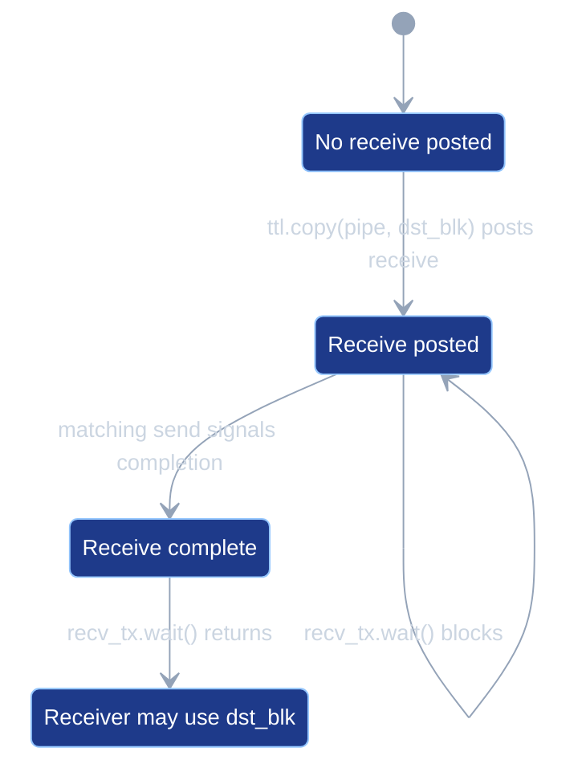
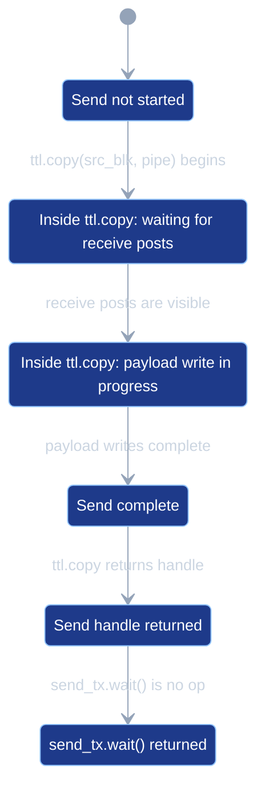
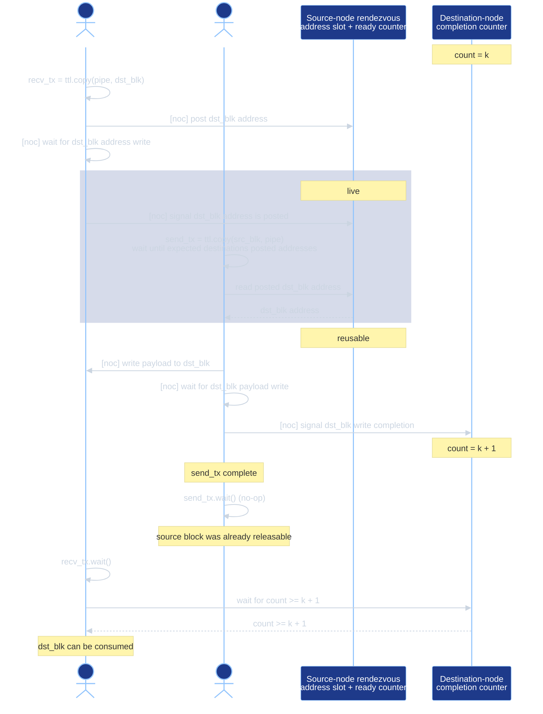

# PipeNets

This document describes PipeNet semantics, verification, lowering,
scheduling, simulator behavior, and test coverage in tt-lang. Both the
compiler and the simulator consume the same operation-level PipeNet
collection described in [Operation PipeNets](#operation-pipenets).

A node is one execution coordinate in the launched device grid. A
dataflow buffer (DFB) is the user-visible payload buffer used by
producer, consumer, and pipe transfer code. A pipe-coupled operation is
an operation whose legality depends on a PipeNet role, such as a
pipe-typed `ttl.copy` or a DFB wait whose producer is PipeNet-routed.
NoC refers to TT-Metal network-on-chip operations used for remote SRAM
writes and semaphore increments.

## Overview

`ttl.PipeNet` describes a logical communication pattern between nodes. A
pipe carries data from a source coordinate (`src`) to either a single
destination (point-to-point) or a contiguous coordinate range
(collective). When the launch grid is larger than the union of all pipe
sources and destinations, the extra nodes have no role in the
communication. If the user fails to guard pipe-coupled work from those
nodes, the kernel reads out-of-bounds tensor regions and corrupts the
pipe synchronization protocol; this failure mode is the one the
verifier guards against (see issue #541).

The launch grid is the grid that `@ttl.operation(grid=...)` schedules
onto. The work extent is the per-axis bounding box of every pipe
coordinate in the user's PipeNets. The launch grid and work extent are
separate: the launch may cover more nodes than the communication uses.
The `grid=` argument selects the launch:

- `grid="full"` launches on the device compute grid.
- `grid="auto"` is currently an alias for `"full"`.
- An explicit tuple is used verbatim.

A PipeNet's active nodes are the union of its source and destination
coordinates. This is the node set tested by `net.is_active()`. Whenever
the launch is wider than those active nodes, the user must guard
pipe-coupled regions with `net.is_src()`, `net.is_dst()`,
`net.is_active()`, or coordinate predicates that express the same role
tests. The verifier rejects any pipe-coupled operation reachable from a
node outside its declared role. The diagnostic names the offending
operation, an example offending coordinate, the contributing PipeNet or
PipeNets, and a suggested guard.

The compiler verifies user-written guards: each pipe-coupled operation
must be reachable only from the nodes permitted by its role
(`ttl.copy(buffer, pipe)` only from `pipe.src`;
`ttl.copy(pipe, buffer)` only from `pipe.dst`; `cb_wait` reachable
only within the static producer domain for that DFB index). The
verifier reads the IR and emits diagnostics; it does not rewrite the
program.

## PipeNet callbacks and generated code

A PipeNet record is one `ttl.Pipe` declaration: one source coordinate and one
point-to-point destination or collective destination range. The Python
frontend represents `net.if_src(callback)` and `net.if_dst(callback)` with one
`ttl.pipenet_foreach_src` or `ttl.pipenet_foreach_dst` region. The region owns
the ordered record list and contains one copy of the callback body. At runtime,
each launch node executes that body once for every record in which the node has
the requested source or destination role. Multiple matching records execute in
PipeNet construction order.

TTKernel conversion uses two representations:

- For one to four records, conversion emits one static pipe and one coordinate
  condition per record. This avoids loop and table-lookup overhead for small
  PipeNets.
- For five or more records, conversion emits one loop over immutable coordinate
  and resource tables. `ttl.select_pipe_src` or `ttl.select_pipe_dst`
  represents the current record inside the loop. This table-driven form emits
  one callback and transfer protocol body; only the immutable table contents
  grow with the number of records.

The immutable tables become bit-packed C++ template arguments stored outside
the kernel stack. Pipe graph analysis still creates one transfer node per
record. A selected-pipe type identifies whether iteration selected the record
by its source or destination coordinates; copy operand position determines
whether that record is used for a send or receive. Launch-domain verification
proves that the selected callback executes on the required endpoint.

Resource planning stores each record's address-table entry and synchronization
indices in record order, and the loop index selects the corresponding values.
Pipe graph analysis maps the shared protocol operation and record index to a
distinct transfer node, so each record retains its own address-sequence proof
and runtime resources.

## Semantics

Lowering selects the destination-address mechanism independently from
the sender synchronization mechanism:

- `RA`: receiver-authored address.
- `CA`: computed address.
- `RP`: receiver-post synchronization.
- `CC`: capacity-counter synchronization.

The slash in a mode name combines one address mechanism with one
synchronization mechanism.

| Mode | Destination address | Send condition |
| --- | --- | --- |
| `RA/RP` | Each receiver publishes its reserved DFB address. | Every required receiver has posted. |
| `CA/RP` | The sender computes each receiver DFB address. | Every required receiver has posted. |
| `CA/CC` | The sender computes each receiver DFB address. | Every required receiver has capacity. |

`RA/CC` is unsupported because CC permits a send without a current
receiver post, so the sender must compute the destination address.

All three modes use the same payload write and receiver-completion
signal. A sender-ready increment means that the receiver has reserved
destination storage; it does not mean that the payload write is
complete. The sender signals payload completion separately after its
NoC write barrier.

| Protocol event or property | `RA/RP` | `CA/RP` | `CA/CC` |
| --- | --- | --- | --- |
| Receiver reserves a destination DFB block | Yes | Yes | Yes |
| Receiver publishes the reserved block address | Yes: one inline 32-bit NoC write per post | No | No |
| Receiver increments the sender-ready counter | After the published address is visible | After reserving the block | No |
| Condition for the sender's payload write | Every required receiver has posted | Every required receiver has posted | The receiver has available DFB capacity |
| Sender obtains the destination address | Reads the published address-table entry | Computes `DFB base + slot * block stride + static offset` | Computes the same address |
| Receiver action after popping a block | No capacity update | No capacity update | Increments the sender's capacity counter |
| Sender/receiver synchronization | Per-transfer receiver-post rendezvous | Per-transfer receiver-post rendezvous | Sender may use the next computed slot when a capacity credit is available |
| Multicast | Supported when receiver runtime addresses are proven equal | Supported with proven equal receiver runtime addresses | Not currently supported; uses `CA/RP` instead |

The practical difference is address publication, not send admission.
`CA/RP` does not permit the sender to run before the receiver post. It
removes the receiver's address write and the sender's address-table read
when the compiler can prove that its computed address is the address of
the block the receiver reserved.

`CA/CC` also removes the per-transfer receiver-post rendezvous. The
capacity counter starts with one credit per free receiver DFB slot.
The sender can use the next computed slot when a credit is available,
and the receiver returns a credit by incrementing the capacity counter
after its pop. This allows sender and receiver execution to overlap
across multiple DFB slots and removes the receiver-post synchronization
traffic.

Point-to-point transfers use `RA/RP` when the sender cannot materialize a
proven receiver address sequence. Multicast can use either address mechanism
only when the graph proves that every receiver has the same destination SRAM
address for every transfer occurrence. The computed-address protocol
is unavailable when any of the following applies:

- `--no-ttl-pipe-computed-addresses` is set.
- The destination tile offset is runtime-valued.
- The graph cannot prove a complete receiver DFB reservation schedule. This
  includes unmodeled producer writes and reservations in unordered functions,
  threads, loops, or branch regions.
- A transfer definition cannot be matched to exactly one send and its
  corresponding receive post and wait family.
- The receiver sequence is fully dynamic, or the graph cannot prove a modular
  recurrence that current computed-address lowering can materialize.
- The receiver DFB does not contain tiles, the sender operations do not
  belong to one sender function, or the address arithmetic does not fit
  the supported 32-bit representation.

The address protocol does not change DFB reservation legality. TT-Metal permits
the producer write pointer to return to the first block only when a reservation
advance reaches the physical DFB end exactly. PipeGraph rejects any proven
reservation sequence whose advance exceeds `block_count` in both address modes.

Multicast is not itself a restriction. A collective transfer whose receiver
endpoints form one address-sequence equivalence class uses `CA/RP` when the
sender can materialize that sequence. `RA/RP` remains available when computed
addressing is disabled or another computed-address predicate fails. It does not
make an invalid receiver reservation sequence valid. Both modes
require the same graph proof because TT-Metal NoC multicast has one destination
SRAM address operand. A collective transfer is rejected unless every receiver
address is proven equal for every occurrence.

Pipe transfers have the following operational semantics:

- A pipe has no implicit intermediate buffer. The destination storage is the
  DFB block the user reserves in the receiver callback.
- `ttl.copy(pipe, dst_blk)` posts a receive for the user-reserved
  destination block and returns a typed `ReceiveRequest`. `RP` records the
  post as a send condition. `RA/RP` also publishes the runtime
  destination address; both CA modes compute it on the sender.
- Waiting on that request waits for the sender's completion
  signal for that posted receive.
- `ttl.copy(src_blk, pipe)` starts a send. `RP` waits until every
  destination has posted a receive; `CC` waits until every destination
  has capacity. The send then writes `src_blk` directly to the
  receiver-owned DFB storage, waits for the payload write to complete,
  and signals completion to the receivers.
- The returned send handle preserves the general TTL copy API. For pipe
  sends, `ttl.wait` on that handle lowers to no operation because the
  lowered send has completed before the handle is produced.
- The compiler uses the user's DFB reserve and wait structure for pipe
  payload storage. Pipe lowering does not create a separate payload DFB.
- Every send requires one corresponding receiver post at every destination.
  The post must be able to run before the send blocks waiting for it.
- Every receiver wait observes the send corresponding to the exact receive
  handle it consumes. The send must be able to run before the receiver blocks
  waiting for completion. Repeating a wait on one handle observes the same
  completed transfer and does not require another send.
- A receiver post does not wait for payload and does not require a receiver
  wait. Code may post a reservation before deciding when or whether to wait. A
  pipe with no sends or waits may contain unused receiver posts.
- A send completes after the payload write and completion signal. It does not
  wait for the receiver to execute a receive wait, so a send does not require
  a receiver wait.
- When a pipe has sends, every destination must have the same number of
  receiver posts as sends. Extra posts would advance the sender-ready state
  before the intended send.
- The verifier builds a wait-for graph over send, receive-post, and
  receive-wait events. It rejects schedules whose same-thread ordering
  creates a wait-for cycle. Other runtime hangs can still have different
  causes.
- A *static definition* is one IR operation that defines a send, receiver post,
  or receiver wait. *Program order* (the order in which events can execute
  within one kernel thread) is distinct from *definition order* (the
  deterministic lexical IR order of definitions for one event kind and
  `PipeKey`). The verifier derives program order from single-block structured
  regions after expanding direct helper calls at each call site. Independent
  kernel threads have no program order.
- The verifier pairs static receiver-post and send definitions in their
  respective program order. Each pair may execute repeatedly, but the two sides
  must contain the same number of static definitions and each pair must execute
  equally often under equivalent conditions. A receiver wait refers to the
  exact post that produced its handle, rather than a position in the wait
  sequence. Alternative definitions under a runtime `scf.if` remain distinct
  unless the verifier can prove one alternative has zero executions at the
  relevant launch node.
- All definitions of one event kind for a pipe endpoint must belong to one
  kernel-thread function. Independent kernel threads have no program order and
  cannot safely share that endpoint's synchronization state.
- Direct helper calls are expanded at each call site. This preserves the
  caller's event order and counts each helper invocation separately. Functions
  containing pipe events must be reachable from a kernel-thread entry point
  through direct calls. Recursive calls and schedules exceeding 4096 events
  after launch-node specialization and helper expansion are rejected.

### Selecting among completed receives

`ttl.wait_any(requests, start)` waits until at least one PipeNet receive request
is complete and returns a typed `ReadyReceive`. `requests` is a nonempty tuple
of distinct `ReceiveRequest` values. `ReadyReceive.index()` returns the selected
tuple index.

Selection inspects indices in cyclic order
`start % len(requests), ..., len(requests) - 1, 0, ...` and ends immediately
before the normalized start index. It selects the first complete request in
that order. A caller implements rotating priority
by passing `(previous_index + 1) % len(requests)` to the next selection. When
several requests are already complete, this rule is deterministic and prevents
a fixed tuple prefix from receiving permanent priority.

Selection completes only the returned request. Nonselected requests remain
pending and retain their original destination DFB reservations. They may
participate in a later `wait_any` or an exact `ReceiveRequest.wait()`. The
selected request may also receive an exact wait; repeated waits observe the
same completed transfer.

Each candidate has a compiler-derived identity consisting of its PipeNet id,
pipe-transfer definition, and selected record index when record selection is
dynamic. The program does not allocate or compare physical semaphore ids.
Lowering maps every identity to a receiver-completion counter and a
cumulative expected sequence value, then polls those resources with a
nonblocking semaphore threshold test. Alternate SSA definitions of one request
are valid only when they denote the same logical channel and destination DFB
stream. Their completion state uses one cumulative counter.

Pending requests require independent destination capacity. Candidates that may
complete or be consumed out of FIFO order use separate DFB streams. Multiple
reserved blocks in one DFB stream are valid only when requests complete and
publish in reservation order. Tensor-backed DFBs expose independent landing
storage directly without intermediate scratch copies.

```python
block0 = landing_dfb0.reserve()
block1 = landing_dfb1.reserve()
request0 = ttl.copy(pipe0, block0)
request1 = ttl.copy(pipe1, block1)

ready = ttl.wait_any((request0, request1), start=next_index)
selected = ready.index()
if selected == 0:
    request0.wait()
    block0.push()
    ready_block0 = landing_dfb0.wait()
    consume(ready_block0)
    ready_block0.pop()
else:
    request1.wait()
    block1.push()
    ready_block1 = landing_dfb1.wait()
    consume(ready_block1)
    ready_block1.pop()
next_index = (selected + 1) % 2
```

The receive transfer created by `ttl.copy(pipe, dst_blk)` moves through
these states:



If `recv_tx.wait()` runs in `ReceivePosted`, the calling kernel blocks
until the matching send reaches `ReceiveComplete`.

Current TTKernel lowering executes the send transfer created by
`ttl.copy(src_blk, pipe)` before returning the send handle:



The source thread cannot execute `send_tx.wait()` before `SendComplete`
because the handle is produced only after the lowered send operation
returns. The possible stall is inside `ttl.copy(src_blk, pipe)` while it
waits for receive posts or payload-write completion.

When a single data-movement kernel executes both a send and a receive
for the same PipeNet, program order in that kernel must satisfy the
pipe synchronization order. In a loopback collective, the source node
is also one of the destinations; in relay kernels, a node receives from
one pipe and sends to another.

For example, the loopback schedule below is invalid because the same thread
tries to send before it posts its own receive:

```python
@ttl.datamovement()
def transfer():
    x, _ = ttl.node(dims=2)
    if x == 0:
        with send_cb.wait() as src_blk, recv_cb.reserve() as dst_blk:

            def send(pipe):
                ttl.copy(src_blk, pipe).wait()

            net.if_src(send)

            def recv(pipe):
                ttl.copy(pipe, dst_blk).wait()

            net.if_dst(recv)
```

The send waits until every destination has posted its receive. In this
same-thread loopback schedule, that post is placed after the blocking send,
so the thread can never reach it:


The solid edge is same-kernel program order. The dashed edge is the
wait-for dependency: the send started by `ttl.copy(src_blk, pipe)` needs
the receive post from `ttl.copy(pipe, dst_blk)`.

Valid same-thread loopback schedules post the receive first, run the
send, then wait for receive completion.

```python
@ttl.datamovement()
def transfer():
    x, _ = ttl.node(dims=2)
    if x == 0:
        with send_cb.wait() as src_blk, recv_cb.reserve() as dst_blk:

            def recv(pipe):
                recv_tx = ttl.copy(pipe, dst_blk)

                def send(pipe):
                    ttl.copy(src_blk, pipe).wait()

                net.if_src(send)
                recv_tx.wait()

            net.if_dst(recv)
```

The verifier collects receiver posts, sends, and receive waits in program order.
Each event kind must have the same number of definitions, and each corresponding
pair must have proven equal execution multiplicity. Equal exact counts prove the
relation directly. When exact counts are unavailable, operations must share one
unresolved structured-control context, and every runtime control value must be
proven equal at the source and receiver nodes. The verifier rejects an unproven
correspondence instead of assuming that unrelated functions, regions, or
node-dependent values execute equally often.

The receive post executes before the send can block on that post. The
receive wait runs only after the send operation has run:


The program order satisfies both dependencies: the send observes the
receiver post from `ttl.copy(pipe, dst_blk)`, and
`recv_tx.wait()` runs after `ttl.copy(src_blk, pipe)` has run the send
that can complete the receive.

## Pipe transfer resource model and TTKernel lowering

Pipe lowering first expands high-level pipe operations to Pipe Transfer IR:

- `ttl.copy(pipe, dst_blk)` expands to `ttl.pipe_transfer.post`.
- `ttl.copy(src_blk, pipe)` expands to `ttl.pipe_transfer.send`.
- `ttl.wait` on a pipe receive handle expands to
  `ttl.pipe_transfer.wait`.
- `ttl.wait_any` on pipe receive requests expands to
  `ttl.pipe_transfer.wait_any`.
- `ttl.wait` on a pipe send handle remains a high-level `ttl.wait` until
  TTKernel conversion, where it is erased because `ttl.pipe_transfer.send`
  has already waited for the payload write and signaled completion.

A transfer node represents one payload transfer: one send, one receiver post
for each destination, and receiver completion. Sender and receiver callbacks
may use separate static pipe values or selected-record operations.
Correspondence analysis matches the send and receiver posts into one transfer
node. A dynamic transfer instance is one runtime execution of that node, such
as one loop iteration. In `RP`, an instance is live after its receiver posts
and before the send consumes their sender-ready count. In `RA/RP`, its
published address is live for the same interval. Resource allocation treats
the sender-ready counter and address-table entry as live from the earliest
receiver post through the send.

A `PipeKey` contains the declared source coordinate, receiver rectangle, and
PipeNet id. It identifies a communication relation, not one transfer node.
Each connection from a transfer node to one receiver DFB is a receiver endpoint.

A receive post uses the `dst_blk` already reserved by the user; it does
not reserve another DFB block. `RA/RP` reads and publishes its DFB write
pointer. `RP` records the post for the matching send. The send uses its
selected mode, performs the NoC write directly to receiver-owned DFB
storage, and signals receiver completion. Collective sends currently use
`RP` and wait for every destination in the receiver set to post.

Lowering to TTKernel models the resources for these modes separately.

Table 1. Pipe transfer resources, backing storage, and allocation scale.

| Resource | Backing storage / location | Allocation scale |
| --- | --- | --- |
| Source payload block (`src_blk`) | User-reserved DFB block on the source node. | User DFB reserve depth. |
| Destination payload block (`dst_blk`) | User-reserved DFB block on the destination node. | User DFB reserve depth. |
| Address table | Compiler-managed SRAM scratch on each source node; 4 bytes per entry, with the total table allocation rounded up to 32-byte alignment. | Per source node: one entry per concurrently live transfer sourced by that node. |
| Sender-ready counter | Source-node local semaphore or GlobalSemaphore-backed SRAM word. | Per source node: one counter per concurrently live transfer sourced by that node. |
| Sender-capacity counter | Source-node local semaphore or GlobalSemaphore-backed SRAM word. | Per source node, one counter per proven receiver endpoint in `CA/CC` mode. Different source nodes may reuse an allocation when their initial capacities match. |
| Receiver-completion counter | Destination-node local semaphore or GlobalSemaphore-backed SRAM word. | One logical counter per transfer node at each receiver. Transfers with disjoint receiver sets may reuse one counter allocation. |

Here, source node means a physical node in the launched device grid. It
does not mean one allocation per static pipe. Address-table entries and
sender-ready counters from the same source node reuse an allocation slot
unless their live intervals overlap. The number of source nodes is bounded
by the launched device grid, not by the number of static pipes.

Receiver-completion allocation follows the physical receiver sets. Two
transfer nodes that share any receiver use distinct counters because
either send may complete first. Transfer nodes with disjoint receiver sets may
reuse one counter allocation because the state is independent on each physical
node. Repeated dynamic executions of one transfer node reuse its assigned
counter and advance a cumulative expected-count value.

The compiler uses one allocation abstraction for completion, readiness, and
capacity counters. By default, it allocates completion counters first, using
local semaphore ids before GlobalSemaphore storage. It then allocates readiness
counters locally only if the entire per-kernel readiness allocation fits in the
remaining local ids; otherwise all readiness counters use GlobalSemaphore
storage. Capacity counters use any remaining local ids and then
GlobalSemaphore storage. `--ttl-pipe-global-semaphores-only` allocates every
compiler-managed PipeNet counter in GlobalSemaphore storage, preserving all
local semaphore ids for application use. No PipeNet counter fails solely
because all 16 local semaphore ids are occupied.

The address table and synchronization counters all reside in Tensix L1 SRAM,
but they use different allocation mechanisms. TTKernel local semaphores consume
hardware semaphore ids. GlobalSemaphore-backed counters are host-created
semaphore objects whose addresses are passed as common runtime arguments.
Address-table storage is host-created L1 scratch containing only 32-bit
receiver-published destination addresses.

TT-Metal validates each kernel's combined unique and common runtime arguments
against the target's kernel-configuration capacity. Its allocator separately
validates L1 availability for GlobalSemaphore and address-table storage. These
checks run during program construction, before dispatch, because their limits
depend on the target and current device allocations.

TTKernel conversion records the compiler-owned pipe resource plan with
module attrs:

- `ttl.pipe_sync_semaphore_count` for local pipe semaphores;
- `ttl.pipe_global_semaphore_count` for GlobalSemaphore-backed PipeNet
  counters;
- `ttl.pipe_sram_scratch_bytes` for receiver-authored address-table
  storage.

The address-table scratch byte count is computed per launched node from
the source-node resource coloring. Each concurrently live same-source
transfer color needs one 4-byte table entry. The compiler takes the
maximum entry count required by any source node and rounds the result up
to 32-byte alignment. If the result is zero, no scratch allocation or
scratch common runtime argument is emitted.

The host runtime reads `ttl.pipe_sram_scratch_bytes` and allocates one
height-sharded TTNN tensor in L1. Each launched node receives one shard
large enough to hold the aligned byte count. The tensor buffer address
is the SRAM scratch base for that node. `build_pipe_runtime_resources`
passes that buffer address as the first pipe-resource common runtime
argument, followed by all GlobalSemaphore counter addresses in compiler
allocation order. The compiler-defined argument prefix is tensor buffer
addresses, computed receiver DFB bases, compiler-managed PipeNet resources,
and logical device coordinates; per-kernel extra arguments follow this prefix.
TTKernel lowering therefore maps pipe runtime arg 0 to common runtime arg index
`num_tensor_args + num_computed_dfb_bases + 0`. It reads the scratch base with
`get_common_arg_val` at that index and adds the compiler-selected byte offset
(`resourceColor * 4`) for the transfer's address-table slot.

This scratch allocation does not alias DFB SRAM. DFB payload storage is
bound through TTNN circular-buffer descriptors in the current runtime,
while pipe scratch is a TTNN L1 tensor buffer address passed separately
as a common runtime argument. tt-metal documents L1 as Tensix SRAM
([Metalium guide](https://github.com/tenstorrent/tt-metal/blob/c296ef469fe6aab65ab0d359e164b14b62d92bfc/METALIUM_GUIDE.md#L41)),
routes `BufferType::L1` buffers through the L1 buffer manager
([allocator.cpp](https://github.com/tenstorrent/tt-metal/blob/c296ef469fe6aab65ab0d359e164b14b62d92bfc/tt_metal/impl/allocator/allocator.cpp#L113-L134)),
and validates static circular-buffer/dataflow-buffer regions against
existing L1 buffer allocations before launch
([tt_metal.cpp](https://github.com/tenstorrent/tt-metal/blob/c296ef469fe6aab65ab0d359e164b14b62d92bfc/tt_metal/tt_metal.cpp#L931-L940)).
The two resource classes still compete for finite L1 capacity, so an
oversized program can fail resource validation, but address-table slots
are offsets inside the scratch tensor, not offsets inside a DFB.

[Device 2.0] This keeps pipe resource ownership in the compiler plan;
future typed device APIs should change only the runtime binding
mechanism, not the IR-level resource model.

The `RA/RP` address-table entry and `RP` sender-ready counter do not
remain live until the transfer handle returned by `ttl.copy` is waited
on. They carry
only pre-send state: the receiver-published DFB address and the count
proving that the required receivers have posted. After the send resets
the ready counter and, for `RA/RP`, reads the address-table entry, those
source-node resources no longer contain state needed by that transfer.
Receive completion is tracked separately by the transfer node's
receiver-completion counter, so the transfer handle returned by
`ttl.copy(pipe, dst_blk)` can remain live until `ttl.wait` without
extending the source-node address-table or sender-ready-counter lifetime.



Each static send and its corresponding receiver posts form one transfer node.
Distinct transfer nodes for the same `PipeKey` may be live concurrently;
resource coloring gives overlapping nodes distinct sender-ready counters and,
for `RA/RP`, distinct address-table entries. This supports receive-ahead code
with multiple transfer definitions without merging their synchronization
state. Completion state is also transfer-specific: completing one transfer
cannot satisfy another transfer's wait. Repeated dynamic executions of one
transfer node reuse that node's state.

### RA/RP: receiver-authored address

Point-to-point and collective transfers use the address table in Table
1 to communicate receiver-owned destination DFB addresses to the source.
The receive post publishes the concrete `dst_blk` address to one
source-node table entry and signals the sender-ready counter. The send
waits for readiness, reads the table entry, and writes the payload to
that receiver-owned DFB block.

Receive posts publish the address with an inline 32-bit NoC write.
The address write is ordered before the sender-ready increment, so the
source cannot observe the post count before the address table entry is
valid.
Table entries are allocated per source node from transfer live
intervals. Same-source transfer intervals that overlap get distinct
entries; non-overlapping same-source intervals can reuse the same entry.
Repeated executions of one transfer node preserve that node's
protocol state. Multiple transfer nodes that reference the same logical pipe
retain distinct address sequences. Resource planning may color their
address-table entries and sender-ready counters to the same storage only when
their live intervals do not overlap.
Address-table storage is L1 scratch, not semaphore storage, so it does
not consume semaphore ids.

### CA/RP and CA/CC: computed receiver address

Some transfers do not need receiver-authored address publication. When the
graph proves a receiver address sequence that the sender can materialize, the
sender computes the destination address from the host-bound DFB base and
compile-time sequence parameters:

```mlir
%receiver_slot = %initial_slot
%dst_addr = %receiver_dfb_base
          + %receiver_slot * %receiver_block_stride_bytes
          + %static_byte_offset
```

The host passes `%receiver_dfb_base` as a common runtime argument because
the backing L1 allocation can change between invocations. Keeping the base
out of compile-time arguments lets the program cache reuse the kernel binary
without retaining an address from an earlier allocation.

For ordinary point-to-point transfers, `%initial_slot` is usually 0. For
gather or allgather-style receivers, `PipeGraph` derives it from the complete
producer reservation schedule for the physical receiver DFB. Producer
reserves select write addresses, and matching pushes advance the DFB write
pointer. Consumer pops affect when a later reserve can complete, but they do not
select its address. Static tensor subviews add `%static_byte_offset` inside the
selected DFB block.

A periodic receiver sequence has a graph-derived `%repeat_stride`. This value
is the distance in DFB blocks between the starting slots selected by consecutive
occurrences, reduced modulo `block_count`. It is not the maximum occupied slot
or the number of in-flight reservations. A reserve shared by multiple receive
posts contributes its block span once. When `%repeat_stride` is nonzero, the
sender uses a local slot counter initialized to `%initial_slot`:

```mlir
%receiver_slot = load %sender_slot_counter
%next_slot = (%receiver_slot + %repeat_stride) mod %block_count
store %next_slot, %sender_slot_counter
```

No counter is needed when the transfer executes once or `%repeat_stride` is
zero modulo `block_count`. Computed addressing requires a modular recurrence
that the sender can materialize; otherwise `RA/RP` publishes the runtime
receiver address. A collective still requires a proven one-class address
partition.

The graph verifies that every reachable slot satisfies
`slot + slot_span <= block_count`. TT-Metal advances the DFB producer write
pointer by `slot_span` blocks and permits it to return to the first block only
when the advance reaches `block_count` exactly. The condition is evaluated over
the reachable recurrence; repeat-stride divisibility is not required.

When the address proof succeeds but the capacity proof does not,
lowering selects `CA/RP`. The address-table write and read are removed,
but the receiver still increments the sender-ready counter and the
sender still waits for every required receiver to post.

When both proofs succeed, lowering selects `CA/CC`. The capacity
counter is initialized to the receiver DFB `block_count`, and the
receiver's remote increment after a pop is its only writer. The sender
tracks its cumulative acquire count in a kernel-local counter and waits
for the capacity counter to reach that count before each payload
write. The sender never writes the shared capacity counter, so a receiver
release cannot race with a sender update.

`CA/CC` uses these events:

1. Function entry initializes `%capacity_counter` to the receiver DFB
   `block_count` with `ttkernel.noc_semaphore_set` on its local or
   GlobalSemaphore-backed pointer, and allocates a zero-initialized kernel-local
   cumulative-acquire counter for the sender.
2. Before each payload write, the sender loads its cumulative-acquire
   counter, adds the acquire count, stores the incremented value back,
   and waits until `%capacity_counter` reaches that value with
   `ttkernel.experimental.semaphore_wait_min`. The sender never writes
   `%capacity_counter` before computing `%dst_addr` and issuing the payload
   NoC write.
3. The sender still signals receiver completion after the payload write
   barrier, using the transfer node's receiver-completion counter. All three
   modes use the same completion mechanism.
4. The receiver executes its normal receive wait, push, wait-front, and
   pop sequence.
5. Lowering emits `ttkernel.noc_semaphore_inc` to the source-node
   capacity counter after the proven receiver pop, followed by
   `ttkernel.noc_async_atomic_barrier`.

The receiver wait and pop must execute on the receiver's NOC thread because
the capacity release is a NoC semaphore increment. A transfer whose consumer
thread owns the pop retains receiver-post synchronization. Debug output from
`-debug-only=ttl-pipe-capacity-analysis` reports why a transfer was not
selected for `CA/CC`.

`CA/CC` removes receiver writes to the source-node address table and
receiver increments of the sender-ready counter. The receiver-completion
counter remains unchanged because it reports payload arrival, not sender
capacity.

#### Receiver address-sequence proof

Address computation must reproduce the physical DFB block selected by every
receiver reserve. Multicast adds a protocol-independent requirement: all
receivers must select the same destination SRAM address for each occurrence of
the collective transfer. The graph represents those requirements directly
instead of treating equal initial slots or equal batch sizes as the semantics.

Address equality does not replace payload compatibility. Every receiver
destination must have the sender DFB block's element type and enough elements
to hold that block. These checks establish that the common NoC payload has the
same interpretation and fits every receiver destination.

##### Graph representation

The address proof uses four graph objects:

| Graph object | Meaning | Address facts owned by the object |
| --- | --- | --- |
| `PipeReceiverDFBNode` | One physical DFB, identified by logical receiver device when present, receiver node, and finalized DFB index. | Writer endpoint list and whether every producer-side advance is a modeled pipe receive. |
| `PipeTransferNode` | One send and its corresponding receiver post for each destination. The send and receiver posts may reference distinct `ttl.pipe_transfer.create` operations. Multiple transfers for one `PipeKey` remain distinct nodes. | Transfer contract, logical-device transfer, send operation, and receiver endpoint list. |
| `PipeReceiverEndpoint` | One connection from a transfer node to a receiver DFB node. | Slot span, static byte offset, and the derived receiver address-sequence proof. |
| `ReceiverAddressSequenceProof` | The proof result for the destination address selected by one endpoint at occurrence `i`. | A proven modular recurrence, optionally restricted to an exact execution count, or `FullyDynamic`. |

Separating `PipeTransferNode` from the logical `PipeKey` prevents two static
uses of one pipe from being assigned one ambiguous slot. Resource allocation
may reuse protocol state between non-overlapping transfer nodes, but that reuse
does not merge their address sequences.

For endpoint `E` and occurrence ordinal `i`, every proven sequence uses:

```text
receiver_address(E, i) =
    dfb_base(E)
    + slot(E, i) * block_stride_bytes(E)
    + static_byte_offset(E)
```

The graph represents a proven sequence as:

| Sequence representation | Slot definition | Applicable execution count |
| --- | --- | --- |
| `ReceiverAddressRecurrence` | `(initial_slot + i * repeat_stride) mod block_count`. | Exact `N`, when static execution analysis proves the count, or unknown when the recurrence is invariant for every execution. |

An absent recurrence means `FullyDynamic`: the graph did not prove one address
formula for every execution. This is distinct from an unknown execution count;
an invariant recurrence remains proven when the number of executions is not
known at compile time.

`i` is the execution ordinal of the transfer node. It is not necessarily one
enclosing loop's induction variable because one loop iteration may contain
multiple transfer nodes. When loop bounds, steps, and relevant
conditions are compile-time analyzable, the compiler proves the exact number of
reachable values of `i` without unrolling the loop. The first execution is
`i = 0`. In a recurrence, `initial_slot` is the physical
slot of the endpoint's reserve in the first proven producer schedule and
`repeat_stride` is the number of DFB blocks by which that reserve advances
between consecutive executions, reduced modulo `block_count`. It is derived
per endpoint; receivers with different surrounding DFB traffic may have
different strides.

`dfb_base` is a symbolic runtime value. Two base symbols compare equal only
when host binding proves that their common runtime arguments have the same
value. The remaining terms are compile-time integers. This permits exact
reasoning without embedding an invocation-specific L1 address in the kernel.
Every sequence satisfies `block_count > 0`, `0 <= slot(E, i) < block_count`,
`slot_span > 0`, and `0 <= repeat_stride < block_count`. Sender
materialization separately requires the final offsets and counter parameters
to fit their 32-bit TTKernel representation.

`ReceiverAddressSequenceProofKind` names the same three models in the
implementation. `ReceiverAddressSequenceProof` stores a recurrence and, for
`KnownCount(N)`, the exact count `N`; `getKind()` derives the model from those
fields and asserts that a count never exists without a recurrence.

The synchronization proof classifies the occurrence domain `I(T)` by what is
known at compile time:

| Occurrence model | Compile-time knowledge | Proof domain |
| --- | --- | --- |
| `KnownCount(N)` | The exact execution count and the receiver recurrence are known. This includes one-shot code and loops whose bounds, steps, and relevant conditions are statically analyzable. | `i` in `[0, N)`. One-shot execution is `KnownCount(1)`. |
| `PeriodicUnknownCount` | The exact count is not known at compile time, but every execution follows the same statically proven producer reservation recurrence and unresolved control values are proven equal at the participating nodes. | All nonnegative `i`, a safe envelope for the unknown count. |
| `FullyDynamic` | A control decision unavailable at compile time changes the order, multiplicity, reservation span, or intervening DFB producer traffic, so no single recurrence is proven. | No address-sequence proof domain. |

`FullyDynamic` describes missing compile-time schedule information, not the
presence of a loop. A compile-time trip count produces `KnownCount(N)`. An
unknown trip count can still produce `PeriodicUnknownCount` when the loop body
has one statically proven, invariant reservation schedule and its bounds are
uniform across the participating nodes. Changes controlled by values that may
differ between nodes produce `FullyDynamic`.

The execution point includes both the logical device, when a device domain is
present, and the launch node within that device. A device predicate emitted for
a graph PipeNet callback is evaluated against that logical device before the
schedule is classified. It is not `FullyDynamic` merely because one generic
kernel module is instantiated on several devices. A condition remains fully
dynamic only when it cannot be resolved after both device and launch-node
coordinates are fixed.

Execution-count specialization shares one immutable baseline dataflow solution
per function or selected-record loop. Each logical-device-qualified execution
context has a lightweight query containing its value evaluators, enumeration
budget, and context-dependent caches. The context also includes the active
record index for selected PipeNet analysis. Query retention is bounded, but
removing a query does not reconstruct the baseline solution. Any IR mutation
invalidates the baseline and all dependent queries.

For example:

```text
one transfer site in scf.for 0 to 4 step 1
    -> KnownCount(4)

one transfer site in scf.for 0 to %runtime_upper step 1,
with the same ordered DFB reservations on every iteration
    -> PeriodicUnknownCount

a branch on a value unavailable at compile time that conditionally inserts
another DFB reservation
between two executions of the transfer
    -> FullyDynamic
```

The one-to-one synchronization verifier still rejects mismatched posts, sends,
or waits. The occurrence model records the multiplicity and recurrence of a
valid matched transfer; it does not make an invalid rendezvous schedule legal.

##### Address-sequence equivalence

Receiver address sequences are equivalent for transfer `T` when their values
are pointwise equal over `I(T)`:

```text
equivalent(E1, E2, T) :=
    for every i in I(T):
        receiver_address(E1, i) == receiver_address(E2, i)
```

This equivalence relation defines a partition of a transfer node's receiver
endpoints. The current verifier determines whether every endpoint belongs to
one proven class; it does not need to materialize the other classes. If a
required pairwise comparison is unknown, the result is unknown rather than an
assumed class. A collective transfer is legal exactly when one class is proven:

```text
if collective(T)
   and (address_partition(T) is unknown
        or address_partition(T).size() != 1):
    error("collective pipe receiver address sequences are not proven equal")
```

This condition applies to both `CA/RP` and `RA/RP`. Receiver-authored
publication changes how the sender obtains the address; it cannot make one NoC
multicast write target different SRAM addresses.

Each proven class uses its lowest stable endpoint ID as a deterministic
representative. Computed collective lowering materializes that representative
sequence; pointwise equivalence proves that it is valid for every endpoint.

The recurrence makes equivalence decidable by finite comparison. For
`KnownCount(N)`, the comparer evaluates at most `N` entries. It may reduce that
work to the reachable period. The slot period of recurrence `S` is:

```text
period(S) = block_count(S) / gcd(block_count(S), repeat_stride(S))
```

For `PeriodicUnknownCount`, every endpoint must have a proven recurrence and
the comparer evaluates one combined period,
`lcm(period(S1), period(S2))`. `FullyDynamic` has no comparison domain and
cannot prove equivalence. Symbolic bases and every evaluated byte address must
match. Equal initial slots and equal repeat strides are sufficient proof
lemmas, but they are not required: different recurrences are accepted when
they produce equal addresses over the reachable occurrences.

Receiver reservation validation uses bounded recurrence enumeration to require:

```text
slot(E, i) + slot_span(E) <= block_count(E)
```

A violation would advance the TT-Metal producer write pointer past the physical
DFB end and is rejected independently of the receiver address protocol.

##### Reservation-schedule construction

Let `D = (logical receiver device, receiver node, finalized DFB index)`, with
the device component omitted for a single-device module. The graph derives
endpoint sequences from the complete producer schedule for `D`, not from one
pipe in isolation. A producer reservation contributes its span once even when
multiple receive posts share it. Its matching push commits that span to the DFB
ring. Consumer waits and pops do not participate in address-sequence
construction because only the reserve/push sequence determines the write
addresses. For local `RP`, a reserve does not complete until the DFB has
enough free blocks, and the sender does not transfer data until that reserve
posts readiness. After an advance reaches the physical DFB end, the next
reserve may select the first block safely even when the consumer is in another
kernel thread. Fabric
transport does not use receiver-post admission and requires a separate capacity
proof; an address sequence alone does not prove that a fabric destination slot
is available.

Current recurrence construction requires every post to one receiver DFB to
share one data-movement function and the same enclosing runtime-selected
regions. A structured loop produces `KnownCount` when its trip count and
relevant conditions are statically analyzable. It produces
`PeriodicUnknownCount` when the count is unknown but every body execution has
the same ordered reservation recurrence and the unresolved loop bounds are
proven equal across participating nodes. Equal execution counts do not create
an order between different functions, branch regions, or loop nests. Such
schedules are `FullyDynamic`.
Scopes known to execute only at the receiver, such as a matching
`ttl.if_dst`, `ttl.pipenet_scope`, or logical-device predicate, do not add an
unresolved runtime condition.

The analysis is:

```text
for D in pipe_graph.receiver_dfbs:
    producer_stream = collect_all_producer_reserves_and_pushes(D)
    schedule_model = classify_producer_schedule(producer_stream)
    if schedule_model == FullyDynamic:
        reservation_schedule(D) = unknown
        continue

    next_slot = 0
    for event in enumerate_proven_schedule(schedule_model):
        if event reserves producer blocks:
            reservation = unique_reservation_owner(event)
            if reservation has no assigned slot:
                if next_slot + reservation.span > block_count(D):
                    reject_reservation_past_dfb_end(reservation)
                assign_initial_slot(reservation, next_slot)
                next_slot = (next_slot + reservation.span) mod block_count(D)
            attach_posts_to_reservation(event, reservation)
        if event pushes producer blocks:
            verify_push_matches_reservation(event)

    reservation_schedule(D) = derive_recurrences(schedule_model, next_slot)

for T in pipe_graph.transfer_nodes:
    occurrence_model(T) = synchronization_proof.occurrence_model(T)
    I(T) = proof_domain(occurrence_model(T))
    if collective(T) and not compatible_receiver_payload(T):
        error("collective pipe receiver payload layouts are incompatible")
    for E in T.receiver_endpoints:
        sequence_proof(E) = derive_address_sequence_proof(
            reservation_schedule(receiver_dfb(E)),
            reservation(E),
            address_geometry(E))

    address_partition(T) = prove_pointwise_address_partition(
        T.receiver_endpoints, I(T))

    if collective(T)
       and (address_partition(T) is unknown
            or address_partition(T).size() != 1):
        error("collective pipe receiver address sequences are not proven equal")

    computed_address(T) =
        occurrence_model(T) != FullyDynamic
        and every sequence_proof(E) is Proven and contiguous over I(T)
        and sender_can_materialize(representative_sequence(T))
```

`sender_can_materialize` also requires a static destination offset, tile-based
DFB geometry, one sender function, one send with its corresponding posts, and
supported 32-bit address arithmetic. For a collective, `RA/RP` is available
only after the independent one-class address proof succeeds.

Protocol selection consumes these graph facts without adding another address
proof:

```text
for T in pipe_graph.transfer_nodes:
    if collective(T) and not compatible_receiver_payload(T):
        error("collective pipe receiver payload layouts are incompatible")
    if collective(T)
       and (address_partition(T) is unknown
            or address_partition(T).size() != 1):
        error("collective pipe receiver address sequences are not proven equal")

    if fabric_transport(T):
        if not computed_address(T):
            error("fabric pipe requires a proven computed receiver address")
        address_mode(T) = CA
    else if computed_addresses_enabled and computed_address(T):
        address_mode(T) = CA
    else:
        address_mode(T) = RA

    if fabric_transport(T):
        synchronization_mode(T) = FABRIC_FLOW_CONTROL
    else if address_mode(T) == CA
       and capacity_sync_enabled
       and capacity_proof(T):
        synchronization_mode(T) = CC
    else:
        synchronization_mode(T) = RP
```

The current capacity proof restricts `CC` to intra-device point-to-point NoC
transfers, so intra-device collectives select `CA/RP` or `RA/RP`. Fabric
transfers use `CA`, routing-plane flow control, and a receiver-completion
counter. They use neither receiver-post sender readiness nor the `CC` capacity
protocol.

##### Partial-overlap example

Consider collective transfer `A` targeting receivers 1 through 4 and transfer
`B` targeting only receivers 1 and 2. All receiver DFBs have two blocks. In one
producer schedule, `A` reserves slot 0 everywhere and `B` then reserves slot 1
on receivers 1 and 2:

| Receivers | Producer schedule | `A` initial slot | `A` repeat stride | `A` slot sequence |
| --- | --- | ---: | ---: | --- |
| 1, 2 | `A, B` | 0 | 0 (`2 mod 2`) | `0, 0, 0, ...` |
| 3, 4 | `A` | 0 | 1 | `0, 1, 0, ...` |

If `A` is `KnownCount(1)`, every endpoint address is compared only at `i = 0`,
so the collective is legal. If a statically known loop makes `A`
`KnownCount(N)` for `N > 1`, or an unknown-count periodic loop makes it
`PeriodicUnknownCount`, the sequences differ at `i = 1`, so the graph produces
two address classes and rejects the multicast. A uniform-repeat-stride
predicate would reject all cases; pointwise equivalence accepts exactly the
legal one.

#### CA/CC capacity proof

For each receiver endpoint `E`, let `D` be its finalized receiver DFB.
The proof establishes this invariant:

```text
admitted_sends(E) <= block_count(D) + completed_one_block_pops(D)
```

The capacity counter is the right side: it starts at `block_count(D)`
and the receiver increments it once after each proven one-block pop. The
sender's cumulative-acquire counter assigns threshold `k` to send `k`.
The send is admitted only after `capacity_counter(E) >= k`, so it has either
one initially free block or one block released by a pop.

`PipeGraph` enumerates all receiver endpoints and groups them by receiver
device, receiver node, and finalized DFB index. Capacity analysis proves
the following predicates:

| Predicate | Required facts |
| --- | --- |
| `single_writer(E, D)` | `writer_endpoints(D) == {E}`. |
| `unit_span(E)` | The receiver reserve for `E` spans one DFB block. |
| `pipe_only_producer(D)` | Every push whose domain overlaps the receiver node has a known domain containing that node, executes on its NOC thread, pushes a whole number of blocks, and has one owning reserve. That reserve owns one or more matching posts; each post has a receive completion wait before the push in the same receiver control context; each post belongs to exactly one push; and the push block count equals the sum of the posts' receiver-slot spans. Receiver-side `ttl.if_dst` regions known to execute on the node preserve this order. |
| `valid_posts(E, D)` | At least one matching post exists. Every post overlapping the receiver node has exactly that node's domain, executes on its NOC thread, and targets `D`. |
| `valid_sends(E)` | At least one matching send exists. Every send has exactly the source-node domain and executes on its NOC thread. |
| `valid_pops(E, D)` | At least one matching pop exists. Every pop overlapping the receiver node has exactly that node's domain, executes on its NOC thread, releases one block, and has one owning DFB wait that has the same domain, thread, and block count. |

Capacity analysis records these predicates as `PipeCapacityEndpointFacts`. It
does not inspect computed-address resources or allocate counters. The module
planner selects `CA/CC` only when every endpoint of transfer node `T` has
capacity facts and `T` has computed receiver-address resources.

`single_writer(E, D)` makes each pop attributable to `E`:
`ttl.cb_pop` identifies `D`, not the transfer node that supplied the popped
block. If another endpoint writes `D`, the release owner is not proven.

The analysis is:

```text
for E in pipe_graph.receiver_endpoints:
    D = receiver_dfb(E)
    if not (single_writer(E, D)
            and unit_span(E)
            and pipe_only_producer(D)
            and valid_posts(E, D)
            and valid_sends(E)
            and valid_pops(E, D)):
        continue
    proven[E] = {sends(E), pops(E, D), block_count(D)}

preliminary_resources = allocate_resources(capacity_selection={})

for T in pipe_graph.transfer_nodes:
    if not (all(E in proven for E in T.receiver_endpoints)
            and computed_address(T, preliminary_resources)):
        mode(T) = ("CA/RP" if computed_address(T, preliminary_resources)
                   else "RA/RP")
        continue
    capacity_selection.add(T)

final_resources = allocate_resources(capacity_selection)
for T in capacity_selection:
    for E in T.receiver_endpoints:
        capacity = allocate_counter_after(
            final_resources, initial=proven[E].block_count)
        record_acquire_before(proven[E].sends, capacity, count=1)
        record_release_after(proven[E].pops, capacity, count=1)
    mode(T) = "CA/CC"
```

Selection is all-or-none per transfer node because one send writes every
endpoint. Multicast uses `CA/RP` when computed addressing is proven. It can use
`RA/RP` only when the transfer node has a proven one-class receiver address
partition. Its receiver post, wait, and pop operations execute over the
complete receiver range, so
`valid_posts` and `valid_pops` cannot establish an exact single-node
domain for each endpoint. Extending `CA/CC` to multicast requires
per-receiver release facts and independent capacity accounting, tracked
in https://github.com/tenstorrent/tt-lang/issues/728.

The `--ttl-pipe-computed-addresses` option, enabled by default, selects
`CA/RP` or `CA/CC` for eligible transfers.
`--no-ttl-pipe-computed-addresses` requests `RA/RP`; multicast is rejected if
its receiver address sequences are not proven pointwise equal.
The `--ttl-pipe-capacity-sync` option, also enabled by default,
selects `CA/CC` when the capacity proof succeeds.
`--no-ttl-pipe-capacity-sync` forces computed-address transfers to
use `CA/RP` and has no effect on `RA/RP` transfers.
`--ttl-pipe-global-semaphores-only` changes only the storage selected for
compiler-managed completion, readiness, and capacity counters. It does not
change addressing or synchronization protocol selection.

### Protocol performance

The measurements below come from the Blackhole device profiler. Each row is the
median of 50 warm dispatches after 5 warmup dispatches. The ready-receiver and
multicast comparisons report sender data-movement kernel duration. The
pipelined-receiver comparison reports the complete interval from the earliest
sender or receiver kernel start to the latest kernel completion. All workloads
transfer BF16 32-by-32 tiles with sender `block_count = 2` and receiver
`block_count = 8`. The benchmark inspects final MLIR to reject a run if the
compiler did not select the requested protocol. Every output was bit-exact.

#### Ready receiver: protocol overhead

The point-to-point workload has one sender and one receiver. It compares all
three protocols side by side. Each reduction is
`(RA/RP sender time - compared sender time) / RA/RP sender time`:

| Transfers | `CA/CC` sender (us) | `CA/RP` sender (us) | `RA/RP` sender (us) | `CA/CC` time reduction vs `RA/RP` | `CA/RP` time reduction vs `RA/RP` |
| ---: | ---: | ---: | ---: | ---: | ---: |
| 64 | 54.616 | 54.457 | 59.688 | 8.50% | 8.76% |
| 256 | 217.294 | 217.340 | 238.946 | 9.06% | 9.04% |
| 1024 | 868.510 | 868.520 | 955.681 | 9.12% | 9.12% |
| 4096 | 3474.474 | 3473.896 | 3825.039 | 9.17% | 9.18% |

`CA/CC` and `CA/RP` differ by at most 0.3% in this workload. Receiver-post
synchronization is not on the critical execution time when the receiver stays
ready, so computed addressing accounts for the measured improvement over
`RA/RP`.

#### Pipelined receiver: CA/CC overlap

The ready-receiver workload is a protocol-overhead control; it does not expose
the scheduling difference between `CA/RP` and `CA/CC`. The pipelined-receiver
workload retains each received DFB block while writing it to four distinct
output locations:

```python
with recv_dfb.wait() as recv_block:
    for output_index in range(receiver_work):
        ttl.copy(
            recv_block,
            out[output_index, transfer_index],
        ).wait()
# The context exit pops the block; CA/CC then returns its capacity.
```

With `CA/RP`, the receiver cannot post the next reservation until those writes
and the pop complete. With `CA/CC`, the sender can write later free DFB slots
while the receiver processes earlier slots. The reduction columns use the
operation times named in their headers:

| Transfers | `CA/CC` operation (us) | `CA/RP` operation (us) | `RA/RP` operation (us) | `CA/CC` reduction vs `CA/RP` | `CA/RP` reduction vs `RA/RP` | `CA/CC` reduction vs `RA/RP` |
| ---: | ---: | ---: | ---: | ---: | ---: | ---: |
| 64 | 89.252 | 101.847 | 114.044 | 12.37% | 10.69% | 21.74% |
| 256 | 354.841 | 406.895 | 456.470 | 12.79% | 10.86% | 22.26% |
| 1024 | 1416.960 | 1623.742 | 1823.716 | 12.73% | 10.97% | 22.30% |
| 4096 | 5661.811 | 6495.647 | 7305.041 | 12.84% | 11.08% | 22.49% |

`CA/CC` reduces complete operation time by 12.4-12.8% relative to `CA/RP` in
this pipelined workload. A 20-run calibration at 256 transfers measured only a
1.74% reduction with receiver `block_count = 1`, then 12.64% with
`block_count = 2` and 12.75% with `block_count = 4`. The benefit therefore
comes from overlapping sender work with receiver processing once the receiver
DFB is at least double-buffered.

#### Multicast: address publication

The multicast workload isolates the address mechanism: both variants
use receiver-post synchronization. One sender multicasts each tile to
three receivers. The default option selects `CA/RP`; disabling computed
addresses selects `RA/RP`:

| Transfers | `CA/RP` sender (us) | `RA/RP` sender (us) | Delta/transfer (us) | Sender reduction | Ratio |
| ---: | ---: | ---: | ---: | ---: | ---: |
| 64 | 60.290 | 68.358 | 0.126 | 11.80% | 1.1338x |
| 256 | 240.942 | 273.790 | 0.128 | 12.00% | 1.1363x |
| 1024 | 964.074 | 1094.733 | 0.128 | 11.94% | 1.1355x |
| 4096 | 3853.720 | 4375.486 | 0.127 | 11.92% | 1.1354x |

The multicast comparison shows the cost of address publication while
holding synchronization constant. `CA/RP` removes each receiver's
address-table write and the sender's address-table read, while both
variants retain the sender-ready counter increments and the sender's
wait for all three posts. Absolute durations should not be compared
between the two tables because their point-to-point and multicast
workloads differ.

### Synchronization-counter allocation

`RP` uses sender-ready counters to record receive posts for a send.
Lowering allocates them from the same live intervals as the address table.
Same-source transfer intervals that overlap get distinct ready counters;
non-overlapping same-source intervals can reuse one ready counter.
Repeated executions of one transfer node use its assigned counter.
Distinct transfer nodes for one logical pipe remain separate intervals
and may reuse a counter only when those intervals do not overlap.

By default, completion colors consume the first local semaphore ids and then
GlobalSemaphore storage. If every readiness color fits in the remaining local
ids, readiness counters use those ids and the same color is reused on different
source nodes. Otherwise all readiness counters use GlobalSemaphore storage,
with one allocation per ready color. Each source node has distinct storage for
that allocation. This all-global readiness rule gives every source node the
same storage interpretation for a ready color.

Capacity counters are allocated after completion and readiness counters. Each
capacity counter uses the next local semaphore id when one remains and otherwise
uses the next GlobalSemaphore allocation. A capacity counter remains live for
the whole kernel, so endpoints on the same source node use distinct counters.
Endpoints on different source nodes may reuse an allocation when their initial
capacities match; the unconditional function-entry initialization then writes
the same value to each source node's independent counter storage. The compiler
preserves the same color assignments and reuse decisions in global-only mode;
only the storage class changes. The compiler records the final local and global totals in
`ttl.pipe_sync_semaphore_count` and `ttl.pipe_global_semaphore_count`.

Receiver completion is cumulative across repeated executions of a transfer
node: sends increment its shared counter, and waits consume it with
monotonically increasing `wait_min` thresholds instead of resetting it per
execution. Each receive post increments a kernel-local sequence for its
completion counter and returns that sequence in the transfer token. The wait
uses the token directly, so storing or reordering tokens does not associate a
wait with a later post. Transfers that share a physical receiver never share a
completion counter. Address-table storage and synchronization counters are
allocated independently, so address publication does not consume local
semaphore ids.

Here, `wait_min` means the receiver waits until the semaphore value is at
least the expected count; it does not require the semaphore to equal that
count exactly.

### Aggregate collective ready counting

Collective `RA/RP` aggregates receiver posts. Each receiver post writes
the local SRAM address of its `dst_blk` to the source-node table entry
and increments one sender-ready counter. For one collective transfer,
those posted addresses must all be the same value because the NoC
multicast write has only one destination address operand. The sender
waits until the counter reaches the destination count, reads that one
destination address from the table, issues one multicast payload write,
and signals receiver completion with that transfer node's completion counter.

TT-Metal NoC multicast has one destination SRAM address for all receivers. All
receivers for one collective pipe must therefore publish the same destination
SRAM address value. The graph validates this as pointwise equality of receiver
address sequences over the transfer occurrence domain. Equal DFB indices,
types, static offsets, initial slots, and repeat strides are useful proof
lemmas, but only the resulting address values are semantic. A one-shot
collective can therefore be legal even when later, unreachable sequence values
would differ. Non-equivalent or unproven sequences are rejected before
TTKernel lowering. Per-receiver destination addresses are not a multicast
feature in the current TT-Metal NoC architecture.

`ttl.wait` on the transfer handle returned by `ttl.copy(pipe, dst_blk)`
expands to `ttl.pipe_transfer.wait`. TTKernel lowering resolves the defining
receive post to its transfer node and waits on that transfer's cumulative
completion state. The receive post returns its next sequence value in the
transfer token. The wait blocks until the receiver-completion counter reaches
that value, so repeated point-to-point and collective receives in loops do not
reuse stale completion state. Completion of another transfer in the same
PipeNet cannot satisfy this wait.

`RA/RP` fixes the multi-iteration write-pointer issue by making
the receiver-owned DFB address authoritative. It also makes same-thread
loopback schedules explicit: the receive post must run before the
dependent send, and the receive wait must run after the send operation
that can complete it has run.

### Lowering walkthrough

This point-to-point `RA/RP` example shows the receiver and sender portions as
separate source and destination regions. The receiver region executes only on
destination node `(1, 0)`. The sender region executes only on source node
`(0, 0)`.

```mlir
%pipe = ttl.create_pipe src(0, 0) dst(1, 0) to(1, 0) net 0
    : !ttl.pipe<src(0, 0) dst(1, 0) to(1, 0) net 0>

ttl.if_dst %pipe : !ttl.pipe<src(0, 0) dst(1, 0) to(1, 0) net 0> {
  %recv = ttl.cb_reserve %dst_dfb
      : <[1, 1], !ttcore.tile<32x32, f32>, 2>
      -> tensor<1x1x!ttcore.tile<32x32, f32>>
  %recv_xf = ttl.copy %pipe, %recv
      : (!ttl.pipe<src(0, 0) dst(1, 0) to(1, 0) net 0>,
         tensor<1x1x!ttcore.tile<32x32, f32>>)
      -> !ttl.transfer_handle
  ttl.wait %recv_xf : !ttl.transfer_handle
  ttl.cb_push %dst_dfb : <[1, 1], !ttcore.tile<32x32, f32>, 2>
}

ttl.if_src %pipe : !ttl.pipe<src(0, 0) dst(1, 0) to(1, 0) net 0> {
  %send_xf = ttl.copy %src_dfb, %pipe
      : (!ttl.cb<[1, 1], !ttcore.tile<32x32, f32>, 2>,
         !ttl.pipe<src(0, 0) dst(1, 0) to(1, 0) net 0>)
      -> !ttl.transfer_handle<write>
  ttl.wait %send_xf : !ttl.transfer_handle<write>
}
```

Pipe transfer expansion makes the protocol events explicit. It records the
transfer contract and optional logical-device transfer proven across every
possible pipe origin. The receive copy becomes a receive post plus a
receive-completion wait. The send copy becomes a pipe-transfer send. The public
send handle preserves the TTL ordering contract for sender-side code, but the
pipe-transfer send itself owns the payload-write barrier and
receiver-completion signal.

```mlir
%transfer = ttl.pipe_transfer.create %pipe {
  kind = #ttl.pipe_transfer_kind<point_to_point>
} : !ttl.pipe<src(0, 0) dst(1, 0) to(1, 0) net 0>
    -> !ttl.pipe_transfer

ttl.if_dst %pipe : !ttl.pipe<src(0, 0) dst(1, 0) to(1, 0) net 0> {
  %recv = ttl.cb_reserve %dst_dfb
      : <[1, 1], !ttcore.tile<32x32, f32>, 2>
      -> tensor<1x1x!ttcore.tile<32x32, f32>>
  %token = ttl.pipe_transfer.post %transfer, %recv
      : (!ttl.pipe_transfer, tensor<1x1x!ttcore.tile<32x32, f32>>)
      -> !ttl.pipe_token<net 0>
  ttl.pipe_transfer.wait %token : !ttl.pipe_token<net 0>
  ttl.cb_push %dst_dfb : <[1, 1], !ttcore.tile<32x32, f32>, 2>
}

ttl.if_src %pipe : !ttl.pipe<src(0, 0) dst(1, 0) to(1, 0) net 0> {
  %send_xf = ttl.pipe_transfer.send %transfer, %src_dfb
      : (!ttl.pipe_transfer,
         !ttl.cb<[1, 1], !ttcore.tile<32x32, f32>, 2>)
      -> !ttl.transfer_handle<write>
  ttl.wait %send_xf : !ttl.transfer_handle<write>
}
```

For `RA/RP`, TTKernel lowering emits receiver-side code that publishes
the destination DFB address to the source-node address table and
increments the sender-ready counter. Each receive post also increments a local
sequence for its completion counter and returns that value in the transfer
token. A receive wait uses the token as the required completion count.
The TTKernel snippets below show only pipe-protocol operations and omit
type annotations.

This example uses three synchronization values:

| Name | Storage | Initial value | Updated by | Read by |
| --- | --- | --- | --- | --- |
| Sender-ready counter | Source-node semaphore at `%ready_sem_index`. If local semaphore ids are exhausted, this is a GlobalSemaphore-backed SRAM address passed as a common runtime argument. | 0 | Each receiver post increments it by 1 after publishing the destination DFB address. The sender resets it to 0 after waiting for all expected posts. | Sender send waits for it to equal `%expected_receivers`. |
| Receiver-completion counter | Destination-node local semaphore or GlobalSemaphore-backed SRAM address, assigned to one transfer node at this receiver. | 0 | Each dynamic execution of that transfer's send increments it by 1 after the payload write barrier. | The matching receiver wait uses `semaphore_wait_min` with the sequence stored in its transfer token. |
| Receiver post-sequence counter | Kernel-local `memref<1xi32>` for a static completion counter. A table-driven receiver uses one `memref<Nxi32>`, where `N` is the number of distinct completion counters referenced by the records. | 0 at function entry | Each matching `ttl.pipe_transfer.post` increments the element for its completion counter. | The post returns the new value in its transfer token; the corresponding wait uses that token as its completion threshold. |

The sender-ready counter is a reusable pre-send synchronization counter. The
receiver-completion counter is cumulative across executions of its transfer
node for the whole kernel execution and is not reset by pipe lowering.

```mlir
// Receiver node (1, 0).
%dst_addr = ttkernel.get_write_ptr(%dst_dfb)
%table_addr = ttkernel.get_common_arg_val(%scratch_arg_index)
%table_noc_addr = ttkernel.get_noc_addr(%src_x, %src_y, %table_addr, %noc)
ttkernel.noc_inline_dw_write(%table_noc_addr, %dst_addr, %byte_enable, %noc)
ttkernel.noc_async_write_barrier(%noc)

// Increment the sender-ready counter on the source node from n to n + 1.
%ready_addr = ttkernel.get_semaphore(%ready_sem_index)
%ready_noc_addr = ttkernel.get_noc_addr(%src_x, %src_y, %ready_addr, %noc)
ttkernel.noc_semaphore_inc(%ready_noc_addr, %one, %noc)

// Assign this post's completion sequence before its token can be reordered.
%old_sequence = memref.load %post_sequence[%zero]
%token_sequence = arith.addi %old_sequence, %one_i32 : i32
memref.store %token_sequence, %post_sequence[%zero]

// A later wait consumes the sequence returned by this post.
%completion_addr = ttkernel.get_semaphore(%completion_sem_index)
%completion_ptr = ttkernel.reinterpret_cast<tt_l1_ptr uint32_t*>(%completion_addr)
ttkernel.experimental::semaphore_wait_min(%completion_ptr, %token_sequence)
```

The sender-side code waits until the receiver has published the address,
resets the ready counter for the next transfer instance, reads the
receiver-authored address-table entry, writes the payload, waits for that
payload write to complete, and signals receiver completion.

```mlir
// Sender node (0, 0).
// Read the sender-ready counter until every expected receiver has posted.
%ready_addr = ttkernel.get_semaphore(%ready_sem_index)
%ready_ptr = ttkernel.reinterpret_cast<tt_l1_ptr uint32_t*>(%ready_addr)
ttkernel.experimental::semaphore_wait(%ready_ptr, %expected_receivers)

// Reset the sender-ready counter to 0 for the next transfer instance.
ttkernel.noc_semaphore_set(%ready_ptr, %zero)

%src_addr = ttkernel.get_write_ptr(%src_dfb)
%table_addr = ttkernel.get_common_arg_val(%scratch_arg_index)
%table_ptr = ttkernel.reinterpret_cast<tt_l1_ptr uint32_t*>(%table_addr)
%dst_addr = ttkernel.load_from_l1(%table_ptr, %zero_i32)
%dst_noc_addr = ttkernel.get_noc_addr(%dst_x, %dst_y, %dst_addr, %noc)
ttkernel.noc_async_write(%src_addr, %dst_noc_addr, %payload_bytes)
ttkernel.noc_async_write_barrier(%noc)

// Increment the receiver-completion counter on the destination node by 1.
%completion_addr = ttkernel.get_semaphore(%completion_sem_index)
%completion_noc_addr =
    ttkernel.get_noc_addr(%dst_x, %dst_y, %completion_addr, %noc)
ttkernel.noc_semaphore_inc(%completion_noc_addr, %one, %noc)
```

`ttl.wait` on a handle produced by `ttl.pipe_transfer.send` lowers to no
operation. This is correct for every pipe send because the sender waits
for the payload NoC write before it increments the receiver-completion
counter. Any receiver that observes the completion counter has therefore
also observed the payload-write ordering point. A later send-handle wait
cannot make receiver data more available. This rule applies only to pipe
send handles; non-pipe async writes still lower `ttl.wait` to the
appropriate NoC barrier.

For collective transfers, the same structure is used with aggregate
ready counting: each receiver increments the same sender-ready counter,
the sender waits for `expected_receivers == numDests`, then the sender
resets that counter to 0. The sender loads the common published
destination address, emits `ttkernel.noc_async_write_multicast` or
`ttkernel.noc_async_write_multicast_loopback_src`, and increments every
remote receiver's completion counter with
`ttkernel.noc_semaphore_inc_multicast`. If the source is inside the
destination range, lowering also increments the local receiver-completion
counter for the source node and then emits
`ttkernel.noc_async_atomic_barrier` so the non-posted completion
increments are flushed before execution continues.

## Within-PipeNet receiver semantics

When two or more pipes in the same PipeNet target the same receiver
node, the receiver observes every arrival cumulatively and each
sender's payload is written to the DFB block selected by its reservation.

### Data layout: physical receiver slots

Slot assignment is deterministic only after the graph establishes a complete
producer reservation schedule for the physical DFB. Within that schedule,
`PipeGraph` follows reserve/push program order and assigns one physical start
slot per reserve. It does not infer producer order between functions, threads,
loop regions, or branch regions from lexical module position. Consumer waits
and pops may execute in another function or thread; their placement does not
alter the ordered sequence of producer write addresses. After the write pointer
reaches the physical DFB end, a later reserve may select the first slot because
it waits until enough DFB blocks are free before posting receiver readiness.

Each receive post identifies the physical start slot selected by its owning DFB
reserve. A `PipeReceiverEndpoint` records that initial slot and the modular
repeat stride derived from the producer schedule. `CA/RP` and `CA/CC` compute
the resulting address sequence. `RA/RP` publishes the address selected by the
runtime reserve. The destination-address mechanism does not alter multicast
legality: a collective transfer node must have one pointwise receiver-address
equivalence class over its occurrence domain.

Overlapping arrivals are safe because the user reserves one DFB block per
receive callback. Computed addressing requires a proven receiver producer
schedule. Otherwise point-to-point transfers publish the actual reserved
address. A collective is rejected when the graph cannot prove one common
address value, even if receiver-authored publication is enabled.

This is the same layout rule point-to-point gather uses:
simultaneously live point-to-point pipes to one destination use distinct
physical receiver slots. Collective overlap differs only in the
completion signal: it uses the hardware multicast completion signal
(`noc_semaphore_inc_multicast`; see `PipeOptimizations.md`, section 2)
rather than per-destination `noc_semaphore_inc`. The receiver DFB
`block_count` is the number of payload blocks available at that
receiver. A reservation may return to the first block only when the producer
write pointer reaches the physical DFB end exactly. The compiler rejects a
proven reservation sequence that advances the write pointer past that end.
Senders whose receiver reservations have all completed may run concurrently.
Each sender writes to the address selected by its completed receiver
reservation.

### Completion counters

Each transfer node has independent logical completion state at every
destination node. Its sender increments that state once per payload arrival.
The receiver keeps a local expected count for repeated executions of the same
transfer and blocks until the corresponding semaphore reaches that count.
Consequences:

- A receiver in `N` pipes' destination ranges observes `N` distinct transfer
  completions per round.
- The user's `if_dst` callback runs once per pipe whose destination includes
  the current node; each callback waits for its corresponding transfer.
- `N` senders targeting one receiver do not coordinate with each other. They
  increment distinct completion counters, so one sender cannot satisfy
  another sender's receive wait.

TT-Metal primitive details for `noc_semaphore_inc_multicast`,
`noc_async_atomic_barrier`, `experimental::semaphore_wait_min`, and the
hardware multicast loopback case are documented in
`PipeOptimizations.md`, section 2.

### Sender concurrency

Slot-per-sender preserves every parallelism property of a non-overlapping
collective. The proof tracks four points in the lowered IR:

1. Receiver address sequences are graph properties. `PipeGraph` proves each
   physical DFB's producer schedule, derives each endpoint's address
   recurrence, and proves the pointwise address partition for collective
   endpoints. `CA/RP` and `CA/CC` use a constant slot or a sender-local counter
   advanced by `repeat_stride`. `RA/RP` uses the receiver-published address
   recorded in the source node's SRAM address table.
2. No inter-sender wait. In `RP`, each sender waits only for its own
   receivers to post. In `CC`, each sender waits only for its own capacity
   counter. The sender then performs its NoC write and increments the
   receiver completion counter. No sender reads a counter signaled by
   another sender.
3. Receiver completion counters identify transfer nodes at each physical
   receiver. Transfers that share a receiver have distinct allocations;
   transfers with disjoint receiver sets may reuse one allocation.
   Sender-ready counters are per source-node transfer interval, so two same-source
   transfers that overlap get distinct state and non-overlapping same-source
   transfers can reuse state. Address-table entries and the corresponding
   inline 32-bit NoC writes exist only in `RA/RP`.
4. Receiver uses cumulative `semaphore_wait_min` for repeated executions of
   one transfer node. Independent senders may complete in either order, but
   each receiver wait observes only its matching transfer's completion state.

The only places execution can stall are:

- An `RP` sender waiting for its receivers to post.
- A `CC` sender waiting for receiver DFB capacity.
- A receiver waiting for its transfer's completion count to reach the expected
  value.
- Hardware NoC bandwidth contention (physical, not compiler-inserted).

Sender of pipe A and sender of pipe B (on different nodes) never share
a synchronization point. They write concurrently to distinct slots,
and transfer-specific completion counters preserve their independent arrival
order. The cost comparison:

| Pattern | Data writes | Signal ops |
|---|---|---|
| N senders * M receivers, slot-per-sender mcast | N mcast | N inc_mcast |
| N senders * M receivers, point-to-point emulation | N*M unicast | N*M inc |

A hypothetical "merged" multicast that combines payloads from N
different sender nodes into one NoC operation is not a hardware
primitive. Each sender therefore emits one multicast NoC op for its data
plus one for its signal, exactly like a non-overlapping collective. The
resource cost of overlapping arrivals is receiver DFB capacity for the
largest simultaneously live receive batch. Receivers that consume and
pop one batch before posting the next batch can use fewer physical DFB
blocks than the total number of logical incoming pipes.

#### Example timeline

Two senders share a destination range:

```
PipeNet([
  Pipe B: src=(1, 0)  dst=(slice(2, 4), 0),
  Pipe A: src=(0, 0)  dst=(slice(2, 4), 0),
])

Compile-time slot assignment:
  Pipe A -> slot 0
  Pipe B -> slot 1
  => block_count(recv_cb) must be >= 2

State at each receiver (R2 and R3 identical; both semaphores start at 0):

  time   recv_cb           sem_A   sem_B   action
  ----   ---------------   -----   -----   -----------------------------
  t0     [  .  |  .  ]       0       0    initial
  t1     [  A  |  .  ]       1       0    S0 wrote slot 0, inc sem_A
  t2     [  A  |  B  ]       1       1    S1 wrote slot 1, inc sem_B
  t3     [  A  |  B  ]       1       1    wait_min(sem_A, 1), consume A
  t4     [  A  |  B  ]       1       1    wait_min(sem_B, 1), consume B
```

t1 and t2 may swap because the two senders are independent. A wait for A still
cannot complete until S0 increments `sem_A`; B's earlier completion affects
only `sem_B`.

## Operation PipeNets

`OperationPipeNets` (defined in `python/ttl/_pipenets/__init__.py`)
is the per-operation data structure the compiler and the simulator
both consume. It holds:

- A list of `PipeNetUse` entries, each with an operation-local id
  (`0..N-1`, reset per invocation) and a tuple of `PipeUse` records
  (source `NodeCoord`, destination `NodeCoord` for point-to-point or
  `NodeRange` for collective).
- `validate()`: empty PipeNet, mixed point-to-point/collective within one
  PipeNet, mixed coordinate ranks across pipes, collective `slice.step`
  other than 1 (rejected at `ttl.Pipe` construction).

The compiler and the simulator both discover PipeNets by walking the
closure cells and module globals of the operation function and each
kernel function: body-local PipeNets are reached through the kernel
functions' closures, captured ones through the operation function's
closure, and module-scope PipeNets through `__globals__`. See the
[language specification](https://github.com/tenstorrent/tt-lang/blob/main/docs/sphinx/specs/TTLangSpecification.md) for
the enclosing-scope capture rule.

Operation-local PipeNet ids keep static pipe values and record tables stable
across invocations and keep graph construction deterministic. Completion
counters are allocated from transfer nodes and their physical receiver sets.
The `OperationPipeNets`
instance is built and validated before MLIR emission on the compiler
side and before the kernels are scheduled on the simulator side.
`PipeNet.__init__` also builds a one-PipeNet `OperationPipeNets` and
runs the same `validate()` synchronously, so malformed PipeNets error
at the construction source location.

## Pass placement

```
... -> ttl-insert-copy-wait
    -> ttl-insert-cb-sync
    -> ttl-verify-pipenet-guards                 (read-only analysis)
    -> ttl-verify-pipenet-schedule               (read-only analysis)
    -> ttl-coalesce-dfb-acquires
    -> ...
    -> ttl-finalize-dfb-indices
    -> ttl-annotate-cb-associations
    -> ttl-verify-dfb-spsc                       (read-only analysis)
    -> ttl-erase-pipenet-scopes                  (transform)
    -> ttl-validate-cb-budget                    (read-only analysis)
    -> convert-ttl-to-ttkernel
    -> ttkernel-insert-inits
    ...
```

`ttl-insert-cb-sync` first makes every DFB lifecycle operation explicit.
`ttl-verify-pipenet-guards` then uses each DFB's unique provisional index to
compare producer and consumer domains. This occurs before final DFB index reuse
so independent logical DFBs are not grouped by a shared physical index.
`ttl-verify-pipenet-schedule` follows it so invalid launch domains are diagnosed
before schedule construction. Both verifiers inspect the high-level pipe
schedule before later transformations modify it, and diagnostics therefore use
TTL-level operation names (`ttl.copy`, `ttl.cb_wait`, `ttl.is_src`, etc.).
Later subblock synchronization may replace an existing DFB reserve/push pair
inside a loop, but it preserves the pair's launch-node domain. The early
producer/consumer domain proof therefore remains valid after that rewrite.
`ttl-erase-pipenet-scopes` then inlines and erases the structural
`ttl.pipenet_scope` markers so downstream lowering sees scope-free IR.

The registered `ttl-verify-pipenet` subpipeline owns the verifier sequence.
The C++ pipeline, Python frontend, and me2e builder invoke that subpipeline at
the same position. This keeps guard verification before schedule verification
without duplicating the ordered pass list.

## Analysis structure

### Launch-node domain analysis

The verifier requires a `ttl.launch_grid` module attribute (an i64
array of length 2 with positive entries). The frontend stamps this
from the resolved grid; lit tests must declare it explicitly.

`ttl-verify-pipenet-guards` is implemented as a
`DenseForwardDataFlowAnalysis<DomainLattice>` over launch coordinates.
The lattice value at each program point is the set of coordinates that
may execute there.

- `setToEntryState`: the entry block of every kernel function starts
  at the full launch grid (`ttl.launch_grid` module attribute).
- `visitOperation`: identity for most ops; pipe-typed `ttl.copy`
  operations check their `before` domain against the pipe role, and
  `ttl.cb_push` / `ttl.cb_wait` operations are recorded for the later
  DFB producer-domain check.
- `visitRegionBranchControlFlowTransfer`: when entering a region of
  `scf.if`, `affine.if`, `ttl.if_src`, `ttl.if_dst`, or
  `ttl.pipenet_scope`, the lattice at the region entry is set to
  `current` intersected with `predicate-domain`. The framework's
  `RegionBranchOpInterface` machinery handles join points after the
  op (the post-op lattice is the union of region exits and skip).

The TTL custom region ops use a `ttl.yield` implicit terminator
(`SingleBlockImplicitTerminator<"YieldOp">`) so the framework can
detect region exits. The verifier loads
`mlir::dataflow::loadBaselineAnalyses` (`DeadCodeAnalysis`,
`SparseConstantPropagation`) before its own analysis, per the upstream
convention.

`Domain` is an explicit `std::set<Coord>` (Coord = `(x, y)`) over the
launch grid. This is sufficient for current 2D grids (<= ~200 nodes) and
avoids an upstream Presburger dependency. Set ops use the standard
library (`std::set_union`, `std::set_intersection`,
`std::set_difference`, `std::includes`).

Per-pipe role containment is the central check. For each pipe-coupled
op the verifier asserts the current execution domain is a subset of
the role required by the op:

| Op | Required role |
| --- | --- |
| `ttl.copy(buffer, pipe)` | `pipe.src` (single coord) |
| `ttl.copy(pipe, buffer)` | `pipe.dst` (receiver set) |
| `ttl.if_src %pipe` body | `pipe.src` (op carries the predicate intrinsically) |
| `ttl.if_dst %pipe` body | `pipe.dst` (op carries the predicate intrinsically) |
| `cb_wait` on pipe-coupled DFB | union of producer domains across all `cb_push` to the same DFB index |

DFB wait checking is module-global: producer domains accumulate by
provisional DFB index across every `cb_push` the analysis visits, then a
post-pass walks recorded `cb_wait` uses and checks each against the union. The
frontend and compiler-created DFBs have unique provisional indices before
physical allocation. A `cb_wait` in one kernel function is therefore checked
against `cb_push` domains for the same logical DFB in other kernel functions,
without combining independent DFBs that later reuse one physical index.

`ttl-verify-pipenet-schedule` reuses the launch-node domains but constructs a
separate event graph. Its correspondence rules are directional:

| Event | Required corresponding event | Reason |
| --- | --- | --- |
| Send | One receiver post at every destination | The send blocks until every destination publishes storage. |
| Receiver wait | One send | The wait blocks until the sender signals payload completion. |
| Receiver post | A send only when that pipe contains sends | Posting publishes storage and does not wait for payload; an unused post is permitted when the pipe has no sends or waits. |

The send does not require a receiver wait. Sender completion includes the
payload write and receiver completion signal, not receiver consumption. The
schedule graph therefore adds send-to-wait edges only for receiver waits that
exist in the program. Receiver waits consume send completions in order, so the
first wait corresponds to the first send, the second wait to the second send,
and so on. Additional sends do not require waits.

Schedule verification requires every region containing pipe events, directly
or through helper calls, to have one block. A multi-block CFG does not define
one static total order, so the verifier rejects it instead of deriving ordering
from block storage order. Multi-block regions that do not contribute pipe
events remain valid. Every event must also have an exact launch-node domain; an
unevaluable coordinate-dependent condition is rejected rather than omitting
its events from the schedule.

Cross-device correspondence includes the logical-device transfer in the pipe
identity. Send counts are evaluated at the transfer's source device; receiver
post and wait counts are evaluated at its destination device. Device predicates
that are mutually exclusive in the generic kernel can therefore prove matching
endpoint counts. Local pipes use the existing launch-node-only queries.

### Pipe transfer and receiver-address graph

`PipeGraph` is the source of truth for pipe topology, transfer definitions,
receiver DFB ownership, and receiver address sequences. Its
relationships are:

```text
PipeTransferNode -- PipeKey
  +-- PipeReceiverEndpoint
        +-- PipeReceiverDFBNode
```

A `PipeKey` describes the declared source-to-receiver relation. It identifies
candidate operations, not a transfer. Each send and its corresponding receiver
posts form one `PipeTransferNode`; their `ttl.pipe_transfer.create` operations
may be distinct. Multiple transfers that use the same `PipeKey` remain distinct
nodes. Each receiver is an endpoint
connected to its physical receiver DFB node. Reverse writer lists on DFB nodes
make complete producer-schedule analysis independent of which transfer
initiated the query.

The analyses have non-overlapping responsibilities:

| Analysis result | Responsibility |
| --- | --- |
| Pipe transfer index | Associate each public wait with its exact receive copy and each internal wait with every possible receive post and their common transfer creation. |
| Launch-node domains | Determine which receiver coordinates execute each operation. |
| DFB acquire/release ownership | Relate reserves, posts, waits, pushes, waits-front, and pops without inferring ownership from lexical proximity. |
| Pipe rendezvous schedule | Verify one-to-one send/post occurrence counts and the wait-for dependencies of exact receive handles. |
| `PipeGraph` | Match each send with one post per receiver, connect its endpoints to physical receiver DFBs, and prove endpoint address sequences. |
| Pipe capacity analysis | Prove which receiver endpoints have unambiguous one-block capacity releases. |
| Pipe module plan | Select protocols and allocate counters, address storage, and sender-local sequence state from analysis facts. |

Synchronization verification and `PipeGraph` share execution-multiplicity
proofs. The verifier diagnoses invalid occurrence correspondence. `PipeGraph`
uses `PipeKey` to collect candidate operations, then matches sends and
per-receiver posts by definition order within each `PipeKey` and verifies that
each pair executes equally often. This does not impose an order between
different `PipeKey`s. The Python DSL identifies the pipe relation but has no
syntax for naming one transfer shared by the source and destination callbacks.
The callbacks may therefore produce distinct `ttl.pipe_transfer.create`
references for the same transfer; those references are not transfer-node
identity.

Graph construction runs after DFB indices and pipe transfer operations are
available and before TTKernel conversion mutates the IR:

```text
collect sends and receiver posts by PipeKey
match each send with one corresponding post per receiver
build one transfer node from each matched send and post set
connect every receiver endpoint to its physical DFB node
collect complete producer reservation schedules per receiver DFB
derive one receiver address recurrence per endpoint
compare endpoint sequences pointwise over each proven occurrence domain
verify collective equality and contiguous payload ranges
```

Stable IDs are assigned from deterministic IR and receiver order and index
`SmallVector` storage. Hash maps may provide ID lookup, but their iteration
order does not determine slot assignment, transfer ordinals, diagnostics, or
resource allocation.

The graph exposes derived facts rather than partial fields that consumers must
reinterpret:

| Graph query | Consumer |
| --- | --- |
| Transfer occurrence model and proof domain | Address-sequence comparison and sender counter selection. |
| Endpoint receiver address-sequence proof | Computed-address resource planning. |
| Proven transfer address partition | Collective legality and protocol selection. |
| Endpoint contiguous-write proof | NoC payload lowering. |
| Receiver DFB writer endpoints and reservation schedule | Capacity and slot-liveness analyses. |

Lowering does not reconstruct a batch size from maximum assigned slots. It
consumes the endpoint's `ReceiverAddressSequenceProof`. A constant recurrence
uses its slot directly. A changing recurrence uses `initial_slot`,
`repeat_stride`, and `block_count`, with a sender-local counter.

`FullyDynamic` and other unproven facts remain explicit. Point-to-point uses
receiver-authored publication. Collective verification cannot accept an
unknown or multi-class receiver address partition and reports a user-facing
error before any lowering mutation.

## Predicate recognition

Three predicate ops - `ttl.is_src`, `ttl.is_dst`, `ttl.is_active`
(the union of source and destination roles) - let user code carry
per-PipeNet guards that the verifier recognizes structurally. Frontend
methods `net.is_src()`, `net.is_dst()`, `net.is_active()` lower to
these ops; coordinate comparisons over `ttl.node(dims=2)` against
integer constants also work and are evaluated per coord.

`visitRegionBranchControlFlowTransfer` narrows the lattice on entry to
each region according to the parent op:

| Parent op | Narrowing rule |
| --- | --- |
| `scf.if` then-branch | intersect with condition domain |
| `scf.if` else-branch | intersect with negated condition domain |
| `affine.if` then/else | per-coord `AffineMap::constantFold` of the IntegerSet |
| `ttl.if_src %pipe` body | intersect with `pipe.src` |
| `ttl.if_dst %pipe` body | intersect with `pipe.dst` |
| `ttl.pipenet_scope` body | unchanged after checking current domain is contained in declared role union |
| `scf.for`/`scf.while`/`affine.for`/`scf.execute_region`/`linalg.generic`/multi-block via `cf.cond_br` | unchanged (no predication, framework default) |

For `scf.if`, the condition's domain is determined structurally:

- `PipeNetPredicateOpInterface` (i.e. `ttl.is_src` / `ttl.is_dst` /
  `ttl.is_active`) -> that PipeNet's role domain via the interface
  methods `getReferencedPipeNetId` / `getReferencedRole`.
- `arith.andi` / `arith.ori` decompose: each operand contributes its
  own domain (intersection or union). A coord-independent operand
  (loop iv, runtime flag) acts as identity instead of making the branch
  domain unknown.
- Other coord-dependent expressions (`arith.cmpi` over arithmetic on
  node coordinates from `ttl.node(dims=2)`) are evaluated per coord.
- A coord-independent expression contributes the universe (uniform
  across the grid).
- Unanalyzable coord-dependent expressions make the branch execution
  domain unknown; the unanalyzable op is threaded through the lattice
  payload so a downstream pipe-coupled op's diagnostic can attach a
  note pointing at the offending expression.

For `affine.if`, the verifier builds an `AffineMap` from the
IntegerSet's constraints (one result per constraint) and folds it per
launch coord with `AffineMap::constantFold`, checking sign against
each constraint's `isEq` flag.

The soundness argument for the verifier is published as a
[gist](https://gist.github.com/brnorris03/5c969f4359fa895c9055c00659074f9d).


## Diagnostics

Every user-facing diagnostic embeds the offending PipeNet id and a
suggested fix in the primary message, with structured notes alongside:
an example offending coordinate, a `PipeNet <N> declared here` note
pointing at the user's `ttl.PipeNet([...])` call site (or the first
`if_src`/`if_dst` referencing it), and a `suggested guard:` line. The
Python frontend's diagnostic formatter renders the primary error and
each note as a separate source-context block so the integer id maps
back to the user's `PipeNet` variable without manual lookup.

`signalPassFailure()` is called once at the end so every site is
reported in a single run rather than failing on the first.

Sample MLIR-level rendering of one violation:

```
error: 'ttl.copy' op this `ttl.copy(buffer, pipe)` sends data on PipeNet 0
       from a node that is not a source of any pipe in that net; wrap the
       copy in `net_0.if_src(...)` or guard with `if net_0.is_src(): ...`
note: example node where the guard does not hold: node=(1, 0)
note: PipeNet 0 declared here  (at PipeNet declaration location)
note: suggested guard: `net_0.is_src()`
```

### User-facing diagnostics

| Diagnostic primary message | Triggered when | Suggested fix in message |
|---|---|---|
| this region exchanges data on PipeNet \<N\> on launched nodes that are not part of that net | A `with cb.reserve()` block containing PipeNet role traffic is reachable from launched nodes outside that net's source/destination union. | wrap the surrounding work in `if net_<N>.is_active(): ...` |
| this `ttl.copy(buffer, pipe)` sends data on PipeNet \<N\> from a node that is not a source of any pipe in that net | A DFB-to-pipe copy is reachable from a node that isn't the pipe's source coordinate. | wrap the copy in `net_<N>.if_src(...)` or guard with `if net_<N>.is_src(): ...` |
| this `ttl.copy(pipe, buffer)` receives data from PipeNet \<N\> on a node that is not a destination of any pipe in that net | A pipe-to-DFB copy is reachable from a node outside the pipe's destination range. | wrap the copy in `net_<N>.if_dst(...)` or guard with `if net_<N>.is_dst(): ...` |
| PipeNet \<N\> requires one static receiver post definition for each static send definition | A send has no receiver-post definition at a destination, or alternative control flow contains a different number of static definitions. | add or reorder receiver posts so every destination posts one reservation for each send |
| PipeNet \<N\> requires one static send definition for each static receive wait definition | A receiver wait has no statically corresponding send. | add the corresponding send or remove the unmatched receiver wait |
| cannot prove a one-to-one synchronization schedule on PipeNet \<N\> | Paired events have different or statically unprovable execution counts or conditions. | use matching static control flow for the corresponding protocol events |
| pipe send occurs before the receiver posts a dataflow buffer reservation on PipeNet \<N\> | A same-thread source can block waiting for a receiver reservation that is posted later in the same thread. | move `ttl.copy(pipe, dst)` before `ttl.copy(src, pipe)`, then wait for receive completion after the send operation has run |
| receive wait occurs before the send that completes it on PipeNet \<N\> | A receiver waits on the receive transfer before the matching sender operation can run. | post the receive first, run the send, then wait on the transfer handle returned by `ttl.copy(pipe, dst)` |
| pipe schedule contains a wait-for cycle | Same-thread ordering creates a wait-for cycle not matched by a more specific diagnostic. | reorder same-thread sends and receives so all required receive posts happen before dependent sends |
| collective pipe receiver payload layouts are incompatible | Collective endpoints use incompatible DFB element types, block sizes, reserve spans, or destination subviews. | use compatible receiver payload layouts, or use separate point-to-point transfers |
| collective pipe receiver address sequences are not proven equal | The graph cannot prove one pointwise destination-address class over all occurrences of a collective transfer. | use receiver schedules that produce the same address for every occurrence, or use separate point-to-point transfers |
| this `cb_wait` reads from a dataflow buffer that no other thread fills | A `cb_wait` references a DFB index that no `cb_push` anywhere in the module writes to. | check that another `@ttl.compute()` or `@ttl.datamovement()` thread reserves and pushes the same buffer |
| this `cb_wait` runs on launched nodes where no thread pushes data to the buffer (would deadlock) | A `cb_wait` is reachable from nodes outside the union of `cb_push` producer domains for the same DFB index. | guard the wait with the same `if net.is_active(): ...` predicate the producer uses |
| could not statically analyze the PipeNet guard around this op | A surrounding condition uses runtime values or arithmetic the verifier can't enumerate per coordinate (e.g. multiplying a node coordinate by a runtime value). | rewrite using `net.is_src()` / `net.is_dst()` / `net.is_active()`, or compare `ttl.node(dims=2)` coordinates against integer constants |

Internal-invariant diagnostics also exist (`references unknown PipeNet
id`, `requires a \`ttl.launch_grid\` module attribute`); these flag
malformed input the frontend should never emit and are not expected in
user code.

## `ttl.pipenet_scope`

`ttl.pipenet_scope` is one of the IR additions this feature introduces
(alongside the `ttl.is_src` / `ttl.is_dst` / `ttl.is_active` predicate
ops described in [Predicate recognition](#predicate-recognition)). It
exists only after frontend emission and before the verifier inlines and
erases it. During that interval, the verifier can recognize user code
that performs PipeNet role traffic without re-deriving the role
declarations from each pipe-coupled op individually. The op never
reaches TTL -> TTKernel lowering.

The frontend emits this region op around DFB-context blocks
(`with cb.reserve()`) whose body contains pipe role work. It carries
two parallel attributes: `ttl.pipe_net_ids` (`DenseI64ArrayAttr`) and
`ttl.pipe_net_roles` (`DenseI64ArrayAttr`, one entry per id; 0 =
Source, 1 = Destination - `Active` is a *predicate* via
`ttl.is_active` and is not valid as a scope role). The verifier checks
that the scope's effective execution domain is a subset of the union
of declared role domains, then walks its body with the same incoming
domain because the scope has no runtime predicate. After verification
the verifier inlines and erases the scope so downstream lowering sees a
`pipenet_scope`-free IR.

The frontend emits the scope only around blocks whose context manager
is `reserve()`. A `wait()` block consumes a DFB filled by some other
thread and may sit unguarded next to ancillary pipe ops, so wrapping
it would over-constrain those ops to the wait's PipeNet roles. The
DFB wait check (verifier checks `cb_wait` against the union of
`cb_push` domains) catches static-domain mismatches the absent scope would
otherwise have flagged.

## Invariants

The verifier relies on these input properties.

| Invariant | Rationale |
| --- | --- |
| `ttl.launch_grid` module attribute present | Subset checks require a finite launch-coordinate domain. The pass emits a module-level error and fails if the attribute is missing. |
| PipeNet source/destination coordinates are static `I64Attr`s in `ttl.create_pipe` or `#ttl.pipe_record` | Domain construction materializes each source coordinate and destination range as concrete `Coord` sets. Lowering emits constants for direct records and immutable lookup tables for larger record lists. The static encoding is a property of today's IR, not a fundamental constraint; see "Future work: parametric PipeNets" for runtime-bound coordinates. |
| Every DFB has a concrete, unique provisional index | DFB wait checks associate producers and consumers before physical index reuse. `ttl-insert-intermediate-dfbs` assigns new compiler-created DFBs the next unused provisional index. |
| One operation per module | The verifier walks all pipes in the module to compute role domains; co-compiling multiple operations would require per-operation scoping. |

## Multi-PipeNet operations

The verifier checks each pipe-coupled op against the role of *its
own* PipeNet, not against the union of all PipeNets' active nodes.
A `ttl.copy(buffer, %pipe_a)` reachable from a node that is in
`net_b.is_active()` but outside `net_a.src` is rejected with a
diagnostic that names `net_a`, not the active nodes of some other
PipeNet.

Two mechanisms together carry per-PipeNet correctness in user code
when an operation defines multiple PipeNets over different node groups:

1. `ttl.if_src %pipe { ... }` and `ttl.if_dst %pipe { ... }` carry
   their own per-node predicate: the inner block executes only when
   the current node matches that pipe's source or is in its
   destination range. Per-pipe data movement is therefore correctly
   conditional without any per-PipeNet wrapper.

2. Non-pipe work (dataflow-buffer reserves, compute, address
   arithmetic) is guarded by the user with explicit role-based
   predicates: `if net.is_src()`, `if net.is_dst()`,
   `if net.is_active()`, or coordinate comparisons over
   `ttl.node(dims=2)` against integer constants.

An example is `test_overlapping_pipenets`: two PipeNets with disjoint
source nodes and overlapping destination nodes, where the
data-movement kernel routes work by node coordinate:

```python
@ttl.datamovement()
def dm_read():
    x, _ = ttl.node(dims=2)
    if x == 0:                           # net_a source role
        with a_cb.reserve() as ablk:
            net_a.if_src(...)
    elif x == 3:                         # net_b source role
        with b_cb.reserve() as bblk:
            net_b.if_src(...)
    elif 1 <= x and x <= 2:              # destination role for both
        with a_cb.reserve() as ablk: net_a.if_dst(...)
        with b_cb.reserve() as bblk: net_b.if_dst(...)
```

## Simulator parity

Compiler and simulator share `OperationPipeNets.validate()` for
construction invariants: non-empty PipeNets, no mixed
point-to-point/collective PipeNet, and consistent coordinate rank. The
validator runs at
`PipeNet(...)` construction and again at operation build time. Beyond
that the two diverge:

| Check | Compiler | Simulator |
| --- | --- | --- |
| Cross-pipe construction validation (above) | yes | yes |
| `ttl.copy` reachable only from `pipe.src` / `pipe.dst` | yes (`ttl-verify-pipenet-guards`) | no |
| Send/post and send/wait correspondence | yes (`ttl-verify-pipenet-schedule`) | runtime only |
| Same-thread PipeNet wait-for cycles | yes (`ttl-verify-pipenet-schedule`) | runtime only |
| `ttl.pipenet_scope` domain is a subset of declared role union | yes | no |
| `cb_wait` covered by `cb_push` producer domain | yes (static) | runtime only (deadlock detector in `greenlet_scheduler.py`) |
| Unanalyzable coord-dependent predicate diagnosed | yes | no |
| Missing/malformed `ttl.launch_grid`, unknown PipeNet ids | yes | n/a (no IR) |

Consequently a guard bug that the compiler rejects with a precise
diagnostic and an example offending coordinate can still run to
completion in the simulator with incorrect results, or trip the runtime
deadlock detector with no static context, when the offending node is in
the simulator's active-node set.

Grid resolution is shared: both compiler and simulator treat `"auto"`
and `"full"` as the device compute grid. The compiled kernel launches on
the resolved launch grid. The simulator filters execution to the union
of all PipeNet source and destination nodes when PipeNets are present;
that filter is not a per-operation role check, so user guards
(`net.is_active()` or coordinate predicates) remain part of the compiler
contract.

## Example: 2D collective matmul

This small collective matmul has work extent M_BLOCKS=4, N_BLOCKS=3 and
is launched under `grid="full"` on a Wormhole device (8x7 grid). The
compiled kernel launches on the whole device grid; the user wraps each
pipe-coupled thread body in `if net.is_active():` so the verifier
accepts it. The simulator additionally filters to the PipeNet
active-node set.

```py
@ttl.operation(grid="full")
def small_mcast_matmul(a, w, out):
    a_pipes = [
        ttl.Pipe(src=(0, row), dst=(slice(0, 3), row))   # broadcast A row
        for row in range(4)
    ]
    a_net = ttl.PipeNet(a_pipes)
    b_pipes = [
        ttl.Pipe(src=(col, 0), dst=(col, slice(0, 4)))   # broadcast B col
        for col in range(3)
    ]
    ttl.PipeNet(b_pipes)

    @ttl.compute()
    def compute():
        if a_net.is_active():
            ...
    ...
```

Pipe sources contribute `{(0, 0), (0, 1), (0, 2), (0, 3), (0, 0), (1, 0),
(2, 0)}` and destinations contribute the rectangles `[0,3) x {row}` for
each row plus `{col} x [0,4)` for each col. `a_net.is_active()` covers
exactly `[0, 3) x [0, 4)`, twelve nodes; the remaining 8x7 - 12 = 44
launched nodes evaluate the predicate to `false` and skip the
pipe-coupled work.

## Test coverage

The same pytest file runs on hardware and on the simulator via
`test/scripts/tt-lang-sim-pytest`, which patches `sys.modules` with the
simulator's `ttl` and `ttnn` before pytest collects, so hardware and
simulator coverage is the default for any test under `test/python/`.
Simulator-only tests under `test/sim/` are reserved for simulator
internal helpers that have no hardware analogue. Lit tests cover
compile-time properties not runtime-observable.

| #  | Behavior under test                                       | Device | Sim | Lit |
|----|-----------------------------------------------------------|:------:|:---:|:---:|
|  1 | Empty PipeNet rejected at construction                    |  X  |  X  |     |
|  2 | Within-PipeNet collective dst overlap allowed (full)      |  X  |  X  |     |
|  3 | Within-PipeNet collective dst overlap allowed (partial)   |  X  |  X  |     |
|  4 | Point-to-point gather to same dst allowed                 |  X  |  X  |     |
|  5 | Nonoverlapping collective pipes in one PipeNet allowed    |  X  |  X  |     |
|  6 | Pipe rejects open-bounded slices                          |  X  |  X  |     |
|  7 | Pipe rejects empty / inverted slices                      |  X  |  X  |     |
|  8 | Mixed point-to-point + collective in one PipeNet rejected |  X  |  X  |     |
|  9 | All point-to-point PipeNet allowed                        |  X  |  X  |     |
| 10 | All collective PipeNet allowed                            |  X  |  X  |     |
| 11 | Pipe.src strict 2-tuple rejection                         |  X  | (2) |     |
| 11a| Pipe.dst slice rejects non-1 step (strided collective unsupported) | X | X |     |
| 11b| Overlapping collective end-to-end: two senders share dst range (issue #505 base) | X | X |     |
| 11c| Overlapping collective end-to-end: multi-tile blocks, partial overlap | X | X |     |
| 12 | Scatter on subgrid (work < launch, single collective pipe) |  X  |  X  |     |
| 12a| Scatter under grid="full" (spec scatter example)          |  X  |  X  |     |
| 13 | Per-row scatter (multi-pipe disjoint dst, 2D active nodes) |  X  |  X  |     |
| 14 | Cross-PipeNet destination overlap permitted               |  X  |  X  |     |
| 15 | Loopback collective (src in dst range)                    |  X  |  X  |     |
| 16 | Nested `if_src` / `if_dst` across two PipeNets (relay)    |  X  |  X  |     |
| 17 | Captured (closure) PipeNet works                          |  X  |  X  |     |
| 18 | Module-scope PipeNet works                                |  X  |  X  |     |
| 19 | Mixed scope: module-scope + body-local PipeNets in one op |  X  |  X  |     |
| 20 | 1D scatter                                                |  X  |  X  |     |
| 20a| All-to-all 1D via overlapping collective pipes (scatter-gather) |  X  |  X  |     |
| 20b| All-to-all 2D per-column overlapping collective pipes (scatter-gather, spec) | X | X |     |
| 21 | 1D gather                                                 |  X  |  X  |     |
| 22 | 1D gather, multiple tiles per source                      |  X  |  X  |     |
| 23 | Ring forward (1D point-to-point +1)                       |  X  |  X  |     |
| 24 | 2D broadcast                                              |  X  |  X  |     |
| 25 | Pipe chain / conv multi-stage                             |  X  |  X  |     |
| 25a| True point-to-point loop with receiver reserve in user code |  X  |  X  |     |
| 25b| Point-to-point self-loop (`src == dst`) with receive-post before send | X | X | |
| 25c| Row/column point-to-point forwarding chains, multi-tile loop |  X  |  X  |     |
| 26 | 1D collective matmul auto-grid baseline                   |  X  |  X  |     |
| 27 | Issue #541 regression: 4x3 work extent under grid="full"  |  X  |  X  |     |
| 28 | Issue #541 regression: 2x2 work extent under grid="full"  |  X  |  X  |     |
| 29 | 2D collective matmul (work < launch via `_even_split`)    |  X  | (1) |     |
| 30 | Balanced 2D matmul (A on dm_read, B on dm_write)          |  X  | (1) |     |
| 31 | Balanced 2D matmul + fused relu                           |  X  |  X  |     |
| 32 | OperationPipeNets: src coord + dst range (collective unit) |     |  X  |     |
| 33 | OperationPipeNets: union across PipeNets                  |     |  X  |     |
| 34 | OperationPipeNets: point-to-point pipe single dst         |     |  X  |     |
| 35 | OperationPipeNets: None when empty                        |     |  X  |     |
| 36 | OperationPipeNets: validate empty PipeNet                 |     |  X  |     |
| 37 | OperationPipeNets: allow overlapping collective dst ranges |     |  X  |     |
| 38 | OperationPipeNets: operation-local id allocation          |     |  X  |     |
| 39 | sim pipe deadlock detection                               |     |  X  |     |
| 40 | Verifier accepts `if net.is_src/is_dst/is_active()` guards |    |     |  X  |
| 41 | Verifier accepts coordinate-compare guards over `ttl.node(dims=2)` |     |     |  X  |
| 42 | Verifier accepts `affine.if` guards via IntegerSet eval   |     |     |  X  |
| 43 | Verifier accepts `pipenet_scope` and inlines it post-check |     |     |  X  |
| 44 | Verifier rejects `ttl.copy(buffer, pipe)` outside source role |     |     |  X  |
| 45 | Verifier rejects `ttl.copy(pipe, buffer)` outside destination role |  |     |  X  |
| 46 | Verifier rejects `cb_wait` with no producer domain coverage |   |     |  X  |
| 47 | Verifier names per-PipeNet role in cross-net diagnostics  |     |     |  X  |
| 48 | `CreatePipeOp::verify` rejects `dstStart > dstEnd` (x)    |     |     |  X  |
| 49 | `CreatePipeOp::verify` rejects `dstStart > dstEnd` (y)    |     |     |  X  |
| 50 | Verifier rejects unanalyzable predicates with location note |   |     |  X  |
| 50a| Verifier rejects missing `ttl.launch_grid` module attribute |   |     |  X  |
| 50b| Pipeline lit confirms `pipenet_scope` is gone post-verifier |   |     |  X  |
| 51 | OperationPipeNets.work_extent: empty / point-to-point / collective |     |  X  |     |
| 52 | OperationPipeNets.work_extent: union, mixed-rank padding  |     |  X  |     |
| 53 | grid="auto" and grid="full" both launch the device grid   |  X  |  X  |     |
| 54 | Verifier accepts every `arith.cmpi` predicate kind and integer expression supported by `IntegerExpressionEvaluator` |  |  |  X  |
| 55 | Verifier accepts `affine.if` over `Mul`, `Mod`, `FloorDiv` (non-zero), `CeilDiv`, `AffineSymbolExpr`, else-branch |  |  |  X  |
| 56 | Guard verifier accepts pipe-coupled op inside `scf.while` / `scf.execute_region` / `affine.for` / multi-block `cf.cond_br` |  |  |  X  |
| 56a | Schedule verifier rejects multi-block regions that contribute pipe events |  |  |  X  |
| 57 | Verifier rejects malformed `pipenet_scope`: missing attrs, length mismatch, role out of {0, 1} |  |  |  X  |
| 58 | Verifier rejects unguarded pipe-coupled op in `scf.for` / `scf.execute_region` |  |  |  X  |
| 59 | Lowering: overlapping collective senders get distinct slot offsets in IR |  |  |  X  |
| 60 | Lowering: slot assignment is order-independent under user pipe reordering |  |  |  X  |
| 61 | Lowering: transfers sharing a receiver use distinct completion counters; disjoint receiver sets may reuse one counter allocation |  |  |  X  |
| 62 | Lowering: loopback collective uses `noc_async_write_multicast_loopback_src` + local receiver-completion increment |  |  |  X  |
| 63 | Address graph rejects a reserve that exceeds `block_count` or crosses the DFB ring end |  |  |  X  |
| 63a| Sequential local receives reuse one DFB block while another thread consumes it | X | X | X |
| 64 | Lowering: aggregate collective receive posts increment one sender-ready count when `CA/CC` is not selected |  |  |  X  |
| 65 | Lowering: non-loopback collective uses a computed receiver address when its graph sequence is materializable | X | | X |
| 66 | Semaphore counting: collective address storage does not allocate semaphore ids | | X | |
| 67 | Schedule verifier rejects receive wait before the send that completes it | X | | X |
| 68 | Schedule verifier rejects same-thread send before receiver post | X | | X |
| 69 | Lowering: overlapping same-source transfers allocate distinct ready counters |  |  |  X  |
| 70 | Lowering: non-overlapping same-source transfers reuse ready counters |  |  |  X  |
| 71 | Schedule verifier rejects mismatched post/send execution contexts | X | | X |
| 72 | Schedule verifier rejects unequal post/send or send/wait counts | | | X |
| 73 | Multicast rejects asymmetric non-pipe receiver DFB writes | X | | X |
| 74 | Multicast rejects receiver address sequences that diverge on a repeated occurrence | | | X |
| 75 | Uniform multicast supports computed and receiver-published address options | | | X |
| 76 | Schedule verifier rejects unequal source/destination trip counts from node-dependent loop bounds | X | | X |
| 77 | Schedule verifier rejects a loop-conditional send paired with an unconditional receiver post | X | | X |
| 78 | Address graph accepts one-shot partial overlap with equal initial addresses and unequal repeat strides | X | | X |
| 79 | Computed-address counter advances by endpoint repeat stride, not maximum assigned slot | | | X |
| 80 | A DFB reserve shared by multiple posts contributes once to the repeat stride | | | X |
| 81 | Multiple transfer nodes for one PipeKey retain distinct address sequences | | | X |
| 82 | Address equivalence compares every value in the combined modular period | | | X |
| 83 | Ordered non-pipe producer reservations contribute to endpoint address sequences | | | X |
| 84 | Collective with a `FullyDynamic` address sequence fails before TTKernel lowering | X | | X |
| 85 | Collective with incompatible receiver payload layouts fails before address comparison | | | X |
| 86 | Statically analyzable loops produce `KnownCount(N)` and compare only reachable occurrences | | | X |
| 87 | Unknown-count loops with an invariant reservation recurrence compare one complete modular period | | | X |
| 88 | Runtime-dependent reservation recurrence selects `RA/RP` for point-to-point and rejects collective | X | | X |
| 89 | Completion of one same-PipeNet transfer cannot satisfy another transfer's receive wait | X | | X |
| 90 | Sixteen overlapping completion resources move sender-ready counters to GlobalSemaphore storage | | | X |
| 91 | A seventeenth overlapping completion counter uses GlobalSemaphore storage | | | X |
| 92 | A capacity counter uses GlobalSemaphore storage when completion and readiness consume all local semaphore ids | | | X |

(1) Device-only due to a simulator divergence outside PipeNet
verification: the simulator's block-state machine accepts
in-place `+=` only on a *temporary* block (the result of a `fill` or
a block expression), not on a dataflow-buffer block that has already
been written via `store(...)`. Hardware accepts both. The matmul
kernels in these tests use `out_blk += a @ b` after an initial
`out_blk.store(fill(...))`, which the simulator rejects.

(2) Hardware-only by design. The hardware-side `ttl.Pipe.src` is
strictly `Tuple[int, int]` (the dialect is 2D), but the simulator's
`Pipe.src` accepts 1D coordinates because the existing
`matmul_1d_mcast` example uses them. The test asserts the hardware-side
rejection contract; it `pytest.skip`s on the simulator runner.

## Device API transition notes

PipeNet IR and verifier rules describe receiver-owned payload storage,
computed or receiver-authored destination addressing, counted readiness or
capacity, and completion waits. They do not depend on the current TTNN or
TTKernel API spelling.
The current lowering has three API-specific binding points:

- [Device 2.0] Address-table storage is allocated today as host-created
  SRAM scratch and passed to kernels by address. A typed device-local
  scratch allocation API should replace that binding without changing
  the address-table resource in the compiler plan.
- [Device 2.0] Receive posts publish address-table entries with an
  inline 32-bit NoC write. A typed remote SRAM write or address-table
  API should replace the primitive call while preserving
  receiver-authored publication.
- [Device 2.0] Sender-ready, receiver-completion, and sender-capacity counters
  use local semaphores until local ids are exhausted, then TTNN-created
  GlobalSemaphores whose addresses are passed as common runtime arguments. A
  typed semaphore object API should bind both storage kinds directly from the
  same compiler resource plan while preserving each counter's protocol.

## Relation to upstream designs

TT-Lang uses dedicated `ttl.pipe_transfer` IR instead of lowering
PipeNets directly to MLIR `async` because generic async tokens describe
dependency ordering, not PipeNet resource ownership. PipeNet lowering
must preserve source/destination coordinates, receiver-authored DFB
address publication, expected receiver counts, aggregate collective
constraints, source-node address-table offsets, and local-vs-global
ready-counter selection.

Upstream MLIR and IREE use the same abstraction pattern: explicit
dependency values or explicit synchronization objects make ordering and
reuse analyzable before target lowering.

- MLIR `async` provides generic `async.token` / `async.value`
  dependencies, `async.execute`, groups, and `async.await`; it does not
  assign target synchronization resources.
- MLIR `gpu` provides GPU-level execution and async token abstractions
  for launch and device ordering.
- MLIR `nvgpu` models target-specific asynchronous copies with
  `nvgpu.device_async_copy`, groups pending copies with
  `nvgpu.device_async_create_group`, and waits for completion with
  `nvgpu.device_async_wait`. The optional `numGroups` wait attribute
  represents a bounded number of in-flight async-copy groups.
- MLIR `nvgpu.mbarrier` models synchronization as a memory-backed
  barrier object with explicit initialization, arrivals, and phase
  waits.
- IREE GPU uses `iree_gpu.async_dma` to keep asynchronous data movement
  explicit until barrier placement and pipelining decisions are made.
  Its pipeline options include `prefetch_num_stages`, where values above
  one enable software-pipelined shared-memory prefetching.
- IREE Stream uses `!stream.timepoint` values to maintain explicit
  wait-on and signal-to behavior, and it has allocation refinement
  passes that make resource reuse legal only when resource semantics and
  ordering allow it.

The TT-Lang analogue is source-node live-interval allocation. The
allocator consumes explicit post/send operations and assigns physical
address-table slots and ready counters only for transfer intervals that
can be live concurrently.

## Limitations

* Work larger than launch: the verifier checks role containment but
  does not add nodes or split work. Operations that distribute more
  work than launched nodes via per-node block tiling (e.g. `_even_split`
  in `test_mcast_matmul.py`) are unaffected when every launched node
  appears in the source/destination union.
* Typos in pipe coordinates change role domains. An operation whose
  pipe writes `dst=(slice(0, 5), 0)` instead of `dst=(slice(0, 4), 0)`
  has a one-node larger destination domain, and that extra node will
  be accepted by the verifier even if the user did not intend it. The
  domains are exactly what the PipeNet says, no more.
* The verifier does not constrain non-pipe work. Under `grid="full"`,
  nodes outside any PipeNet role may still execute compute, plain
  DFB pushes, or other SPMD-over-the-full-device work. Only ops
  coupled to a PipeNet (pipe-typed copies, pipe-coupled DFB waits,
  `if_src` / `if_dst` bodies) require role containment.
* Aggregate collective ready counting removes semaphore growth with
  destination count, but it does not remove receiver DFB capacity
  requirements for overlapping arrivals. A full-device all-to-all on
  a grid with more than the maximum supported DFB block count still
  requires receive-slot batching or another explicit reuse mechanism.
* Receiver address analysis represents modular recurrences with exact or
  unknown execution counts. A `FullyDynamic` point-to-point schedule uses
  `RA/RP`, while collective verification reports an error because receiver
  address equality is unproven.
* Receiver reservation validation rejects a proven address sequence with a
  reachable slot whose reservation span advances past `block_count`. This DFB
  producer-pointer invariant is independent of receiver address protocol.
* Domain representation is `std::set<Coord>` over the launch grid. This
  is sufficient for current 2D grids (<= ~200 nodes); revisit when grids
  grow to 3D or thousands of nodes.
* Three pipeline definitions: verifier and eraser are registered in
  three separate strings (C++ pipeline, Python frontend, me2e
  builder). A future refactor consolidating these would prevent future
  passes from drifting between them.

## Fabric integration

Cross-device PipeNets use explicit logical device domains and device-transfer
edges. `PipeKey` continues to describe the node-level relation within a device;
it does not encode physical topology. `PipeReceiverDFBKey` and every schedule
query are additionally qualified by logical receiver device. The host runtime
resolves logical device edges to physical fabric routes.

The shared graph and proof must preserve these fabric invariants:

* logical-device predicates are evaluated as part of the execution coordinate;
* corresponding send and receiver-post declarations identify the same logical
  device transfer;
* fabric transfers require a proven computed receiver address;
* fabric senders do not wait for receiver-post readiness, so a receiver pop does
  not make the assigned slot available to another fabric transfer in the same
  invocation;
* fabric completion uses remotely addressable synchronization storage;
* `CC` capacity counters are not selected for fabric transfers.

## Future work

* If multiple operations are ever co-compiled into one module, scope
  the verifier walk to the enclosing operation by a marker attribute or
  by using a per-operation pass driver.
* Indirect calls containing pipe events are unsupported. Pipe events must be
  reachable from a kernel-thread entry point through direct `func.call`
  operations so the verifier can preserve call-site order and argument values.
* `CreatePipeOp` verifier could additionally bound-check coordinates
  against the device grid extent (the `dstStart <= dstEnd` ordering is
  already enforced).
* For larger grids (3D, thousands of nodes) the explicit
  `std::set<Coord>` representation should be replaced with a Presburger
  set or axis-aligned rectangle set so domain operations stay
  tractable.
* Automatic receive-batch scheduling. Current lowering supports
  receive-slot reuse when user code posts one batch, waits for the
  arrivals, consumes and pops those DFB entries, then posts the next
  batch. It does not reorder or partition a user-written schedule that
  posts all arrivals at once; that schedule still needs DFB capacity for
  all simultaneously live arrivals.
* Parametric PipeNets - runtime-bound pipe coordinates resolved at
  kernel-launch time rather than `@ttl.operation` decoration time. The
  current pipeline resolves `ttl.Pipe(src=..., dst=...)` arguments to
  Python `int` / `slice` literals during frontend tracing and
  materializes them as attributes on `ttl.create_pipe` or
  `#ttl.pipe_record`. A parametric variant requires three coordinated changes:
  1. IR: add a representation whose source/destination coordinates are SSA
     `index` values rather than attributes. Static bounds must remain available
     so verification and downstream analyses retain a finite launch-node
     domain. The current attribute form remains appropriate when coordinates
     are known during frontend tracing.
  2. Verifier: replace the `std::set<Coord>` `Domain` with a symbolic
     representation, either an upstream Presburger set
     (`mlir::presburger::IntegerRelation`) or a structured
     axis-aligned-rectangle set with parametric bounds, and recast
     `pipeSourceDomain` / `pipeDestinationDomain` / `getBranchDomains`
     to produce symbolic constraints over the pipe's coordinate
     operands and the launch-grid extents. Per-pipe role containment
     then becomes a Presburger emptiness check (`current - role` is
     empty) parameterized by the static bounds. The `ttl.is_src` /
     `ttl.is_dst` / `ttl.is_active` recognition stays structural; the
     per-coord enumeration in `evalBool` becomes a constraint
     constructor.
  3. Lowering: direct records currently become constant coordinates, while
     larger record lists become immutable coordinate tables. Runtime-bound
     coordinates must instead remain SSA values through source/destination
     matching and NoC operation creation. TT-Metal's multicast NoC primitives
     already accept runtime coordinates, and `IsSrcLowering` /
     `IsDstLowering` already construct `arith.cmpi` / `arith.andi` /
     `arith.ori` expressions over pipe coordinates.

  Frontend surface: `ttl.Pipe(src=ttl.runtime_arg("M"), ...)` or a
  similar SSA-typed coordinate, with the `OperationPipeNets`
  data structure carrying static bounds plus a record of which axes
  are runtime-resolved. `grid="full"` shrinks to the static bounding
  box rather than the resolved work extent. The `@ttl.operation`
  caching key includes the bounds (not the runtime values), so a
  single compiled kernel covers every invocation that fits the
  declared bounds.

  Out of scope for parametric PipeNets: per-iteration data-dependent runtime
  routing decided inside a kernel function. The TTKernel multicast handshake
  allocates receiver-completion counters per transfer node and
  sender-ready counters plus address-table entries per transfer at kernel
  compile time. Reconfiguring an
  mcast group mid-kernel is not a tt-metal-supported operation; data-
  dependent routing would be expressed as a point-to-point transfer with
  runtime destination, not as a PipeNet.
