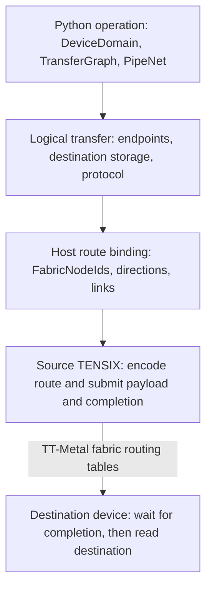

# Pipes on Fabric

This document describes the hardware capabilities, compiler design, software
architecture, implementation, and validation of cross-device PipeNets in
tt-lang. It complements [PipeNets](PipeNets.md), which defines the shared pipe
semantics used by both local NoC and fabric transports.

## System overview



High-level TTL records the logical transfer only. The active TT-Metal control
plane selects the injection connection, host binding supplies the target route
encoding, and device routing tables forward the packet.

## Hardware capabilities

### TENSIX nodes and destination storage

A TENSIX node contains five Baby RISC-V processors, local SRAM, hardware
semaphores, and dataflow buffers (DFBs). Data movement kernels execute on the
node's data movement processors. Compute kernels execute on its compute
processors. A DFB is an L1-resident FIFO used to transfer tiles between those
threads.

Pipe payload storage remains receiver-owned for both local and fabric
transfers. An L1 destination uses a receiver DFB block; the receiver reserves
it before the sender writes. A fabric transfer may instead target a region of
an interleaved DRAM tensor. The receiver reads that region after completion,
and the compiler proves that writes cannot overwrite an unread region. Fabric
routers and packet buffers transport data; they do not provide PipeNet payload
storage.

### On-device NoC and inter-device fabric

The NoC transfers data between nodes and memory controllers on one device. A
NoC unicast address for a local DFB transfer contains the translated
destination node coordinates and the destination L1 address. Existing PipeNet
lowering uses NoC writes and NoC semaphore increments for transfers whose
endpoints are on the same device.

The TT-Metal fabric transfers packets between devices. A fabric packet
contains two distinct destinations:

- a chip route selects the destination device or the sequence of fabric
  routers;
- a NoC command selects the destination L1 address or DRAM page address after
  the packet reaches the destination device.

These destinations must not be conflated. A logical `DeviceRef` determines
which device participates in a transfer. Immediately before submitting a
compiled operation, the host runtime constructs per-device `ProgramDescriptor`
runtime arguments and a `MeshProgramDescriptor`. During this execution-setup
stage, called *host runtime route binding* below, it resolves each logical
device to a `FabricNodeId`, queries the outgoing direction, and asks the
control plane owned by the active `MeshDevice` runtime context to configure an
injection connection. When explicit link assignment is required, binding also
queries the eligible forwarding links. Binding completes before
`ttnn.generic_op(...)` submits the program; it does not execute in a device
kernel. The packet's NoC command is built separately from the destination
address: translated node coordinates and an L1 DFB address for an L1 receive,
or tensor metadata and page coordinates for a DRAM receive.

### Routing-plane connections

Generated data movement kernels use a tt-lang adapter over TT-Metal's direct
`RoutingPlaneConnectionManager` and experimental fabric mux client. Host code
obtains the direct kernel defines from `ttnn.get_fabric_kernel_defines()` and
configures direct runtime arguments with `ttnn.fabric_connection_rt_args()`.
The runtime-argument call:

- selects a forwarding direction and fabric link;
- allocates the connection semaphores in the program descriptor;
- returns the runtime arguments consumed by TT-Metal's
  `tt::tt_fabric::RoutingPlaneConnectionManager::build_from_args()`, which the
  adapter's `open()` reaches through `open_connections()`.

The kernel opens the required connections before sending, obtains the sender
associated with a connection slot, and closes all opened connections before
returning. Connection selection and packet routing are separate operations. A
connection chooses a router injection direction and link. The packet header
still identifies how far or to which device the packet travels.

When concurrent managers cannot receive distinct forwarding links, target
binding may assign eligible managers to a program-local TT-Metal mux. This is a
transport-resource decision; it does not change the PipeNet address,
readiness, capacity, payload, or completion protocol.

| Property | Direct connection | Program-local mux |
| --- | --- | --- |
| Selection | Preferred whenever all concurrent manager requests can be assigned eligible links. | Used only after direct assignment fails and mux assignment satisfies every resource constraint. |
| Eligible manager | Any supported generated or external manager. | A compiler-generated manager with one single-execution runtime lifetime and one connection. Repeated and external manager lifetimes remain direct. |
| Shared clients | One manager owns each assigned injection link during its lifetime. | Managers with the same direction, routing-plane endpoint, and eligible link receive separate mux channels on one shared link. |
| Device objects | One `RoutingPlaneConnectionManager` per generated manager. | One `WorkerToFabricMuxSender` per client and one `tt_fabric_mux.cpp` kernel per mux group. |
| Worker nodes | Uses the application's data movement node. | Uses each client node plus one otherwise unused worker node for the mux kernel. |
| Worker semaphores | Two per direct connection. | Four per client, one shared termination semaphore, and two on the mux node. |
| Packet operations | The client submits the packet directly to the routing-plane sender. | The client submits the same packet through its mux channel; the mux forwards it to the routing-plane endpoint. |
| Completion | PipeNet completion follows payload visibility. | Identical to direct mode. |
| Shutdown | Each manager closes its direct connections. | Clients disconnect; one termination master waits for the other clients, then terminates the mux kernel. |

The device sequences are:

```text
direct client:
  open direct connections
  submit PipeNet packets
  close direct connections

mux group:
  mux node: initialize endpoint and client channels
  each client: connect; submit PipeNet packets; disconnect
  termination master: wait for all disconnects; terminate mux node
```

### Packet routing

Host runtime binding supplies the final physical destination for each logical
transfer. Generated kernels use the route encoding required by the active
fabric mode:

```cpp
#if defined(FABRIC_2D)
tt::tt_fabric::fabric_set_unicast_route(
    packet_header, destination_device_id, destination_mesh_id);
#else
tt::tt_fabric::fabric_set_unicast_route<false>(
    packet_header, destination_hop_count);
#endif
```

TT-Metal initializes routing tables when fabric starts. The 2D form encodes the
destination mesh and device. The 1D form encodes the number of hops along one
forwarding direction. The host validates each 1D hop against the control plane,
connects the manager to the first device, and supplies the final hop count. The
kernel does not reconstruct a topology model or search connection tags.

The selected operation is a target-runtime decision. Neither the fabric mode
nor either route encoding is part of the TTL domain or transfer-graph model.

### Fabric PipeNet synchronization protocol

The compiler selects one of three
[fabric protocols](PipeNets.md#computed-dram-tensor-destinations).
`PipeSynchronizationProtocol::Fabric` implements `CLA/RP` for an L1 DFB or
`CDA/RP` for an interleaved DRAM tensor region. The receiver posts readiness
over the reverse fabric route; the sender waits for it before writing.
`PipeSynchronizationProtocol::FabricNoRendezvous` implements `CDA/NR`: a
point-to-point DRAM transfer whose destination regions are proven disjoint
throughout the invocation. It omits the reverse readiness increment and
sender wait. All three use a remote completion increment and a receiver wait.

| Protocol | Receiver post | Sender | Receiver after completion |
| --- | --- | --- | --- |
| `CLA/RP` | Reserve the L1 DFB block and increment sender readiness. | Wait for readiness; write the computed L1 DFB slot. | Consume and pop the DFB block. |
| `CDA/RP` | Increment sender readiness; no destination DFB reservation. | Wait for readiness; write the computed DRAM tensor region. | Read the region into a local DFB before reusing it. |
| `CDA/NR` | Record the completion sequence; no reverse readiness post. | Write a region proven disjoint from other writes in the invocation. | Read the region after completion. |

Readiness and completion counters are cumulative; lowering does not reset
them between transfer occurrences. TT-Fabric link-level flow control manages
packet transport resources. It does not protect a destination against
overwrite or replace PipeNet completion synchronization. Fabric transfers do
not use the `CA/CC` capacity-counter protocol.

### Payload and completion ordering

For an L1 DFB or one DRAM page, the sender uses a fused payload write and
completion increment. For a multi-page DRAM region, it emits scatter writes
of up to four pages per packet (or a single-page write for the remainder),
then a separate completion increment. These commands use one routing-plane
connection; its ordering makes the payload visible before completion. The
receiver waits for completion before consuming the DFB block or reading the
DRAM region.

The fused command follows TT-Metal's packet lifecycle:

1. Reset and allocate a packet header.
2. Encode the chip route.
3. Encode the destination NoC write and completion increment.
4. Wait for an empty fabric write slot.
5. Submit the payload without the header.
6. Flush the header with a blocking operation.
7. Close the opened connections.

The target runtime reports the maximum fabric payload size. Code generation
must not embed a device-specific limit. Larger L1 PipeNet payloads require
target-aware packetization, with completion after the payload packets. DRAM
tensor regions use the page-based writes described above.

### Physical and logical device arrangements

A `DeviceDomain` defines a logical product index space. Component coordinates
are concatenated in component declaration order to produce a flattened tuple.
For example:

```python
devices = ttl.DeviceDomain.product(host=(2,), device=(4,))
```

maps `DeviceRef((host,), (device,))` to the tuple `(host, device)`. Component
names document logical roles; they do not select a host, chip, link, or fabric
axis.

For each materialized logical device, tt-lang currently performs this
logical-to-TTNN placement conversion:

1. Resolve the `DeviceRef` components in `DeviceDomain` declaration order.
2. Concatenate every component's axes into one integer tuple.
3. Construct a TTNN `MeshCoordinate` with that same tuple.

There is no coordinate permutation, offset, or placement lookup. The same
tuple selects the entry in the `MeshProgramDescriptor` and is passed to the
compiled device-role predicates. This document calls that conversion the
*coordinate-preserving placement*. It preserves the coordinate tuple only; it
does not establish physical-device identity or topology.

There is no rank adaptation. The flattened logical rank must equal the active
`MeshDevice` rank: tt-lang does not add, remove, combine, or split axes. When no
placement is specified, every logical coordinate is materialized and the
flattened domain extent must fit inside the active mesh. If the operation has
mesh tensors, their mesh extent must equal the flattened domain extent.
Explicit `mesh_program_placements` may select a subset inside the logical
domain, tensor mesh, and active mesh, but they do not remap coordinates. Every
PipeNet endpoint must remain covered. Incompatible ranks or selected
coordinates are rejected before program descriptors are constructed.

For the product domain above, the mapping stages are:

| Logical value | Flattened coordinate | TTNN placement | Physical identity |
| --- | --- | --- | --- |
| `DeviceRef(host=0, device=3)` | `(0, 3)` | `MeshCoordinate(0, 3)` | `mesh_device.get_fabric_node_id(MeshCoordinate(0, 3))` |
| `DeviceRef(host=1, device=0)` | `(1, 0)` | `MeshCoordinate(1, 0)` | `mesh_device.get_fabric_node_id(MeshCoordinate(1, 0))` |

tt-lang determines the first three columns through the coordinate-preserving
placement defined above. The active `MeshDevice` resolves the last column;
tt-lang does not derive a `mesh_id`, `chip_id`, adjacency, or distance from
`(host, device)`.

TTNN then maps each `MeshCoordinate` to a `FabricNodeId` with
`MeshDevice.get_fabric_node_id()`. This is where the logical mesh arrangement
first acquires a physical fabric identity. A `FabricNodeId::chip_id` is an
identifier within its physical mesh, not a distance or adjacency relation.

TTL currently has no user-facing placement contract that associates a logical
axis with a physical fabric axis or requires adjacent `DeviceDomain`
coordinates to map to adjacent `FabricNodeId` values. The
coordinate-preserving placement does not preserve adjacency. `axis_neighbor`
relations and stencil offsets therefore identify logical neighbors; they do
not guarantee a one-hop physical connection. `mesh_program_placements` only
restricts which logical coordinates execute and cannot remap them or impose an
adjacency constraint. Runtime route binding checks whether the selected fabric
mode can configure each resolved route, but that check is not a user-controlled
logical-to-physical placement guarantee.

A future language extension could support algorithms that intentionally
program the physical mesh. It would explicitly bind each logical `DeviceRef`
to a `MeshCoordinate` and express physical-axis or adjacency requirements for
the target to validate. That placement contract would remain separate from
the logical communication relation stored by `TransferGraph`. Direct physical
placement would make a program depend on a target topology and mesh extent,
reducing portability and automatic scaling. It should therefore be an optional
target-specific facility; topology-independent programs should continue to use
logical domains and let runtime binding select physical routes.

Route resolution depends on the active fabric mode:

- In 2D mode, host binding resolves only the source and final destination
  `FabricNodeId` values. TT-Metal's routing tables select all intermediate
  forwarding decisions.
- In 1D mode, the source and destination must differ along exactly one logical
  mesh axis. Host binding enumerates every intervening logical coordinate,
  maps each coordinate to a `FabricNodeId`, and requires every consecutive hop
  to use the same forwarding direction. In 1D ring mode, host binding routes
  over the ring's closing link only when the control plane lists the two ends
  of the axis as direct neighbors and the route over that link takes fewer
  hops; otherwise, including ties, it keeps the direction along the axis
  order. `FABRIC_1D_RING` does not guarantee that link, and 1D connection
  setup accepts only a direct neighbor. External fabric connection
  requirements follow the same rule, so an external manager must connect in
  the direction it selects.
  Neighbor-exchange mode additionally requires exactly one logical hop. The
  generated packet encodes the validated hop count and opens its connection
  toward the first mapped hop.

For example, in 1D mode a transfer from `(0, 0)` to `(0, 3)` enumerates
`(0, 0)`, `(0, 1)`, `(0, 2)`, and `(0, 3)`. The runtime maps all four
coordinates to physical node ids, validates that the three hops use one
forwarding direction, opens the connection toward the node for `(0, 1)`, and
encodes hop count three. On a four-device axis in 1D ring mode whose ends
are direct neighbors, the same transfer enumerates `(0, 0)` and `(0, 3)`,
opens the connection toward `(0, 3)` over the closing link, and encodes hop
count one.
A 1D transfer from `(0, 3)` to `(1, 0)` is rejected because two logical axes
differ. In 2D mode, that pair is legal when TT-Metal can route between the two
resolved `FabricNodeId` values; TT-Metal's routing tables select intermediate
routers.

The coordinate-preserving placement is an implementation restriction, not a
`DeviceDomain` invariant. Supporting arbitrary placement requires an explicit
mapping from each logical `DeviceRef` to a `MeshCoordinate`; inferring topology
from component names or coordinate differences would be incorrect.

## Design

### Design goals

Fabric pipes extend PipeNet communication across devices without making the
TTL programming model depend on a current Tenstorrent system topology. The
design has the following invariants:

- `DeviceDomain`, `DeviceRef`, and `TransferGraph` contain no
  fabric mode, physical mesh identifier, route direction, link index, packet
  limit, or NoC selection.
- `DeviceRef` identifies a logical member of a `DeviceDomain`. It is not a
  physical device identifier.
- PipeNet protocol planning is shared by local NoC and fabric transports.
- PipeNet identifiers preserve semantic identity and never select physical
  semaphore ids or runtime-argument indices.
- Host runtime route binding resolves logical devices, physical routes,
  transport limits, and connection metadata while constructing program
  descriptors before submission.
- Runtime communication state scales with local live degree and queue depth,
  not the total domain or transfer-graph size.
- Source programs and high-level TTL IR remain valid when a target uses a
  different topology or routing API.

### Programming model

`DeviceDomain` is a logical index set of devices. It follows the separation
used by Chapel domains and locales: the domain defines membership, while a
target-specific mapping determines physical placement.

`DeviceRef` identifies one member of a device domain. `TransferGraph`
describes the logical communication relation. `PipeNet` applies the existing
pipe protocol to that relation.

An explicit `TransferGraph.edges(...)` relation enumerates arbitrary directed
logical-device pairs. It is appropriate for sparse or irregular connectivity
that has no structured constructor. Here, *explicit* refers only to logical
connectivity: it does not specify physical placement, links, or forwarding
routers. Regular axis-neighbor, stencil, gather, scatter, and all-to-all
relations use compact parameter-based forms so storage does not grow with the
number of derived edges.

`DeviceDomain.current_index()` returns the zero-based row-major order of the
current logical device. Pipe callback identities expose source and destination
indices using the same ordering. These indices support distributed tensor
offsets without exposing physical device identifiers or route coordinates.

For example, a point-to-point transfer graph records only its logical edge:

```python
devices = ttl.DeviceDomain((1, 4))
transfers = ttl.TransferGraph.edges(
    devices,
    edges=[((0, 0), (0, 3))],
)
net = ttl.PipeNet(graph=transfers)
```

Graph-only construction applies the transfer relation to every launch node. For
example, in an operation with a `(2, 2)` launch grid, the graph above describes
these four transfers:

```text
device (0, 0), node (0, 0) -> device (0, 3), node (0, 0)
device (0, 0), node (1, 0) -> device (0, 3), node (1, 0)
device (0, 0), node (0, 1) -> device (0, 3), node (0, 1)
device (0, 0), node (1, 1) -> device (0, 3), node (1, 1)
```

Each transfer uses the same node coordinate on its source and destination
device. A transfer between distinct node coordinates declares the node
relation separately:

```python
net = ttl.PipeNet(
    graph=transfers,
    pipes=[ttl.Pipe(src=(1, 0), dst=(0, 0))],
)
```

Each transfer is `(source device, source node) ->
(destination device, destination node)`. Device-indexed `ttl.Pipe` endpoints
allow one `PipeNet` to contain different device and node relations without a
separate public association type. PipeNet guards restrict which declared
endpoints execute protocol operations; they do not infer or modify the
relation.

The graph does not state whether the target uses a line, ring, torus, mesh, or
another interconnect. It also does not require `(0, 0)` and `(0, 3)` to be one
hardware packet apart.

`TransferGraph` supports explicit edge lists and parameter-based axis-neighbor,
stencil, gather, scatter, and all-to-all relations. Additional common relations
should describe communication semantics without adding target topology fields.

### Shared pipe protocol

Local and fabric transfers use the same logical ordering requirements. The
receiver owns the destination storage. The sender writes only after a receiver
post, a proven capacity credit, or proof that its DRAM destination is disjoint
and cannot be reused during the invocation. The receiver observes completion
before reading the payload. PipeNet guards restrict endpoint roles. DFB
lifetimes remain visible to shared compiler analyses when the destination is
a DFB.

The transport emitter maps that protocol onto either NoC or fabric
operations. It does not redefine PipeNet semantics.

### Synchronization storage

The resource planner selects synchronization storage independently from
PipeNet identity. Local transfers use densely allocated hardware semaphore ids
when every access remains on one device. A completion counter targeted by a
fabric atomic uses a host-created `GlobalSemaphore`; a local semaphore id
cannot identify an object on another device.

`GlobalSemaphore` provides a common L1 address on the selected TENSIX nodes of
every device. The sender receives that address as a common runtime argument and
combines it with the destination node coordinates to form the remote NoC
address. The receiver uses the same runtime argument as the local address for
its completion wait. Route metadata and synchronization storage are therefore
independent: changing the selected route does not change PipeNet semantics or
counter identity.

### Late route planning

The compiler does not infer or create physical routes from logical device
coordinates. Host runtime binding accepts only source and destination pairs
that the active TT-Metal control plane can route. The current implementation:

- resolves logical endpoints to `FabricNodeId` values;
- queries the outgoing direction along each resolved route and, when the
  target exposes link enumeration, the eligible injection links for its
  connection target;
- reuses one injection connection for destinations with the same direction
  and a common forwarding link;
- first assigns direct links by manager lifetime, allowing a proven
  receiver/sender ownership pair to reuse a link while requiring interfering
  direct managers to use distinct links;
- if direct assignment fails, retains non-multiplexable managers on distinct
  links and distributes eligible single-execution managers across
  program-local mux groups;
- supplies final destination identifiers for 2D routing or a validated hop
  count for 1D routing.

Together, the compiler's fabric route and Pipe module plans record logical
route indices, source and destination TENSIX nodes, L1 address formulas,
payload constraints, and synchronization objects. Host binding maps each
logical route index to a connection slot and final physical target. Neither
plan infers topology from a `DeviceDomain`.

A future route optimizer belongs in this late planner. When the control plane
exposes multiple legal routes or links, the planner can reject candidates that
the selected packet format cannot encode, score the remaining candidates by
hop count, link availability, estimated contention, and connection reuse, and
cache the selected plan for the mesh and fabric configuration. A target that
cannot encode a legal route in one packet may materialize explicit forwarding
after logical transfer analysis; that is not required by the current
destination-routed TT-Metal transport.

### Collective communication

Collectives are transfer relations plus local computation. They should reuse
the same route resolver and fabric transport emitter instead of implementing
an unrelated communication subsystem.

The fabric pytest suite is intended to cover:

- point-to-point;
- broadcast;
- reduce-to-root;
- all-gather;
- reduce-scatter;
- all-reduce;
- all-to-all.

Each collective may select a target-specific algorithm after the logical
relation is known. Ring, tree, and direct-exchange algorithms are lowering
strategies, not high-level domain properties.

## Software architecture

### Compilation flow

Cross-device pipe processing has separate compilation and execution-setup
stages:

```text
Compilation:
Python DeviceDomain, DeviceRef, TransferGraph, and PipeNet
  -> TTL device-domain and transfer attributes
  -> Pipe Transfer IR and shared PipeNet resource planning
  -> logical fabric-route records attached to generated kernels
  -> TTKernel routing-plane operations
  -> EmitC calls into tt::tt_fabric

Host execution setup for each invocation:
compiled kernel route records + active MeshDevice
  -> host runtime route binding
  -> FabricNodeId and MeshDevice-scoped forwarding-direction queries
  -> direct-link selection or program-local mux construction
  -> control-plane connection setup
  -> per-device ProgramDescriptor runtime arguments
  -> MeshProgramDescriptor construction
  -> TTNN MeshProgramDescriptor execution
```

Logical transfer analysis remains independent of physical topology. Concrete
fabric configuration, connection selection, and final physical destinations
first enter during host runtime route binding, after kernel generation and
before `ttnn.generic_op(...)` submission. Generated kernels consume those
values as runtime arguments.

### Logical-to-physical binding timeline

The compiler preserves logical coordinates through Pipe lowering. Host
execution setup performs placement and physical binding:

```text
Compilation                              Host execution setup                         Device

DeviceRef -> DeviceRefAttr -> ttl.fabric_routes -> (1, 0) -> MeshCoordinate(1, 0)
 logical      logical          logical              logical    placement key
                                                              |
                                               active MeshDevice.get_fabric_node_id()
                                                              |
                                                              v
                              packet route <- route args <- FabricNodeId(mesh, chip)
                              target-specific             physical identity
```

For `DeviceRef(host=1, device=0)`, the stages are:

1. Frontend lowering creates a `DeviceRefAttr` containing component
   coordinates `((1,), (0,))`.
2. `PipeLowering.cpp` classifies the transfer as cross-device and attaches a
   `ttl.fabric_routes` entry to each affected kernel function. The entry stores
   logical `local` and `remote` `DeviceRefAttr` values, a stable route index,
   and source TENSIX nodes. It contains no physical identifier or route.
3. Artifact extraction concatenates the component coordinates in declaration
   order. The corresponding `FabricRouteSpec` contains the tuple `(1, 0)`.
4. `kernel_runner.py` creates the per-device descriptor at
   `MeshCoordinate(1, 0)`. It also passes `(1, 0)` separately as the logical
   coordinates consumed by compiled device-role predicates.
5. `fabric_target.py` calls
   `mesh_device.get_fabric_node_id(MeshCoordinate(1, 0))`. The returned
   `FabricNodeId(mesh_id, chip_id)` is the first physical device identity in
   this sequence; it is obtained from the active mesh, not calculated from the
   integers `1` and `0`.
6. Host binding queries forwarding information and fills the connection slot,
   destination device id, destination mesh id, and 1D hop-count tables. The
   generated kernel reads those tables to encode the packet route.

Keeping the two representations separate is intentional. Logical PipeNet IR
is independent of the machine that executes it, while topology, fabric mode,
and available links are properties of the active runtime context. The
separation also provides one explicit insertion point for a future compiler or
host placement planner: it can replace the current coordinate-preserving
conversion with a mapping from each logical `DeviceRef` to a
`MeshCoordinate`. Such a planner could preserve selected neighbor relations,
reduce hop count or contention, and account for unavailable devices without
changing the source-level transfer graph or TTL IR. Descriptor placement would
use the mapped physical coordinate, while device-role predicates would
continue to receive the original logical coordinate.

Embedding physical coordinates directly in portable source would bypass that
optimization point and make programs dependent on one mesh rank, extent, and
topology. A future direct-physical placement facility should therefore remain
explicit and target-specific.

### Frontend and TTL IR

The Python domain model is implemented in `python/ttl/domains.py`. The AST
lowering in `python/ttl/_src/ttl_ast.py` converts logical domain members and
transfer edges into TTL attributes.

The TTL dialect defines:

- `DeviceDomainComponentAttr` for one named logical index-space component;
- `DeviceDomainAttr` for a product of components;
- `DeviceRefAttr` for logical coordinates within that domain;
- `DeviceRangeAttr` for a logical device range;
- `TransferEdgeAttr` for one logical transfer relation;
- `DeviceTransferAttr` for binding a logical device edge to a node-level
  pipe;
- `TransferGraphAttr` for explicit edge lists or parameter-based
  logical-device relations;
- `PipeMappingAttr` for one device graph and its list of node Pipes; every
  graph edge is combined with every listed Pipe;
- `PipeNetRecordsAttr` for a local record list or an ordered list of graph
  mappings;
- `CurrentDeviceIndexOp` for the current member's row-major logical index.

These attributes contain no target route fields. Their verifiers check domain
membership, coordinate rank, and transfer structure.

A graph PipeNet lowers to one `PipeNetRecordsAttr` containing its mappings and
one callback region for each source or destination role. The callback receives
one selected transfer with node coordinates and logical device indices. Graphs
created with `axis_neighbor`, `stencil`, `gather`, `scatter`, or `all_to_all`
calculate endpoints from their stored parameters. An explicit graph compares
the current device index with the declared edge endpoints; its generated IR
scales with the number of declared edges rather than the complete domain.
Each device iterates only edges for which it is the source or destination.
Every transfer has a stable index used to select its resource-table entries.
Core specialization removes node-coordinate table columns whose value is
constant on that core. The frontend and TTL IR do not store a separate record
for every combination of device edge and node Pipe.

One compiled operation fixes its logical domain extents. A Python function may
accept domain extents and construct the corresponding graph for each supported
device count. Transfer graphs remain logical; host target binding resolves
physical placement, routes, and forwarding links.

### Pipe lowering

`lib/Dialect/TTL/Transforms/PipeLowering.cpp` first classifies every concrete
`DeviceTransferAttr`. A transfer whose source and destination devices are equal
uses the NoC transport. A cross-device transfer uses the fabric transport; its
sender and receiver-post sides each record the current logical device, remote
logical device, local injection TENSIX node, and owning function.

The resulting `ttl.fabric_routes` function attribute is deliberately logical.
Each dictionary entry contains `local` and `remote` `DeviceRefAttr` values,
`route_index`, and `source_nodes`. `PipeLowering` neither constructs a
`MeshCoordinate` nor queries topology. Python artifact extraction later
flattens the two device references into `FabricRouteSpec` tuples; physical
resolution still waits until host execution setup.

Before record-loop materialization, lowering builds immutable plans for every
graph callback. It then materializes those loops and expands high-level copies
into explicit transfer operations. From that stable transfer IR, it constructs
and validates a module-wide fabric plan before applying fabric metadata or
emitting TTKernel transport operations. Within each function it deduplicates
equal logical routes and assigns stable route indices.
Route indices address four aligned runtime tables: connection slot,
destination device id, destination mesh id, and 1D hop count. The selected
PipeNet record retains its concrete `PipeRecordAttr` during traversal, so later
queries reuse that record instead of expanding the complete transfer graph
again.

Manager lifetime analysis groups fabric operations into scoped intervals.
Lowering records which routes each interval uses, which generated receiver and
sender intervals may transfer ownership sequentially, and which intervals may
execute concurrently. It verifies matching locations, routes, and statically
bounded invocation counts before permitting ownership transfer. All remaining
interval pairs interfere. This interval plan is serialized as kernel metadata;
host binding uses it to assign forwarding links without mutating compiler IR.

After the complete plan is valid, lowering creates the routing-plane manager
operations and applies their route indices. Separate send and receiver-post
transport interfaces keep PipeNet protocol planning independent of transport
emission:

- Same-device receiver posts publish or compute a NoC destination and use
  local synchronization resources.
- `CLA/RP` and `CDA/RP` receiver posts send a reverse-route fabric atomic
  that publishes readiness. `CDA/NR` omits this atomic after the disjoint
  destination proof.
- The cross-device sender computes an L1 DFB slot address or DRAM tensor page
  addresses. It waits for readiness under `CLA/RP` and `CDA/RP`, then emits
  a fused write and completion for one destination page or ordered writes and
  a separate completion increment for multiple DRAM pages.
- The receiver waits on its local completion counter before consuming the L1
  DFB block or reading the DRAM tensor region.

The resource planner resolves every synchronization counter to an L1 address
before transport emission. Transport code consumes that address and never
interprets a PipeNet id as a semaphore id. Each cross-device transfer uses a
completion counter from the global semaphore namespace. Same-device completion
counters use dense local ids unless the selected allocation policy requires
global storage. If any sender-ready counter uses fabric, all ready-counter
colors use global storage so one color has one storage kind on every source
node. Proven receiver/sender manager ownership uses a separate local semaphore
and generation protocol.

Fabric lowering requires computed receiver addresses. For an L1 destination,
the sender receives the DFB base from host runtime arguments and builds the
remote NoC address from the destination node coordinates. For a DRAM
destination, it computes page addresses from tensor metadata and destination
coordinates. The receiver-published address-table mechanism is limited to the
NoC transport. After packet injection, TT-Metal fabric routers perform all
intermediate forwarding; lowering does not generate programs for intermediate
devices.

### TTKernel representation

TTKernel operations represent the routing-plane manager lifecycle and packet
submission:

- create a `RoutingPlaneConnectionManager` value;
- open connections from a runtime argument block;
- submit a remote atomic increment;
- submit a fused payload write and remote atomic increment, or DRAM page
  writes followed by a remote atomic increment;
- close the opened connections.

The send operations take a connection index, destination device id,
destination mesh id, and destination hop count. The connection index selects
the injection slot. The active target configuration selects the applicable
route encoding.

### EmitC and generated C++

`lib/Conversion/TTKernelToEmitC/TTKernelToEmitC.cpp` lowers routing-plane
operations to a generated adapter that dispatches to the direct manager or mux
client from runtime arguments. The following shows the fused L1 or one-page
DRAM path; multi-page DRAM uses scatter writes and a separate completion
increment. Route encoding is common to both modes:

```cpp
experimental::RoutingPlaneConnectionManager connection_manager;
auto route_id = connection_manager.open(connection_count, runtime_arg_base);

auto* packet_header = connection_manager.packetHeader(
    route_id, connection_slot);
#if defined(FABRIC_2D)
tt::tt_fabric::fabric_set_unicast_route(
    packet_header, destination_device_id, destination_mesh_id);
#else
tt::tt_fabric::fabric_set_unicast_route<false>(
    packet_header, destination_hop_count);
#endif

packet_header->to_noc_fused_unicast_write_atomic_inc(...);
connection_manager.waitForEmptyWriteSlot(connection_slot);
connection_manager.sendPayloadWithoutHeaderNonBlockingFromAddress(...);
connection_manager.sendPayloadFlushBlockingFromAddress(...);

connection_manager.close(connection_count);
```

The destination encoder is selected by TT-Metal's `FABRIC_2D` kernel define.
The high-level TTL program selects neither this condition nor the direct or mux
transport.

### Host runtime route binding

`python/ttl/kernel_runner.py` orchestrates execution setup after compiled
kernel specifications are available and before the invocation calls
`ttnn.generic_op(...)`. It creates one `ProgramDescriptor` per materialized
logical device coordinate and places those descriptors into a
`MeshProgramDescriptor`.

`python/ttl/_src/fabric_target.py` owns target route resolution, complete-plan
validation, and descriptor mutation. For each generated kernel and TENSIX node,
it determines the active logical routes, maps remote coordinates with
`mesh_device.get_fabric_node_id()`, checks direct neighbors before selecting a
shorter 1D ring closing link, queries forwarding directions and eligible links,
and groups destinations by direction. It validates a distinct-link assignment
for all interfering managers first. If that assignment fails and mux is
enabled, it keeps external and repeated-lifetime managers direct and assigns
eligible single-execution managers to shared links. Each mux group requires
one common routing-plane endpoint, one otherwise unused worker node, an
in-bounds private L1 interval, and sufficient client and mux-node semaphores.
`--no-ttl-fabric-mux` disables this fallback. No semaphore, runtime argument,
or program descriptor is modified until the complete plan is valid.

An operation executes on its complete `device_domain` by default. The
`mesh_program_placements` operation option can instead select explicit logical
device coordinates or inclusive `ttl.MeshProgramPlacement` ranges. The host
then materializes descriptors only for those devices. Placement is explicit:
the compiler does not infer it from PipeNet endpoints. A device without a
PipeNet endpoint may still run a tensor copy or computation elsewhere in the
operation. Omitting that device would omit that work. Every graph-based PipeNet
source and destination must be included in the explicit placement. Explicit
placements must use one coordinate rank and their inclusive ranges must not
overlap.

The compiler-managed runtime prefix is:

```text
[
  connection_count,
  route_slot_0, ..., route_slot_N,
  destination_device_id_0, ..., destination_device_id_N,
  destination_mesh_id_0, ..., destination_mesh_id_N,
  destination_hop_count_0, ..., destination_hop_count_N,
  routing_plane_connection_manager_args...
]
```

`route_slot_I` selects the manager connection used by logical route `I`. The
remaining arrays describe its final target. Connection manager arguments begin
at `1 + 4 * N`. Nodes without an active fabric route receive zeroed route
metadata and no connection-manager arguments.

This prefix is private to the tt-lang target runtime and generated TTKernel
code. It is not represented in TTL source attributes.

Compiler-managed global semaphore addresses follow the optional PipeNet SRAM
scratch base in common runtime arguments. They are allocated while constructing
the program descriptor. Direction queries and synchronization allocation do not
execute in a device kernel or once per packet.

## Implementation details

### TT-Metal control-plane APIs

tt-lang uses these TTNN bindings during host runtime route binding:

- `get_eth_forwarding_direction()` validates a source-destination pair and
  returns its outgoing direction;
- `get_forwarding_link_indices()` exposes TT-Metal's existing control-plane
  forwarding-link query to Python;
- `get_chip_neighbors()` lists direct neighbors; 1D ring routing uses it to
  check for a closing link;
- `get_fabric_kernel_defines()` returns the defines required by the active
  direct fabric API;
- `fabric_connection_rt_args()` validates explicit links, allocates direct
  connection resources in a `ProgramDescriptor`, and returns client runtime
  arguments;
- `ttnn.experimental.fabric_mux.Config` and its client helpers compute mux L1
  layout, compile-time arguments, runtime arguments, and descriptor resources.

Each `CompiledTTNNKernel` caches forwarding directions, eligible links, and
direct-neighbor results by source and destination `FabricNodeId`. The cache is
cleared when the mesh object or active fabric configuration changes. The binder
first collects every connection required by one source device. Within a
manager, destinations with the same direction reuse one connection only when
their eligible-link sets intersect. Across managers, the compiler records
ownership intervals and an interference graph. Deterministic graph coloring
permits a proven receiver/sender ownership pair to reuse a forwarding link and
assigns distinct links to all other managers. An external manager may reserve a
fixed link through operation runtime resources; tt-lang validates the
reservation but does not interpret or modify the external manager's runtime
arguments. The complete plan is validated before program descriptors,
semaphores, or runtime arguments are modified. If link enumeration is
unavailable, noninterfering managers may use the control-plane default; a plan
that needs explicit link assignment is rejected.

An external scoped manager call inside structured control flow records its
compiler-proven launch-node domain. Runtime binding resolves each kernel
descriptor independently, verifies that the recorded nodes are contained by
that descriptor, and unions the per-descriptor domains for the claim. An absent
domain means the complete descriptor executes the interval; a present empty
domain means no node executes it. The external binding must cover the resulting
node set exactly.

Each scoped external call releases its manager before returning. Scoped calls
in one RISC function are therefore sequential even when sibling structured
control-flow regions contain them, provided both execute on the same single
launch node. Multiple launch nodes may progress independently, and calls in
different functions may execute concurrently, so those intervals remain
interfering.

The compiler serializes an ordered sequence of generated receiver and sender
manager intervals only when corresponding intervals each contain one protocol
operation, implement the same transfers at the same device and TENSIX node,
use the same routes, and have equal statically bounded loop invocation counts.
PipeNet verification separately proves matching execution counts for every
send and receiver post. Unknown loop counts, mismatched interval sequences, or
generation-count overflow remain interfering and require distinct links.

One compiler-allocated local semaphore transfers ownership across the complete
proven sequence. For a receiver-post transfer, the receiver opens its manager,
publishes readiness, closes the manager before waiting for payload completion,
and publishes the sender generation. The sender then opens its manager, sends
the payload, closes the manager, and publishes the next receiver generation.
Repeated or multi-interval sequences derive generations from a kernel-local
invocation ordinal that advances only when an interval executes. This
preserves the sequence when a conditional skips an interval. One single-shot
interval uses
constant generations and requires no ordinal. Program submission reinitializes
compiler-managed semaphores, including when a cached program descriptor is
reused. Global-semaphore-only compilation does not allocate this local
ownership semaphore, so every manager remains interfering in that mode.

Connection and mux setup still run for each constructed program descriptor
because their semaphores and runtime arguments are invocation resources. The
complete direct-or-mux plan validates defines, worker placement, L1 use, and
semaphore capacity before modifying the program descriptor. Runtime argument
and semaphore allocation uses a staging descriptor so an allocation or ABI
error does not partially modify the program descriptor. The cached direction
query and setup run on the host before submission. No control-plane query runs
in a device kernel or once per packet.

Generated kernels pass final destination identifiers for 2D routing or a
validated hop count for 1D routing. This keeps forwarding decisions in TT-Metal
without adding a tt-lang-specific public route API or inferring physical routes
from node-number differences.

### Destination-routed transport behavior

Generated C++ uses the routing-plane manager, packet pool, target route
encoder, sender submission sequence, completion wait, and connection closure.
It uses a fused write and atomic command for L1 destinations and one-page DRAM
regions. Multi-page DRAM regions use page writes and an ordered completion
atomic. Fabric routers forward packets according to the TT-Metal routing
tables; intermediate TENSIX programs are not part of the current transport.

### Validation requirements

Fabric changes require both a quick multi-device hardware check and a
representative full-system run. The full-system run uses the complete
discovered mesh and exercises the full fabric pytest suite. The smaller-system
run shortens the edit-test cycle but is not sufficient evidence of correctness.

The collective suite derives its domain from the control-plane mesh extent and
requests mesh routing so arbitrary physical turns remain one packet route.
Dedicated route tests request mesh, torus-X, torus-Y, and torus-XY modes. The
torus cases send across each configured boundary and require every tested
extent to exceed two, because a two-device extent cannot distinguish a wrap
link from its ordinary neighbor link. The bidirectional exchange test covers
that extent-two relation separately. A dedicated Galaxy CI fabric phase exposes
the complete discovered mesh so these cases exercise the system topology.
Target selection occurs when opening the runtime mesh, not in TTL domain or
transfer attributes.

Validation also includes the complete existing `test/python/pipe` suite and
the affected MLIR tests. A source-level C++ match or a smaller-system hardware
pass does not establish correctness without the full-system result.

### Remaining capability work

The current implementation supports coordinate-preserving logical-to-TTNN
direct connections when concurrent requests fit the available forwarding
links and a program-local mux when eligible single-execution managers exceed
that direct capacity. It validates the complete target-binding plan before
modifying program descriptors and rejects unsupported resource schedules.
General fabric support still requires:

- a language-level physical-mesh placement facility that binds each logical
  `DeviceRef` to a `MeshCoordinate` and validates requested adjacency;
- target-level router aggregation and connection reuse beyond the compiler's
  per-node manager intervals, including any transport-specific barriers;
- mux use by repeated manager lifetimes, with explicit lifetime and shutdown
  proofs;
- tt-lang lowering and runtime binding for graph transfers with device-range
  destinations using TT-Metal fabric multicast;
- a receiver-address publication protocol for schedules that cannot prove
  computed receiver addresses.

### Remaining optimization and validation work

- Jointly score legal routes and links by hop count, availability, estimated
  contention, direct connection reuse, mux cost, and shutdown cost.
- Measure destination-table decoding, host connection setup, connection reuse,
  mux forwarding, packetization, and worker placement against specialized
  communication kernels.
