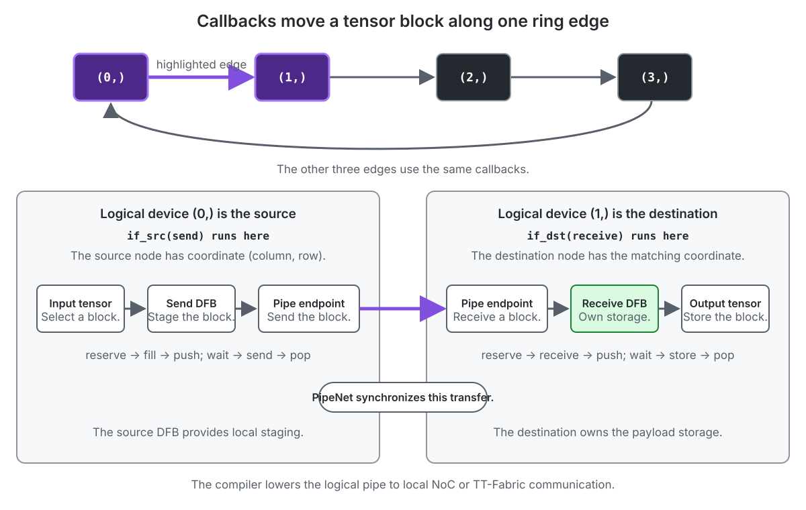
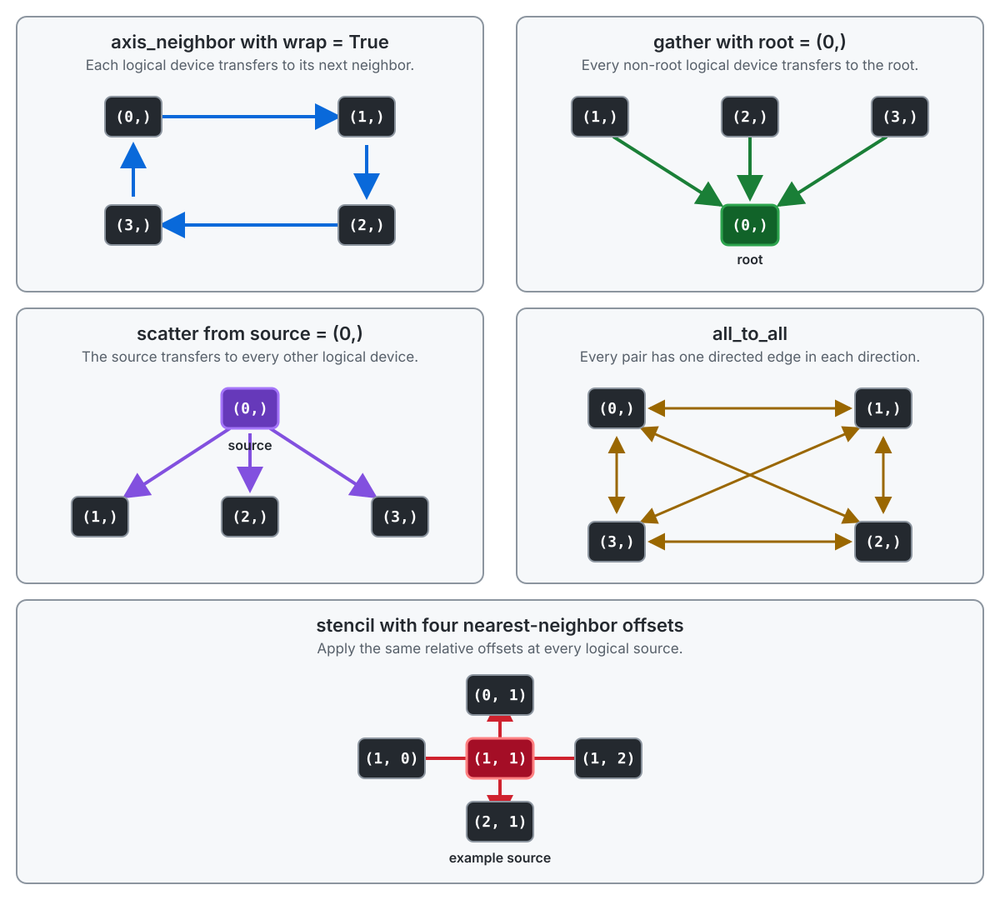
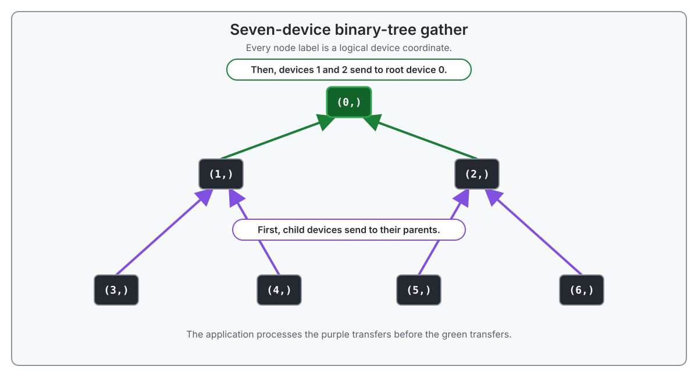
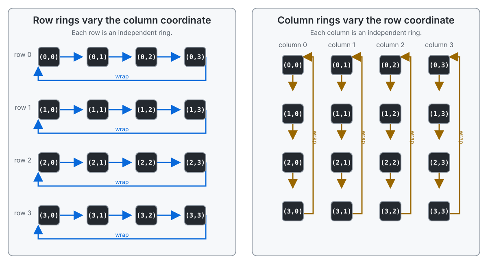

# Multi-Device Communication with TT-Lang Pipes

TT-Lang pipes define communication between nodes. A *node* is a worker core.
A `PipeNet` applies the same pipe protocol to transfers within one device or
across several logical devices. Application code names logical devices and
transfers, not physical devices, fabric coordinates, or routes.

## The Goal

This tutorial constructs parameterized rings and grouped communication
relations without encoding physical placement or routes.

## Contents

<ul>
  <li>
    <a href="#running-an-operation-on-several-devices">Running an Operation on Several Devices</a>
    <ul>
      <li><a href="#logical-device-coordinates">Logical Device Coordinates</a></li>
      <li><a href="#referring-to-one-logical-device">Referring to One Logical Device</a></li>
      <li><a href="#specifying-device-communication">Specifying Device Communication</a></li>
      <li><a href="#synchronizing-transfers-with-pipenet">Synchronizing Transfers with PipeNet</a></li>
      <li><a href="#moving-a-tensor-block-through-a-ring">Moving a Tensor Block Through a Ring</a></li>
    </ul>
  </li>
  <li>
    <a href="#applying-communication-patterns">Applying Communication Patterns</a>
    <ul>
      <li><a href="#choosing-a-structured-transfer">Choosing a Structured Transfer</a></li>
      <li><a href="#a-binary-tree-gather-for-any-device-count">A Binary-Tree Gather for Any Device Count</a></li>
      <li><a href="#row-and-column-rings">Row and Column Rings</a></li>
      <li><a href="#repeating-a-ring-within-each-replica">Repeating a Ring Within Each Replica</a></li>
      <li><a href="#a-two-stage-all-gather">A Two-Stage All-Gather</a></li>
      <li><a href="#an-expert-exchange-within-each-replica">An Expert Exchange Within Each Replica</a></li>
    </ul>
  </li>
  <li><a href="#how-tt-lang-selects-noc-or-tt-fabric">How TT-Lang Selects NoC or TT-Fabric</a></li>
  <li><a href="#current-api-support">Current API Support</a></li>
</ul>

## Running an Operation on Several Devices

An operation selects devices and nodes separately:

- `device_domain` selects the logical devices that participate.
- `grid` selects the nodes that execute on each participating device.

`device_domain` is optional. When it is omitted, tensor placement determines
where the operation executes. An operation that uses logical device coordinates
or cross-device communication declares one `DeviceDomain`. For now,
`@ttl.operation` accepts at most one `device_domain`.

For example, this operation selects four logical devices. `grid="full"` selects
the full available worker-node grid for the compiled operation and applies that
grid on every participating device:

```python
device_domain = ttl.DeviceDomain((4,))


@ttl.operation(grid="full", device_domain=device_domain)
def distributed_operation(inp, out):
    @ttl.compute()
    def compute():
        pass
```

The two selections are independent. Changing `grid` changes the nodes on each
device. Changing the `DeviceDomain` extent changes the participating logical
devices.

### Logical Device Coordinates

A `DeviceDomain` is an N-dimensional logical index set. Each element identifies
one logical device. Its extent tuple has one entry per dimension. For example,
`DeviceDomain((4,))` is one-dimensional and contains `(0,)`, `(1,)`, `(2,)`,
and `(3,)`. `DeviceDomain((2, 3, 4))` is three-dimensional and contains 24
logical devices.

```python
device_count = 4
device_domain = ttl.DeviceDomain((device_count,))
```

These coordinates are not physical chip IDs, fabric coordinates, links, routes,
or NoC coordinates. The extent determines the logical devices and their
row-major order.

> **&#10067; How does a DeviceDomain coordinate map to a physical device?**
>
> A `MeshDevice` is TT-Metal's runtime representation of an active device mesh.
> The current runtime concatenates the extents of the `DeviceDomain` components
> and requires the mesh tensor to have that same extent. It associates each
> logical coordinate tuple with the same coordinate in the active `MeshDevice`.
> Application code specifies neither a physical chip ID nor a route. See
> [Host runtime route binding](https://github.com/tenstorrent/tt-lang/blob/bnorris/pipes-multidevice-integrated-poc/docs/development/PipesOnFabric.md#host-runtime-route-binding)
> in the Pipes on Fabric design document for the program-descriptor and
> route-binding sequence.

### Referring to One Logical Device

A `DeviceRef` identifies one logical device in a `DeviceDomain`. An
N-dimensional regular domain uses an N-dimensional coordinate:

```python
root_device = ttl.DeviceRef(0)
volume_device = ttl.DeviceRef((1, 2, 3))
```

`DeviceDomain.product(...)` combines any number of independent named index
sets. Each extent tuple may have any positive rank. The total logical rank is
the sum of their ranks. The following example deliberately uses two
one-dimensional index sets to model a two-dimensional logical mesh.
`row=(2,)` provides row coordinates 0 and 1, while `column=(3,)` provides
column coordinates 0, 1, and 2:

```python
grouped_domain = ttl.DeviceDomain.product(
    row=(2,),
    column=(3,),
)
grouped_device = ttl.DeviceRef(row=1, column=2)
```

| | column 0 | column 1 | column 2 |
| --- | --- | --- | --- |
| row 0 | `(0, 0)` | `(0, 1)` | `(0, 2)` |
| row 1 | `(1, 0)` | `(1, 1)` | `(1, 2)` |

The domain therefore contains six logical devices. Fixing a row coordinate and
varying the column coordinate selects a row group. Fixing a column coordinate
and varying the row coordinate selects a column group.

`grouped_device` identifies logical row 1 and logical column 2. It does not
identify a physical device.

The API calls each named index set a *component*. It does not restrict a
product domain to `row` and `column` or to one-dimensional components. For
example, this domain has three named components and four coordinate axes:

```python
higher_rank_domain = ttl.DeviceDomain.product(
    replica_grid=(2, 2),
    expert=(4,),
    pipeline=(3,),
)
higher_rank_device = ttl.DeviceRef(
    replica_grid=(1, 0),
    expert=3,
    pipeline=2,
)
```

> **&#10067; Can kernel code query its physical device and branch on it?**
>
> The user API does not expose a physical device ID. Kernel code can branch on
> logical membership with `DeviceDomain.is_current()` and obtain the current
> row-major logical index with `DeviceDomain.current_index()`:
>
> ```python
> if device_domain.is_current((0,)):
>     # Execute work assigned to logical device 0.
>     pass
>
> logical_device_index = device_domain.current_index()
> ```
>
> `is_current()` accepts a static logical device reference and can be used as
> an `if` condition. Neither operation reveals physical placement.

### Specifying Device Communication

A `TransferGraph` defines a directed communication relation over a
`DeviceDomain`. Each edge names a logical source and destination. The graph
does not define payload storage or synchronization.

Separating the relation from pipe semantics records every edge in one logical
coordinate system without selecting a transport. A ring, tree, gather, scatter,
or all-to-all relation answers which logical devices communicate. It does not
specify how the receiver stores the payload or how source and destination
synchronize. Structured forms also allow a domain extent to change without
enumerating a new edge list in application source.

Explicit edges describe an exact relation:

```python
device_domain = ttl.DeviceDomain((4,))
transfer_graph = ttl.TransferGraph.edges(
    device_domain,
    edges=[
        ((1,), (0,)),
        ((3,), (2,)),
    ],
)
```

> **&#10067; Why describe the operation's devices separately from its
> transfers?**
>
> An operation can use several communication relations over the same devices,
> and a device can execute computation without participating in every
> relation. `DeviceDomain` states the operation's logical device membership
> once. Each `TransferGraph` then states which logical devices communicate in
> one relation.

### Synchronizing Transfers with PipeNet

A `PipeNet` applies pipe synchronization and ownership rules to a
`TransferGraph`:

```python
transfer_net = ttl.PipeNet(graph=transfer_graph)
```

The destination owns the dataflow buffer (DFB) storage for the received
payload. Source and destination callbacks reserve, transfer, wait for, and
release DFB blocks according to the PipeNet protocol. `if_src()` executes a
callback for logical source roles. `if_dst()` executes a callback for logical
destination roles.

The transfer relation and the protocol remain separate:

- `TransferGraph` states which logical devices communicate.
- `PipeNet` defines their source and destination roles, synchronization,
  completion, and receiver-owned storage.

These static declarations also provide inputs to compiler verification. The
compiler checks role predicates, matching transfer counts, dataflow-buffer
producer and consumer coverage, and wait-for cycles. Rejecting an invalid
protocol before execution prevents these errors from appearing as device
deadlocks or hangs. See [PipeNet semantics and diagnostics](https://github.com/tenstorrent/tt-lang/blob/main/docs/development/PipeNets.md#semantics)
for the current checks and their limits.

The complete programming model separates four roles:

| Role | Abstraction |
| --- | --- |
| Define the logical devices that participate. | `DeviceDomain` |
| Define which logical devices communicate. | `TransferGraph` |
| Synchronize sources and destinations and manage payload storage. | `PipeNet` |
| Select the physical mapping and transport, including supported route optimization. | Compiler and runtime |

> **&#10067; Why not put the device list and fabric transfers directly in a
> PipeNet?**
>
> `PipeNet` is not a fabric-only abstraction. The same ownership and
> synchronization protocol applies among nodes on one device, across devices,
> and across logical mesh groups. `DeviceDomain` and `TransferGraph` provide
> the logical endpoints. The compiler and runtime then select the PipeNet data
> transport: local NoC for same-device transfers or TT-Fabric for cross-device
> transfers. They bind physical endpoints. Keeping these decisions separate
> also permits target-specific mapping and route optimization.

### Moving a Tensor Block Through a Ring

**Script**: [`examples/pipes-tutorial/ring.py`](https://github.com/tenstorrent/tt-lang/blob/main/examples/pipes-tutorial/ring.py)

The first complete transfer uses `axis_neighbor(..., wrap=True)` to define a
ring without enumerating its edges:

```python
def make_ring(device_count):
    if device_count < 2:
        raise ValueError("a ring requires at least two logical devices")

    device_domain = ttl.DeviceDomain((device_count,))
    ring_graph = ttl.TransferGraph.axis_neighbor(
        device_domain,
        axis=0,
        wrap=True,
    )
    ring_net = ttl.PipeNet(graph=ring_graph)
    return device_domain, ring_net
```

For logical device `(i,)`, the graph contains an edge to
`((i + 1) % device_count,)`. Changing `device_count` changes the logical
devices and causes the compiler to specialize the operation for that extent.
The application still describes the ring without physical coordinates. The
runtime mesh extent must match the domain extent.

A `TransferGraph` identifies logical endpoints; it does not move tensor data.
The `PipeNet` callbacks select the payload and perform the transfer. The same
callback mechanism applies to every transfer graph.

For every ring edge, the source callback reads one node's input block and sends
it through the pipe. The destination callback receives the block into the
corresponding node's output location.

For the highlighted edge `(0,) -> (1,)`, `if_src(send)` runs `send` on logical
device `(0,)`, and `if_dst(receive)` runs `receive` on logical device `(1,)`.
The same callbacks run for every ring edge and every node in the selected grid.
The source and destination nodes have the same `(column, row)` coordinate.



The following operation implements this transfer:

```python
ring_domain = ttl.DeviceDomain((4,))
ring_net = ttl.PipeNet(
    graph=ttl.TransferGraph.axis_neighbor(
        ring_domain,
        axis=0,
        wrap=True,
    )
)


@ttl.operation(grid="full", device_domain=ring_domain)
def ring_copy(inp, out):
    send_dfb = ttl.make_dataflow_buffer_like(
        inp, shape=(1, 1), block_count=2
    )
    receive_dfb = ttl.make_dataflow_buffer_like(
        out, shape=(1, 1), block_count=2
    )

    @ttl.compute()
    def idle_compute():
        pass

    @ttl.datamovement()
    def send_to_next_device():
        node_column, node_row = ttl.node(dims=2)

        def send(pipe):
            reserved_send_block = send_dfb.reserve()
            ttl.copy(inp[node_row, node_column], reserved_send_block).wait()
            reserved_send_block.push()

            ready_send_block = send_dfb.wait()
            ttl.copy(ready_send_block, pipe).wait()
            ready_send_block.pop()

        ring_net.if_src(send)

    @ttl.datamovement()
    def receive_from_previous_device():
        node_column, node_row = ttl.node(dims=2)

        def receive(pipe):
            reserved_receive_block = receive_dfb.reserve()
            ttl.copy(pipe, reserved_receive_block).wait()
            reserved_receive_block.push()

            ready_receive_block = receive_dfb.wait()
            ttl.copy(
                ready_receive_block,
                out[node_row, node_column],
            ).wait()
            ready_receive_block.pop()

        ring_net.if_dst(receive)
```

`reserve()` obtains an empty DFB block for writing, and `push()` publishes the
filled block. `wait()` obtains a filled block for reading, and `pop()` releases
the consumed block.

The `if_src()` callback executes on each logical edge source. Its `pipe`
argument represents the destination endpoint and can be the destination of
`ttl.copy`. The `if_dst()` callback executes on each logical edge destination.
Its `pipe` argument represents the source endpoint and can be the source of
`ttl.copy`.

No callback contains a physical device coordinate or a route.

## Applying Communication Patterns

### Choosing a Structured Transfer

Structured forms describe common relations without enumerating every edge in
application source:

| Form | Logical relation |
| --- | --- |
| `TransferGraph.axis_neighbor(...)` | Each logical device transfers to a neighbor along one logical axis. |
| `TransferGraph.stencil(...)` | Each logical device transfers by every logical-coordinate offset in a specified set. |
| `TransferGraph.gather(...)` | Each non-root logical device transfers to the root within the selected component. |
| `TransferGraph.scatter(...)` | The source transfers to every other logical device within the selected component. |
| `TransferGraph.all_to_all(...)` | Every logical device transfers to every other logical device within the selected component. |

The following example constructs every structured form. Most use a
one-dimensional four-device domain. The stencil uses a two-dimensional domain
because each offset has the rank of the selected domain component:

```python
line_domain = ttl.DeviceDomain((4,))
plane_domain = ttl.DeviceDomain((3, 3))

ring_graph = ttl.TransferGraph.axis_neighbor(
    line_domain,
    axis=0,
    wrap=True,
)
nearest_neighbor_graph = ttl.TransferGraph.stencil(
    plane_domain,
    offsets=[
        (-1, 0),
        (1, 0),
        (0, -1),
        (0, 1),
    ],
)
gather_graph = ttl.TransferGraph.gather(
    line_domain,
    root=(0,),
)
scatter_graph = ttl.TransferGraph.scatter(
    line_domain,
    source=(0,),
)
all_to_all_graph = ttl.TransferGraph.all_to_all(line_domain)
```

The arrows below show logical transfer direction. In the all-to-all panel, a
line with arrowheads at both ends represents two directed edges.



For `stencil(...)`, every offset is relative to each source coordinate.
Transfers whose destination would be outside the component extent are omitted.
Setting `wrap=True` applies each offset modulo the component extent. Duplicate
and self edges are omitted.

`TransferGraph` specifies endpoints, not payload selection or local
computation. For example, `scatter(...)` constructs a source-to-all relation.
A scatter callback selects a destination-specific payload. A broadcast can use
the same endpoints while sending the same payload to each destination.
Similarly, `all_to_all(...)` defines every ordered edge between distinct
logical devices. An all-gather callback sends one local payload to every
destination; an all-to-all callback selects a payload for each destination.

See the [Programming model](https://github.com/tenstorrent/tt-lang/blob/bnorris/pipes-multidevice-integrated-poc/docs/development/PipesOnFabric.md#programming-model)
and [Collective communication](https://github.com/tenstorrent/tt-lang/blob/bnorris/pipes-multidevice-integrated-poc/docs/development/PipesOnFabric.md#collective-communication)
sections of the Pipes on Fabric design document for the separation between
logical transfer relations, collective semantics, and target-selected
schedules.

Ring, tree, stencil, gather, broadcast, scatter, and all-to-all name logical
communication relations or schedules. They do not assert that the physical
interconnect has the same topology.

> **&#10067; Can one operation use several `DeviceDomain` objects?**
>
> For now, `@ttl.operation` accepts zero or one `DeviceDomain`, not a list.
> A product domain is still one N-dimensional domain. Multiple
> `TransferGraph` objects can define different relations or subsets over that
> domain. For disjoint sets in one operation, define an encompassing domain
> and use explicit graphs for the participating subsets. Separate physical
> meshes currently require separate operations.

### A Binary-Tree Gather for Any Device Count

`TransferGraph.gather(...)` describes a direct transfer from every non-root
device to the root. A binary-tree gather instead processes the deepest tree
level before its parent level. The current API has no structured binary-tree
form, so the following helper constructs one explicit `TransferGraph` and
`PipeNet` for each depth:

```python
def make_binary_tree_gather(device_count):
    if device_count < 2:
        raise ValueError("a gather requires at least two logical devices")

    device_domain = ttl.DeviceDomain((device_count,))
    gather_stages = []
    maximum_depth = device_count.bit_length() - 1

    for depth in range(maximum_depth, 0, -1):
        first_device = (1 << depth) - 1
        last_device = min((1 << (depth + 1)) - 1, device_count)
        edges = [
            ((child,), ((child - 1) // 2,))
            for child in range(first_device, last_device)
        ]
        gather_stages.append(
            ttl.PipeNet(
                graph=ttl.TransferGraph.edges(
                    device_domain,
                    edges=edges,
                )
            )
        )

    return device_domain, gather_stages
```

The parent of logical device `i` is `(i - 1) // 2`. For seven devices, the
generated stages are:

| Stage | Logical transfers |
| --- | --- |
| Deepest level | `3 -> 1`, `4 -> 1`, `5 -> 2`, `6 -> 2` |
| Root level | `1 -> 0`, `2 -> 0` |



The operation must process `gather_stages` in the returned order. At each
stage, a parent receives its child payloads and prepares the aggregate sent by
the next stage. Each `PipeNet` synchronizes its stage's transfers; the
operation's dataflow establishes the dependency between stages. Putting every
tree edge in one graph would not encode this deepest-first schedule.

`device_count` is a Python construction parameter, not a runtime-dynamic
value. Changing it regenerates the necessary tree depth and edges before the
compiler specializes the operation. No edge describes a physical fabric link.

### Row and Column Rings

**Script**: [`examples/pipes-tutorial/row_and_column_rings.py`](https://github.com/tenstorrent/tt-lang/blob/main/examples/pipes-tutorial/row_and_column_rings.py)

A two-dimensional `DeviceDomain` uses axis 0 for rows and axis 1 for columns.
Varying axis 1 creates one ring per fixed row. Varying axis 0 creates one ring
per fixed column:

```python
def make_2d_rings(row_count, column_count):
    device_domain = ttl.DeviceDomain((row_count, column_count))

    row_ring_graph = ttl.TransferGraph.axis_neighbor(
        device_domain,
        axis=1,
        wrap=True,
    )
    column_ring_graph = ttl.TransferGraph.axis_neighbor(
        device_domain,
        axis=0,
        wrap=True,
    )

    return (
        device_domain,
        ttl.PipeNet(graph=row_ring_graph),
        ttl.PipeNet(graph=column_ring_graph),
    )
```

The following diagram draws all row and column rings in a logical 4 by 4
domain. Separate panels keep the wraparound edges readable. Every node label is
a logical `(row, column)` coordinate.



Changing `row_count` or `column_count` changes the logical devices in the
rings, not their physical placement. Because `TransferGraph` contains no
placement, a target-specific mapping pass can choose one without changing the
application. The current runtime maps logical devices in active `MeshDevice`
coordinate order and uses the control plane to select routes; it does not
compare alternate logical-to-physical mappings. See
[Late route planning](https://github.com/tenstorrent/tt-lang/blob/bnorris/pipes-multidevice-integrated-poc/docs/development/PipesOnFabric.md#late-route-planning)
for the current route-selection procedure and planned route optimization.

### Repeating a Ring Within Each Replica

Suppose a simplified MoE-like operation executes several model replicas. Within
each replica, tensor parallelism distributes one tensor across several devices,
with each device holding one shard. The operation needs one independent ring
among the shards of every replica. A named Cartesian product domain records
both indices without flattening them into one device number:

```python
def make_replica_shard_rings(replica_count, shard_count):
    device_domain = ttl.DeviceDomain.product(
        replica=(replica_count,),
        shard=(shard_count,),
    )

    ring_within_each_replica = ttl.TransferGraph.axis_neighbor(
        device_domain,
        component="shard",
        axis=0,
        wrap=True,
    )
    ring_across_matching_shards = ttl.TransferGraph.axis_neighbor(
        device_domain,
        component="replica",
        axis=0,
        wrap=True,
    )

    return (
        device_domain,
        ring_within_each_replica,
        ring_across_matching_shards,
    )
```

The API calls each named index set a *component*. The first graph varies
`shard` while keeping `replica` fixed, so it creates one shard ring per
replica. The second varies `replica` while keeping `shard` fixed, so
corresponding shards can communicate across replicas. The component names are
chosen by the application. They describe logical grouping, not a physical
device hierarchy.

This example models the data-parallel and tensor-parallel grouping around an
MoE layer. The later expert-exchange example models token communication among
experts.

Fixing one component coordinate defines a group analogous to a TT-Metal
submesh. In TT-Metal, a *submesh* is more specific: it is a child `MeshDevice`
created from a rectangular region of a parent `MeshDevice`, identified by a
`MeshShape` and an optional `MeshCoordinate` offset. Target placement can map
the group to such a submesh.

### A Two-Stage All-Gather

A two-dimensional all-gather can exchange shards within one logical dimension
at a time. The first stage below varies `column` while keeping `row` fixed. The
second stage varies `row` while keeping `column` fixed. `row` and `column` are
application-defined names, not reserved TT-Lang names or physical mesh
dimensions. Other names define the same relations when the `component`
arguments use those names:

```python
def make_2d_all_gather(row_count, column_count):
    device_domain = ttl.DeviceDomain.product(
        row=(row_count,),
        column=(column_count,),
    )

    gather_within_rows = ttl.PipeNet(
        graph=ttl.TransferGraph.all_to_all(
            device_domain,
            component="column",
        )
    )
    gather_across_rows = ttl.PipeNet(
        graph=ttl.TransferGraph.all_to_all(
            device_domain,
            component="row",
        )
    )

    return device_domain, gather_within_rows, gather_across_rows
```

Each logical device retains its local shard. `all_to_all(...)` supplies the
edges that transfer the missing remote shards because it excludes self-edges.

| Stage | Vary | Keep fixed | Result available to each logical device |
| --- | --- | --- | --- |
| Gather within rows | `column` | `row` | Every shard from the device's row |
| Gather across rows | `row` | `column` | Every row aggregate |

For a 4 by 2 domain, the first stage contains four independent two-device
all-gathers. The second stage contains two independent four-device all-gathers.
After both stages, each device can assemble all eight shards. The send and
receive callbacks determine shard offsets and concatenation order; the
`TransferGraph` objects determine only which logical devices exchange them.

### An Expert Exchange Within Each Replica

An MoE-style expert exchange can apply all-to-all communication to the
`expert` index set while keeping the `replica` index set fixed:

```python
def make_expert_exchange(replica_count, expert_count):
    device_domain = ttl.DeviceDomain.product(
        replica=(replica_count,),
        expert=(expert_count,),
    )
    expert_exchange = ttl.TransferGraph.all_to_all(
        device_domain,
        component="expert",
    )
    return device_domain, ttl.PipeNet(graph=expert_exchange)
```

This relation connects every pair of distinct expert coordinates within each
replica coordinate. It does not implement token selection, expert computation,
payload layout, or result combination.

## How TT-Lang Selects NoC or TT-Fabric

The compiler lowers same-device transfers to local NoC communication and
cross-device transfers to TT-Fabric communication. Before execution, the
runtime maps each logical device to the active `MeshDevice` and supplies the
physical route information required by the generated program. Application code
does not select a physical route.

TT-Fabric can traverse on-device NoC and inter-device Ethernet hops. TT-Metal
also uses PCIe for host-device transfers and fabric control-plane access. These
uses are outside current PipeNet data-transfer lowering. Host-device transfers
will use separate TT-Lang abstractions; fabric control-plane access remains
runtime infrastructure. See the TT-Metal
[TT-Fabric data and control planes](https://github.com/tenstorrent/tt-metal/blob/e908c31332b60860ed0d4186452dc880cdd5a81d/tech_reports/TT-Fabric/TT-Fabric-Architecture.md#11-operational-structure)
and
[H2D and D2H PCIe sockets](https://github.com/tenstorrent/tt-metal/blob/e908c31332b60860ed0d4186452dc880cdd5a81d/tech_reports/TT-Distributed/HDSocketsModel.md#1-background-h2d--d2h-pcie-sockets)
for the corresponding TT-Metal communication layers.

```text
TT-Lang operation declares communication
  DeviceDomain + TransferGraph + PipeNet
                       |
                       v
the compiler plans logical endpoints and pipe protocol state
                       |
                       v
target-specific lowering selects local NoC or TT-Fabric
                       |
                       v
the runtime maps logical devices and supplies physical routes
```

The logical relation remains valid when the target uses a different physical
device arrangement.

## Current API Support

TT-Lang implements:

- regular and Cartesian product `DeviceDomain` objects and logical `DeviceRef`
  values;
- explicit transfer edges and structured `axis_neighbor`, `stencil`, `gather`,
  `scatter`, and `all_to_all` forms;
- graph-based `PipeNet` callbacks and logical role predicates;
- per-logical-device program descriptors;
- runtime binding and local NoC or direct TT-Fabric transport selection.

All code blocks use the public API and contain no physical coordinates.
