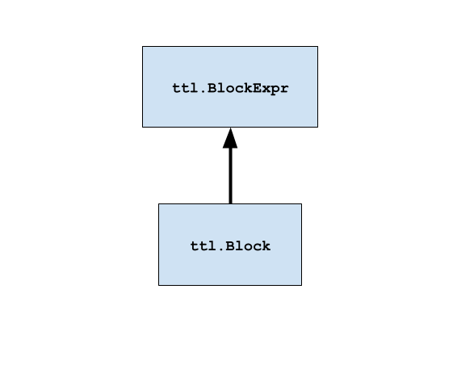
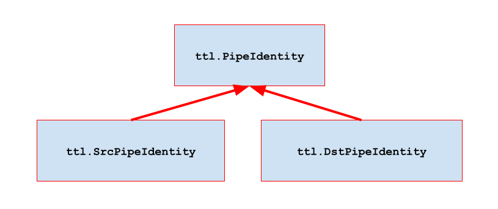

# TT-Lang

# Language Specification

* [0. Versions](#0-versions)
* [1. Introduction](#1-introduction)
* [2. Kernel program](#2-kernel-program)
* [3. Grid](#3-grid)
    * [3.1. Grid size function](#31-grid-size-function)
    * [3.2. Core function](#32-core-function)
* [4. Dataflow buffer](#4-dataflow-buffer)
* [5. Block](#5-block)
* [6. Pipe](#6-pipe)
    * [6.1. Pipe net](#61-pipe-net)
* [7. Tensor slice](#7-tensor-slice)
* [8. Copy](#8-copy)
* [9. Semaphore](#9-semaphore)
* [Appendix A. Glossary](#appendix-a-glossary)
* [Appendix B. Block operators and math functions](#appendix-b-block-operators-and-math-functions)

## 0. Versions

| *Version* | *Date* | *Description of changes* |
| :---- | :---- | :---- |
| 0.1 | 12/15/2025 | Initial version |
| 0.2 | 01/20/2026 | Remove `ttl.Program` |
| 0.3 | 01/23/2026 | Add specification for block operators and math functions |
| 0.4 | 01/26/2026 | Add `ttl.math.broadcast` |
| 0.5 | 02/05/2026 | Use dataflow buffer instead of circular buffer term |
| 0.6 | 02/06/2026 | Add rounding, mask, `ttl.math.transpose`, `ttl.math.fill` and `ttl.math.where` functions |

## 1. Introduction

TT-Lang is a Python based *domain specific language (DSL)* designed to express kernel programs for TT hardware. While based on Python the language maintains a number of constraints to what parts of Python can be used in what context, hence the DSL nature of it. TT-Lang is tightly integrated with [TT-NN](https://docs.tenstorrent.com/tt-metal/latest/ttnn/index.html) to provide seamless experience of mixing existing TT-NN operations and user-defined kernel programs.

The programming model of TT-Lang is centered around explicit specification of data movement and compute threads and explicit synchronization between them. This allows the user to have fine grained control of the execution schedule and its performance implications. TT-Lang offers abstractions familiar to TT-Metalium users such as *dataflow buffers* and *semaphores*. TT-Lang also offers new, higher level abstractions, such as *tensor slices*, *blocks* and *pipes* that wrap the complexity of dealing with tensor memory layout, compute API and core-to-core communication correspondingly.

## 2. Kernel program

*Kernel function* is a Python function with `ttl.kernel` decorator. This function takes input and output [*TT-NN tensors*](https://docs.tenstorrent.com/tt-metal/latest/ttnn/ttnn/tensor.html) as arguments and returns `None`. A kernel function contains definitions of thread functions as well as objects shared by thread functions. A thread function is a Python function with no arguments and returning `None` that is annotated by `ttl.compute` or `ttl.datamovement` decorators.

### Example

```py
@ttl.kernel()
def foo(
    x: ttnn.Tensor,
    y: ttnn.Tensor,
) -> None:
    @ttl.compute()
    def some_compute():
        # ...

    @ttl.datamovement()
    def some_dm0():
        # ...

    @ttl.datamovement()
    def some_dm1():
        # ...

shape = ttnn.Shape([128, 128])

x = ttnn.rand(shape, layout=ttnn.TILE_LAYOUT)
y = ttnn.zeros(shape, layout=ttnn.TILE_LAYOUT)

foo(x, y)
```

## 3. Grid

A *grid* defines a space of Tensix cores to which the kernel is submitted for execution. In a single-chip case it is two dimensional. In a multi-chip case it has three or more dimensions representing different levels of connectivity (same card, same host, same rack etc).

### 3.1. Grid size function

The `ttl.grid_size` function returns the size of the grid. The function takes an argument that specifies how many dimensions to return. If requested dimensions are smaller than grid dimensions, the highest rank dimension is flattened. If requested dimensions are greater than grid dimensions, highest rank dimensions are padded with a value of one. The `ttl.grid_size` can be used inside a kernel function as well as inside thread functions.

| Type alias/Function | Description |
| :---- | :---- |
| `ttl.PositiveInt = Annotated[int, Gt(0)]` | A positive integer. The metadata `Gt(0)`, can be used by runtime type-checkers to enforce the integer constraints.  |
| `ttl.Size = ttl.PositiveInt` | A size. |
| `ttl.Shape = ttl.Size \| Tuple[ttl.Size, ...]` | A shape type. `ttl.Size` for 1D and tuple of `ttl.Size` otherwise. |
| `ttl.grid_size(dims: ttl.Size) -> ttl.Shape` | Return grid size in specified dimensionality. Returns `ttl.Size` for `dims = 1` and a tuple of `ttl.Size` for other values of dims. |

#### Example

```py
# for (8, 8) single chip grid gets x_size = 64
x_size = ttl.grid_size(dims = 1)

# for (8, 8, 8) multi-chip grid gets x_size = 8, y_size = 64
x_size, y_size = ttl.grid_size(dims = 2)

# for (8, 8) single-chip grid gets x_size = 8, y_size = 8, z_size = 1
x_size, y_size, z_size = ttl.grid_size(dims = 3)
```

### 3.2. Core function

The `ttl.core` function returns *core coordinates* of the current Tensix core. Core coordinates are zero based and contiguous, which corresponds to a logical indexing scheme. The function takes an argument that specifies how many dimensions to return. If requested dimensions are smaller than grid dimensions, the highest rank dimension is flattened. If requested dimensions are greater than grid dimensions, highest rank dimensions are padded with a value of zero. The `ttl.core` can be used inside a kernel function as well as inside thread functions.

| Type alias/Function | Description |
| :---- | :---- |
| `ttl.NaturalInt = Annotated[int, Ge(0)]` | Non-negative integer. The metadata `Ge(0)`, can be used by runtime type-checkers to enforce the integer constraints. |
| `ttl.Index = ttl.NaturalInt` | An index, assumes non-negative indexes. |
| `ttl.CoreCoord = ttl.Index \| Tuple[ttl.Index, ...]` | Core coordinates. `ttl.Index` for 1D and tuple of `ttl.Index` otherwise. |
| `ttl.core(dims: ttl.Index) -> ttl.CoreCoord` | Return core coordinates in specified dimensionality. Returns `ttl.Index` for `dims = 1` and a tuple of `ttl.Index` for other values of dims. |

#### Example

```py
# for (8, 8) single chip grid gets x = [0, 64)
x = ttl.core(dims = 1)

# for (8, 8, 8) multi-chip grid gets x = [0, 8), y = [0, 64)
x, y = ttl.core(dims = 2)

# for (8, 8) single-chip gets x = [0, 8), y = [0, 8), z = 0
x, y, z = ttl.core(dims = 3)
```

## 4. Dataflow buffer

A *dataflow buffer* is a communication primitive for synchronizing the passing of data between thread functions within one Tensix core. A dataflow buffer is created with the `ttl.make_dataflow_buffer_like` function by passing TT-NN tensor, *shape* and *buffer factor*. The TT-NN tensor determines basic properties (likeness) such as data type and *shape unit*. The shape unit is a whole tile if the tensor has a tiled layout and is a scalar if the tensor has a row-major layout. Shape determines the shape of a *block* returned by one of the *acquisition functions* and is expressed in shape units. Buffer factor determines the total size of L1 memory allocated as a product of block size and buffer factor. For the most common case buffer factor defaults to 2 to enable double buffering.

There are two acquisition functions on a dataflow buffer object: `wait` and `reserve`. A dataflow buffer is constructed in the scope of the kernel function but its object functions can only be used inside of thread functions. Acquisition functions can be used with Python `with` statement, which will automatically release acquired blocks at the end of the `with` scope. Alternatively, if acquisition functions are used without the `with` the user must explicitly call a corresponding release function: `pop` for `wait` and `push` for `reserve`.

#### Example

```py
x_dfb = ttl.make_dataflow_buffer_like(x,
    shape = (2, 2),
    buffer_factor = 2)

@ttl.datamovement()
def some_read():
    # acquire x_blk from x_dfb
    with x_dfb.reserve() as x_blk:

        # produce data into x_blk
        # ...

        # release x_blk implicitly by x_dfb.push() at the end of the with scope

@ttl.compute()
def some_compute():
    # acquire x_blk from x_dfb
    x_blk = x_dfb.wait()

    # consume data in x_blk
    # ...

    x_dfb.pop() # release x_blk explicitly
```

| Type alias/Function | Description |
| :---- | :---- |
|  `ttl.make_dataflow_buffer_like(ttnn.Tensor: likeness_tensor, shape: ttl.Shape,   buffer_factor: ttl.Size) -> ttl.DataflowBuffer` | Create a dataflow buffer by inheriting basic properties from `likeness_tensor`. |
|  `ttl.DataflowBuffer.reserve(self) -> ttl.Block` | Reserve and return a block from a dataflow buffer. **This function is blocking** and will wait until a *free* block is available. A free block is typically used by a producer to write the data into. |
| `ttl.DataflowBuffer.push(self)` | Push a block to a dataflow buffer. This function is called by the producer to signal the consumer that a block *filled* with data is available. **This function is non-blocking.** |
| `ttl.DataflowBuffer.wait(self) -> ttl.Block` | Wait for and return a block from a dataflow buffer. **This function is blocking** and will wait until a block filled with data is available. A filled block is typically used by a consumer to read data from. |
| `ttl.DataflowBuffer.pop(self)` | Pop a block from a dataflow buffer. This function is called by the consumer to signal the producer that block is free and available. **This function is non-blocking.** |

## 5. Block

A *block* represents memory acquired from a dataflow buffer. Block size is determined by the shape of a dataflow buffer and its memory is allocated when a dataflow buffer is created. Inside of a compute thread a block can participate in a *block expression* with built-in Python operators and TT-Lang math functions as an operand. A block can also be a storage for the result of block expression by using store function. When the store function is invoked multiple times for the same block with the `acc = True` parameter, TT-Lang will generate accumulation for all calls after the first one. When `acc = False`, all stores simply store (no accumulation). It is illegal to have multiple `store` invocations  for the same block with different values of `acc` parameter. Inside of data movement threads a block can participate in `ttl.copy` as a source or a destination.

#### Element-wise with broadcast example

```py
# ---------------------
# Element-wise with broadcast: Y = sqrt(A^2 + B^2)
#
# Tensor   Torch shape  Shape in tiles
# A        N            NT
# B        1            1
# Y        N            NT
#
# NT = N // TILE_SIZE

a_dfb = ttl.make_dataflow_buffer_like(A, shape = (1, ))
b_dfb = ttl.make_dataflow_buffer_like(B, shape = (1, ))
y_dfb = ttl.make_dataflow_buffer_like(Y, shape = (1, ))

@ttl.datamovement()
def elwise_read():
    for nt in range(NT):
        # acquire a_blk and b_blk from a_dfb and b_dfb:
        with (
            a_dfb.reserve() as a_blk,
            b_dfb.reserve() as b_blk
        ):
            # then copy:
            a_xf = ttl.copy(A[nt], a_blk)
            b_xf = ttl.copy(B[0], b_blk)

            a_xf.wait()
            b_xf.wait()

            # release a_blk and b_blk

@ttl.compute()
def elwise_compute():
    for _ in range(NT):
        # acquire a_blk, b_blk and y_blk from a_dfb, b_dfb and y_dfb:
        with (
            a_dfb.wait() as a_blk,
            b_dfb.wait() as b_blk,
            y_dfb.reserve() as y_blk,
        ):
            # then compute y = sqrt(a^2 + b^2):
            a_squared = a_blk ** 2
            b_squared = b_blk ** 2
            y = ttl.math.sqrt(a_squared + ttl.math.broadcast(b_squared, dims=[0]))
            y_blk.store(y)

            # release a_blk, b_blk and y_blk


@ttl.datamovement()
def elwise_write():
    for nt in range(NT):
        # acquire y_blk from y_dfb:
        with y_dfb.wait() as y_blk:

            # then copy:
            y_xf = ttl.copy(y_blk, Y[nt])
            y_xf.wait()

            # release y_blk
```

#### Matmul example

```py
# ---------------------
# Matmul with bias: Y = A @ B + C
#
# Tensor   Torch shape  Shape in tiles
# A        I, M, K      IT, MT, KT
# B        K, N         KT, NT
# C        M, N         MT, NT
# Y        I, M, N      IT, MT, NT
#
# IT = I // TILE_SIZE
# MT = M // TILE_SIZE
# NT = N // TILE_SIZE
# KT = K // TILE_SIZE

a_dfb = ttl.make_dataflow_buffer_like(A, shape = (1, 1, 1))
b_dfb = ttl.make_dataflow_buffer_like(B, shape = (1, 1))
c_dfb = ttl.make_dataflow_buffer_like(C, shape = (1, 1))
y_dfb = ttl.make_dataflow_buffer_like(Y, shape = (1, 1, 1))

@ttl.datamovement()
def matmul_read():
    for it in range(IT):
        for mt in range(MT):
            for nt in range(NT):
                # acquire c_blk from c_dfb:
                with c_dfb.reserve() as c_blk:

                    # then copy:
                    c_xf = ttl.copy(C[mt, nt], c_blk)
                    c_xf.wait()

                    # release c_blk

                for kt in range(KT):
                    # acquire a_blk and b_blk from a_dfb and b_dfb:
                    with (
                        a_dfb.reserve() as a_blk,
                        b_dfb.reserve() as b_blk
                    ):
                        # then copy:
                        a_xf = ttl.copy(A[it, mt, kt], a_blk)
                        b_xf = ttl.copy(B[kt, nt], b_blk)

                        a_xf.wait()
                        b_xf.wait()

                        # release a_blk and b_blk

@ttl.compute()
def matmul_compute():
    for _ in range(IT):
        for _ in range(MT):
            for _ in range(NT):
                # acquire y_blk from y_dfb:
                with y_dfb.reserve() as y_blk:
                    # acquire c_blk from c_dfb:
                    with c_dfb.wait() as c_blk:

                        # then compute: y = c:
                        y_blk.store(c_blk, acc=True)

                        # release c_blk

                    for _ in range(KT):
                        # acquire a_blk and b_blk from a_dfb and b_dfb:
                        with (
                            a_dfb.wait() as a_blk,
                            b_dfb.wait() as b_blk
                        ):
                            # then compute y += a @ b:
                            y_blk.store(a_blk @ b_blk, acc=True)

                            # release a_blk and b_blk

                    # release y_blk

@ttl.datamovement()
def matmul_write():
    for it in range(IT):
        for mt in range(MT):
            for nt in range(NT):
                # acquire y_blk from y_dfb:
                with y_dfb.wait() as y_blk:

                    # then copy:
                    y_xf = ttl.copy(y_blk, Y[it, mt, nt])
                    y_xf.wait()

                    # release y_blk
```

| Function | Description |
| :---- | :---- |
| `ttl.Block.store(self, expr: ttl.BlockExpr, acc: Boolean = False)` | This function materializes the result of a *block expression* and stores it in the block. When `acc` is set to `True` store with accumulation is allowed. Block expression uses Python builtin math operators and `ttl.math.xxx` functions on block expression. **This function is blocking** so that block is safe to use immediately after the call. |
| `ttl.BlockExpr.__pow__(self, exponent: ttl.PositiveInt) -> ttl.BlockExpr` | Example of Python built-in operator. See full list in [Appendix B. Block operators and math functions](#appendix-b-block-operators-and-math-functions). |
| `ttl.BlockExpr.__add__(self, other: ttl.BlockExpr) -> ttl.BlockExpr` | Example of Python built-in operator. See full list in [Appendix B. Block operators and math functions](#appendix-b-block-operators-and-math-functions). |
| `ttl.math.sqrt(expr: ttl.BlockExpr) -> ttl.BlockExpr` | Example of TT-Lang math function. See full list in [Appendix B. Block operators and math functions](#appendix-b-block-operators-and-math-functions). |



## 6. Pipe

A *pipe* is a communication primitive for organizing the passing of data between data movement threads on different Tensix cores. A pipe is used as a source or a destination in the `ttl.copy`. The pipe is constructed with source core coordinate (`src`) and destination (`dst`), which is either a single core coordinate for unicast or *core range* for multicast. The core range uses a combination of dimension slices and values to describe a contiguous hypercube. The core range dimensions’ aspects will match the corresponding aspects returned by the `grid_size` function for the same number of dimensions.

| Type alias/Function | Description |
| :---- | :---- |
| `ttl.CoreRange = Tuple[ttl.Index \| slice, ...]` | A core range. |
| `ttl.Pipe[DstT](src: ttl.CoreCoord, dst: DstT) -> ttl.Pipe[DstT]` | Constructs pipe description to be used to construct pipe net. The `dst` argument is of `DstT` type, which can be either `ttl.CoreCoord` or `ttl.CoreRange`. |

### 6.1. Pipe net

A *pipe net* is a communication primitive that groups pipes into a network. A pipe net is constructed from a list of pipes and encapsulates all necessary information to determine if a given core is source, destination or both and where and from which core or cores the corresponding transfers will occur. Pipe net object has two functions: `if_src` and `if_dst`. Both functions have a single argument: *condition body function*.

Condition body function is invoked for each pipe in case of `if_src` if the current core is a source, and in case of `if_dst` if the current core is a destination. The condition body function has a single argument: a pipe identity that satisfies the condition. Condition body function can identify the source and the destination by its `src` and `dst` read-only properties correspondingly.

A pipe net is constructed in the scope of the kernel function but can only be used with its `if_src` and `if_dst` functions inside of a data movement thread function. The corresponding  `ttl.copy` where a pipe is a source or a destination can be called only inside of a condition body function. Calls into `if_src` and `if_dst` can be nested within condition functions for different pipe nets.

| Function | Description |
| :---- | :---- |
| `ttl.PipeNet[DstT](pipes: List[ttl.Pipe[DstT]]) -> ttl.PipeNet[DstT]` | Constructs pipe net. |
| `ttl.PipeNet[DstT].if_src(self, cond_fun: Callable[[ttl.SrcPipeIdentity[DstT]], None])` | Call condition function for each pipe in the pipe net that is a source. |
| `ttl.PipeNet[DstT].if_dst(self, cond_fun: Callable[[ttl.DstPipeIdentity], None])` | Call condition function for each pipe in the pipe net that is a destination. |
| `@property ttl.SrcPipeIdentity[DstT].dst(self) -> DstT` | Get destination core or core range for pipe in `if_src`. |
| `@property ttl.DstPipeIdentity.src(self) -> ttl.CoreCoord` | Get source core for pipe in `if_dst`. |



#### Gather example

```py
# Grid:
#
# column
# x == 0
#   |
#   V
# (0, 0) (1, 0) (2, 0) (3, 0) <-- row y == 0
# (0, 1) (1, 1) (2, 1) (3, 1)
# (0, 2) (1, 2) (2, 2) (3, 2)
# (0, 3) (1, 3) (2, 3) (3, 3)

# ---------------------
# gather from row y to (0, y) with unicast

grid_x, grid_y = ttl.grid_size()

net = ttl.PipeNet([ttl.Pipe(
    src = (x, y),
    dst = (0, y)) for x in range(1, grid_x) for y in range(grid_y)])

# (1, 0) -> (0, 0) |             |
# (2, 0) -> (0, 0) | sequential  |
# (3, 0) -> (0, 0) |             |
# ...              |             | concurrent
#                                |
# (1, 1) -> (0, 1)               |
# ...                            |

@ttl.datamovement()
def dm():
    # reserve blk:
    with dfb.reserve() as blk:

        def pipe_src(pipe):
            # write data into blk
            # ...

            # then copy blk to pipe:
            xf = ttl.copy(blk, pipe)
            xf.wait()

        def pipe_dst(pipe):
            # copy blk from pipe:
            xf = ttl.copy(pipe, blk)
            xf.wait()

            # then read data from blk
            # ...

        net.if_src(pipe_src)
        net.if_dst(pipe_dst)
```

#### Scatter example

```py
# ---------------------
# scatter from (x, 0) to column x with multicast

grid_x, grid_y = ttl.grid_size()

net = ttl.PipeNet([ttl.Pipe(
    src = (x, 0),
    dst = (x, slice(1, grid_y))) for x in range(grid_x)])

# (0, 0) => (0, 1) (0, 2) (0, 3) ... |
# (1, 0) => (1, 1) (1, 2) (1, 3) ... | concurrent
# ...                                |

@ttl.datamovement()
def dm():
    # reserve blk:
    with dfb.reserve() as blk:

        def pipe_src(pipe):
            # write data into blk
            # ...

            # then copy blk to pipe:
            xf = ttl.copy(blk, pipe)
            xf.wait()

        def pipe_dst(pipe):
            # copy blk from pipe:
            xf = ttl.copy(pipe, blk)
            xf.wait()

            # then read data from blk
            # ...

        net.if_src(pipe_src)
        net.if_dst(pipe_dst)
```

#### Scatter-gather example

```py
# ---------------------
# scatter-gather column x with multicast/loopback

grid_x, grid_y = ttl.grid_size()

net = ttl.PipeNet([ttl.Pipe(
    src = (x, y),
    dst = (x, slice(0, grid_y))) for x in range(grid_x) for y in range(grid_y)])

# (0, 0) => (0, 0) (0, 1) (0, 2) ... |            |
# (0, 1) => (0, 0) (0, 1) (0, 2) ... | sequential |
# (0, 2) => (0, 0) (0, 1) (0, 2) ... |            |
# ...                                |            | concurrent
#                                                 |
# (1, 0) => (1, 0) (1, 1) (1, 2) ...              |
# ...                                             |

@ttl.datamovement()
def dm():
    # reserve blk
    with dfb.reserve() as blk:

        def pipe_src(pipe):
            # write data into blk
            # ...

            # then copy blk to pipe:
            xf = ttl.copy(blk, pipe)
            xf.wait()

        def pipe_dst(pipe):
            # copy blk from pipe:
            xf = ttl.copy(pipe, blk)
            xf.wait()

            # then read data from blk
            # ...

        net.if_src(pipe_src)
        net.if_dst(pipe_dst)
```

#### Forward to a \+1 neighbor example

```py
# ---------------------
# forward to a +1 neighbor in a column x

grid_x, grid_y = ttl.grid_size()

net = ttl.PipeNet([ttl.Pipe(
    src = (x, y),
    dst = (x, (y + 1) % grid_y)) for x in range(grid_x) for y in range(grid_y)])

# (0, 0) => (0, 1)  |
# (0, 1) => (0, 2)  |
# ...               |
# (0, 7)* => (0, 0) |
# ...               | concurrent
#                   |
# (1, 0) => (1, 1)  |
# ...               |
#
# * - assuming (8, 8) grid

@ttl.datamovement()
def dm():

    # reserve blk_to_send and blk_received:
    with (
        dfb_to_send.reserve() as blk_to_send,
        dfb_received.reserve() as blk_received
    ):

        def pipe_src(pipe):
            # write data into blk_to_send
            # ...

            # then copy blk to blk_to_send:
            xf = ttl.copy(blk_to_send, pipe)
            xf.wait()

        def pipe_dst(pipe):
            # copy blk_received from pipe:
            xf = ttl.copy(pipe, blk_received)
            xf.wait()

            # then read data from blk_received
            # ...

        net.if_src(pipe_src)
        net.if_dst(pipe_dst)
```

## 7. Tensor slice

A *tensor slice* is a view into a TT-NN tensor defined in terms of a dimension slice or value for each of the tensor's dimensions. A tensor slice can participate in `ttl.copy` as a source or a destination with the corresponding destination and source being a block. Tensor slice can only be used in the scope of a data movement thread function.

| Function | Description |
| :---- | :---- |
| `ttnn.Tensor.__getitem__(self, *index: ttl.Index \| slice) -> ttl.TensorSlice` | Get a tensor slice from a TT-NN tensor. |

#### Example

```py
g = 2 # granularity
a_dfb = ttl.make_dataflow_buffer_like(A, shape = (g, 1))

row_tiles = A.shape[0] // ttl.TILE_SHAPE[0]
col_tiles = A.shape[1] // ttl.TILE_SHAPE[1]
cols_per_core = math.ceil(col_tiles / (grid_size(dims = 1)))

core_num = core(dims = 1)
start_ct = core_num * cols_per_core
end_ct = min(start_ct + cols_per_core, col_tiles)

@ttl.datamovement()
def dm():
    for ct in range(start_ct, end_ct):
        for rt in range(row_tiles // g):
            # acquire a_blk from a_dfb:
            with a_dfb.reserve() as a_blk:

                # then copy from a tensor slice of matching shape:
                row_slice = slice(rt * g, (rt + 1) * g) # explicit row slice
                a_xf = ttl.copy(
                    A[row_slice, ct:ct + 1], # in-line col slice
                    a_blk)
                a_xf.wait()
```

## 8. Copy

The `ttl.copy` function expresses a variety of data movements that always have two arguments: source and destination. `ttl.copy` returns a *transfer handle* object. A transfer handle has a `wait` function that serves as a barrier. When the `wait` returns the transfer is complete and data in the destination is safe to use.  The `ttl.copy` can only be used inside of a data movement thread function.

| Function | Description |
| :---- | :---- |
| `ttl.copy(src: ttl.Block, dst: ttl.TensorSlice) -> ttl.TransferHandle`<br><br>`ttl.copy(src: ttl.TensorSlice, dst: ttl.Block) -> ttl.TransferHandle`<br><br>`ttl.copy(src: ttl.Block, dst: ttl.PipeIdentity) -> ttl.TransferHandle`<br><br>`ttl.copy(src: ttl.PipeIdentity, dst: ttl.Block) -> ttl.TransferHandle` | Copy data between a block, a tensor slice, or a pipe. **This function is non-blocking.** The compiler statically checks if the shape of block and tensor slice are compatible and if the shape of block sent to a pipe is compatible with the shape of block received from the same pipe. When a pipe is used as a destination there must be a corresponding `ttl.copy` where the same pipe is used as source. Furthermore, `ttl.copy` with pipe must be guarded by pipe net’s `if_src` and `is_dst` where this pipe is destination and source correspondingly. |
| `ttl.TransferHandle.wait()` | Wait for data transfer to complete. **This function is blocking.** |

## 9. Semaphore

A *semaphore* is a communication primitive for general synchronization between data movement threads on different Tensix cores. Each semaphore has an associated 32-bit unsigned integer *semaphore value* for each Tensix core. This value can be changed (set or incremented) by a data movement thread on the local or a remote core. When changing semaphore value remotely a single core coordinate for unicast change or a core range for multicast change is specified. Only setting the semaphore value is supported as a multicast change. A data movement thread can wait on a semaphore until its value satisfies a condition. It is possible to specify either a condition with exact value or a condition with minimum value. Only local data movement threads can wait on a semaphore.

`ttl.Semaphore` class is constructed with its initial value that defaults to zero. A `ttl.Semaphore` instance can be constructed in kernel function scope. A `ttl.Semaphore` instance provides `wait_eq`, `wait_ge` and `set` functions for managing local semaphore value. To change a remote semaphore value an instance of `ttl.UnicastRemoteSemaphore` or `ttl.MulticastRemoteSemaphore` is obtained by calling `get_remote` and `get_remote_multicast` functions correspondingly. The `ttl.UnicastRemoteSemaphore` supports `inc` and `set` while `ttl.MulticastRemoteSemaphore` supports only `set`. Functions that change the value or wait on condition can be used only in the scope of a data movement thread function. Functions that obtain remote semaphores can be used in scopes of both kernel and data movement thread functions.

#### One-to-many barrier example

```py
core_num = core(dims = 1)
my_barrier = ttl.Semaphore()
all_barrier = my_barrier.get_remote_multicast()

@ttl.datamovement()
def dm():
    if core_num == 0:
        # do something on core 0 while non-0 cores wait...
        all_barrier.set(1)
    else:
        my_barrier.wait_eq(1)
        # core 0 is done
```

#### Many-to-one barrier example

```py
core_num = core(dims = 1)
my_barrier = ttl.Semaphore()
core_0_barrier = my_barrier.get_remote((0, 0))
non_0_core_count = grid_size(dims = 1) - 1

@ttl.datamovement()
def dm():
    if core_num != 0:
        # do something on non-0 cores while core 0 waits...
        core_0_barrier.inc(1)
    else:
        my_barrier.wait_eq(non_0_core_count)
        # non-0 cores are done
```

| Function | Description |
| :---- | :---- |
| `ttl.Count = ttl.NaturalInt` | A type for semaphore value. |
| `ttl.Semaphore.wait_eq(self, value: ttl.Count)` | Wait until the local semaphore value is equal to specified value. **This function is blocking.** Can be used only in the scope of a data movement thread function. |
| `ttl.Semaphore.wait_ge(self, value: ttl.Count)` | Wait until the local semaphore value is greater or equal to specified value. **This function is blocking.** Can be used only in the scope of a data movement thread function. |
| `ttl.Semaphore.set(self, value: ttl.Count)` | Set the local semaphore value to specified value. **This function is non-blocking.** Can be used only in the scope of a data movement thread function. |
| `ttl.Semaphore.get_remote(self, ttl.CoreCoord: core) -> ttl.UnicastRemoteSemaphore` | Get remote unicast semaphore for specified core coordinate. Returns an instance of `ttl.UnicastRemoteSemaphore`. Can be used in both kernel and thread function scopes. |
| `ttl.Semaphore.get_remote_multicast(self, ttl.CoreRange: core_range) -> ttl.MulticastRemoteSemaphore` | Get remote multicast semaphore for specified core range. When called with no arguments returns remote multicast semaphore for the entire grid. Returns an instance of `ttl.MulticastRemoteSemaphore`. Can be used in both kernel and thread function scopes. |
| `ttl.UnicastRemoteSemaphore.set(self, value: ttl.Count)` | Set remote unicast semaphore value to specified value. **This function is non-blocking.** Can be used only in the scope of a data movement thread function. |
| `ttl.UnicastRemoteSemaphore.inc(self, value: ttl.Count)` | Increment remote unicast semaphore value by specified value. **This function is non-blocking.** Can be used only in the scope of a data movement thread function. |
| `ttl.MulticastRemoteSemaphore.set(self, value: ttl.Count)` | Set remote multicast semaphore value to specified value. **This function is non-blocking.** Can be used only in the scope of a data movement thread function. |

## Appendix A. Glossary

| Term | Description |
| :---- | :---- |
| *Domain specific language (DSL)* | A language based on a constrained subset of the host language, Python in the case of TT-Lang. |
| *Kernel function* | A Python function that encapsulates a custom operation written in TT-Lang, which can be used as TT-NN operation. |
| *Thread function* | A Python function typically defined inside of the scope of kernel function that encapsulates a particular thread behavior. |
| *Data movement thread function* | A Python function that encapsulates data movement thread behavior. |
| *Compute thread function* | A Python function that encapsulates compute thread behavior. |
| *TT-NN tensor* | Tensor representation in TT-NN environment. Encapsulates key meta information such as shape, data type, layout, storage and memory configuration. |
| *Grid* | A multidimensional space of Tensix cores. A single chip is represented by a 2D grid. A multichip system is represented by 3D and higher dimensional grids. |
| *Core coordinates* | Coordinates of a given Tensix core within a grid. Each dimension is zero based and contiguous, which corresponds to logical indexing. |
| *Dataflow buffer* | A communication primitive for synchronizing the passing of data between threads within one Tensix core. Maintains memory space that is written by a producer and read by a consumer as well as synchronization mechanism necessary to communicate between producer and consumer to avoid data races. |
| *Dataflow buffer’s shape* | A shape of a block of memory acquired from a dataflow buffer to be either written by the producer or read by the consumer. |
| *Dataflow buffer’s shape unit* | A unit in which dataflow buffer shape is expressed. When a dataflow buffer is created in likeness of tiled TT-NN Tensor the unit is a tile. If it is created in likeness of row-major TT-NN the unit is a scalar. |
| *Dataflow buffer’s buffer factor* | A buffer factor determines how many block sized pages are allocated by the dataflow buffer. In the most case it is 2 pages to allow double buffering so that both consumer and producer can make progress by having one acquired block each to work with. |
| *Dataflow buffer’s acquisition function* | A blocking function that keeps a thread waiting until a block becomes available in the dataflow buffer. |
| *Dataflow buffer’s release function* | A non-blocking function that releases a block back to the dataflow buffer to make it available to other threads. |
| *Block* | A block of memory acquired from a dataflow buffer. In a compute thread a block can participate in an expression as input, and also be used to store the expression's result. In a data movement thread a block can participate in copy operation as a source or destination. |
| *Block expression* | A block expression is a Python expression using built-in Python operators as well as TT-Lang math functions where operands are either blocks or block expressions. |
| *Pipe* | A pipe is a communication primitive for organizing the passing of data between data movement threads on different Tensix cores. |
| *Pipe net* | A pipe net is a communication primitive that groups pipes into a network. While a single pipe is capable of representing the passing of data from a single core, a network of pipes generalizes to a data passing pattern over the entire grid. A pipe net is constructed from the list of pipes, which is typically created by Python list comprehension over one or more aspects of a grid. |
| *Pipe net’s condition body function* | A Python function passed to be executed conditionally if the current core is a source, a destination, or both in the given pipe net. A condition function can be called multiple times sequentially if the current core participates in multiple pipes. |
| *Tensor slice* | A Python slice expression used with TT-NN tensor to specify a view to be used as a source or a destination in a copy operation. |
| *Transfer handle* | A handle to an asynchronous copy operation. A transfer handle is used as a barrier to ensure that operation is finished and the corresponding source or destination block is safe to use. |
| *Semaphore* | A communication primitive for general synchronization between data movement threads on different Tensix cores. |
| *Semaphore value* | A 32-bit unsigned integer value associated with a semaphore on each Tensix core. This value can be set or incremented by a data movement thread on the local or a remote Tensix core. |

## Appendix B. Block operators and math functions

### Binary operators and math functions

| Function | Description |
| :---- | :---- |
| `ttl.BlockExpr.__add__(self, other: ttl.BlockExpr) -> ttl.BlockExpr` | Add two blocks element-wise. Example: `a + b`. |
| `ttl.BlockExpr.__sub__(self, other: ttl.BlockExpr) -> ttl.BlockExpr` | Two blocks subtracted second from first element-wise. Example: `a - b`. |
| `ttl.BlockExpr.__mul__(self, other: ttl.BlockExpr) -> ttl.BlockExpr` | Multiply two blocks element-wise. Example: `a * b`. |
| `ttl.BlockExpr.__truediv__(self, other: ttl.BlockExpr) -> ttl.BlockExpr` | Two blocks divided first by second element-wise. Example: `a / b`. |
| `ttl.BlockExpr.__matmul__(self, other: ttl.BlockExpr) -> ttl.BlockExpr` | Dot product of two blocks. If `a` has shape `[M, K]` and `b` has shape `[K, N]` then the result will have shape `[M, N]`. Example: `a @ b`. |
| `ttl.math.max(a: ttl.BlockExpr, b: ttl.BlockExpr) -> ttl.BlockExpr` | Element-wise maximum |
| `ttl.math.min(a: ttl.BlockExpr, b: ttl.BlockExpr) -> ttl.BlockExpr` | Element-wise minimum |

### Basic unary math functions

| Function | Description |
| :---- | :---- |
| `ttl.BlockExpr.__abs__(self) -> ttl.BlockExpr` | Absolute value. Example: `abs(a)`. |
| `ttl.BlockExpr.__neg__(self) -> ttl.BlockExpr` | Negation. Example: `-a`. |
| `ttl.BlockExpr.__pow__(self, exponent: ttl.PositiveInt) -> ttl.BlockExpr` | Power with scalar unsigned integer exponent. Example; `a ** 2`. |
| `ttl.math.exp(expr: ttl.BlockExpr) -> ttl.BlockExpr` | Natural base exponential (`e^x`) |
| `ttl.math.exp2(expr: ttl.BlockExpr) -> ttl.BlockExpr` | Base 2 exponential (`2^x`) |
| `ttl.math.expm1(expr: ttl.BlockExpr) -> ttl.BlockExpr` | Natural base exponential minus one (`ttl.math.exp(x) - 1`) |
| `ttl.math.log(expr: ttl.BlockExpr) -> ttl.BlockExpr` | Natural logarithm |
| `ttl.math.logp1(expr: ttl.BlockExpr) -> ttl.BlockExpr` | Natural logarithm of value plus 1 (`ttl.math.log(x + 1)`) |
| `ttl.math.sqrt(expr: ttl.BlockExpr) -> ttl.BlockExpr` | Square root |
| `ttl.math.square(expr: ttl.BlockExpr) -> ttl.BlockExpr` | Square |
| `ttl.math.rsqrt(expr: ttl.BlockExpr) -> ttl.BlockExpr` | Reciprocal square root (`1 / ttl.math.sqrt(x)`) |
| `ttl.math.recip(expr: ttl.BlockExpr) -> ttl.BlockExpr` | Reciprocal (`1 / x`) |
| `ttl.math.rsub(a: ttl.BlockExpr, b: ttl.PositiveInt) -> ttl.BlockExpr` | Subtract a from b where b is scalar unsigned integer (`b - a`) |

### Trigonometric unary math functions

| Function | Description |
| :---- | :---- |
| `ttl.math.tan(expr: ttl.BlockExpr) -> ttl.BlockExpr` | Tangent |
| `ttl.math.tanh(expr: ttl.BlockExpr) -> ttl.BlockExpr` | Hyperbolic tangent |
| `ttl.math.atan(expr: ttl.BlockExpr) -> ttl.BlockExpr` | Arctangent |
| `ttl.math.atanh(expr: ttl.BlockExpr) -> ttl.BlockExpr` | Hyperbolic arctangent |
| `ttl.math.sin(expr: ttl.BlockExpr) -> ttl.BlockExpr` | Sine |
| `ttl.math.asin(expr: ttl.BlockExpr) -> ttl.BlockExpr` | Arcsine |
| `ttl.math.asinh(expr: ttl.BlockExpr) -> ttl.BlockExpr` | Hyperbolic arcsine |
| `ttl.math.cos(expr: ttl.BlockExpr) -> ttl.BlockExpr` | Cosine |
| `ttl.math.acos(expr: ttl.BlockExpr) -> ttl.BlockExpr` | Arccosine |
| `ttl.math.acosh(expr: ttl.BlockExpr) -> ttl.BlockExpr` | Hyperbolic arccosine |

### Activation functions

| Function | Description |
| :---- | :---- |
| `ttl.math.relu(expr: ttl.BlockExpr) -> ttl.BlockExpr` | [ReLU](https://docs.pytorch.org/docs/stable/generated/torch.nn.ReLU.html) |
| `ttl.math.relu_max(expr: ttl.BlockExpr, upper_limit: ttl.PositiveInt) -> ttl.BlockExpr` | ReLU with upper limit (`ttl.math.relu(ttl.math.min(x, upper_limit)))`) |
| `ttl.math.relu_min(expr: ttl.BlockExpr, lower_limit: ttl.PositiveInt) -> ttl.BlockExpr` | ReLU with lower limit (`ttl.math.relu(ttl.math.max(x, lower_limit)))`) |
| `ttl.math.leaky_relu(expr: ttl.BlockExpr, slope: ttl.PositiveInt) -> ttl.BlockExpr` | [Leaky ReLU](https://docs.pytorch.org/docs/stable/generated/torch.nn.LeakyReLU.html) |
| `ttl.math.elu(expr: ttl.BlockExpr, slope: ttl.PositiveInt) -> ttl.BlockExpr` | [ELU](https://docs.pytorch.org/docs/stable/generated/torch.nn.ELU.html) |
| `ttl.math.gelu(expr: ttl.BlockExpr) -> ttl.BlockExpr` | [GELU](https://docs.pytorch.org/docs/stable/generated/torch.nn.GELU.html) |
| `ttl.math.sigmoid(expr: ttl.BlockExpr) -> ttl.BlockExpr` | [Sigmoid](https://docs.pytorch.org/docs/stable/generated/torch.nn.Sigmoid.html) |
| `ttl.math.celu(expr: ttl.BlockExpr, alpha: ttl.PositiveInt, alpha_recip: ttl.PositiveInt) -> ttl.BlockExpr` | [CELU](https://docs.pytorch.org/docs/stable/generated/torch.nn.CELU.html) |
| `ttl.math.silu(expr: ttl.BlockExpr) -> ttl.BlockExpr` | [SiLU](https://docs.pytorch.org/docs/stable/generated/torch.nn.SiLU.html#torch.nn.SiLU) (Swish) |
| `ttl.math.prelu(expr: ttl.BlockExpr, alpha: ttl.PositiveInt) -> ttl.BlockExpr` | [PReLU](https://docs.pytorch.org/docs/stable/generated/torch.nn.PReLU.html) |
| `ttl.math.softplus(expr: ttl.BlockExpr, beta: ttl.PositiveInt, beta_reciprocal: ttl.PositiveInt, threshold: ttl.PositiveInt) -> ttl.BlockExpr` | [Softplus](https://docs.pytorch.org/docs/stable/generated/torch.nn.Softplus.html) |
| `ttl.math.softsign(expr: ttl.BlockExpr) -> ttl.BlockExpr` | [Softsign](https://docs.pytorch.org/docs/stable/generated/torch.nn.Softsign.html) |
| `ttl.math.hardsigmoid(expr: ttl.BlockExpr) -> ttl.BlockExpr` | [Hardsigmoid](https://docs.pytorch.org/docs/stable/generated/torch.nn.modules.activation.Hardsigmoid.html) |
| `ttl.math.hardtanh(expr: ttl.BlockExpr, min: ttl.PositiveInt, max: ttl.PositiveInt) -> ttl.BlockExpr` | [Hardtanh](https://docs.pytorch.org/docs/stable/generated/torch.nn.modules.activation.Hardtanh.html) |
| `ttl.math.selu(expr: ttl.BlockExpr, scale: ttl.PositiveInt, alpha: ttl.PositiveInt) -> ttl.BlockExpr` | [SELU](https://docs.pytorch.org/docs/stable/generated/torch.nn.modules.activation.SELU.html) |

### Reduction, broadcast and transpose functions

| Function | Description |
| :---- | :---- |
| `ttl.math.reduce_sum(expr: ttl.BlockExpr, scaler: ttl.BlockExpr, dims: List[int]) -> ttl.BlockExpr` | Scaled sum reduction over specified dimensions. Example for reduction over rows: `ttl.math.reduce_sum(a, s, dims=[0])`. Example for reduction over rows and columns: `ttl.math.reduce_sum(a, s, dims=[0, 1])`.  |
| `ttl.math.reduce_max(expr: ttl.BlockExpr, scaler: ttl.BlockExpr, dims: List[int]) -> ttl.BlockExpr` | Scaled maximum reduction over specified dimensions. Example for reduction over rows: `ttl.math.reduce_max(a, s, dims=[0])`. Example for reduction over rows and columns: `ttl.math.reduce_max(a, s, dims=[0, 1])`. |
| `ttl.math.broadcast(expr: ttl.BlockExpr, dims: List[int]) -> ttl.BlockExpr` | Broadcast a block over specified dimensions. Produces block with shape expanded to be compatible with the outer part of the expression.<br><br>Example for broadcast over dimension 0: `y.store(ttl.math.broadcast(a, dims=[0]))`. Here the `store` is the outer expression and therefore if `y` has shape of `(N, M)` then `a` must have shape of `(1, M)`.<br><br>Example for broadcast over dimension 1: `y.store(b * ttl.math.broadcast(a, dims=[1]))`. Here the `*` is the outer expression and therefore if `b` has shape of `(N, M)` then `a` must have shape of `(N, 1)`.<br><br>Example for broadcast over both dimensions: `y.store(b + ttl.math.broadcast(a, dims=[0, 1]))`. Here the `+` is the outer expression, but because the broadcast is on `dims=[0,1]` `a` must have shape of `(1, 1)`. |
| `ttl.math.transpose(expr: ttl.BlockExpr) -> ttl.BlockExpr` | Transpose a block. For argument block of shape `(M, N)` produces resulting block with shape `(N, M)`. Supported only for 2-dimensional blocks. |

### Rounding functions

| Function | Description |
| :---- | :---- |
| `ttl.math.frac(expr: ttl.BlockExpr) -> ttl.BlockExpr` | Fractional portion |
| `ttl.math.trunc(expr: ttl.BlockExpr) -> ttl.BlockExpr` | Truncated integer portion |
| `ttl.math.round(expr: ttl.BlockExpr, decimals: ttl.PositiveInt) -> ttl.BlockExpr` | Rounds to the number of decimal places specified in `decimals` |
| `ttl.math.floor(expr: ttl.BlockExpr) -> ttl.BlockExpr` | Floor |
| `ttl.math.ceil(expr: ttl.BlockExpr) -> ttl.BlockExpr` | Ceil |
| `ttl.math.clamp(expr: ttl.BlockExpr, min: ttl.PositiveInt, max: ttl.PositiveInt) -> ttl.BlockExpr` | Clamp to specified `min` and `max` |
| `ttl.math.threshold(expr: ttl.BlockExpr, threshold: ttl.PositiveInt, replacement: ttl.PositiveInt) -> ttl.BlockExpr` | For all values greater than specified `threshold` replace with specified `value` |
| `ttl.math.sign(expr: ttl.BlockExpr) -> ttl.BlockExpr` | Replace positive element with 1 and negative elements with -1 |
| `ttl.math.signbit(expr: ttl.BlockExpr) -> ttl.BlockExpr` | Replace positive and positive zero elements with 1 and the rest with 0 |

### Fill, mask and where functions

| Function | Description |
| :---- | :---- |
| `ttl.math.fill(expr: ttl.BlockExpr, value: float) -> ttl.BlockExpr` | Fill a block with specified `value` |
| `ttl.math.mask(expr: ttl.BlockExpr, mask: ttl.BlockExpr) -> ttl.BlockExpr` | Mask a block with specified `mask` by replacing masked elements with 0. |
| `ttl.math.mask_posinf(expr: ttl.BlockExpr, mask: ttl.BlockExpr) -> ttl.BlockExpr` | Mask a block with specified `mask` by replacing masked (equals 1) elements with positive infinity. |
| `ttl.math.where(expr: ttl.BlockExpr, true_value: ttl.BlockExpr, false_value: ttl.BlockExpr) -> ttl.BlockExpr` | For each element in a block return the corresponding element from `true_value` if true (equals 1) and `false_value` otherwise (equals 0) |
